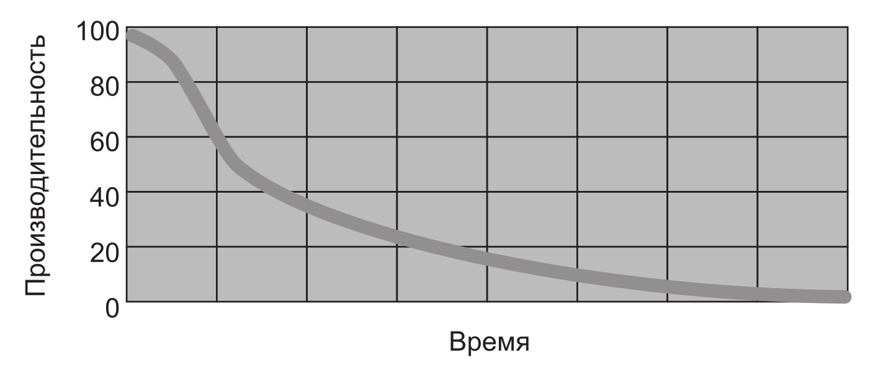

# Episode 1. Clean Code

## Does Clean Code Matter?

Чистый код имеет очень большое значение при долговременной разработке и поддержке больших
и сложных программных продуктов.

## The Productivity Trap (ловушка)

Productivity vs Time

Чем сложнее продукт, тем:

* Требуется все больше и больше времени на внедрение новых фич.
* Требуется все больше и больше времени на исправление багов.
* Затраты на разработку увеличиваются.
* Найм новых сотрудников не спасает (даже ухудшает) положение.

## The Big Redesign in the Sky

Переписывание продукта с нуля скорее всего не спасет положение:

* Старый продукт постоянно развивается - надо развивать также переписываемый продукт.
* Отсюда, новый продукт может не поддерживать какие-то фичи старого.

Переписывание программы может сработать для несложного и молодого продукта.

## Code Rot (протухание кода)

### Rigidity (отсутствие гибкости)

Система сопротивляется изменениям.

Каждое изменение кода начинает приводить к новым багам в самых разных частях программного продукта.

Исправление бага вместо одного дня занимает несколько недель.

### Fragility (хрупкость)

Поведение кода становится непредсказуемым после любого изменения.

Изменение в одном месте ПО, может изменить/сломать функционал в совершенно другом месте.

### Inseparability (неделимость)

Невозможность переиспользования функционала в других частях, при разработке другого ПО.

### Opacity (непрозрачность)

Сложночитаемый код ухудшает его поддержку.

### Why does code Rot? (Почему код становится грязным?)

Дедлайны, откладывание "причесывания" кода на "когда-нибудь потом".
Естественно, что "когда-нибудь потом" никогда не наступает.

## The Boy Scout Rule

Оставляйте после себя место чище, чем оно было до вас.
После каждого изменения кода, старайтесь делать код вокруг чуть чище.
