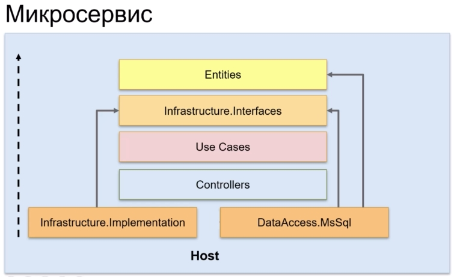

# Масштабирование

## Введение

### Применение на практике

- Подбор слоев и их связей в зависимости от специфики проекта
- Масштаб проекта
- Сложность бизнес-логики и логики приложения
- Количество инфраструктуры и интеграций

### Варианты масштаба

- Микросервис
  - Это проект, который реализует всего один Bounded Context, т.е. всего один кусочек
какой-то бизнес логики/предметной области, которые достаточно тесно друг с другом связаны.
  - Малый размер приложения.
  - Самый малый вариант масштаба.

- Стартап
  - Это проект, который делает небольшая команда (2-3 человека) в течение нескольких месяцев.
  - Размер проекта ~1000-2000 человеко-часов.
  - В дальнейшем может превратиться в средний проект.

- Средний проект
  - Это проект на ~5000 человеко-часов.

- Большой проект
  - Может содержать несколько Bounded Context (предметных областей).
  - Может содержать несколько входных точек (backend и/или frontend) в приложении.
  - Это проект на ~10000 и более человеко-часов.
  - Большая команда (5-7 человек) в течение полугода или 4-5 человек - год и более.

## Микросервис


Замечания:

- Присутствуют все 4 уровня чистой архитектуры.
- Как правило почти все микросервисы работают с БД. У каждого микросервиса своя БД.
- `Controllers` в отдельный компонент не выделяются (входят в состав `Host`).
- В качестве `Host` выступает какой-нибудь framework.
- Отдельный компонент реализации доступа к БД (на схеме `DataAccess.MsSql`).
- Внутри `Host` может находиться инфраструктура `Infrastructure.Implementation`
(если ее не очень много).

Если `Infrastructure.Implementation` все же много, то выделяем в отдельный проект:



## Микросервис. Пример реализации

*Проект: 13. Microservice*

Здесь показан минимально возможный набор компонентов (слоев) для реализации микросервиса в
виде чистой архитектуры.

### 0 `Utils`

Все тоже самое - здесь находится инфраструктура, переиспользуемая всеми слоями:

- Helpers
- Extension методы
- Cross-cutting concerns - инфраструктурная пронизывающая функциональность, которая используется
на разных слоях приложения:
  - Логирование.
  - Обработка ошибок.
  - Измерение времени работы каких-либо методов.

### 1 `Entities`

Все тоже самое:

- Сущности
- Enums
- Исключения, связанные с бизнес-логикой

Изменения:

В Entities переместился метод рассчета заказа. Раньше он был в `DomainServices.Implementation`.
Сейчас в `Entity.Order`:

```csharp
namespace Domain.Models;

public class Order
{
    public int Id { get; set; }
    public DateTime CreateDate { get; set; }
    public OrderStatus Status { get; set; }

    public ICollection<OrderItem> Items { get; set; }

    // Этот метод перенесен из DomainServices.Implementation.OrderService
    public decimal GetTotal()
    {
        return Items.Sum(x => x.Quantity * x.Product.Price);
    }
}
```

### 2 `Infrastructure.Interfaces`

Все интерфейсы инфраструктуры в одном проекте. В примере здесь находятся:

- `IDbContext` - интерфейс доступа к данным (раньше был в проекте `DataAccess.Interfaces`).
- `ICurrentUserService` - (раньше был в `Web.Interfaces`).

Здесь могут быть также и другие интерфейсы инфраструктуры: например, интерфейсы для взаимодействия
с шиной сообщений.

### 3 `UseCases`

Здесь use cases в стиле CQRS:

- отдельный класс, отдельный handler на каждый use case.
- есть Command
- есть Query

### 4 `Controllers`

Папка для контроллеров пустая - контроллеры расположены в composition root (`WebApp`).

В отдельный проект их не выделяем, т.к. микросервис маленький и бонусов от выделения контроллеров
в отдельный проект мы не получим.

### 5 `Infrastructure.Implementation`

В качестве реализации `DataAccess.MsSql`. Здесь находятся:

- Migrations
- `AppDbContext`
- Здесь mapping'и entity на базу

### Взаимосвязи в микросервисе

