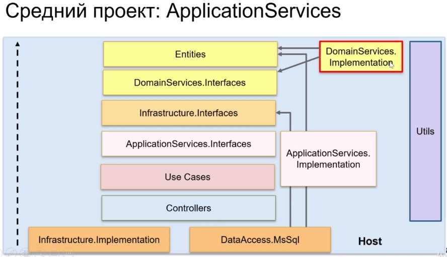

# Масштабирование

## 1. Введение

### Применение на практике

- Подбор слоев и их связей в зависимости от специфики проекта
- Масштаб проекта
- Сложность бизнес-логики и логики приложения
- Количество инфраструктуры и интеграций

### Варианты масштаба

- Микросервис
  - Это проект, который реализует всего один Bounded Context, т.е. всего один кусочек
какой-то бизнес логики/предметной области, которые достаточно тесно друг с другом связаны.
  - Малый размер приложения.
  - Самый малый вариант масштаба.

- Стартап
  - Это проект, который делает небольшая команда (2-3 человека) в течение нескольких месяцев.
  - Размер проекта ~1000-2000 человеко-часов.
  - В дальнейшем может превратиться в средний проект.

- Средний проект
  - Это проект на ~5000 человеко-часов.

- Большой проект
  - Может содержать несколько Bounded Context (предметных областей).
  - Может содержать несколько входных точек (backend и/или frontend) в приложении.
  - Это проект на ~10000 и более человеко-часов.
  - Большая команда (5-7 человек) в течение полугода или 4-5 человек - год и более.

## 2. Микросервис


Замечания:

- Присутствуют все 4 уровня чистой архитектуры.
- Как правило почти все микросервисы работают с БД. У каждого микросервиса своя БД.
- `Controllers` в отдельный компонент не выделяются (входят в состав `Host`).
- В качестве `Host` выступает какой-нибудь framework.
- Отдельный компонент реализации доступа к БД (на схеме `DataAccess.MsSql`).
- Внутри `Host` может находиться инфраструктура `Infrastructure.Implementation`
(если ее не очень много).

Если `Infrastructure.Implementation` все же много, то выделяем в отдельный проект:


## Микросервис. Пример реализации

*Проект: 13. Microservice*

Здесь показан минимально возможный набор компонентов (слоев) для реализации микросервиса в
виде чистой архитектуры.

### 0 `Utils`

Все тоже самое - здесь находится инфраструктура, переиспользуемая всеми слоями:

- Helpers
- Extension методы
- Cross-cutting concerns - инфраструктурная пронизывающая функциональность, которая используется
на разных слоях приложения:
  - Логирование.
  - Обработка ошибок.
  - Измерение времени работы каких-либо методов.

### 1 `Entities`

Все тоже самое:

- Сущности
- Enums
- Исключения, связанные с бизнес-логикой

Изменения:

В Entities переместился метод рассчета заказа. Раньше он был в `DomainServices.Implementation`.
Сейчас в `Entity.Order`:

```csharp
namespace Domain.Models;

public class Order
{
    public int Id { get; set; }
    public DateTime CreateDate { get; set; }
    public OrderStatus Status { get; set; }

    public ICollection<OrderItem> Items { get; set; }

    // Этот метод перенесен из DomainServices.Implementation.OrderService
    public decimal GetTotal()
    {
        return Items.Sum(x => x.Quantity * x.Product.Price);
    }
}
```

### 2 `Infrastructure.Interfaces`

Все интерфейсы инфраструктуры в одном проекте. В примере здесь находятся:

- `IDbContext` - интерфейс доступа к данным (раньше был в проекте `DataAccess.Interfaces`).
- `ICurrentUserService` - (раньше был в `Web.Interfaces`).

Здесь могут быть также и другие интерфейсы инфраструктуры: например, интерфейсы для взаимодействия
с шиной сообщений.

### 3 `UseCases`

Здесь use cases в стиле CQRS:

- отдельный класс, отдельный handler на каждый use case.
- есть Command
- есть Query

### 4 `Controllers`

Папка для контроллеров пустая - контроллеры расположены в composition root (`WebApp`).

В отдельный проект их не выделяем, т.к. микросервис маленький и бонусов от выделения контроллеров
в отдельный проект мы не получим.

### 5 `Infrastructure.Implementation`

В качестве реализации `DataAccess.MsSql`. Здесь находятся:

- Migrations
- `AppDbContext`
- Здесь mapping'и entity на базу

### Взаимосвязи в микросервисе


## 3. Стартап

Отличие от микросервисов - много инфраструктуры.


По количеству бизнес и application логики стартап не будет сильно превосходить microservice.

Здесь скорее всего будет тот же самый набор уровней: `DomainServices`, `ApplicationServices`
скорее всего не понадобятся.

По количеству инфраструктуры - здесь ее больше. Примеры:

- Интеграция с внешней системой
- Логирование
- Поисковый движок (Elastic Search)

Инфраструктура представлена попарными компонентами: интерфейсами `*.Interfaces` и их реализацией:

- `DataAccess.Interfaces` и `DataAccess.MsSql`
- `Delivery.Interfaces` и `Delivery.Company`
- `WebApp.Interfaces` и `WebApp` (на схеме `Host`)

## Стартап. Масштабирование из микросервиса. Пример реализации

*Проект: 14. Startup*

### Дробление `Infrastructure.Interfaces`

1. Выделение нескольких отдельных проектов из `Infrastructure.Interfaces`:

- БД
  - `DataAccess.Interfaces`
  - `DataAccess.MsSql`
- Информация о текущем пользователе
  - `WebApp.Interfaces`
  - `WebApp`
- Служьы доставки (новая служба, добавилась в микросервис)
  - `Delivery.Interfaces`
  - `Delivery.Company`

2. `UseCase` ссылаются на:

- `DataAccess.Interfaces`
- `WebApp.Interfaces`
- `Delivery.Interfaces`

3. Регистрация служб в `WebApp`:

```csharp
// Infrastructure
builder.Services.AddScoped<ICurrentUserService, CurrentUserService>();
builder.Services.AddScoped<IDeliveryService, DeliveryService>();
var connectionString = builder.Configuration.GetConnectionString("DefaultConnection");
builder.Services.AddDbContext<IDbContext, AppDbContext>(opts => opts.UseSqlite(connectionString));
```

### Использование `IDeliveryService`

Пример использование сервиса в `Use Cases`:

```csharp
namespace UseCases.Order.Queries.GetById;

public class GetOrderByIdQueryHandler : IRequestHandler<GetOrderByIdQuery, OrderDto>
{
    public GetOrderByIdQueryHandler(
        IDbContext dbContext,
        IDeliveryService deliveryService,
        IMapper mapper)
    {
        // ...
    }

    public async Task<OrderDto> Handle(GetOrderByIdQuery query, CancellationToken cancellationToken)
    {
        // Использование БД через интерфейс
        var order = await _dbContext.Orders
            .AsNoTracking()
            .Include(x => x.Items).ThenInclude(x => x.Product)
            .FirstOrDefaultAsync(x => x.Id == query.Id);

        if (order == null)
            throw new EntityNotFoundException();

        // Расчет цена с использованием сервиса доставки через интерфейс
        var dto = _mapper.Map<OrderDto>(order);
        var totalWeight = order.Items.Sum(x => x.Product.Weight);
        var deliveryCost = _deliveryService.CalculateDeliveryCost(totalWeight);
        dto.Total = order.GetTotal() + deliveryCost;

        return dto;
    }
}
```

## 4. Средний проект

На схемах, чтобы их не загромождать, не показано множество интерфейсов и реализаций
компонентов инфраструктуры. Вся инфраструктура лежит в `Infrastructure.Interfaces`,
`Infrastructure.Implementation` и `DataAccess.MsSql`.

`Controllers` все еще остаются в составе `WebApp` (на схемах `Host`).

### Изменение 1. Больше логики в домене


В средних проектах по сравнению со стартапом больше доменной логики приложения:

- Стоимость заказа с учетом скидок
- Стоимость заказа с учетом доставки

Появляются новые компоненты: `DomainServices.Interfaces` и `DomainServices.Implementation`.

`Use Cases` ссылаются и используют `DomainServices.Interfaces`.

### Изменение 2. Больше логики в домене



В средних проектах по сравнению со стартапом появляются Application Services: растет количество
Use Cases, общая логика, используемая в Use Cases помещается в Application Services.

Появляются новые компоненты: `ApplicationServices.Interfaces` и `ApplicationServices.Implementation`.

`Use Cases` ссылаются и используют `ApplicationServices.Interfaces`.

## Средний проект. Масштабирование стартапа. Добавление бизнес логики. Пример реализации

*Проект: 15. Middle*

### Добавление DomainServices

Добавляются: `DomainServices.Interfaces` и `DomainServices.Implementation` в слой "1 Entities":

```csharp
namespace DomainServices.Interfaces;

public delegate decimal CalculateDeliveryCost(float weight);

public interface IOrderDomainService
{
    decimal GetTotal(Order order, CalculateDeliveryCost deliveryCostCalculator);
}
```

Реализация (предварительная версия):

```csharp
namespace DomainServices.Implementation;

public class OrderDomainService : IOrderDomainService
{
    public decimal GetTotal(Order order, CalculateDeliveryCost deliveryCostCalculator)
    {
        var totalWeight = order.Items.Sum(x => x.Product.Weight);
        var deliveryCost = deliveryCostCalculator(totalWeight);
        var total = order.GetTotal() + deliveryCost;
        return total;
    }
}
```

Логика в метод `GetTotal` была перенесена из `UseCases.Order.Queries.GetById`,
класса `GetOrderByIdQueryHandler`.

Если мы перенесем сюда логику из `Order` (метод `GetTotal`), то итоговая реализация будет такой:

```csharp
namespace DomainServices.Implementation;

public class OrderDomainService : IOrderDomainService
{
    public decimal GetTotal(Order order, CalculateDeliveryCost deliveryCostCalculator)
    {
        var totalWeight = order.Items.Sum(x => x.Product.Weight);
        var deliveryCost = deliveryCostCalculator(totalWeight);
        var total = order.Items.Sum(x => x.Quantity * x.Product.Price) + deliveryCost;
        return total;
    }
}
```

### Регистраци DomainServices

Верхний/корневой слой `WebApp` ссылается на `DomainServices.Implementation`.

```csharp
// Domain
builder.Services.AddScoped<IOrderDomainService, OrderDomainService>();

// Infrastructure
// ...
```

### Использование DomainServices в UseCases

`Use Cases` ссылаются на `DomainServices.Interfaces`.

Использование:

```csharp
namespace UseCases.Order.Queries.GetById;

public class GetOrderByIdQueryHandler : IRequestHandler<GetOrderByIdQuery, OrderDto>
{
    public GetOrderByIdQueryHandler(
        IDbContext dbContext,
        IMapper mapper,
        IDeliveryService deliveryService,
        IOrderDomainService domainService)
    {
        // ...
    }

    public async Task<OrderDto> Handle(GetOrderByIdQuery query, CancellationToken cancellationToken)
    {
        var order = await _dbContext.Orders
            .AsNoTracking()
            .Include(x => x.Items).ThenInclude(x => x.Product)
            .FirstOrDefaultAsync(x => x.Id == query.Id);

        if (order == null)
            throw new EntityNotFoundException();

        var dto = _mapper.Map<OrderDto>(order);
        dto.Total = _domainService.GetTotal(order, _deliveryService.CalculateDeliveryCost);   // new
        return dto;
    }
}
```

## Средний проект. Масштабирование стартапа. Добавление логики приложения. Пример реализации

*Проект: 15. Middle*

ApplicationServices содержат логику, которая повторно используется между разными Use Case'ами.

### Добавление ApplicationServices

Добавляются: `ApplicationServices.Interfaces` и `ApplicationServices.Implementation` в слой "3 Use Cases".

### Регистраци ApplicationServices

Верхний/корневой слой `WebApp` ссылается на `ApplicationServices.Implementation`.

```csharp
// Domain
// ...

// UseCases & Application
builder.Services.AddScoped<ISecurityService, SecurityService>();

// Infrastructure
// ...
```

### Использование ApplicationServices в UseCases

`Use Cases` ссылаются на `ApplicationServices.Interfaces`.

## Средний проект. Итоги

Итого, для реализации business и application логики 4 уровня:

- Бизнес логика:
  - `Entities`
  - `DomainServices`
- Application логика:
  - `ApplicationServices`
  - `UseCases`

На практике, 4 уровня логики должно хватить на проект любой сложности. Часто используется даже
меньшее число уровней логики: 2-3.
