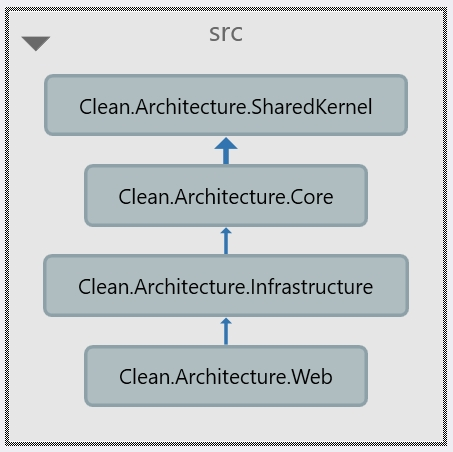
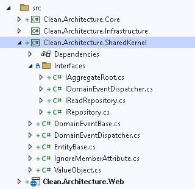
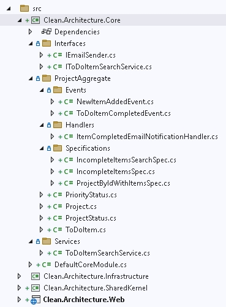
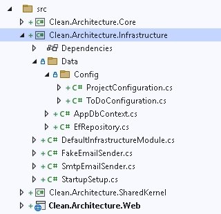
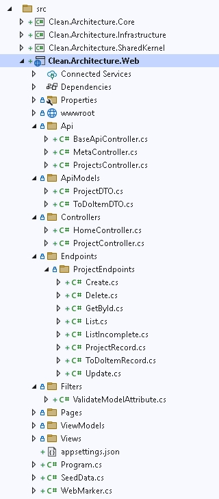
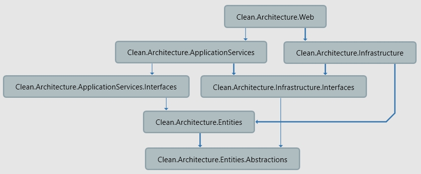
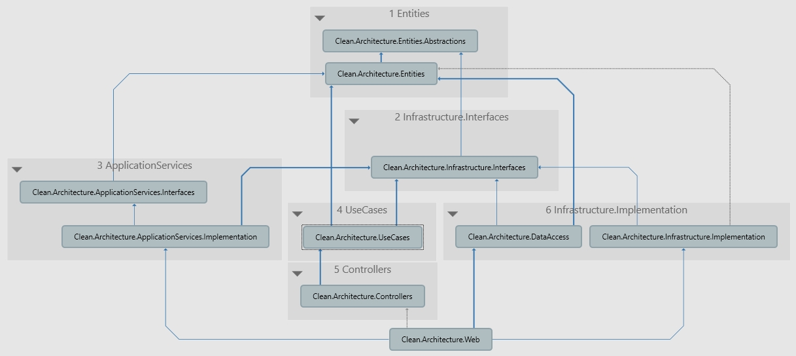

# Анализ сэмпла чистой архитектуры от Steve Smith

Source Git: `https://github.com/ardalis/CleanArchitecture`

Fork Git: `https://github.com/denis-tsv/CleanArchitecture-ardalis`

## Обзор структуры проекта

*Проект: 17. FromSteveSmith*



### Слой 1. `Clean.Architecture.SharedKernel`



Содержит набор базовых классов и интерфейсов.

- Папка `Interfaces`
  - `IAggregateRoot` - интерфейс-маркер для Aggregate Root Entities
  - `IDomainEventDispatcher`
  - `IReadRepository`
  - `IRepository` - интерфейс репозитория

- Корень проекта
  - `DomainEventBase` - абстрактный класс DomainEvent
  - `DomainEventDispatcher`
  - `EntityBase` - абстрактный класс Entity
  - `IgnoreMemberAttribute` - атрибут
  - `ValueObject` - абстрактный класс ValueObject

### Слой 2. `Clean.Architecture.Core`



Зависит от `Clean.Architecture.SharedKernel`

- Папка `Interfaces`
  - `IMailSender` - интерфейс отправки email.
  - `ITodoItemSearchService` - сервис для поиска.

- Папка `ProjectAggregate`

  - Папка `Events`. Доменные события.
    - `NewItemAddedEvent`
    - `ToDoItemCompletedEvent`

  - Папка `Handlers`
    - `ItemCompletedEmailNotificationHandler`. Handler для отправки email.

  - Папка `Specification`
    - `IncompleteItemsSearchSpec`
    - `IncompleteItemsSpec` - все нерешенные задачи.
    - `ProjectByIdWithItemsSpec`

  - `PriorityStatus`. Какой-то класс
  - `Project`. Какое-то Entity.
  - `ProjectStatus`. Enum.
  - `ToDoItem`. Entity. Используется Rich модель.

- Папка `Services`
  - `ToDoItemSearchService` - реализация сервис для поиска.

### Слой 3. `Clean.Architecture.Infrastructure`



Зависит от `Clean.Architecture.Core` и `Clean.Architecture.SharedKernel`

- Папка `Data`
  - Папка `Config`. Файлы конфигурации сущностей в EntityFramework.
    - `ProjectConfiguration`
    - `Configure`

  - `AppDbContext`. Внутри него mediator, при успешном сохранении дынных в БД, все events,
  которые есть в сохраненном mediator, публикуются.
  - `EfRepository` - реализация `IRepository`. Реализация репозитория является вырожденной - все,
  что делают методы репозитория это делегируют вызовы методов в `AppDbContext`.

- Корень проекта
  - `DefaultInfrastructureModule` - модуль, регистрирующий зависимости (`Autofac`).
  - `FakeEmailSender`
  - `SmtpEmailSender` - реализация сервиса для отправки email.
  - `StartupSetup` - вспомогательный класс для регистрации `AppDbContext`.

### Слой 4. `Clean.Architecture.Web`

Composition Root.



Зависит от `Clean.Architecture.Infrastructure`

- Папка `Api`. В этой папке находятся API контроллеры:
  - `BaseApiController`
  - `MetaController`
  - `ToDoItemsController`

- Папка `ApiModels`. В этой папке находятся DTO для контроллеров:
  - `ProjectDTO`
  - `ToDoItemDTO`

- Папка `Controllers`. В этой папке находятся "обычные" (не API) контроллеры:
  - `HomeController`
  - `ProjectController`

Прямо в методах контроллеров API реализована Application логика. Пример:

- Получение данных
- Выполнение бизнес-операции
- Сохранение данных в репозитории
- Маппинг результата в DTO

## Проблемы проекта

### 1. Непонятное содержимое проекта `Clean.Architecture.SharedKernel`


Что такое "SharedKernel"? Какое его назначение? Это неудачное наименование.

С точки зрения чистой архитектуры:

#### Переместить в `Entities`

- Папка `Interfaces`
  - `IAggregateRoot` - интерфейс-маркер для Aggregate Root Entities
  - `IDomainEventDispatcher`

- Корень проекта
  - `DomainEventBase` - абстрактный класс DomainEvent
  - `DomainEventDispatcher`
  - `EntityBase` - абстрактный класс Entity
  - `IgnoreMemberAttribute` - атрибут
  - `ValueObject` - абстрактный класс ValueObject

#### Переместить в `Infrastructure.Interfaces` (или `Database.Infrastructure.Interfaces`)

- Папка `Interfaces`
  - `IReadRepository`
  - `IRepository` - интерфейс репозитория

т.к. данные интерфейсы относятся к инфраструктуре (доступ к БД) и согласно чистой архитектуре
они не должны входить в состав Entities.

Но, DDD допускает наличие подобных интерфейсов в слое Entities.

### 2. Проблемы `Clean.Architecture.Core`


Что такое "Core"? Какое его назначение? Это Entities, Application Service, Domain Service?
Короче, неудачное наименование.

С точки зрения чистой архитектуры:

#### Переместить в `Entities`

- Папка `ProjectAggregate`

  - Папка `Events`. Доменные события.
    - `NewItemAddedEvent`
    - `ToDoItemCompletedEvent`

  - Папка `Specification`. (Относится к бизнес логике).
    - `IncompleteItemsSearchSpec`
    - `IncompleteItemsSpec` - все нерешенные задачи.
    - `ProjectByIdWithItemsSpec`

  - `PriorityStatus`. Какой-то класс
  - `Project`. Какое-то Entity.
  - `ProjectStatus`. Enum.
  - `ToDoItem`. Entity. Используется Rich модель.

#### Переместить в `Infrastructure.Interfaces`

- Папка `Interfaces`
  - `IMailSender` - интерфейс отправки email.

#### Переместить в `ApplicationServices.Interfaces`

- Папка `Interfaces`
  - `ITodoItemSearchService` - сервис для поиска.

#### Переместить в `ApplicationService` (или `UseCases`)

- Папка `ProjectAggregate`

  - Папка `Handlers`
    - `ItemCompletedEmailNotificationHandler`. Handler для отправки email.

- Папка `Services`
  - `ToDoItemSearchService` - реализация сервиса для поиска.

### 3. Проблемы `Clean.Architecture.Infrastructure`


В принципе, здесь проблем нет: здесь находится инфраструктура. Единственное, возможно,
придется разделить этот проект на несколько, если будет слишком много инфраструктуры.

## Перепроектирование (рефакторинг) проекта

*Проект: 18. FromSteveSmithRefactor1*

### Изменения в `Clean.Architecture.SharedKernel`

1. Создание нового проекта `Clean.Architecture.Infrastructure.Interfaces` и перенос туда:

- `IReadRepository`
- `IRepository` - интерфейс репозитория

Ссылка на `Clean.Architecture.Entity.Abstractions`

2. Переименование `Clean.Architecture.SharedKernel` в `Clean.Architecture.Entity.Abstractions`.

Т.к. в данном классе остались абстрактные сущности для их использования в Entities.

Этот проект нельзя назвать `*.Utils`, т.к. здесь нет:

- Extensions methods
- Helper'ов
- Cross cutting concerns (пронизывающая функциональность)
- Логирования
- Обработки ошибок

### Изменения в  `Clean.Architecture.Core`

1. Переименование `Clean.Architecture.Core` в `Clean.Architecture.ApplicationServices`.

2. Создание нового проекта `Clean.Architecture.Entities` и перенос туда:

- Папка `ProjectAggregate`

  - Папка `Events`. Доменные события.
    - `NewItemAddedEvent`
    - `ToDoItemCompletedEvent`

  - Папка `Specification`
    - `IncompleteItemsSearchSpec`
    - `IncompleteItemsSpec` - все нерешенные задачи.
    - `ProjectByIdWithItemsSpec`

  - Папка `Specification`. (Относится к бизнес логике).
    - `IncompleteItemsSearchSpec`
    - `IncompleteItemsSpec` - все нерешенные задачи.
    - `ProjectByIdWithItemsSpec`

  - `PriorityStatus`. Какой-то класс
  - `Project`. Какое-то Entity.
  - `ProjectStatus`. Enum.
  - `ToDoItem`. Entity. Используется Rich модель.

`Clean.Architecture.Entities` будет ссылаться на `Clean.Architecture.Entity.Abstractions`.

3. Перенос в `Clean.Architecture.Infrastructure.Interfaces`

Из папки `Interfaces`, `IMailSender` - интерфейс отправки email.

4. Создание нового проекта `Clean.Architecture.ApplicationServices.Interfaces` и перенос туда:

Из папки `Interfaces`, `ITodoItemSearchService` - сервис для поиска.

5. Это остается в `ApplicationServices`:

- Папка `ProjectAggregate`
  - Папка `Handlers`
    - `ItemCompletedEmailNotificationHandler`. Handler для отправки email.

- Папка `Services`
  - `ToDoItemSearchService` - реализация сервиса для поиска.

6. Проект `Clean.Architecture.ApplicationServices` будет ссылаться на

- `Clean.Architecture.Entities`
- `Clean.Architecture.Infrastructure.Interfaces`
- `Clean.Architecture.ApplicationServices.Interfaces`

### Ссылки в проектах `Clean.Architecture.Infrastructure` и `Clean.Architecture.Web`

- `Clean.Architecture.Infrastructure` ссылается на:

  - `Clean.Architecture.Entities`
  - `Clean.Architecture.Infrastructure.Interfaces`

- `Clean.Architecture.Web` ссылается на:

  - `Clean.Architecture.ApplicationServices`
  - `Clean.Architecture.Infrastructure`

### Итоговая промежуточная архитектура после рефакторинга



## Рефакторинг инфраструктуры

*Проект: 19. FromSteveSmithRefactor2*

В компоненте `Clean.Architecture.Infrastructure` есть реализации нескольких инфраструктур:

- Доступ к с данным (доступ к БД)
- Реализация почтового сервиса `EmailSender`.

Плюс, для функционала доступа к БД возможно в будущем дополнительное разделение, т.к.
в примере используются два провайдера к БД: `MSSql` и `SQLite`.

Возможное будущее дополнительное разделение проекта реализации доступа к БД на:

- `Clean.Architecture.DataAccess.MSSql`
- `Clean.Architecture.DataAccess.SQLite`

### Разделение проекта `Clean.Architecture.Infrastructure` на две части

- Новый проект `Clean.Architecture.Infrastructure.Implementation`
- `Clean.Architecture.Infrastructure` переименуем в `Clean.Architecture.DataAccess`.

### Проект `Clean.Architecture.Infrastructure.Implementation`

Сюда перемещаем `EmailSender`.

Ссылка на `Clean.Architecture.Infrastructure.Interfaces`.

### Проект `Clean.Architecture.Web`

Добавляются ссылки на:

- `Clean.Architecture.ApplicationServices.Implementation` (ссылка была ранее)
- `Clean.Architecture.DataAccess` (ссылка была ранее)
- `Clean.Architecture.Infrastructure.Implementation`

## Рефакторинг Use Cases. CQRS и Mediator

*Проект: 20. FromSteveSmithRefactor3*

Слишком "толстые" контроллеры - в их методах реализованы Use Cases.

Будем переносить логику из контроллеров API в Use Cases.

### Добавление нового компонента `Clean.Architecture.UseCases`

- В `Clean.Architecture.UseCases` добавить ссылку на:
  - Проект `Clean.Architecture.Entities`
  - Проект `Clean.Architecture.Infrastructure.Interfaces`
  - nuget `MediatR`

- В новый проект из `Clean.Architecture.Web` переносится папка `ApiModels` с переименованием ее в
`Dtos` (там находятся 2 dto).

Итоговая раскладка CQRS выглядит так:

- Папка `Project`
  - Папка `Commands`
    - Папка `CompleteProject`
      - `CompleteProjectCommand.cs`
      - `CompleteProjectCommandHandler.cs`
      - `CompleteProjectCommandResult.cs`
    - Папка `CreateProject`
      - `CreateProjectCommand.cs`
      - `CreateProjectCommandHandler.cs`
  - Папка `Dtos`
    - `ProjectDTO.cs`
    - `ToDoItemDTO.cs`
  - Папка `Queries`
    - Папка `GetProjectById`
      - `GetProjectByIdQuery.cs`
      - `GetProjectByIdQueryHanlder.cs`
    - Папка `GetProjectsList`
      - `GetProjectsListQuery.cs`
      - `GetProjectsListQueryHandler.cs`

#### Пример команды и ее обработчика

```csharp
public class CreateProjectCommand : IRequest<ProjectDTO>
{
    public CreateProjectDTO Dto { get; init; } = null!;
}
```

```csharp
public class CreateProjectCommandHandler : IRequestHandler<CreateProjectCommand, ProjectDTO>
{
    private readonly IRepository<ProjectEntity> _repository;

    public CreateProjectCommandHandler(IRepository<ProjectEntity> repository)
    {
        _repository = repository;
    }

    public async Task<ProjectDTO> Handle(CreateProjectCommand request, CancellationToken cancellationToken)
    {
        var newProject = new ProjectEntity(request.Dto.Name, PriorityStatus.Backlog);
        var createdProject = await _repository.AddAsync(newProject);
        var result = new ProjectDTO
        (
            id: createdProject.Id,
            name: createdProject.Name
        );

        return result;
    }
}
```

#### Пример запроса и его обработчика

```csharp
public class GetProjectsListQuery : IRequest<List<ProjectDTO>>
{
}
```

```csharp
public class GetProjectsListQueryHanlder : IRequestHandler<GetProjectsListQuery, List<ProjectDTO>>
{
    private readonly IRepository<ProjectEntity> _repository;

    public GetProjectsListQueryHanlder(IRepository<ProjectEntity> repository)
    {
        _repository = repository;
    }

    public async Task<List<ProjectDTO>> Handle(GetProjectsListQuery request, CancellationToken cancellationToken)
    {
        var projects = await _repository.ListAsync();
        var projectDTOs = projects
            .Select(project => new ProjectDTO(id: project.Id, name: project.Name))
            .ToList();

        return projectDTOs;
    }
}
```

### Изменения в `Clean.Architecture.Web`

- Добавить ссылку на `Clean.Architecture.UseCases`
- Добавить ссылку на nuget `MediatR` (ранее ссылка уже была)
- Добавить ссылку на nuget `MediatR.Extensions.Microsoft.DependencyInjection`
- Опционально. Добавить ссылку на nuget `AutoMapper` (было в примере, на видео)

#### Регистрация сервисов

- Регистрация `MediatR`:

```csharp
builder.Services.AddMediatR(typeof(GetProjectByIdQuery));
```

- Опционально. Регистрация `AutoMapper` (было в примере, на видео):

```csharp
builder.Services.AddAutoMapper(typeof(ToDoItemMappingProfile));
```

#### Контроллер `ProjectsController`

Пример использования CQRS и MediatR. Находится в поддиректории `Api`.

Вот что получилось, после переноса кода в слой Use Cases:

```csharp
public class ProjectsController : BaseApiController
{
    private readonly IMediator _mediator;

    public ProjectsController(IMediator mediator)
    {
        _mediator = mediator;
    }

    [HttpGet("{id:int}")]
    public async Task<IActionResult> GetById(int id)
    {
        var result = await _mediator.Send(new GetProjectByIdQuery { Id = id });
        if (result == null)
            return NotFound();

        return Ok(result);
    }

    // ...
```

## Рефакторинг контроллеров

*Проект: 21. FromSteveSmithRefactor4*

Имеет ли смысл выносить контроллеры в отдельный компонент из `Clean.Architecture.Web`?

В данном решении два типа контроллеров: API и которые генерируют View представления (html разметку).

Выносить последние в отдельное решение не имеет смысла: рядом расположены View - их надо
будет тоже переносить. Проще оставить их как есть.

Контроллеры API имеет смысл перенести в отдельный компонент, хотя бы ради того, чтобы
не путать их с контроллерами, отвечающими за генерацию представлений View.

### Перенос контроллеров API из `Clean.Architecture.Web`

- Создание нового проекта `Clean.Architecture.Controllers`

- В `Clean.Architecture.Controllers` добавление ссылок:
  - На nuget пакет `Microsoft.AspNetCore.Mvc.Core`
  - На проект `Clean.Architecture.UseCases`

- Перенос контроллеров API из `Clean.Architecture.Web` в новый проект.

- В `Clean.Architecture.Web` добавление ссылки на `Clean.Architecture.Controllers`.

## Создание папок для группировки проектов по слоям. Итоги

*Проект: 21. FromSteveSmithRefactor4*

Последний шаг - создание папок для группировки проектов по слоям:

- Папка `1 Entities`. (Все, что касается бизнес логики)
  - `Clean.Architecture.Entities`
  - `Clean.Architecture.Entities.Abstractions` (базовые классы для моделирования предтной области)

- Папка `2 Infrastructure.Interfaces`
  - `Clean.Architecture.Infrastructure.Interfaces`

- Папка `3 ApplicationServices`
  - `Clean.Architecture.ApplicationServices.Implementation`
  - `Clean.Architecture.ApplicationServices.Interfaces`

- Папка `4 UseCases`
  - `Clean.Architecture.UseCases`

- Папка `5 Controllers`
  - `Clean.Architecture.Controllers`

- Папка `6 Infrastructure.Implementation` (реализация инфраструктуры)
  - `Clean.Architecture.DataAccess` (реализация доступа к данным)
  - `Clean.Architecture.Infrastructure.Implementation` (остальные реализации инфраструктуры)

- `Clean.Architecture.Web` (самый верхний компонент)

### Итоговая диаграмма зависимостей


