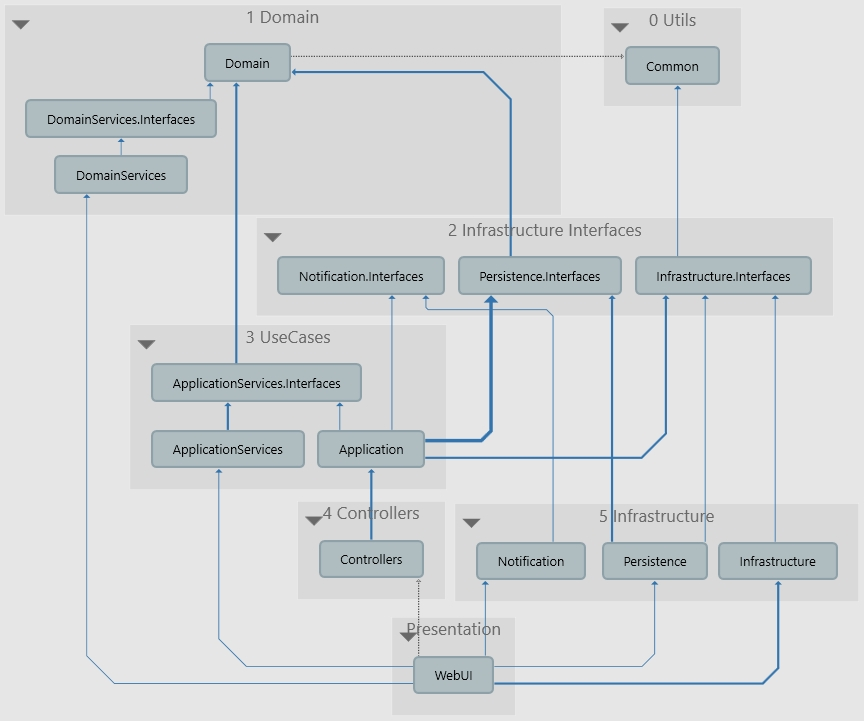

# Анализ сэмпла чистой архитектуры от Jason Taylor

Source Git: `https://github.com/jasontaylordev/NorthwindTraders`

Fork Git: `https://github.com/denis-tsv/NorthwindTraders-CleanArchitecture`

## Обзор `Domain`

*Проект: 22. FromJasonTaylor*

Обзор структуры проекта снизу вверх. Самый нижний компонент `Domain`.

Здесь:

- Базовые классы `ValueObject`, `AuditableEntity`
- Entities
- Exceptions (относятся к предментной области)
- ValueObjects

Выводы:

- Дядя Боб называет подобного рода компоненты "Entity".
- Домен сделан хорошо.
- Нет интерфейсов инфраструктуры (репозитории).
- Entities используют анемичную модель.

### Добавление доменных сервисов `DomainServices`

*Проект: 23. FromJasonTaylorRefactor1*

Как легко можно добавить компонент `DomainServices`?

1. Создание новых проектов:

- `DomainServices.Interfaces` (интерфейсы)
- `DomainServices` (реализация)

2. Ссылки:

- `DomainServices.Interfaces` ссылается на `Domain`
- `DomainServices` ссылается на `DomainServices.Interfaces`
- `WebUI` ссылается на `DomainServices`

3. Регистрация в `WebUI`

В данном примере, в каждом компоненте есть свой регистратор.

3.1. Создание вспомогательного класса для регистрации зависимости. 

В `DomainServices` надо добавить nuget-пакет `Microsoft.Extensions.DependencyInjection.Abstractions`

Регистратор в `DomainServices`:

```csharp
public static class DependencyInjection
{
    public static IServiceCollection AddDomainServices(this IServiceCollection services)
    {
        services.AddScoped<IOrderDomainService, OrderDomainService>();
        return services;
    }
}
```

3.2. Регистрация в `WebUI`

```csharp
public class Startup
{
    public void ConfigureServices(IServiceCollection services)
    {
        services.AddDomainServices();
        //...
    }
```

## Обзор `Common`, `Application`

*Проект: 22. FromJasonTaylor*

*Проект: 23. FromJasonTaylorRefactor1*

Компонент `Common` содержит единственный интерфейс `IDateTime`. `Common` претендент на самый
нижний уровень иерархии.

Компонент `Application` напоминает слой `Use Cases`. Для реализации CQRS использует `MediatR`.

Содержит:

- CQRS (команды и хендлеры, запросы и хедлеры - находятся вместе, в одном файле). Папки:
  - `Categories`
  - `Customers`
  - `Employees`
  - `Products`
  - `System`

- Папка `Common`:
  - Папка `Behaviours` (вспомогательные классы, используемые в MediatR, для CQRS):
    - `RequestLogger`
    - `RequestPerformanceBehaviour`
    - `RequestValidationBehavior`
  - Папка `Exceptions` (исключения уровня Application):
    - `BadRequestException`
    - `DeleteFailureException`
    - `NotFoundException`
    - `ValidationException`
  - Папка `Interfaces`:
    - `ICsvFileBuilder`
    - `ICurrentUserService`
    - `INorthwindDbContext`
    - `INotificationService`
    - `IUserManager`
  - Папка `Mappings` (используется `AutoMapper`):
    - `IMapFrom`
    - `MappingProfile`
  - Папка `Models`:
    - `Result` (возвращаемый результат без данных, но с описанием ошибок)

### Перенос в `Common`

В `Application` класс `Result` "претендует" на более низкий уровень - перенесем его в `Common`

Добавление в `Domain` ссылку на `Common`.

### Новый проект `Infrastructure.Interfaces`

*Проект: 23. FromJasonTaylorRefactor1*

Из компонента `Application` в `Infrastructure.Interfaces` можно перенести содержимое папки
`Interfaces` - это интерфейсы инфраструктуры.

1. Создаем новый компонент `Infrastructure.Interfaces`

2. Добавляем nuget-пакет `Microsoft.EntityFrameworkCore`

3. Из `Infrastructure.Interfaces` ссылка на `Domain` и `Common`

4. Перенос почти всех интерфейсов из `Application.Interfaces` в `Infrastructure.Interfaces`

В `Application` остается только 1 интерфейс `ICsvFileBuilder`:

```csharp
namespace Northwind.Application.Common.Interfaces
{
    public interface ICsvFileBuilder
    {
        byte[] BuildProductsFile(IEnumerable<ProductRecordDto> records);
    }
}
```

Этот интерфейс содержит ссылку `ProductRecordDto` - кандидат на перенос в `ApplicationServices`
(будет сделано в следующих рефакторингах).

5. Перенос DTO из `Application` в `Infrastructure.Interfaces` для их использования в интерфейсах.

### Перенос проектов в папки по слоям

- Папка `0 Utils`
  - Проект `Common`
- Папка `1 Domain`
  - Проект `Domain`
  - Проект `DomainServices`
  - Проект `DomainServices.Infrastructure`
- Папка `2 Infrastructure Interfaces`
  - Проект `Infrastructure.Interfaces`

## Добавление доменных сервисов `ApplicationServices`

*Проект: 24. FromJasonTaylorRefactor2*

В `Application` с прошлого раза остался только 1 интерфейс `ICsvFileBuilder`:

```csharp
namespace Northwind.Application.Common.Interfaces
{
    public interface ICsvFileBuilder
    {
        byte[] BuildProductsFile(IEnumerable<ProductRecordDto> records);
    }
}
```

Его можно перенести в ApplicationServices.

Есть еще в папке `Common\Mappings` интерфейс `IMapFrom`:

```csharp
public interface IMapFrom<T>
{
    void Mapping(Profile profile) => profile.CreateMap(typeof(T), GetType());
}
```

Этот интерфейс может использоваться любым из слоев - его можно переместить на самый нижний
слой `Common`.

1. Новая папка `3 UseCases`. Туда помещается `Application` и новые `ApplicationServices`

2. Создание двух новых проектов: `ApplicationServices` и `ApplicationServices.Interfaces`.

3. Перенос в `ApplicationServices.Interfaces` файлы:

- `ICsvFileBuilder`
- `ProductRecordDto` (dto, которое используется в `ICsvFileBuilder`)

4. Ссылки:

- `ApplicationServices.Interfaces` ссылается на `Domain`
- `ApplicationServices` ссылается на `ApplicationServices.Interfaces`
- `Application` ссылается на `ApplicationServices.Interfaces`

В `ApplicationServices.Interfaces` добавляется nuget пакет `AutoMapper`.

5. Реализация `ICsvFileBuilder` находится в `Infrastructure`, файл `CsvFileBuilder`.

Перенос этого файла в `ApplicationServices`.

В `ApplicationServices` надо добавить nuget пакеты:

- `CsvHelper`
- `Microsoft.Extensions.DependencyInjection.Abstractions`

6. В `ApplicationServices` добавляется `DependencyInjection` - вспомогательный класс
для регистрации зависимостей:

```csharp
public static class DependencyInjection
{
    public static IServiceCollection AddApplicationServices(this IServiceCollection services)
    {
        services.AddTransient<ICsvFileBuilder, CsvFileBuilder>();
        return services;
    }
}
```

В `WebUI` добавляется ссылка на `ApplicationServices`.

Регистрация в `WebUI`:

```csharp
public class Startup
{
    public void ConfigureServices(IServiceCollection services)
    {
        services.AddApplicationServices();
        //...
    }
```

7. Из `Infrastructure` теперь можно удалить ссылку на `Application`.

## Рефакторинг инфраструктуры

*Проект: 25. FromJasonTaylorRefactor3*

Здесь сделано два Bounded Context: один для авторизации (проект `Infrastructure`),
второй для управления объектами Northwind (проект `Persistence`).

### Проект `Infrastructure`

Содержит:

- Папка `Identity` (реализация авторизации)
  - Папка `Migrations`
  - `ApplicationDbContext`
  - `ApplicationUser`
  - `IdentityResultExtensions`
  - `UserManagerService`

- `MachineDateTime` (реализация `IDateTime` - время на текущей машине)
- `NotificationService` (реализация `INotificationService` - сервиса уведовмлений)

### Проект `Persistence`

Содержит:

- Папка `Configuration` (настройки БД для Northwind)
  - Папка `Migrations`
  - `DesignTimeDbContextFactoryBase`
  - `NorthwindDbContext`
  - `NorthwindDbContextFactory`

Инфраструктуру БД лучше **всегда выделять** в отдельный проект, т.к. он "жирный":

- ORM маппинги
- Миграции
- DbFactory
- Data seed - наполнение БД первоначальными данными

### Проект `Infrastructure.Interfaces`

(Уже ранее был рассмотрен). Содержит:

- `ICurrentUserService`
- `INorthwindDbContext`
- `INotificationService`
- `IUserManager`
- `MessageDto`

Данные интерфейсы и их реализации можно распределить на три группы:

1. `INotificationService` и `MessageDto`
2. `INorthwindDbContext`
3. `ICurrentUserService` и `IUserManager` (для работы с текущим пользователем)

### Разделение инфраструктуры

В папку `2 Infrastructure Interfaces` добавляются новые проекты:

1. Новый проект `Persistence.Interfaces`

Сюда переносится `INorthwindDbContext`, добавляются ссылки на `Domain`, nuget пакет
`Microsoft.EntityFrameworkCore`.

В принципе, из `Infrastructure.Interfaces` ссылку на nuget пакет `Microsoft.EntityFrameworkCore`
можно удалить.

2. Новый проект `Notification.Interfaces` - инфраструктура для отправки сообщений.

(Обычно в такого рода проектах находятся реализации для взаимодействия с шиной сообщений).

Сюда переносятся `INotificationService` и `MessageDto`.

3. В уже существующем проекте `Infrastructure.Interfaces` остались `ICurrentUserService` и
`IUserManager`.

### Реализации

Все реализации инфраструктуры будут находиться в папке `Infrastructure`.

1. Уже существующий `Persistence` будет ссылаться на `Persistence.Interfaces`.

1. Уже существующий `Infrastructure` ссылается на `Infrastructure.Interfaces`.

3. Новая реализация инфраструктуры - создаем новый проект`Notification`.

Будет ссылаться на `Notification.Interfaces`.

Из `Infrastructure` в `Notification` переносится `NotificationService`.

В `Notification` надо добавить ссылку на nuget пакет
`Microsoft.Extensions.DependencyInjection.Abstractions`

В `Notification` добавляется `DependencyInjection` - вспомогательный класс
для регистрации зависимостей:

```csharp
public static class DependencyInjection
{
    public static IServiceCollection AddNotification(this IServiceCollection services)
    {
        services.AddTransient<INotificationService, NotificationService>();
        return services;
    }
}
```

В `WebUI` добавляется ссылка на `Notification`.

Регистрация в `WebUI`:

```csharp
public class Startup
{
    public void ConfigureServices(IServiceCollection services)
    {
        services.AddNotification();
        //...
    }
```

Регистрацию сервисов можно отсортировать в порядке возрастания их иеарархии в solution:

```csharp
public void ConfigureServices(IServiceCollection services)
{
    services.AddDomainServices();

    services.AddApplication();
    services.AddApplicationServices();

    services.AddInfrastructure(Configuration, Environment);
    services.AddPersistence(Configuration);
    services.AddNotification();
    //...
}
```

4. В `Application` надо добавить ссылки на `Persistence.Interfaces` и `Notification.Interfaces`.

## Рефакторинг контроллеров

*Проект: 26. FromJasonTaylorRefactor4*

В `WebUI`, в папке `Controllers` находятся контроллеры.

Реализованы хорошо: единственное, что они делают это:

- Получают данные
- Отправляют входные данные с помощью `MediatR` в Use Cases
- Возвращают результат

Ради чистоты эксперимента контроллеры можно выделить в отдельный компонент.
Хотя это необязательно делать:

- Здесь нет нескольких frontend'ов/backend'ов.
- Нет отдельных API (mobile, admin и т.д.)

### Выделение контроллеров в отдельный проект `Controllers`

1. Создание нового проекта `Controllers`.

2. Добавить nuget'ы:

- `MediatR`
- `Microsoft.AspNetCore.Mvc.Core`
- `Microsoft.AspNetCore.ApiAuthorization.IdentityServer`

3. Перенести все контроллеры из `WebUI`, папки `Controllers` в проект `Controllers`.

4. Добавление ссылки из `Controllers` на `Application`.

5. Добавление ссылки из `WebUI` на `Controllers`.

### Добавление ссылки на контроллеры в другом проекте

*(Может понадобиться сделать в некоторых версиях .NET)*

При регистрации, в `Startup` классе надо написать:

```csharp
services.AddApplicationPart(typeof(CategoriesController).Assembly)
```

где `CategoriesController` - это один из регистрируемых контроллеров.

### Группировка проектов в solution по папкам

- Папка `0 Utils`
  - Проект `Common`
- Папка `1 Domain`
  - Проект `Domain`
  - Проект `DomainServices`
  - Проект `DomainServices.Infrastructure`
- Папка `2 Infrastructure Interfaces`
  - Проект `Infrastructure.Interfaces`
  - Проект `Notification.Interfaces`
  - Проект `Persistence.Interfaces`
- Папка `3 UseCases`
  - Проект `Application`
  - Проект `ApplicationServices`
  - Проект `ApplicationServices.Interfaces`
- Папка `4 Controllers`
  - Проект `Controllers`
- Папка `5 Infrastructure`
  - Проект `Infrastructure`
  - Проект `Notification`
  - Проект `Persistence`
- Папка `Presentation` (была изначально)
  - Проект `WebUI` (был изначально)

### Пример возможной доработки Command/Query (`MediatR`)

В исходном solution Command выглядела примерно так:

```csharp
public class DeleteCategoryCommand : IRequest
{
    public int Id { get; set; }

    public class DeleteCategoryCommandHandler : IRequestHandler<DeleteCategoryCommand>
    {
        private readonly INorthwindDbContext _context;

        public DeleteCategoryCommandHandler(INorthwindDbContext context)
        {
            _context = context;
        }

        public async Task<Unit> Handle(DeleteCategoryCommand request, CancellationToken cancellationToken)
        {
            var entity = await _context.Categories
                .FindAsync(request.Id);

            if (entity == null)
            {
                throw new NotFoundException(nameof(Category), request.Id);
            }

            _context.Categories.Remove(entity);
            await _context.SaveChangesAsync(cancellationToken);
            return Unit.Value;
        }
    }
}
```

Непринципиальные замечания:

1. Сам запрос CQRS можно вынести в отдельный файл от обработчика.
2. Воспользоваться `AsyncRequestHandler` чтобы возвращать не `Task<Unit>`, а просто `Task`.

После изменений:

```csharp
public class DeleteCategoryCommand : IRequest
{
    public int Id { get; set; }
}
```

```csharp
public class DeleteCategoryCommandHandler : AsyncRequestHandler<DeleteCategoryCommand>
{
    private readonly INorthwindDbContext _context;

    public DeleteCategoryCommandHandler(INorthwindDbContext context)
    {
        _context = context;
    }

    protected override async Task Handle(DeleteCategoryCommand request, CancellationToken cancellationToken)
    {
        var entity = await _context.Categories
            .FindAsync(request.Id);

        if (entity == null)
        {
            throw new NotFoundException(nameof(Category), request.Id);
        }

        _context.Categories.Remove(entity);
        await _context.SaveChangesAsync(cancellationToken);
    }
}
```

## Итоговая структура solution


