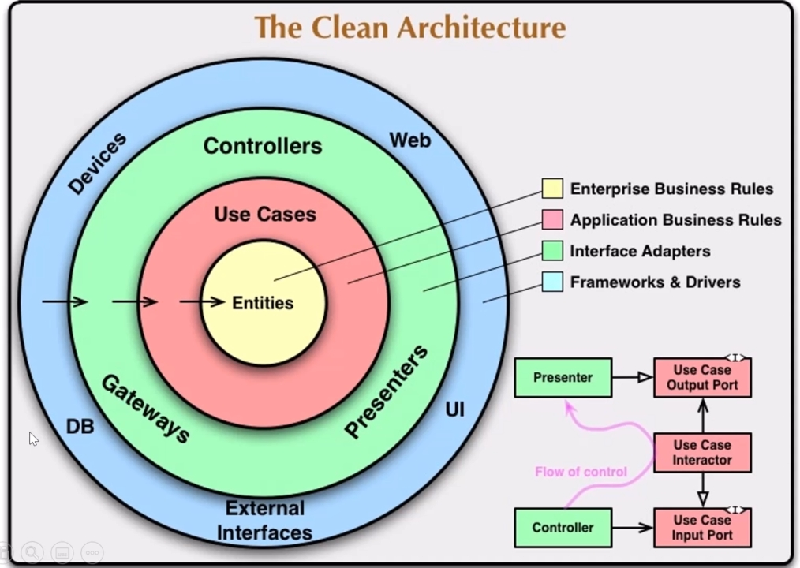

# Чистая архитектура на практике

Курс: `https://www.udemy.com/course/clean-architecture-csharp-ru/`

Git: `https://github.com/denis-tsv/CleanArchitectureCourse`

- [02 Чистая архитектура на практике](Part1.md)
- [03 Масштабирование](Part2.md)
- [04 Анализ сэмпла чистой архитектуры от Steve Smith](Part3.md)
- [05 Анализ сэмпла чистой архитектуры от Jason Taylor](Part4.md)

## Ссылки

- [Нужно ли оборачивать ORM репозиторием](https://youtu.be/3yPpL1rEK9o)
- [Почему в 2020 году не нужна своя реализация паттерна Repository](https://youtu.be/TQHgaDfrDmE)

