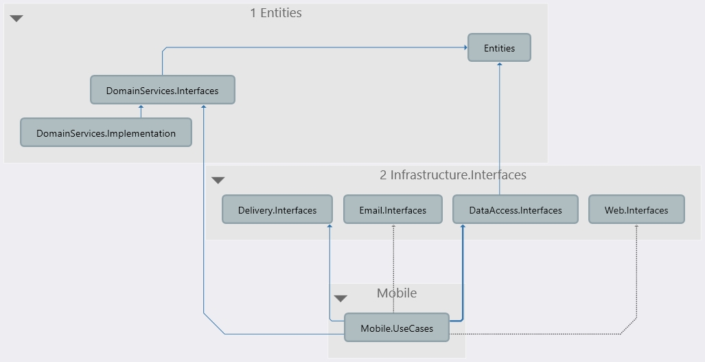

# Чистая архитектура на практике

Курс: `https://www.udemy.com/course/clean-architecture-csharp-ru/`

Git: `https://github.com/denis-tsv/CleanArchitectureCourse`

## Создание Migration

### Установка (обновление) Entity Framework Core Tool

Надо сделать только раз. Либо шаг 1, либо шаг 2.

Шаг 1. Если `dotnet-ef` еще не установлен

```text
dotnet tool install --global dotnet-ef
```

Шаг 2. Если `dotnet-ef` еще не установлен, но требует обновления:

```text
dotnet tool update --global dotnet-ef
```

### Создание миграции

```text
dotnet ef migrations add Initial -s WebApp.csproj -p ../DataAccess/DataAccess.csproj
```

- `Initial` - имя миграции

- `-s WebApp.csproj` - The startup project to use.
  Defaults to the current working directory.

- `-p ../DataAccess/DataAccess.csproj` - The project to use. Defaults to the current
  working directory. (Именно здесь и будет создана migration).

### Применение миграции

```text
dotnet ef database update -v
```

- `-v` или `--verbose` - необязательный параметр, позволяет увидеть более подробную информацию
  о том, что происходит при выполнении команды.

Файл БД `WebApp.db` появляется прямо в директории `01. Initial/WebApp/`.

## Проект 01. Начальный проект

Проект `01. Initial` - начальный проект по "стандартной" архитектуре.

Его схема:


## 01.Cross-cutting concerns. Helpers

*Проект: 02. UtilsAndDomainServices*

На диаграммах чистой и луковой архитектур обычно не указывается область cross-cutting concerns.

**Cross-cutting concerns** - это сквозная (или пронизывающая) функциональность.

- Относится к инфраструктуре приложения.
- Часто используется несколькими слоями приложения.

Примеры cross-cutting concerns:

- Транзакционность
- Логирование
- Измерение производительности
- Extension методы
- Атрибуты
- Helpers

В примере в solution добавится проект `Utils`. Там будет простые методы расширения для `string`.

На этот проект могут ссылаться все остальные проекты в solution: добавляем ссылку на проект `Utils`
в `Domain`.

Луковая архитектура без `Utils`:


Луковая архитектура с `Utils`:


## 02. Entities и доменные сервисы

- Это бизнес-логика, которая существует в реальной жизни (без софта).
- Никакой больше логики кроме бизнес-логики в Entities быть не должно. Никаких интерфейсов,
репозиториев и т.п.
- Рекомендуется использовать Rich-model (дядя Боб рекомендует).
- Но в реальной жизни анемичная модель также используется.

Примеры бизнес-логики, которая может существовать в реальной жизни и без софта:

- Магазин: рассчет стоимости заказа, с учетом/без учета скидки.
- Бухгалтерия: рассчеты в тетрадях и т.п.

**Rich-model** - модели, которые содержат не только данные, но и инкапсулируют методы для их
обработки.

**Анемичная модель** - модель, которая содержит только данные.

### Что положить в Entities

- Entities (модели) - сущности, которые моделируют объекты предметной области.
- Перечисления
- Исключения - только исключения, относящиеся к предметной области.
- Domain Events

Пример entities для интернет магазина:

- Заказ
- Товар
- Пункт заказа

Пример исключений, относящихся к предметной области:

- НельзяРассчитатьСтоимостьЗаказа
- БалансНеСошелся

### Если будет использоваться анемичная модель

Для этого надо выделить Domain Services для бизнес-логики.

В демо-проекте будет продемонстрирован пример использования анемичной модели.

В solution добавляются проекты:

- `DomainServices.Interfaces` - интерфейсы
- `DomainServices.Implementation` - реализация интерфейсов


Кто может ссылаться:

- На `DomainServices.Interfaces` могут ссылаться все вышестоящие проекты.
- На `DomainServices.Implementation` может ссылаться самый верхний "root" проект:
  - На рисунке это `Frameworks`
  - В демо-проекте это запускаемый верхний проект `WebApp`.

### Практика

*Проект: 02. UtilsAndDomainServices*

Перенос метода расчета стоимости заказа из `Application.OrderService` в слой Entities.

```csharp
public async Task<OrderDto> GetByIdAsync(int id)
{
    // ...
    dto.Total = order.Items.Sum(x => x.Quantity * x.Product.Price)
    return dto;
}
```

Если будет использоваться rich-model, то просто перенос в entities, в класс `Order`:

```csharp
public class Order
{
    public int Id { get; set; }
    public DateTime CreateDate { get; set; }
    public OrderStatus Status { get; set; }

    public ICollection<OrderItem> Items { get; set; }

    // NEW
    public decimal GetTotal()
    {
        return Items.Sum(x => x.Quantity * x.Product.Price);
    }
}
```

Но у нас используется анемичная model:

1. В новый проект `DomainServices.Interfaces` добавляется:

```csharp
public interface IOrderDomainService
{
    decimal GetTotal(Order order);
}
```

2. В новый проект `DomainServices.Implementation` добавляется реализация:

```csharp
public class OrderDomainService : IOrderDomainService
{
    public decimal GetTotal(Order order)
    {
        return order.Items.Sum(x => x.Quantity * x.Product.Price);
    }
}
```

3. Добавление ссылок в проекты:

  - В `Application` ссылка на `DomainServices.Interfaces`
  - В `WebApp` ссылка на `DomainServices.Implementation`

4. Регистрация нового сервиса в контейнере:

```csharp
builder.Services.AddScoped<IOrderDomainService, OrderDomainService>();
```

5. Использование зарегистрированного сервиса `IOrderDomainService` в `Application.OrderService`.

## 03. Data Access

*Проект: 03. DataAccess*

### Use Cases и Data Access

- В Use Cases находится логика приложения - логика, которые связана с автоматизацией бизнес-процессов.
- Не должны зависеть от фреймворков (ORM, Web, ...).
- На каждую роль один use case.

Примеры:

- Взаимодествие с инфраструктурой.
- Информация о сеансе текущего пользователя.

Use Cases нужны интерфейсы инфраструктуры:

- База данных
- Интеграции (email-сервис)
- Хост (текущий пользователь и его права)

### Расположение интерфейсов инфраструктуры

В луковой архитектуре расположение интерфейсов четко определено:


Расположение интерфейсов по DDD:


Где расположены интерфейсы инфраструктуры в чистой архитектуре:

- Не в Entities (как это реализовано в DDD).
- Интерфейсы инфраструктуры располагаются в слое UseCases.

Наш пример в качестве инфраструктуры использует базу данных.

Поэтому создаем и добавляем слой `DataAccess.Interfaces` и его реализацию `DataAccess`:


- Слой `DataAccess.Interfaces` помещается между слоями `Entities` и `Use Cases`.
- Слой `DataAccess.Interfaces` ссылается на `Entities`.
- Слой `DataAccess.Interfaces` используется слоем `Use Cases`.
- Реализация слоя `DataAccess.Interfaces` находится в слое `DataAccess`, который расположен
ближе всего к слою `Frameworks`.

### Практика

*Проект: 03. DataAccess*

#### Добавление проекта `DataAccess.Interfaces`

1. Создание проекта `DataAccess.Interfaces`.

2. Добавление в `DataAccess.Interfaces` ссылки на `Entities` и `Microsoft.EntityFrameworkCore`.

3. В `DataAccess.Interfaces`, создаем `IDbContext`:

```csharp
public interface IDbContext
{
    DbSet<Order> Orders { get; }
    DbSet<Product> Products { get; }

    Task<int> SaveChangesAsync(CancellationToken token);
}
```

Почему в интерфейс доступа к БД мы добавляем `DbSet`, а не создаем репозитории?
Объяснение в двух словах:

- Мы здесь не зависим ни от какой конкретной базы (зависимость только от "общего" пакета
`Microsoft.EntityFrameworkCore`).

- Концепция `DbContext` сама по себе является реализацией паттерна `Repository` и `Unit of work`.
(Т.е. реализация дополнительной абстракции `Repository` является избыточной).

4. Добавление в `DataAccess` ссылки на `DataAccess.Interfaces`.

5. Класс `DataAccess.AppDbContext` теперь реализует `IDbContext` (добавляем `IDbContext`):

```csharp
public class AppDbContext : DbContext, IDbContext
{
    // ...
}
```

6. `Application` теперь ссылается не на `DataAccess`, а на `DataAccess.Interfaces`:

- Меняем ссылки в `.csproj`
- В классах, которые используют `AppDbContext` меняем на

7. Верхний `WebApp` теперь ссылается на `DataAccess`.

7.1. Меняем регистрацию сервиса:

с

```csharp
builder.Services.AddEntityFrameworkSqlite().AddDbContext<AppDbContext>();
```

на

```csharp
builder.Services.AddEntityFrameworkSqlite().AddDbContext<IDbContext, AppDbContext>();
```

7.2. Еще один вариант регистрации сервиса. Через чтение конфигурационного файла:

```csharp
var connectionString = builder.Configuration.GetConnectionString("DefaultConnection");
builder.Services.AddDbContext<IDbContext, AppDbContext>(opts => opts.UseSqlite(connectionString));
```

В `AppDbContext` метод `OnConfiguring(DbContextOptionsBuilder options)` пустой.

В `appsettings.json` строка подключения такая:

```json
"ConnectionStrings": {
  "DefaultConnection": "Filename=WebApp.db;"
}
```

#### Раскладывание проектов по папкам

Рекомендуется для сортировки проектов по уровням использовать именование папок с нумерацией.

Сортировка проектов по папкам в solution:

- Папка `0 Utils`:
  - Проект `Utils`
- Папка `1 Entities`:
  - Проект `Domain`
  - Проект `DomainServices.Implementation`
  - Проект `DomainServices.Interfaces`

### Итого

Слой `Application` теперь не зависит от типа БД, а зависит только от `IDbContext`.

## 04. Инфраструктура. Много инфраструктуры

*Проект: 04. Infrastructure* - общий проект под инфраструктуру

*Проект: 05. InfrastructureSeparate* - отдельные проекты под инфраструктуру

Что делать если у приложения много инфраструктуры.

Например, в приложении может быть несколько вещей из:

- База данных (на чтение, на запись, KeyValue storage)
- Веб-фреймворк
- Service Bus
- Blob Storage (для хранения файлов)
- Elastic Search (для ускорения поиска)

### Что сделать

Выделить проект `Infrastructure.Interfaces` и положить туда интерфейсы всей инфраструктуры,
которая используется приложением:


- `DataAccess` лучше оставить отдельным слоем.
- В `Infrastructure.Implementation` будет находиться реализация остальной инфраструктуры.

`DataAccess` и `Infrastructure.Implementation` могут ссылаться **только** на
`Infrastructure.Interfaces` и, если это необходимо, на `Entities`.

### Что кладем в `Infrastructure.Interfaces`

- Интерфейсы для доступа к инфраструктуре
  - ORM для доступа к базе
  - Elastic Search
  - Blob Storage
  - ...
- Интерфейсы для зависимостей веб-фреймворка
  - Текущий пользователь (получение информации о текущем пользователе)
- Интерфейсы для интеграции с врешними системами
  - Отправка Email и SMS

#### Если инфраструктуры слишком много

То `Infrastructure.Interfaces` и `Infrastructure.Implementation` могут стать слишком большими.

Поэтому: выделяем интерфейс и реализацию каждой инфраструктуры.

Пример:

- Для Service Bus:
  - `ServiceBus.Interfaces`
  - `ServiceBus.Implementation`
- Для Blob Storage:
  - `BlobStorage.Interfaces`
  - `BlobStorage.Implementation`
- ...
- `Инфраструктура N`:
  - `Интеграция N.Interfaces`
  - `Интеграция N.Implementation`


При таком походе будет множество слабосвязанных маленьких компонентов.

### Практика

#### 1. Добавление только `Infrastructure.Interfaces` и `Infrastructure.Implementation`

*Проект: 04. Infrastructure*

1. `DataAccess.Interfaces` переименовывается в `Infrastructure.Interfaces`

2. В `Infrastructure.Interfaces` создаются папки:

- `Infrastructure` - для доступа к БД - сюда помещеается `IDbContext`.
- `Integrations` - для какого-нибудь email сервиса.
- `WebApp` - для получения информации о пользователе.

3. Интерфейсы для наших псевдо-сервисов:

- В `Infrastructure.Interfaces`, `Integrations`:
создадим `IEmailService` - интерфейс email сервиса.

- В `Infrastructure.Interfaces`, `WebApp`:
создадим `ICurrentUserService` - интерфейс сервиса для получения информации о текущем пользователе.

4. Новый проект `Infrastructure.Implementation` ссылается на `Infrastructure.Interfaces`.

5. Можно сгруппировать объекты по папкам:

- Папка `2 Infrastructure.Interfaces`:
  - Проект `Infrastructure.Interfaces`
- Папка `Infrastructure.Implementation`:
  - Проект `DataAccess`
  - Проект `Infrastructure.Implementation`

6. Добавление реализаций

- В `Infrastructure.Implementation` - реализацию для `IEmailService`.
- В `WebApp`, папку `Services` - реализацию для `ICurrentUserService`.

7. Слой `Application` ссылается на `Infrastructure.Interfaces`.

8. Слой `WebApp` ссылается на `Infrastructure.Implementation` и `DataAccess`.

9. Регистрация новых сервисов на `WebApp`:

```csharp
builder.Services.AddScoped<ICurrentUserService, CurrentUserService>();
builder.Services.AddScoped<IEmailService, EmailService>();
```

Можно сгруппировать регистрацию сервисов по слоям:

```csharp
// Domain
builder.Services.AddScoped<IOrderDomainService, OrderDomainService>();

// Infrastructure
builder.Services.AddScoped<ICurrentUserService, CurrentUserService>();
builder.Services.AddScoped<IEmailService, EmailService>();
builder.Services.AddEntityFrameworkSqlite().AddDbContext<IDbContext, AppDbContext>();

// Application
builder.Services.AddScoped<IOrderService, OrderService>();

// Frameworks
builder.Services.AddAutoMapper(typeof(MapperProfile));
builder.Services.AddControllers();
```

#### 2. Добавление `Infrastructure.Interfaces` и `Infrastructure.Implementation` для каждого компонента инфраструктуры

*Проект: 05. InfrastructureSeparate*

Все сервисы инфраструктуры разбиваются на попарные проекты.

1. В solution получаются следующие компоненты инфраструктуры:

- `DataAccess.Interfaces` и `DataAccess`
- `Email.Interfaces` и `Email.Implementation`
- `Web.Interfaces` и `WebApp`

2. Добавление интерфейсов для наших псевдо-сервисов:

- В `Email.Interfaces` добавляем `IEmailService`
- В `Web.Interfaces` добавляем `ICurrentUserService`
- В `DataAccess.Interfaces` остается `IDbContext`

3. Интерфейсы инфраструктуры могут ссылаться только на "нижние" слои:

- `Entity`
- `Utils`

4. Релизации инфраструктуры

- `Email.Implementation`, добавляется `EmailService`
- `WebApp` - в папку `Services`добавим `CurrentUserService`
- `DataAccess.Interfaces` - лежит `AppDbContext`

5. Слой `Application` ссылается на интерфейсные слои инфраструктуры `*.Interfaces`

6. Слой `WebApp` ссылается на реализацию слоев инфраструктуры `*.Implementation`

7. Обязательно: регистрация в `WebApp` всех сервисов (см. прошлый раздел)

## 05. Use Cases

*Проект: 06. UseCases*

Определения:

- **Use Case** - это операция, которую хочет выполнить пользователь.

- **Use Case** - вариант использования нашей системы.

Пользователь это не обязательно живой человек.

Примеры use case для интернет магазина:

- Оформить заказ
- Выбрать товар для просмотра по нему деталей
- Отменить заказ

Триггером use case может быть:

- Внешняя система, которая загружает или получает из нашей системы какие-либо данные.
- Background job (запуск по расписанию, синхронизация).

### Что такое интерактор

Дядя Боб обычно изображает секцию с Use Case так:


- `Controller` - отдает данные во входной порт Use Case (`Input Port`).
- `Presenter` - получает результаты работы Use Case из выходного порта (`Output Port`) и дальше
доставляет их пользователю.

Еще одна картинка от дяди Боба:


Из этих двух картинок видно что `Use Case Interactor`:

- Получает входные параметры/данные `Input Data`
- У него есть возможность взаимодействия с уровнем доступа к данным `Data Access Interface`
- У него есть возможность взаимодействия с `Entities`

Что делает Interactor: он управляет взаимодействием инфраструктуры с одной стороны (доступ к данным)
и бизнес-логика с другой стороны.

Например Interactor:

- загружает данные из базы
- выполняет бизнес-операции
- как-то изменяет объекты, загруженные в память
- сохраняет данные в базу
- может взаимодействовать с внешней системой: отправка SMS, email, сообщений по шине, ...

### Как реализовать Interactor

Логика уровня приложения, которая напрямую не связана с бизнес-логикой, а связана с ее
автоматизацией.

#### 1 способ реализации. Application Services

Обычно используются в слоистой архитектуре.

```csharp
public class OrderService
{
    public Order CreateOrder()
    {
    }

    public List<Order> GetOrders()
    {
        return _orderRepository.GetAllOrders();
    }
}
```

Здесь 2 метода - 2 use case'а.

#### 2 способ реализации. CQRS Handlers

Создается отдельный класс для каждого use case'а.

```csharp
public class GetOrderRequestHandler
{
    public List<Order> Handle(GetOrderRequest request)
    {
        return _dbContext.Orders;
    }
}
```

#### Какую из реализации выбрать? Сервис или хедлер?

- Правилу зависимостей удовлетворяют оба варианта.
- Автор рекомендует использовать хендлеры:
  - Явный вызов use case'а из use case'а.
  - Изоляция use case'ов.
  - Только необходимые зависимости и Generic-параметры для каждого из use case.
  - *(Что?)* AOP (aspect oriented programming) без магии Fody (pipeline).
  - *(Что?)* Cross-cutting concerns через pipeline, а не магию Fosy или DynamicProxy.

### Практика

*Проект: 06. UseCases*

1. Добавим еще один Use Case (для наглядности).

1.1. Сейчас есть только 1 use case: в `Application`, в `OrderService`, метод `GetByIdAsync`.

Добавим метод `CreateOrderAsync` в `IOrderService`:

```csharp
Task<int> CreateOrderAsync(CreateOrderDto dto);
```

И его реализацию в `OrderService`:

```csharp
public async Task<int> CreateOrderAsync(CreateOrderDto dto)
{
    var order = _mapper.Map<Order>(dto);
    _dbContext.Orders.Add(order);
    await _dbContext.SaveChangesAsync();
    return order.Id;
}
```

Dto'шки:

```csharp
public class CreateOrderDto
{
    public List<OrderItemDto> Items { get; set; }
}

public class OrderDto
{
    public int Id { get; set; }
    public decimal Total { get; set; }
}

public class OrderItemDto
{
    public int ProductId { get; set; }
    public int Quantity { get; set; }
}
```

Не забываем добавить Dto'шки в `MapperProfile`.

1.2. Новый метод в контроллере `OrdersController`:

```csharp
[HttpPost]
public async Task<int> Create([FromBody] CreateOrderDto dto)
{
    var id = await _orderService.CreateOrderAsync(dto);
    return id;
}
```

Теперь, переход к реализации Use Cases

2. Проект `Application` переименуем в `UseCases`.

3. Подключение `MediatR`.

- В проект `UseCases` добавляется nuget пакет `MediatR`.
- В проект `WebApp` добавляется nuget пакет `MediatR.Extensions.Microsoft.DependencyInjection`.

*Мое замечание: использование `MediatR` некоторые рассматривают как антипаттерн.*

4. Отрефакторим сервисы - заменим их на хендлеры.

4.1. Для каждого агрегата внутри проекта `UseCases` создадим отдельные папки.

- Папка `Order`. Внутри - все, что относится к заказу.
  - Папка `Order\Commands` - команды.
    - Папка `Order\Commands\CreateOrder` - Команда "Создание заказа".
  - Папка `Order\Queries` - queries.
    - Папка `Order\Queries\GetById` - Query "Получение заказа".
  - Папка `Order\Dto` - папка для Dto'шек.
  - Папка `Order\Utils` - папка для вспомогательных инструментов.

4.2. Создадим внутренний request, который отправляется от контроллера к use case'у:

В `Order\Commands\CreateOrder` создадим `CreateOrderCommand`:

```csharp
public class CreateOrderCommand : IRequest<int>
{
    public CreateOrderDto Dto { get; set; }
}
```

И handler для него (тоже в папке `Order\Commands\CreateOrder`):

```csharp
public class CreateOrderCommandHandler : IRequestHandler<CreateOrderCommand, int>
{
    private readonly IMapper _mapper;
    private readonly IDbContext _dbContext;

    public CreateOrderCommandHandler(IMapper mapper, IDbContext dbContext)
    {
        _mapper = mapper;
        _dbContext = dbContext;
    }

    public async Task<int> Handle(CreateOrderCommand command, CancellationToken cancellationToken)
    {
        var order = _mapper.Map<Domain.Entities.Order>(command.Dto);
        _dbContext.Orders.Add(order);
        await _dbContext.SaveChangesAsync();
        return order.Id;
    }
}
```

В метод `CreateOrderCommandHandler.Handle` попадает функционал из метода
`OrderService.CreateOrderAsync`.

4.3. Аналогично делаем внутренний request:

В `Order\Queries\GetById` создадим `GetOrderByIdQuery` и `GetOrderByIdQueryHandler`.

4.4. В `Order\Dto` переносим:

- `CreateOrderDto`
- `OrderDto`
- `CreateItemDto`

4.5. В `Order\Utils` перенесем `MapperProfile`

*Мое замечание: если будет mapping чего-то другого, помимо Order, то `Utils` надо ИМХО переместить в корень проекта `UseCases`*.

5. Удаляем `IOrderService` и `OrderService` - они уже больше не нужны.

6. В `WebApp`:

6.1. Регистрация `MediatR`

Вместо:

```csharp
builder.Services.AddScoped<IOrderService, OrderService>();
```

Будет:

```csharp
builder.Services.AddMediatR(typeof(CreateOrderCommand));
```

6.2. Контроллер `OrdersController` будет выглядеть так:

```csharp
[ApiController]
[Route("[controller]")]
public class OrdersController : ControllerBase
{
    private readonly ISender _sender;

    public OrdersController(ISender sender)
    {
        _sender = sender;
    }

    [HttpGet("{id}")]
    [ProducesResponseType(StatusCodes.Status200OK)]
    [ProducesResponseType(StatusCodes.Status404NotFound)]
    public async Task<OrderDto> Get(int id)
    {
        var result = await _sender.Send(new GetOrderByIdQuery { Id = id });
        return result;
    }

    [HttpPost]
    public async Task<int> Create([FromBody] CreateOrderDto dto)
    {
        var id = await _sender.Send(new CreateOrderCommand { Dto = dto });
        return id;
    }
}
```

## 06. Application Services

*Проект: 07. ApplicationServices*

В хендлерах может использоваться общая логика:

- Вызов хранимок и островов SQL.
- Проверка прав и ролей пользователей.

### Куда поместить общую логику?

- Сделать базовые классы хенлера - не всегда может получиться. Особенно если проект большой.

- Аналогично для generic - может не получиться.

- Предпочтительно: общую логику можно сделать как **Application Services** и внедрять в хедлеры
через Dependency Injection.

### Куда поместить Application Services?

Оставить в Use Cases в отдельной папке - неконсистентно (некрасиво: в `UseCase` будут
и Use Cases и Application Services).

Лучше переместить Application Services в отдельный компонент:


- `ApplicationServices.Interfaces` помещаются между `Entities` и `Use Cases`.
- `Use Cases` ссылаеются на `ApplicationServices.Interfaces`.
- На `ApplicationServices.Implementation` может ссылаться только самый верхний компонент -
composition root (на схеме это `Frameworks`, в тестовом примере это `WebApp`).

### Практика

*Проект: 07. ApplicationServices*

1. Новые проекты: `ApplicationServices.Interfaces` и `ApplicationServices.Implementation`.

2. Новая папка `3 Application`.

Сюда помещаем:

- `ApplicationServices.Interfaces`
- `ApplicationServices.Implementation`
- `UseCases`

3. Переименуем старую папку `Infrastructure.Implementation` в `4 Infrastructure.Implementation`.

4. Для примера создадим для управления правами и ролями пользователей:

в `ApplicationServices.Interfaces` и `ApplicationServices.Implementation`
добавим `ISecurityService` и `SecurityService` соответственно.

5. Добавление ссылок:

- `ApplicationServices.Implementation` ссылается на `ApplicationServices.Interfaces`
- `UseCases` ссылается на `ApplicationServices.Interfaces`
- `WebApp` ссылается на `ApplicationServices.Implementation`

6. Регистрация сервиса в `WebApp`:

```csharp
// Application
builder.Services.AddScoped<ISecurityService, SecurityService>();
```

## 07. Controllers

*Проект: 08. Controllers*

- Связывают бизнес-логику с внешним миром.
  - Контроллеры принимают запросы от внешних систем.
  - Преобразуют входные данные в формат, понятный ядру, use case'у.
  - Передают запрос ядру, use case'у.
  - Получают результат.
  - При необходимости преобразуют результат в формат, понятный получателю результата.
  - Результат отправляют получателю.
- Контроллеры зависят от web-фреймворка.

Пример контроллера с методом, принимающим запрос от внешнего мира:

```csharp
public class OrdersController
{
    [HttpGet("{id}")]
    public OrderDto Get(int id)
    {
        return _mediator.Send(new GetOrderByIdRequest { Id = id });
    }
}
```

Можно ли напрямую из контроллера обратиться к уровню данных? Вот так, например:

```csharp
public class OrdersController
{
    [HttpGet("{id}")]
    public OrderDto Get(int id)
    {
        return _orderRepository.Get(id);
    }
}
```

`_orderRepository` - это объект уровня `DbContext`.

Или можем ли мы из контроллера обращаться напрямую к внешним сервисам? Вот так, например:

```csharp
public class OrdersController
{
    [HttpPost("{id}")]
    public void SendNotification(int id)
    {
        return _emailService.Notify(id);
    }
}
```

### Controllers. Зависимости

Вспомним **правило зависимостей**: снаружи-внутрь. Наружные компоненты могут обращаться ко
всем внутренним слоям.

Но тогда контроллеры могут использовать инфраструктуру:

- Получать данные из репозитория напрямую в обход use cases.
- И напрямую использовать интеграции.

Такие ссылки контроллеров надо **запретить** для "чистоты архитектуры".

Контроллеры могут **только вызывать Use Cases** и ничего больше:


### Controllers. Методы

Должен ли контроллер содержать отдельный метод для каждого use case? Ответ: это необязательно.

Метод контроллера может запускать разные use cases:

- Использовать разные параметры (заказ из корзины и в один клик).
- В зависимости от прав текущего пользователя (админ или нет).

Так можно делать по чистой архитектуре:

```csharp
public class OrderController
{
    public void CreateOrder(OrderDto order)
    {
        if (User.IsInRole("Admin"))
            _mediator.Send(new CreateAdminOrderRequest(order));
        else
            _mediator.Send(new CreateUserOrderRequest(order));
    }
}
```

или так:

```csharp
public class OrdersController
{
    public void CreateOrder(OrderDto order, bool oneClick)
    {
        if (oneClick)
            _mediator.Send(new CreateOneClickOrderRequest(order));
        else
            _mediator.Send(new CreateOrderRequest(order));
    }
}
```

Но все же **рекомендуется** создавать по одному методу на каждый use case:

```csharp
public class OrdersController
{
    public void CreateOrder(OrderDto order)
    {
        _mediator.Send(new CreateOrderRequest(order));
    }

    public void CreateOneClickOrder(OneClickOrderDto order)
    {
        _mediator.Send(new CreateOneClickOrderRequest(order));
    }
}
```

### Controllers. Надо ли их выделять в отдельный проект


С одной стороны в выделении контроллеров в отдельный проект нет преимуществ, т.к. они
сильно завязаны и зависят от web-framework'а.

Controllers могут быть частью Framework если:

- В проекте всего один модуль.
- Миримся с возможностью залезть из контроллера в инфраструктуру (данные, внешние сервисы).


Controllers могут быть расположены отдельно от Framework если:

- Есть несколько точек входа в приложение
  - Frontend API
  - Admin API
  - Mobile API
  - Public API
  - Background / Web Jobs

- Чтобы защититься от ссылки на `Infrastructure.Interfaces` (т.к. мы должны обращаться только к Use Cases).

*Мое примечание: из `Controllers` все равно будут видны `*.Interfaces`, т.к. ссылки на них видны через слой `UseCases`*.

- Чтобы защититься от вызова handlers других модулей:


Здесь физически невозможно использовать Use Cases для соседнего функционала.

### Практика

*Проект: 08. Controllers*

1. Новый проект `Controllers`, перемещаем туда `OrdersController` из `WebApp`.

Зависимости `Contollers`:

- Nuget пакет `MediatR`
- Nuget пакет `Microsoft.AspNetCore.Mvc.Core`
- Проект `UseCases`

2. Для демонстрации добавим в solution еще один API:

- Проект `Web.Controllers`
- Проект `Web.UseCases`

- Проект `Controllers` переименуем в `Mobile.Controllers`.
- Проект `UseCases` переименуем в `Mobile.UseCases`.

Это все положим в новые папки (папки в корне solution):

- Папка `Mobile`:
  - Проекты `Mobile.Controllers` и `Mobile.UseCases`.
- Папка `Web`:
  - Проекты `Web.Controllers` и `Web.UseCases`.

3. `WebApp` будет ссылаться на:

- Проект `Mobile.Controllers`
- Проект `Web.Controllers`

4. Дополнительно, что `ASP.NET` увидел контроллеры в нескольких проектах надо при регистрации:

Вместо:

```csharp
builder.Services.AddControllers();
```

Добавить:

```csharp
builder.Services
    .AddControllers().PartManager.ApplicationParts
    .Add(new AssemblyPart(typeof(Web.Controllers.DummyController).Assembly));

builder.Services
    .AddControllers().PartManager.ApplicationParts
    .Add(new AssemblyPart(typeof(Mobile.Controllers.OrdersController).Assembly));
```

## 08. Frameworks

Это:

- Базы данных. А также ORM как инструмент доступа к ней.
- Тесты.
- Внешние сервисы. А также код для интеграции с ними.
- Frontend.


- `Host` - наше приложение/система, процесс
  - `DataAccess.MsSql` - инфраструктура доступа к данным
  - `Infrastructure.Implementation` - вся остальная инфраструктура

Внешние системы, которые вызываются или вызывают нашу систему:

- `Database`
- `Email service`
- `Tests`

В `Infrastructure.Implementation` находятся:

- Зависимости от Web-движка (url-генератор).
- Интеграции со сторонними сервисами.
- Background Jobs

В `DataAccess.DatabaseName` находится все, что связано с доступом к данным:

- ORM, SQL-скрипты
- Заполнение базы начальными данными
- Миграции
- Fluent-маппинги

### Нужно ли писать вокруг используемых библиотек обертки?

Общий совет: писать или не писать зависит от библиотеки и разрабатываемой системы -
если хорошо понимаете для чего это нужно.

1. Репозиторий поверх ORM. **Писать обертку не надо.**

В нашем случае обертку поверх ORM делать не надо, т.к.:

- сейчас ORM (например Entity Framework) для тестов позволяет использовать в качестве
тестовой БД Sqlite или InMemory.

- `DbContext` сам по себе уже является реализацией паттерна `Repository` и `Unit of Work`.

- скорее всего ORM в приложении меняться не будет, поэтому лишние прослойки не нужны.

>Мое замечание:
>Владимир Хориков в своей книге крайне не советовал при тестировании работы с БД использовать
>заменители реальной БД (Sqlite или InMemory), т.к. их поведение может существенно отличаться
>от работы реальной БД.

2. Свой CQRS движок поверх стороннего (MediatR). **Писать обертку не надо.**

- скорее всего CQRS движок в приложении меняться не будет, поэтому лишние прослойки не нужны.

3. Обертка(и) вокруг Web framework. **Можно частично.**

Иногда обертки для Web framework писать полезно:

- Для использования/вызова функционала ASP.NET в `Use Cases`.
- Для тестирования.

Примеры таких оберток:

- Создали свой Sequrity Manager на основе ASP.NET.
- Сервис с получением информации о пользователе (тоже на основе работы ASP.NET).

## 09 Кричащая архитектура

*Проект: 09. Renaming*


Кричащая архитектура - названия проектов, сущностей и т.д. в исходном коде должны говорить
о предметной области.

Это не всегда реализуемо на практике: предметная область может скрываться внутри слоев приложения:
`Dommain`, `Use Cases`, `Controllers` и т.п.

Но, можно сделать кричащую инфраструктуру:

- На уровне компонентов:

  - `DataAccess.MsSql`
  - `Email.Mailhandler`

- На уровне классов:

  - `AzureServoceBus`

### Именование компонентов

Избегаем неоднозначно трактуемых названий:

- `Domain`
- `Application`
- `Services`

Часто одни и теже названия используются в разных архитектурах и все разработчики понимают
по своему, что может находиться в этих слоях.

Например, для слоя `Domain`:

- Чистая архитектура говорит, что здесь может находиться только чистая безнес логика.
- DDD говорит, что в `Domain` помимо бизнес логики могут находится интерфейсы к внешним сервисам
(на репозитории, например).

Пример "бардака", возникшего в `Application` из-за отсутствия четкого непонимания о назначении слоя:


Видно, что этот проект можно разделить минимум на два проекта: в папке `Interfaces`
находятся интерфейсы инфаструктуры. Их можно перенести в `Infrastrcture.Interfaces`
(или вообще разнести по нескольким `*.Interfaces`).

Содержимое папок `TodoItems` и `TodoLists` можно оставить - они относятся к Use Cases.

Еще один пример "бардака" в `Domain`:


Видно, что компонент перегружен. Все что не является бизнес логикой, лучше из этого компонента
убрать.

### Практика

*Проект: 09. Renaming*

- Папка `0 Utils`. Проект `Utils` можно оставить как есть.

- Папка `1 Entites`.

  - Переименование проекта `Domain` в `Entities`. Новое название более четко
определяет назначение этого проекта.

  - Проекты `DomainServices.Interfaces` и `DomainServices.Implementation` можно оставить
  без изменений.

- Папка `2 Infrastructure.Interfaces`. Названия проектов остаются без изменений:

  - `DataAccess.Interfaces`
  - `Email.Interfaces`
  - `Web.Interfaces`

- Папка `3 Application` ничего не меняем:

  - `ApplicationServices.Implementation`
  - `ApplicationServices.Interfaces

- Папка `4 Infrastructure.Implementation`. Можно более четко задать название проектов:

  - `DataAccess` переименовать в `DataAccess.Sqlite`
  - `Email.Implementation` переименовать в `Email.MailHandler`, т.к. этот проект занимается,
  например, рассылкой писем.

- Папка `Mobile`. Все в порядке.

  - `Mobile.Controllers`
  - `Mobile.UseCases`

- Папка `Web`. Все в порядке.

  - `Web.Controllers`
  - `Web.UseCases`

- Проект `WebApp`. Все в порядке.

Такие переименования более четко задают назначение проектов и слоев.

## 10.1 Изоляция домена от инфраструктуры

*Проект: 10. DomainBad*

Пример. Усложним бизнес-логику. Вначале плохой пример: Добавление ссылки на инфраструктуру в
`Entities`.

Задача. Надо сделать расчет стоимости заказа с учетом доставки:

- Если стоимость заказа больше определенного порога, то доставка бесплатна.
- Если стоимость заказа меньше - доставка добавляется к стоимости.
- Стоимость доставки считается во внешнем сервисе.

### Добавление `Weight` в `Product`

Добавление веса в продукт надо для расчета стоимости доставки.

```csharp
namespace Domain.Models;

public class Product
{
    public int Id { get; set; }
    public string Name { get; set; }
    public decimal Price { get; set; }
    public float Weight { get; set; }
}
```

Плюс, надо добавить данные в `Product`, в `AppDbContext`.

#### Создание миграции

1. В Package Manager Console (default project: `WebApp`):

```text
add-migration Weight -project DataAccess.Sqlite
```

Или из консоли (из корня проекта `DataAccess.Sqlite`):

```text
dotnet ef migrations add Weight -s ..\WebApp\WebApp.csproj -p DataAccess.Sqlite.csproj
```

2. Обновление БД, из Package Manager Console (default project: `WebApp`):

```text
update-database -project DataAccess.Sqlite
```

Или из консоли (из корня проекта `DataAccess.Sqlite`):

```text
dotnet ef database update -s ..\WebApp\WebApp.csproj
```

### Добавление ссылки на службу доставки

Служба доставки является инфраструктурой.

Добавление двух проектов:

- `Delivery.Interfaces` в папку `2 Infrastructure.Interfaces`.
- `Delivery.DeliveryCompany` (реализация) в папку `4 Infrastructure.Implementation`.

Интерфейс:

```csharp
namespace Delivery.Interfaces
{
    public interface IDeliveryService
    {
        decimal CalculateDeliveryCost(float weight);
    }
}
```

Реализация:

```csharp
namespace Delivery.DeliveryCompany
{
    public class DeliveryService : IDeliveryService
    {
        public decimal CalculateDeliveryCost(float weight)
        {
            return (decimal)weight * 10;
        }
    }
}
```

Ссылки:

- `DomainServices.Implementation` на `Delivery.Interfaces`.
- `Delivery.DeliveryCompany` на `Delivery.Interfaces`.
- `WebApp` на `Delivery.DeliveryCompany` (еще добавление регистрации).

### Обновление метода расчета заказа

В `OrderDomainService` инжектируется сервис `IDeliveryService`. Метод `GetTotal` будет таким:

```csharp
public class OrderDomainService : IOrderDomainService
{
    private readonly IDeliveryService _deliveryService;

    public OrderDomainService(IDeliveryService deliveryService)
    {
        _deliveryService = deliveryService;
    }

    public decimal GetTotal(Order order)
    {
        var totalPrice = order.Items.Sum(x => x.Quantity * x.Product.Price);
        decimal deliveryCost = 0;
        if (totalPrice < 1000)
        {
            var totalWeight = order.Items.Sum(x => x.Product.Weight);
            deliveryCost = _deliveryService.CalculateDeliveryCost(totalWeight);
        }

        return totalPrice + deliveryCost;
    }
}
```

### Итоговая (плохая) архитектура


Видно, что из `Entities` зависимость идет в обратную сторону - плохой признак.

## 10.2 Изоляция домена от инфраструктуры

*Проект: 11. DomainGood*

Пример. Усложним бизнес-логику. Вначале плохой пример: Добавление ссылки на инфраструктуру в
`Entities` через delegate.

Задача. Надо сделать расчет стоимости заказа с учетом доставки:

- Если стоимость заказа больше определенного порога, то доставка бесплатна.
- Если стоимость заказа меньше - доставка добавляется к стоимости.
- Стоимость доставки считается во внешнем сервисе.

### Добавление `Weight` в `Product`

Добавление веса в продукт надо для расчета стоимости доставки.

```csharp
namespace Domain.Models;

public class Product
{
    public int Id { get; set; }
    public string Name { get; set; }
    public decimal Price { get; set; }
    public float Weight { get; set; }
}
```

Плюс, надо добавить данные в `Product`, в `AppDbContext`.

#### Создание миграции

1. В Package Manager Console (default project: `WebApp`):

```text
add-migration Weight -project DataAccess.Sqlite
```

Или из консоли (из корня проекта `DataAccess.Sqlite`):

```text
dotnet ef migrations add Weight -s ..\WebApp\WebApp.csproj -p DataAccess.Sqlite.csproj
```

2. Обновление БД, из Package Manager Console (default project: `WebApp`):

```text
update-database -project DataAccess.Sqlite
```

Или из консоли (из корня проекта `DataAccess.Sqlite`):

```text
dotnet ef database update -s ..\WebApp\WebApp.csproj
```

### Добавление ссылки на службу доставки

Служба доставки является инфраструктурой.

Добавление двух проектов:

- `Delivery.Interfaces` в папку `2 Infrastructure.Interfaces`.
- `Delivery.DeliveryCompany` (реализация) в папку `4 Infrastructure.Implementation`.

Интерфейс:

```csharp
namespace Delivery.Interfaces
{
    public interface IDeliveryService
    {
        decimal CalculateDeliveryCost(float weight);
    }
}
```

Реализация:

```csharp
namespace Delivery.DeliveryCompany
{
    public class DeliveryService : IDeliveryService
    {
        public decimal CalculateDeliveryCost(float weight)
        {
            return (decimal)weight * 10;
        }
    }
}
```

Ссылки:

- `Delivery.DeliveryCompany` на `Delivery.Interfaces`.
- `WebApp` на `Delivery.DeliveryCompany` (еще добавление регистрации).

**Не надо добавлять** ссылку `DomainServices.Implementation` на `Delivery.Interfaces`.

### Обновление метода расчета заказа

Обращение к `IDeliveryService` можно реализовать из `DomainService.Interfaces`
через делегат.

#### Добавление делегата

В `DomainServices.Interfaces` добавляется новый файл `CalculateDeliveryCost.cs`:

```csharp
namespace DomainServices.Interfaces
{
    public delegate decimal CalculateDeliveryCost(float weight);
}
```

А интерфейс метода расчета стоимости товара станет таким:

```csharp
public interface IOrderDomainService
{
    decimal GetTotal(Order order, CalculateDeliveryCost calculateDeliveryCost);
}
```

В `OrderDomainService` метод `GetTotal` теперь такой:

```csharp
public class OrderDomainService : IOrderDomainService
{
    public decimal GetTotal(Order order, CalculateDeliveryCost calculateDeliveryCost)
    {
        var totalPrice = order.Items.Sum(x => x.Quantity * x.Product.Price);
        decimal deliveryCost = 0;
        if (totalPrice < 1000)
        {
            var totalWeight = order.Items.Sum(x => x.Product.Weight);
            deliveryCost = calculateDeliveryCost(totalWeight);

            return totalPrice + deliveryCost;
        }
    }
}
```

#### Изменения в UseCases

- В проект `Mobile.UseCases` добавляется ссылка на `Delivery.Interfaces`
- Через конструктор класса `GetOrderByIdQueryHandler` инжектируется `IDeliveryService`
- Делегат `_deliveryService.CalculateDeliveryCost` передается в вызов расчета стоимости заказа с учетом доставки:

```csharp
public class GetOrderByIdQueryHandler : IRequestHandler<GetOrderByIdQuery, OrderDto>
{
    // ...

    public GetOrderByIdQueryHandler(
        // ...
        IDeliveryService deliveryService)
    {
        // ...
        _deliveryService = deliveryService;
    }

    public async Task<OrderDto> Handle(GetOrderByIdQuery query, CancellationToken cancellationToken)
    {
        // ...
        dto.Total = _orderDomainService.GetTotal(order, _deliveryService.CalculateDeliveryCost);
        return dto;
    }
}
```

### Итоговая (хорошая) архитектура



Уже лучше - нет обратных зависимостей, как в предыдущем примере.

### Выводы

- Бизнес логика может быть сложной и зависеть от вызовов к внешней инфраструктуре.
- Использование делегатов позволяет сохранить логику независимой от внешней инфраструктуры.
- Как правило, в реальности очень малая часть бизнес логики зависит от внешней инфраструктуры.
Как следстие - требуется малое количество делегатов.

- Подход DDD разрешает вносить зависимости (интерфейсы) от внешней инфраструктуры в доменную
область, но лучше оставлять домен независимым от них.

## 11. Background Jobs

*Проект: 12. BackgroundJob*

**Background Job** - это какая-то логика, которая запускается не по триггеру из внешней системы,
а по событию, которое генерирует само приложение.

Пример триггеров из внешней системы:

- Пользователь нажал кнопку на frontend'е, пришел запрос на backend.
- Обращение к public API "снаружи".

Сейчас достаточно популярным является использование облачных сервисов, таких как:

- AWS Amazon
- Microsoft Azure

В таком случае Background Job'ы реализуются в виде отдельных процессов - Web Job'ов.

Также возможно добавить Background Job'ы как часть разрабатываемого приложения, что здесь
и будет продемонстрировано.

### Практика. Background Job'а

*Проект: 12. BackgroundJob*

Будет рассмотрен пример  background job, который будет получать информацию из Delivery Service
о статусе заказов (заказ доставлен/не доставлен):

- Background Job будет доставать из БД все еще недоставленные заказы.
- Через сервис доставки проверять их статус.
- Если статус заказа изменился на "доставлен", то Background Job сохраняет новое состояние заказа в БД.

Фактически, Background Job это еще один Interactor (Use case), который управляет взаимодействием.
Он взаимодействует:

- С инфраструктурой (БД, Delivery Service).
- Производит бизнес-операции (изменение статусов заказов на "доставлен").

### Background Job по расписанию

В качетстве управления запуском job'ов будет использован планировщик `Hangfire`.

1. Добавить в `Mobile.UseCases`, в папку `Orders`, новую папку `BackgroundJobs`.

2. В `BackgroundJobs` новый класс `UpdateDeliveryStatusJob`:

```csharp
namespace Mobile.UseCases.Order.BackgroundJobs;
public class UpdateDeliveryStatusJob : IJob
{
    private readonly IDbContext _dbContext;
    private readonly IDeliveryService _deliveryService;

    public UpdateDeliveryStatusJob(IDbContext dbContext, IDeliveryService deliveryService)
    {
        _dbContext = dbContext;
        _deliveryService = deliveryService;
    }

    public async Task ExecuteAsync()
    {
        // Получение заказов из БД.
        var orders = await _dbContext.Orders
            .Where(x => x.Status == OrderStatus.Created)
            .ToListAsync();

        // Получение информации о статусе заказов.
        var items = orders
            .Select(x => new { Order = x, Task = _deliveryService.IsDeliveredAsync(x.Id) })
            .ToList();

        await Task.WhenAll(items.Select(x => x.Task));

        // Бизнес операция. Обновление статуса заказа.
        foreach (var item in items)
        {
            if (item.Task.Result)
            {
                item.Order.Status = OrderStatus.Delivered;
            }
        }

        // Сохранение заказов в БД.
        await _dbContext.SaveChangesAsync();
    }
}
```

В проект `Mobile.UseCases` также добавлен интерфейс `IJob` (*Зачем он нужен?*):

```csharp
namespace Mobile.UseCases;
public interface IJob
{
    Task ExecuteAsync();
}
```

В реальности `UpdateDeliveryStatusJob` может выглядеть сложнее:
может быть добавлено ограничение количества запросов к `_deliveryService` например, в минуту 100
запросов (а то заспамим).

`IDeliveryService` теперь выглядит так:

```csharp
public interface IDeliveryService
{
    decimal CalculateDeliveryCost(float weight);
    Task<bool> IsDeliveredAsync(int orderId);       // new
}
```

Его реализация:

```csharp
public class DeliveryService : IDeliveryService
{
    public decimal CalculateDeliveryCost(float weight) =>
        (decimal)weight * 10;

    public Task<bool> IsDeliveredAsync(int orderId) =>
        Task.FromResult(true);    // Для учебного примера пусть всегда возвращает true.
}
```

3. Добавление в `WebApp` nuget пакета `Hangfire`.

`Hangfire` - планировщик. Довольно популярный пакет.

>Пакет `Hangfire.SQLite` надо ставить дополнительно, если используется SQLite.

3.1. `Hangfire` добавляется в конфигурацию приложения (секция `Startup.Configure` или
`Program` в .NET Core 6):

```csharp
app.UseHangfireDashboard();

RecurringJob.AddOrUpdate<UpdateDeliveryStatusJob>(
    recurringJobId: "UpdateDeliveryStatusJob",
    methodCall: job => job.ExecuteAsync(),
    cronExpression: Cron.Minutely);
```

- `Cron.Daily` - задача будет запускаться каждый день, в 00:00 часов.

3.2. `Hangfire` регистрируется в сервисах:

Пример регистрации для MSSQL сервера:

```csharp
// Frameworks
// ...
var connectionString = builder.Configuration.GetConnectionString("MsSql");
builder.Services.AddHangfire(cfg => cfg.UseSqlServerStorage(connectionString));
builder.Services.AddHangfireServer();
```

Пример регистрации для SQLite сервера (я использую):

```csharp
// Frameworks
// ...
var connectionString = builder.Configuration.GetConnectionString("DefaultConnection");
builder.Services.AddHangfire(cfg => cfg.UseSQLiteStorage(connectionString));
builder.Services.AddHangfireServer();
```

В `app.settings`:

```json
"ConnectionStrings": {
  "DefaultConnection": "Filename=WebApp.db;"
},
```

**Обязательно** ставить `;`, т.к. без нее Hangfire не воспринимает строку подключения.

### Background Job. Запуск из Use Case

Например, отправка email пользователю при создании заказа. Отправка
email может добавляться в планировзик или ставиться в очередь сообщений.

Задача отправки email это не задача use case, это задача инфраструктуры.

1. В нашем примере опять будет использован планировщик `Hangfire`.
Use Case'ы будут обращаться к нему через интерфейсы слоя `WebApp.Interfaces`
(т.к. `HangFire` находится в слое `WebApp`):

```csharp
namespace Web.Interfaces;

public interface IBackgroundJobService
{
    void Schedule<T>(Expression<Func<T, Task>> expression);
}
```

В `WebApp`, в папке `Services` реализация:

```csharp
namespace WebApp.Services;

public class BackgroundJobService : IBackgroundJobService
{
    public void Schedule<T>(Expression<Func<T, Task>> expression)
    {
        BackgroundJob.Schedule(expression, delay: TimeSpan.Zero);
    }
}
```

- `BackgroundJob` - это класс из `Hangfire`.
- `TimeSpan.Zero` - немедленный запуск.

2. Регистрация сервиса

```csharp
// Infrastructure
// ...
builder.Services.AddScoped<IBackgroundJobService, BackgroundJobService>();
```

3. Использоание сервиса `IBackgroundJobService` в Use Case

Добавление отправки пользователю email после создания заказа.

В `CreateOrderCommandHandler` добавляется:

```csharp
namespace Mobile.UseCases.Order.Commands.CreateOrder;

public class CreateOrderCommandHandler : IRequestHandler<CreateOrderCommand, int>
{
    public CreateOrderCommandHandler(
        IMapper mapper,
        IDbContext dbContext,
        IBackgroundJobService backgroundJobService,     // New
        ICurrentUserService currentUserService)         // New
    {
        // ...
    }

    public async Task<int> Handle(CreateOrderCommand command, CancellationToken cancellationToken)
    {
        var order = _mapper.Map<Domain.Models.Order>(command.Dto);
        _dbContext.Orders.Add(order);
        await _dbContext.SaveChangesAsync();

        // New. Отправка email при помощи планировщика.
        _backgroundJobService.Schedule<IEmailService>(emailService =>
            emailService.SendAsync(_currentUserService.Email, "Order created", $"Order {order.Id} created"));

        return order.Id;
    }
}
```

## 12. Как перейти из слоистой к чистой архитектуре

Основные моменты:

1. `Use Cases`. Из них есть ссылка на все интерфейсы инфраструктуры.
В частности, на интерфейс доступа к данным `DataAccess.Interfaces`.

В слоистой архитектуре ссылка идет "напрямую" к слою данных.

2. Разные компоненты инфраструктуры, Application Services, Domain Services используют
отдельные проекты с интерфейсами и реализацией.

Такой подход позволяет лучше контролировать зависимости: кто должен ссылаться, а кто не должен.
Например, `Use cases` могут обращаться только к слоям `*.Interfaces`, но не к их реализациям.

В слоистой архитектуре как правило интерфейсы лежат в одном проекте с их реализацией.

3. Entities ни от чего не зависят (кроме общих `Utils`).

## 14. Итоги

### 1. Слой `0 Utils`

Самый нижний слой. В примере - папка `0 Utils`, проект `Utils`

Здесь расположены:

- Extension методы.
- Helper'ы.
- Атрибуты.
- Cross-cutting concerns - инфраструктурная пронизывающая функциональность, которая используется
на разных слоях приложения:
  - Логирование.
  - Обработка ошибок.
  - Измерение времени работы каких-либо методов.

### 2. Слой `1 Entities`

Этот уровень должен быть независимым от инфраструктуры: никаких интерфейсов к репозиториям,
как предлагают другие походы здесь не должно быть.

Здесь расположены:

- Entities - моделируют сущности предметной области.
- Enums (перечисления).
- Domain events.
- Исключения. Исключения, которые связаны с бизнес логикой.
Например "НельзяРассчитатьСтоимостьЗаказа".

Если используется Rich модель, то вся бизнес логика должна находиться в Entities.

Если у нас что-то из:

- Анемичная модель.
- Сложная бизнес логика, которую нельзя поместить только в одну Entity.
- Если есть какая-то логика (типа паттерна Visitor), которая обрабатывает цепочку вложенных объектов.

То логика выносится в доменные сервисы (`DomainServices`). Делается два проекта:

- `DomainServices.Interfaces`
- `DomainServices.Implementation`

При наименовании **не** рекомендуется использовать расплывчатые названия типа: `Core` или `Domain`.
Рекомендует назвать `Entities` - ничего кроме сущностей предметной области в данном проекте нет.

### 3. Слой `2 Infrastructure.Interfaces`

Каждый компонент инфраструктуры делится на две части интерфейсы и реализация.
Могут зависеть от нижних слоев `Utils` и/или `Entities`.

Здесь находятся интерфейсы:

- Доступ к БД
  - `DataAccess.Interfaces` (зависит от `Entities`)
- Интеграция с внешними сервисами:
  - `Delivery.Interfaces`
  - `Email.Interfaces`
  - `WebApp.Interfaces`

Интеграция с внешними сервисами может быть как в виде одного, так и в виде нескольких проектов.
Как правило, для небольших приложений, интеграция с внешними сервисами может быть в одном проекте,
но для больших проектов предпочтительно делить на несколько.

При наименовании рекомендуется добавлять суффикс `Interfaces`.

### 4. Слой `3 Application`

Уровень логики приложения - `Use Cases`.

Содержит слои:

- `ApplicationServices.Interfaces`
- `ApplicationServices.Implementation`

Пример его функциональности:

- Хранение информации о текущем сеансе пользователя: текущий id, email пользователя.

Зависит от слоя `Infrastructure.Interfaces`. Он может:

- Обращаться к БД.
- Выполнять бизнес правила.
- Модифицировать состояния Entities.

В этом слое:

- Для каждого агрегата (для каждой отдельной сущности) есть отдельно взятый сервис, который
реализует правила (Application rules) при помощи отдельных методов.
- На каждый Use Case создается отдельный метод.

Если логика приложения большая и/или сложная, то рекомендуется делать дополнительные
проекты в слое Use Cases.

#### Дополнительные Use Cases

В примере:

- Папка `Mobile`
  - `Mobile.UseCases`
- Папка `Web`
  - `Web.UseCases`

При использовании дополнительных Use Cases `ApplicationService` можно использовать для хранения
логики, общей для всех Use Case'ов.

Здесь дополнительно:

- Используется CQRS поход: команды и запросы. На каждый Use Case создается отдельный класс,
отдельный handler.

Достоинства CQRS подхода:

- Код каждого Use Case инкапсулирован в отдельном классе.
- Нет лишних зависимостей. (Только те, которые использует
- Только нужные generic параметры
- Очень хорошо показывает себя в больших и сложных Use Case'ах.

### 5. Слой `4 Infrastructure.Implementations`

В примере слои:

- `DataAccess.MsSql` (здесь реализация доступа к конкретной БД)
- `Delivery.Company`
- `Email.MailHandler`

Рекомендуются наименования:

- Либо суффикс `Implementation` (не особо рекомендуется)
- Либо наименование, исходя из наименования инфраструктуры:
  - `DataAccess.MsSql`
  - `DataAccess.PostgreSql`
  - `ServiceBus.RabbitMq`
- Либо наименование, исходя из назначения сервиса

### 6. Controllers

Зависимости:

- Обращаются к слою "Use Cases": `ApplicationServices`, `Mobile.UseCases`, `Web.UseCases`
- **Не должны** обращаться к слою `*.Interfaces`

В примере:

- Папка `Mobile`
  - `Mobile.Controllers`
- Папка `Web`
  - `Web.Controllers`

Controller'ы действуют как входные точки для приложения, которые вызывают use case'ы:

- Получают http запросы.
- Преобразуют http запросы в DTO'шки, которые могут обрабатывать use cases.
- Передают DTO в Use Cases.
- Получают результат.
- Преобразуют результат в ответ, понятный вызывающей стороне.

Controller'ы необязательно выносить в отдельный проект, если проект небольшой. Их можно оставить
в самом верхнем, корневом слое (проекте). В примере это проект `WebApp`.

Если проект большой и есть несколько наборов входных точек:

- API для front-end
- API для мобилок
- Public API - для внешних систем
- API админки

то контроллеры можно вынести в отдельные проекты, как это было сделано в примере:

- Папка `Mobile`
  - `Mobile.Controllers` (API для мобилок)
  - `Mobile.UseCases`
- Папка `Web`
  - `Web.Controllers` (API для front-end)
  - `Web.UseCases`

### 7. WebApp

Самый верхний слой. Composition root.

Единственный компонент, которому разрешены ссылки на проекты вида `*.Implementation`.
