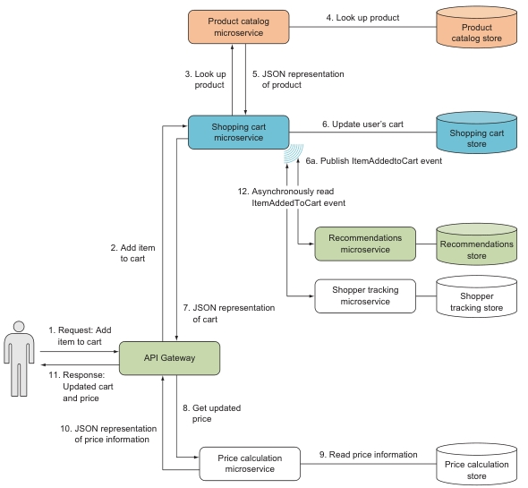

# 1. Microservices at a glance (первый взгляд)

- Understanding microservices and their core characteristics
- Examining the benefits and drawbacks of microservices
- An example of microservices working in concert to serve a user request
- Using ASP.NET for a simple application

## 1.1 What is a microservice?

A **microservice** is a service with one, and only one, very narrowly focused capability that a
remote API exposes (предоставляет) to the rest (остальной) of the system.

Every microservice in a system:

- Runs in its own separate process
- Can be deployed on its own, independently of the other microservices
- Has its own dedicated data store
- Collaborates with other microservices to complete its own action
(Взаимодействует с другими микросервисами для выполнения своих собственных действий)

Microservice doesn't need to be written in the same programming language.

Microservice may communicate via:

- HTTP (often)
- queues
- a service bus
- gRPC
- GraphQL

## 1.2 What is a microservices architecture?

Microservices as an architectural style is a lightweight form of service-oriented architecture
(SOA) where the services are each tightly focused on doing one thing and doing it well.

Microservice characteristics:

- A microservice is responsible for a single capability.
(Микросервис ответственен за единственную характеристику).
- A microservice is individually deployable.
(Возможность индивидуального развертывания).
- A microservice consists of one or more processes.
- A microservice owns its own data store.
- A small team can maintain a few handfuls of microservices.
- A microservice is replaceable.

### Responsible for a single capability

- A microservice has a single responsibility
- That responsibility is for a capability
(Микросервис ответственен за единственную характеристику)

There are two types of capabilities (характеристик) in a microservice system:

- **Бизнес-характеристики** (business capability) - это то, что система делает, что способствует
цели системы, например, отслеживает корзины покупок пользователей или рассчитывает цены.
Хороший способ выделить отдельные бизнес-возможности системы - это использовать
domain-driven design.

- **Технические характеристики** (technical capability) - то,что необходимо использовать
другим микросервисам. Например, интеграция с какой-либо сторонней системой.
Technical capability не являются основными факторами для разбиения системы на микросервисы;
они выявляются только тогда, когда появляются несколько микросервисов с business capability,
которым нужны такие же technical capability.

### Individually deployable (возможность индивидуального развертывания)

A microservice should be **individually deployable**.

- Должна быть возможность deploy микросервиса не затрагивая соседние.

- Другие микросервисы в системе должны продолжать запускаться и работать во время deploy соседа.

- Изменения в каждый микросервис вносятся часто, что приводит к частым deploy с
низким уровнем риска.

- Each microservice should be built into separate artifacts (e.g., separate Docker
containers).

- Процесс развертывания также должен быть настроен таким образом, чтобы поддерживать развертывание
микросервисов по отдельности, в то время как другие микросервисы продолжают работать.

- Изменения в интерфейсе микросервиса обычно должны быть обратно совместимы с интерфейсами
старой версии.

- Взаимодействие микросервисов должно быть надежным: каждый из них должен ожидать, что другие
микросервисы время от времени могут выходить из строя.

- Сбой одного микросервиса не должен приводить к сбою других микросервисов.
Допустимо только уменьшенная функциональность или немного более длительное время обработки запросов.

### Consists of one or more processes

- Each microservice must run in separate processes from other microservices.
- Each microservice can have more than one process.

### Own data store

- Each microservice owns its own data store.
- Each microservice to use whichever database is best suited for the job.
(Каждый микросервис должен использовать ту базу данных, которая лучше всего подходит для данной работы).
- Каждый из микросервисов имеет права доступа только к своей БД.

### Maintained by a small team

Эмпирическое наблюдение: около 5 человек способно полноценно обслуживать 10-30 микросервисов.

### Replaceable

Microservice to be **replaceable**, it must be able to be rewritten from scratch within
a reasonable time frame (разумные временные сроки).

## 1.3 Why microservices?

- Enable continuous delivery
- Allow for an efficient developer workflow because they're highly maintainable
- Are robust (надежные) by design
- Can scale up or down independently of each other

### Enabling continuous delivery

- Can be developed and modified quickly
- Can be comprehensively (всесторонне) tested by automated tests
- Can be deployed independently
- Can be operated efficiently

#### What is continuous delivery?

Continuous delivery (непрерывная поставка) это практика разработки, при которой команда гарантирует что программное обеспечение всегда может быть быстро развернуто в production в любое время.

Два основных требования к Continuous delivery:

1. Программное обеспечение всегда должно находиться в полностью функциональном состоянии.
Это достигается автоматизацией тестирования и разработке с очень небольшими изменениями.

2. Gроцесс развертывания должен быть повторяемым, надежным и быстрым, чтобы обеспечить частые
production deployments. Это достигается за счет полной автоматизации процесса развертывания.

### High level of maintainability (обслуживаемость)

Факторы, которые обеспечивают maintainability (обслуживаемость):

- Each well-factored microservice provides a *single capability*. Not two—just one.
- A microservice owns its own data store. No other services can interfere with a
microservice's data store.
- Data store with the typical size of the microservice codebase, means you can understand
a complete service all at once.
- Well-written microservices can (and should) be comprehensively covered by
automated tests.
- Небольшая команда может поддерживать несколько небольших микросервисов.
- Each microservice is individually deployable.

### Favor lightweight (Леговесность)

Простота микровервисов является основным их преимуществом.

При разработке микровервисов важно избегать усложнения их кодовой базы за счет использования
больших, сложных фреймворков, библиотек или продуктов из-за того, что их функциональность может понадобиться в будущем. Скорее всего, это будет не так, поэтому следует предпочесть меньшие
по размеру и легкие технологии, которые решают текущие задачи микросервиса.

Микросервис можно всегда полностью переписать в течение разумного времени, если в какой-то момент технологии, которые использовались изначально, больше не отвечают потребностям.

### Robust and scalable (Надежность и масштабируемость)

## 1.4 Costs and downsides of microservices. (Недостатки)

- Microservice systems are distributed systems:
  - Могут быть сложнее для понимания и для тестирования чем monolithic systems.
  - Обмен данными между процессами в сетях происходит на порядки медленнее, чем вызовы внутрипроцессных методов.
  - communication across process boundaries or
- Microservice systems are made up of many microservices, each of which has to
be developed, deployed, and managed in production. This means you'll have
many deployments and a complex production setup.
- Each microservice is a separate codebase. Consequently, refactorings that move
code from one microservice to another are painful.

## 1.5 Greenfield vs. brownfield

Disadvantages of big, monolithic systems:

- Coupling is high throughout the codebase. (Высокая связность по всей кодовой базе).
- Скрытые связи между различными компонентами системы.
- Развертывание приложения - это длительный процесс, который может задействовать несколько человек
и выполняться длительное время.
- Система имеет универсальную архитектуру, предназначенную для работы с самыми
сложными компонентами.

Вопросы, которые следует задавать при переходе к микросервисам:

- Достаточно ли велик объем системы, чтобы оправдать сложность распределенной архитектуры?
- Достаточно ли велик объем системы, чтобы оправдать затраты на создание автоматизации развертывания?
- Выиграет ли эта система от возможности развертывания подсистем по отдельности?
- Можете ли вы создать достаточную автоматизацию развертывания?
- Достаточно ли вы осведомлены о домене, чтобы правильно идентифицировать и
разделить различные независимые бизнес-возможности системы?
- Просуществует ли проект достаточно долго, чтобы окупить первоначальные инвестиции в
автоматизацию и дистрибуцию?

## 1.6 Code reuse

При использовании микросервисов стоит задуматься о переиспользовании кодовой базы.
При использовании общей библиотеки:

- У сервиса теперь есть еще одна зависимость, которую вы должны понять, чтобы понять весь сервис
в целом. Замедляется перемещение по коду и рефакторинг.
- Код в библиотеке может разрабатываться с точки зрения нескольких вариантов его использования.
- Разделяемая библиотека представляет собой форму связи между использующими ее службами.
Обновление библиотеки может привести к потребности обновления нескольких зависящий от нее сервисов.

### Tools

- IDE:
  - Visual Studio
  - Visual Studio Code
  - JetBrains Rider

- Tool for making HTTP requests:
  - `REST client` plug-in for Visual Studio Code
  - `Fiddler`
  - `Postman`
  - `cURL`

## The complete picture of microservices working in concert to serve a user request



## 1.9 A simple microservices example

*Исходники*:

- [C#: HelloMicroservices/cs](HelloMicroservices/cs/)
- [F#: HelloMicroservices/fs](HelloMicroservices/fs/)

Создание простого сервиса, который возвращает текущие дату и время в виде строки при
обращении к нему по адресу `http://localhost:5000` или `https://localhost:5001`.

### Создание empty ASP.NET application

Для C#:

```text
dotnet new web -n HelloMicroservices
```

Для F#:

```text
dotnet new web -lang F# -n HelloMicroservices
```

### Примеры запросов в `REST client`

*Файл*: [requests.http](requests.http):

```text
GET http://localhost:5000/

###
GET https://localhost:5001/
Accept: application/json
```

Отправка запроса - выделить и нажать Ctrl+Alt+R

## Summary

- *Microservices* is an term (термин) used both for the microservices architectural
style and for individual (отдельных) microservices in a system of microservices.

- The microservices architectural style is a special (особая) form of SOA, where each service
is small and provides one and only one business capability.

- A microservice is a service with a single narrowly focused capability.

- 6 characteristics of a microservice:
  - Provides a single capability (умение, назначение).
  - Individually deployable. You must be able to deploy every microservice on its
own without touching any other part of the system.
  - Runs in one or more processes, separate from other microservices.
  - Owns and stores the data belonging to the capability it provides in a data
store that the microservice itself has access to.
  - Is small enough that a small team of around five people can develop and
maintain a few handfuls or more of them (от 10 до 30 микросервисов).
  - Replaceable. The team should be able to rewrite a microservice from scratch
in a short period of time if, for instance, the codebase has become a mess.

- Microservices go hand-in-hand with continuous delivery:
  - Having small, individually deployable microservices makes continuous delivery easier.
  - Being able to deploy automatically, quickly, and reliably (надежно) simplifies deploying
and maintaining (поддержку) a system of microservices.

- A system built with microservices allows for scalability and resilience
(обеспечивает масштабируемость и устойчивость).

- A system built with microservices is malleable (пластична): it can be easily changed according
to your business needs. Each microservice by itself is highly maintainable, and
even creating new microservices to provide new capabilities can be done quickly.

- Microservices collaborate (взаимодействуют друг с другом) to provide functionality
to the end user.

- A microservice exposes a remote public API that other microservices may use.
(Микросервис предоставляет удаленный общедоступный API, который могут использовать другие
микросервисы).

- A microservice can expose a feed of events that other microservices can sub-
scribe to. Events are handled asynchronously in the subscribers but still allow
subscribers to react to events quickly.
(Микросервис может предоставлять поток событий, на которые другие микросервисы могут
подписываться. События обрабатываются подписчиками асинхронно, но все же позволяют
подписчикам быстро реагировать на события).

- ASP.NET is well suited for implementing microservices.

- Kubernetes is the container orchestrator.

- Most microservices don't serve HTML from their endpoints, but rather data in the form of JSON,
for instance. (Большинство микросервисов не работает с HTML. Чаще всего они работают с данными,
например в виде JSON).
Tools like `REST client`, `Postman`, and `Fiddler` are good for testing such endpoints.
