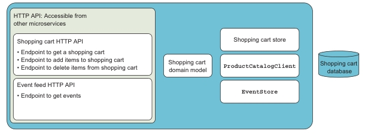
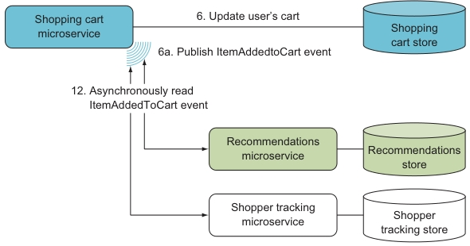

# 2. A basic shopping cart microservice

- A first iteration of an implementation of the shopping cart microservice
- Creating HTTP endpoints with ASP.NET MVC
- Implementing a request from one microservice to another
- Implementing a simple event feed for a microservice

## 2.1 Overview of the Shopping Cart microservice

### 2.1.1 Components of the Shopping Cart microservice

Схема микросервиса:



- `Shopping cart domain model` implementing any business rules related to shopping carts.

- An HTTP API handle all incoming HTTP requests. Divided into two parts:
  - one handles requests from other microservices to do something:
  - the other exposes an event feed.

The shopping cart microservice supports three types of synchronous requests:

- Getting a shopping cart
- Adding an item to a shopping cart
- Deleting an item from a shopping cart

On top of that, it exposes an event feed that other microservices can subscribe to. 

- Two data store components:
  - `EventStore` handles saving events to and reading them from the data store.
  - `ShoppingCartStore` handles reading and updating shopping carts in the data store.

*Note: shopping carts and events may be stored in different databases (see [chapter 6](Chapter06.md)).*

The `ProductCatalogClient` communicates with the product catalog microservice. Purposes:

- It encapsulates knowledge of the other microservice`s API in one place.
- It encapsulates the details of making an HTTP request.
- It encapsulates caching results from the other microservice.
- It encapsulates handling errors from the other microservice.

## 2.2 Implementing the Shopping Cart microservice

Creating empty project:

```text
dotnet new web -n ShoppingCart
```

`ShoppingCart` folder structure:

- Корень проекта
  - Стандартные файлы
    - `appsettings.Development.json`
    - `appsettings.json`
    - `Program.cs`
    - `Startup.cs`
    - `ShoppingCart.csproj`
  - `ProductCatalogClient`
    (Client for product catalog microservice: interface and implementation)
- Папка `EventFeed`
  - `Event.cs` (событие)
  - `EventFeedController.cs` (контроллер - точка доступа (подписки) для других сервисов)
  - `EventStore.cs` (Хранилище событий: interface and implementation)
- Папка `ShoppingCart`
  - `ShoppingCart.cs`
    (The shopping cart domain model)
  - `ShoppingCartController.cs`
    (Implements shopping cart HTTP endpoint)
  - `ShoppingCartStore.cs`
    (Contains the data access code: interface and implementation)

Used technologies:

- `System.Net.Http.HttpClient` is a .NET type for making HTTP requests. It provides an API for
creating and sending HTTP requests as well as reading theresponses that come back.
- `Polly` - library that makes it easy to implement the more common policies for
handling remote-call failures. Out of the box, `Polly` has support for various retry
and circuit breaker policies. (Info about circuit breakers in [chapter 7](Chapter07.md)).
- `Scrutor` is a library that add a number of convenient (удобные) extensions to ASP.NET's
built-in dependency injection container.

### 2.2.2 The Shopping Cart microservice's API for other services

Shopping cart HTTP API:

- An HTTP `GET` endpoint where other microservices can fetch a user's shopping cart as a
JSON document by providing a user ID.
- An HTTP `POST` endpoint where other microservices can add items to a user's shopping cart.
The items to be added are passed to the endpoint as a JSON array of product IDs.
- An HTTP `DELETE` endpoint where other microservices can remove items from a user's shopping cart.
The items to be deleted are passed in the body of the request as a JSON array of product IDs.

#### Запросы. Getting a shopping cart. Adding items to a shopping cart

Запрос. Get shopping cart for a user with ID 123:

```text
HTTP GET /shoppingcart/123 HTTP/1.1
Host: shoppingcart.my.company.com
Accept: application/json
```

Запрос. Adding two items to a shopping cart:

```text
POST /shoppingcart/123/items HTTP/1.1    // The URL includes the ID of the shopping cart: 123.
Host: shoppingcart.my.company.com
Accept: application/json                 // The response should be in JSON format.
Content-Type: application/json           // The data in the request body is in JSON.
[1, 2]                                   // The request body is a JSON array of product IDs.
```

#### Use `Scrutor` to scan the ShoppingCart assembly

1) Add nuget package:

```text
dotnet add package scrutor
```

2) Register `Scrutor` in `Startup` (в книге):

```csharp
public void ConfigureServices(IServiceCollection services)
{
    services.AddControllers();
    services.Scan(selector => selector
        .FromAssemblyOf<Startup>()
        .AddClasses()
        .AsImplementedInterfaces());
}
```

Как в книге регистрация у меня не заработала, поэтому я сделал так (на .NET 6):

```csharp
builder.Services.Scan(selector => selector
    .FromAssemblyOf<Program>()
    .AddClasses(classes => classes.AssignableTo<IShoppingCartStore>())
    .AsImplementedInterfaces()
    .WithTransientLifetime());
```

#### Добавление методов в `ShoppingCartController`

- `Get: /shoppingcart/{userId}`
- `Post: /shoppingcart/{userId}/items`
- `Delete: /shoppingcart/{userId}/items`

#### Добавление `IShoppingCartStore` и его реализации

### 2.2.3 Fetching product information

- The product catalog microservice and the shopping cart microservice are separate
microservices running in separate processes, perhaps even on separate servers.

- The product catalog exposes an HTTP API that the shopping cart uses.

- Product catalog information is fetched in HTTP GET requests to an endpoint on the product
catalog microservice.

3 steps to implement the HTTP request to the product catalog microservice:

1. Implement the HTTP `GET` request.
2. Parse the response from the endpoint at the product catalog microservice and
translate it to the domain of the shopping cart microservice.
3. Implement a policy for handling failed requests to the product catalog
microservice.

Интерфейс `IProductCatalogClient`, его реализация `ProductCatalogClient`.

Регистрация `ProductCatalogClient` as *typed http client* в `ConfigureServices` в `Startup`:

```csharp
builder.Services.AddHttpClient<IProductCatalogClient, ProductCatalogClient>();
```

#### Запрос. Fetches the information for product

Запрос. Fetches the information for product IDs 1 and 2:

```text
HTTP GET /products?productIds=[1,2] HTTP/1.1
Host: productcatalog.my.company.com
Accept: application/json
```

### 2.2.4 Parsing the product response

Реализация этого функционала находится в `ProductCatalogClient`:

- The product catalog microservice returns product information as a JSON array.
- Only the `ProductCatalogClient` class knows anything about the API of the product catalog
microservice.
- `ProductCatalogClient` must deserialize and translate the response data.

### 2.2.5 Adding a failure-handling policy

Remote calls fail for many reasons:

- the network can fail
- the call could be malformed (неправильный)
- the remote microservice might have a bug
- the server where the call is handled may fail during processing
- the remote microservice might be in the middle of a redeploy

In a system of microservices, you must expect failures and design a level of
resilience around every place remote calls are made. Более детально в [chapter 7](Chapter07.md)).

*Caching* product information has some significant advantages:

- It makes the shopping cart more resilient (стойкий) to failures in product catalog.
- The shopping cart microservice will perform better when the product information is present
in the cache.
- Fewer (меньшее количество) calls made from the shopping cart microservice mean less stress
is put on the product catalog microservice.

Дополнительная информация по кэшированию и обработки ошибок соединений см. в [главе 7](Chapter07.md)).

Используются nuget пакеты:

- `Polly`
- `Microsoft.Extensions.Http.Polly`

Using a Polly policy involves these two steps:

1. Declaring the policy.
2. Using the policy to execute the remote call.

Добавление policy в классе `Startup`.
Повторение вызовов (3 раза с возрастающей задержкой) через http client в `IProductCatalogClient`:

```csharp
builder.Services
    .AddHttpClient<IProductCatalogClient, ProductCatalogClient>()
    .AddTransientHttpErrorPolicy(p =>
        p.WaitAndRetryAsync(
            retryCount: 3,
            attempt => TimeSpan.FromMilliseconds(100 * Math.Pow(2, attempt))));
```

### 2.2.6 Implementing a basic event feed

Сервисы, подписанные на события shopping cart:



Implementing the event. Три шага:

- *Raise events*. The code in the shopping cart *domain model* raises events when
something significant (according to the business rules) happens. Significant
events are when items are added to or removed from a shopping cart.

- *Store events*. The events raised by the shopping cart domain model are stored in
the microserviceэ's data store.

- *Publish events*. Implementing an event feed allows other microservices to subscribe by polling
(подписка на события посредством периодических опросов).

#### Raising an event

When items are added to a shopping cart, the `ShoppingCart` domain object raises an
event by calling the `Raise` method on `IEventStore` and providing the data for the event.

#### Storing an event

- The events raised by the domain code aren't published to other microservices directly.

- Instead, they're stored and then published asynchronously.

- In other words, all `EventStore` does when an event is raised is store the event in a database.

- Every event is stored as a separate entry in the event store database, and each event gets a
monotonically increasing sequence number.

- `EventStore` stores every incoming event and keeps track of the order in which they
arrive.

#### A simple event feed (простая лента событий)

- Subscribers ask for new events periodically (e.g., once every 30 seconds).

- Add in the shopping cart microservice an HTTP endpoint (`EventFeedController`) that allows
subscribers to request events.

- A subscriber can limit events count:

#### Запрос. Get events

Запрос. Get all events newer than event number 100

```text
GET /events?start=100 HTTP/1.1
Host: shoppingcart.my.company.com
Accept: application/json
```

Запрос. Get all events between number 100 and 200

```text
GET /events?start=100&end=200 HTTP/1.1
Host: shoppingcart.my.company.com
Accept: application/json
```

- Subscribers should use the `start` and `end` query string parameters to make sure they only
get new events.

- If the shopping cart is down when a subscriber polls, the subscriber can ask for the same events
again later.

## Summary

- Implementing a complete microservice doesn't take much code. The shopping
cart microservice has only the following:

  – Two short controllers
  – A simple `ShoppingCart` domain class
  – A client class for calling the product catalog microservice
  – Two straightforward data access classes: `ShoppingCartDataStore` and `EventStore`
   (not shown in this chapter)

- MVC makes it simple to implement HTTP APIs. The routing attributes MVC provides make it easy
to add endpoints to a microservice. Just add an action method
and put a routing attribute like `[HttpGet("")]` or `[HttpPost("")]` on it.

- You should always expect that other microservices may be down. To prevent
errors from propagating, each remote call should be wrapped in a policy for
handling failure.

- The `Polly` library is useful for implementing failure-handling policies and wrapping
them around remote calls.

- Implementing a basic event feed is simple and enables other microservices to
react to events. The poor man's event feed implemented in this chapter is just a
short controller.

- Domain model code is usually responsible for raising events, which are then
stored in an event store and published through an event feed.

## Запросы

Все запросы [тут](chapter02/requests.http)
