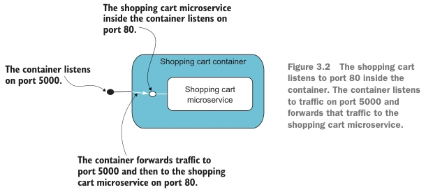
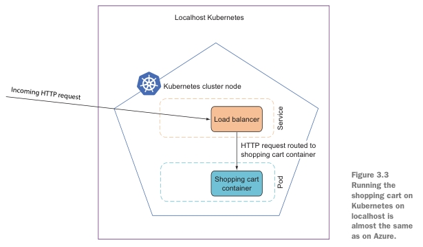

# 3. Deploying a microservice to Kubernetes

- Packaging a microservice in a Docker container
- Deploying a microservice container to Kubernetes on localhost
- ~~Creating a basic Kubernetes cluster on Azure's AKS (Azure Kubernetes Service)~~
- ~~Deploying a microservice container to a Kubernetes cluster on AKS~~

## 3.1 Choosing a production environment

Опции для запуска:

- Running the microservices on your own Windows or Linux servers on-premise (локальных).
  - Using `Kestrel` ASP.NET's web server behind a proxy like `Nginx` or `IIS`.

- Using a Platform as a Service (PaaS) cloud option that supports .NET like
Azure Web Apps or Azure Service Fabric.
  - No maintaining the underlying infrastructure.

- Putting microservices into containers and deploying them to a cloud-specific container
service like Azure's ACS or Amazon's ECS.
  - No maintaining the underlying infrastructure.
  - Containers come with an OS, you will have to keep that up-to-date and patched.

- Using cloud-agnostic (независимые от облака) container orchestrators like Kubernetes,
Apache Mesos, or RedHat OpenShift.

Преимущества использования контейнеров и Kubernetes:

- By choosing to put our microservices in containers, we keep (оставляем) several of the
options listed open, which gives us flexibility.

- By choosing Kubernetes, we get a mature and widely used container orchestrator,
which is supported by all the major clouds and which can also run on your own
servers.


## 3.2 Putting the Shopping Cart microservice in a container

Исходники микросервиса "ShoppingCart" перенесены из предыдущей, [2 главы](Chapter02.md).

### 3.2.1 Adding a Dockerfile to the Shopping Cart microservice

Для создания docker контейнера используются файлы:

- `Dockerfile` (находится в shopping cart project) - инструкции по созданию docker image.
- `.dockerignore` - игнорирование директорий и файлов при создании docker image
(например, игнорирование при копировании (инструкция `COPY`)).

The Dockerfile is a description of the container we want to build and should look like the
following code.

`Dockerfile`

```dockerfile
# (1) The .NET SDK used for building the microservice
# (2) Restore NuGet packages.
# (3) COPY . . - копирует всю папку в текущую папку контейнера
# (4) Build the microservice in release mode.
# (5) Publish the microservice to the /app/publish folder.
# (6) The image the final container is based on
# (7) The container should accept requests on port 80.
# (8) Copy files from /app/publish to final container.
# (9) Specify that when the final container runs it will start up dotnet ShoppingCart.dll.

FROM mcr.microsoft.com/dotnet/sdk:5.0 AS build                       # (1)
WORKDIR /src
COPY ["ShoppingCart/ShoppingCart.csproj", "ShoppingCart/"]
RUN dotnet restore "ShoppingCart/ShoppingCart.csproj"                # (2)
COPY . .                                                             # (3)
WORKDIR "/src/ShoppingCart"
RUN dotnet build "ShoppingCart.csproj" -c Release -o /app/build      # (4)

FROM build AS publish
RUN dotnet publish "ShoppingCart.csproj" -c Release -o /app/publish  # (5)

FROM mcr.microsoft.com/dotnet/aspnet:5.0 AS final                    # (6)
WORKDIR /app
EXPOSE 80                                                            # (7)
COPY --from=publish /app/publish .                                   # (8)
ENTRYPOINT ["dotnet", "ShoppingCart.dll"]                            # (9)
```

Инструкции Docker:

- `FROM` - задает базовый (родительский) образ.
  - `AS` - имя для образа, чтобы можно было на него ссылаться.
- `WORKDIR` - задает рабочую директорию для следующей инструкции.
- `COPY` - копирует в контейнер файлы и папки.
  - `.` - текущая директория, где находится пользователь или рабочая директория контейнера.
  - `--from=publish` - ссылка на образ `publish`, оттуда копируются данные.
- `RUN` - выполняет команду и создает слой образа. Используется для установки в контейнер пакетов.
- `EXPOSE` - указывает на необходимость открыть порт.
- `ENTRYPOINT` — предоставляет команду с аргументами для вызова во время выполнения контейнера. Аргументы не переопределяются.

The steps in `Dockerfile`:

- *Build the shopping cart code* - builds the shopping cart code using a Docker image
that contains the .NET SDK and calls first `dotnet restore` and then `dotnet build`.

- *Publish the shopping cart microservice* - The second part of the `Dockerfile` uses the
`dotnet publish` command to copy the files needed at runtime from the build
output folder (`/app/build`) to a new folder called `/app/publish`.

- *Create a container image based on ASP.NET* - The third and final step in the
`Dockerfile` creates the final container image, which is the result of the multistage build
described in the `Dockerfile`. The step is based on an ASP.NET Docker image from Microsoft.
That image comes with the ASP.NET runtime.
We add the files from the `/app/publish` folder and specify that the entry point
to the container image is `dotnet ShoppingCart.dll`, which is a command that
runs the compiled ASP.NET application in the `ShoppingCart.dll`.

И еще, инструкции Docker, дополнительно:

- `LABEL` - описывает метаданные. Например: сведения о том, кто создал и поддерживает образ.
- `ENV` - устанавливает постоянные переменные среды.
- `ADD` - копирует файлы и папки в контейнер, может распаковывать локальные .`tar`-файлы.
- `CMD` - описывает команду с аргументами, которую нужно выполнить когда контейнер будет запущен.
Аргументы могут быть переопределены при запуске контейнера.
В файле может присутствовать лишь одна инструкция `CMD`.
- `ARG` - задает переменные для передачи Docker во время сборки образа.
- `VOLUME` - создает точку монтирования для работы с постоянным хранилищем.

Файл `.dockerignore`:

```text
[B|b]in/
[O|o]bj/
```

### 3.2.2 Building and running the shopping cart container

Запускать из директории где находится `Dockerfile`.

#### Команда. Build

Build a shopping cart container image from the `Dockerfile`:

```text
docker build . -t shopping-cart
```

- `-t` присваивает тег собранному image

#### Команда. Run

Run the container image:

```text
docker run --name shopping-cart --rm -p 5000:80 shopping-cart
```

- `-d` - запуск docker контейнера в фоновом режиме и возврат обратно в терминал.
- `--name` - gives the container a name (`shopping-cart`).
- `--rm` - container is automatically removed when the container exits.
- `-p 5000:80` - container exposes port 5000 and listens to traffic on
that port. Any incoming traffic to port 5000 is forwarded to port 80 inside the
container.
- `shopping-cart` at the end of the command is the name of the container image to run.




#### Команда. Stop

To stop the shopping cart container:

```text
docker stop shopping-cart
```

#### Команда. Просмотр images

```text
docker image list
```

#### Команда. Удаление image

```text
docker image rm 7581fa3f72a3
```

Где `7581fa3f72a3` - image ID удаляемого контейнера.

## 3.3 Running the shopping cart container in Kubernetes



### 3.3.1 Setting up Kubernetes localhost

#### On Windows

Using Docker Desktop with with the option to enable Kubernetes.

`Settings -> Kubernetes -> Enable Kubernetes`

#### On Linux

- To install MicroK8S (Kubernetes cluster) on a Linux machine:

```text
sudo snap install microk8s --classic
```

This installs the `microk8s` command-line interface, which includes the `kubectl` command.

- Create an alias for `kubectl`:

```text
snap alias microk8s.kubectl kubectl
```

#### Команда. Check that Kubernetes is indeed (действительно) running

```text
kubectl cluster-info
```

The `kubectl` command is the command line interface to control Kubernetes, and we
will be using that to deploy the shopping cart to Kubernetes, both on `localhost` and on
Azure.

Furthermore, `kubectl` can be used to inspect the Kubernetes cluster and to
start the Kubernetes dashboard, which gives you a friendly UI for looking inside the
Kubernetes cluster.

## 3.4 Creating Kubernetes deployment for the shopping cart

Для описания deployment требуется manifest файл `.yaml`.

В примере файл manifest располагается рядом с `Dockerfile`.

Файл `shopping-cart.yaml` содержит 2 секции.

1. A deployment section that specifies which container we want to deploy and how
we want it set up:

- We want to deploy the shopping cart container.

- We want one copy of the container running. We could set this number differently and Kubernetes
would take care of running as many instances as we wanted.

- The port the container communicates on, port `80` in the case of the shopping cart,
just like we saw earlier.

2. A service section that configures load balancing in front of the shopping cart.
The load balancer makes the shopping cart accessible outside the Kubernetes
cluster by giving it an external IP. If we were deploying more than one instance
of the shopping cart container, the load balancer would balance the incoming
traffic between the shopping cart instances.

Файл `shopping-cart.yaml`:

```yaml
# (1) Start of the section specifying the container deployment
# (2) The container image to deploy
# (3) The port the container listens for requests on

# (4) Start of the section specifying a service
# (5) Specifies this is a load balancer service
# (6) Listens on port 5000 externally
# (7) Maps to port 80 on the container
# (8) Routes requests to the shopping cart

kind: Deployment            # (1)
apiVersion: apps/v1
metadata:
  name: shopping-cart
spec:
  replicas: 1
  selector:
    matchLabels:
      app: shopping-cart
  template:
    metadata:
      labels:
        app: shopping-cart
    spec:
      containers:
        - name: shopping-cart
          image: shopping-cart              # (2)
          imagePullPolicy: IfNotPresent
          ports:
            - containerPort: 80             # (3)
---
kind: Service                 # (4)
apiVersion: v1
metadata:
  name: shopping-cart
spec:
  type: LoadBalancer          # (5)
  ports:
    - name: shopping-cart
      port: 5000              # (6)
      targetPort: 80          # (7)
  selector:
    app: shopping-cart        # (8)
```

#### Команды. Deploy and run, list

- Run everything described in the manifest:

```text
kubectl apply -f shopping-cart.yaml
```

`-f` - The file(s) that contain the configurations to apply.

- List everything running in the Kubernetes cluster:

```text
kubectl get all
```

#### Команды. Removing a service from Kubernetes

```text
kubectl delete -f shopping-cart.yaml
```

### (Optional). Install Kubernetes dashboard

Документация: [https://github.com/kubernetes/dashboard](https://github.com/kubernetes/dashboard)

#### Deploying the Dashboard UI

Deploy Kubernetes dashboard version 2.2.0 (в книге):

```text
kubectl apply -f https://raw.githubusercontent.com/kubernetes/dashboard/v2.2.0/aio/deploy/recommended.yaml
```

На момент чтения:

```text
kubectl apply -f https://raw.githubusercontent.com/kubernetes/dashboard/v2.7.0/aio/deploy/recommended.yaml
```

Удаляется такой же командой:

```text
kubectl delete -f https://raw.githubusercontent.com/kubernetes/dashboard/v2.7.0/aio/deploy/recommended.yaml
```

И вообще, для любой команды, которая была выполнена через `kubectl apply -f *`, можно
остановить ее через `kubectl delete -f *`.

#### Accessing the Dashboard UI

Здесь [Creating sample user](https://github.com/kubernetes/dashboard/blob/master/docs/user/access-control/creating-sample-user.md) описано:

- how to create a new user using the Service Account mechanism of Kubernetes.
- grant this user admin permissions.
- login to Dashboard using a bearer token tied to this user.

1. Надо создать в Kubernetes: Service Account и ClusterRoleBinding. Это делается
в манифесте - файл [`dashboard-adminuser.yaml`](dashboard-adminuser.yaml) (необязательно называть именно так).

```yaml
apiVersion: v1
kind: ServiceAccount
metadata:
  name: admin-user
  namespace: kubernetes-dashboard
---
apiVersion: rbac.authorization.k8s.io/v1
kind: ClusterRoleBinding
metadata:
  name: admin-user
roleRef:
  apiGroup: rbac.authorization.k8s.io
  kind: ClusterRole
  name: cluster-admin
subjects:
- kind: ServiceAccount
  name: admin-user
  namespace: kubernetes-dashboard
```

2. Запуск файла `dashboard-adminuser.yaml`. Я запускал через PowerShell, может можно через обычный
`cmd`:

```text
 kubectl apply -f dashboard-adminuser.yaml
```

3. Getting a Bearer Token

```text
kubectl -n kubernetes-dashboard create token admin-user
```

В консоли будет выведена строка, содержащая токен.

*Примечание. В книге была приведена вот эта команда:*

```text
kubectl -n kube-system describe secret default
```

*без описания двух предыдущих шагов. Конечно же, не вышло получить token.*

4. Create a secure channel to your Kubernetes cluster. (По сути, запуск dashboard).

Команда из терминала:

```text
kubectl proxy
```

5. Зайти на Dashboard можно по этому адресу:

```text
http://localhost:8001/api/v1/namespaces/kubernetes-dashboard/services/https:kubernetes-dashboard:/proxy/
```

6. В строку Token надо вставить сгенеренную строку из шага 3. Готово.

## Summary

- The microservices can be deployed to many different environments.
- .NET-based microservices are easily put into containers and run as containers.
- Dockerfiles for .NET-based microservices follow a common template.
- Deploying microservices to Kubernetes gives us a highly scalable environment and
a versatile container orchestrator (универсальный оркестратор контейнеров).
- Kubernetes works the same on localhost and in the cloud. This means we can
easily run the exact containers on localhost for development and in the cloud
for production.
- Kubernetes manifests for our microservices are all similar.
- Kubernetes has various tools for scaling, monitoring, and debugging microservices.
- Azure Kubernetes Services - это простой в настройке управляемый сервис для Kubernetes,
который позволяет быстро приступить к работе с Kubernetes.
