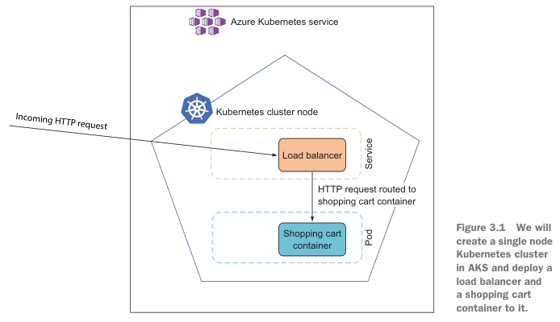

# 3. Deploying a microservice to Kubernetes

- Packaging a microservice in a Docker container
- Deploying a microservice container to Kubernetes on localhost
- ~~Creating a basic Kubernetes cluster on Azure's AKS (Azure Kubernetes Service)~~
- ~~Deploying a microservice container to a Kubernetes cluster on AKS~~

## 3.1 Choosing a production environment

Опции для запуска:

- Running the microservices on your own Windows or Linux servers on-premise (локальных).
  - Using `Kestrel` ASP.NET's web server behind a proxy like `Nginx` or `IIS`.

- Using a Platform as a Service (PaaS) cloud option that supports .NET like
Azure Web Apps or Azure Service Fabric.
  - No maintaining the underlying infrastructure.

- Putting microservices into containers and deploying them to a cloud-specific container
service like Azure's ACS or Amazon's ECS.
  - No maintaining the underlying infrastructure.
  - Containers come with an OS, you will have to keep that up-to-date and patched.

- Using cloud-agnostic (независимые от облака) container orchestrators like Kubernetes,
Apache Mesos, or RedHat OpenShift.

Преимущества использования контейнеров и Kubernetes:

- By choosing to put our microservices in containers, we keep (оставляем) several of the
options listed open, which gives us flexibility.

- By choosing Kubernetes, we get a mature and widely used container orchestrator,
which is supported by all the major clouds and which can also run on your own
servers.



## 3.2 Putting the Shopping Cart microservice in a container

### 3.2.1 Adding a Dockerfile to the Shopping Cart microservice

Для создания docker контейнера используются файлы:

- `Dockerfile` (находится в shopping cart project) - инструкции по созданию docker image.
- `.dockerignore` - игнорирование директорий и файлов при создании docker image
(например, игнорирование при копировании (инструкция `COPY`)).

The Dockerfile is a description of the container we want to build and should look like the
following code.

`Dockerfile`

```dockerfile
# (1) The .NET SDK used for building the microservice
# (2) Restore NuGet packages.
# (3) COPY . . - копирует всю папку в текущую папку контейнера
# (4) Build the microservice in release mode.
# (5) Publish the microservice to the /app/publish folder.
# (6) The image the final container is based on
# (7) The container should accept requests on port 80.
# (8) Copy files from /app/publish to final container.
# (9) Specify that when the final container runs it will start up dotnet ShoppingCart.dll.

FROM mcr.microsoft.com/dotnet/sdk:5.0 AS build                       # (1)
WORKDIR /src
COPY ["ShoppingCart/ShoppingCart.csproj", "ShoppingCart/"]
RUN dotnet restore "ShoppingCart/ShoppingCart.csproj"                # (2)
COPY . .                                                             # (3)
WORKDIR "/src/ShoppingCart"
RUN dotnet build "ShoppingCart.csproj" -c Release -o /app/build      # (4)

FROM build AS publish
RUN dotnet publish "ShoppingCart.csproj" -c Release -o /app/publish  # (5)

FROM mcr.microsoft.com/dotnet/aspnet:5.0 AS final                    # (6)
WORKDIR /app
EXPOSE 80                                                            # (7)
COPY --from=publish /app/publish .                                   # (8)
ENTRYPOINT ["dotnet", "ShoppingCart.dll"]                            # (9)
```

Инструкции Docker:

- `FROM` - задает базовый (родительский) образ.
  - `AS` - имя для образа, чтобы можно было на него ссылаться.
- `WORKDIR` - задает рабочую директорию для следующей инструкции.
- `COPY` - копирует в контейнер файлы и папки.
  - `.` - текущая директория, где находится пользователь или рабочая директория контейнера.
  - `--from=publish` - ссылка на образ `publish`, оттуда копируются данные.
- `RUN` - выполняет команду и создает слой образа. Используется для установки в контейнер пакетов.
- `EXPOSE` - указывает на необходимость открыть порт.
- `ENTRYPOINT` — предоставляет команду с аргументами для вызова во время выполнения контейнера. Аргументы не переопределяются.

The steps in `Dockerfile`:

- *Build the shopping cart code* - builds the shopping cart code using a Docker image
that contains the .NET SDK and calls first `dotnet restore` and then `dotnet build`.

- *Publish the shopping cart microservice* - The second part of the `Dockerfile` uses the
`dotnet publish` command to copy the files needed at runtime from the build
output folder (`/app/build`) to a new folder called `/app/publish`.

- *Create a container image based on ASP.NET* - The third and final step in the
`Dockerfile` creates the final container image, which is the result of the multistage build
described in the `Dockerfile`. The step is based on an ASP.NET Docker image from Microsoft.
That image comes with the ASP.NET runtime.
We add the files from the `/app/publish` folder and specify that the entry point
to the container image is `dotnet ShoppingCart.dll`, which is a command that
runs the compiled ASP.NET application in the `ShoppingCart.dll`.

И еще, инструкции Docker, дополнительно:

- `LABEL` - описывает метаданные. Например: сведения о том, кто создал и поддерживает образ.
- `ENV` - устанавливает постоянные переменные среды.
- `ADD` - копирует файлы и папки в контейнер, может распаковывать локальные .`tar`-файлы.
- `CMD` - описывает команду с аргументами, которую нужно выполнить когда контейнер будет запущен.
Аргументы могут быть переопределены при запуске контейнера.
В файле может присутствовать лишь одна инструкция `CMD`.
- `ARG` - задает переменные для передачи Docker во время сборки образа.
- `VOLUME` - создает точку монтирования для работы с постоянным хранилищем.

Файл `.dockerignore`:

```text
[B|b]in/
[O|o]bj/
```
