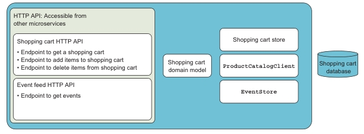

# 4. Identifying and scoping microservices

- Scoping microservices for business capability.
(Определение области применения микросервисов для бизнес-функций)

- Scoping microservices to support technical capabilities.
(Определение области применения микросервисов для поддержки технических функций)

- Scoping microservices to support efficient development work.
(Определение области применения микросервисов для эффективной разработки/развития)

- Managing when scoping microservices is difficult.
(Разрешение затруднений в определении области действия микросервисов)

- Carving out new microservices from existing ones.
(Создание новых микросервисов из существующих)

Чтобы успешно работать с микросервисами, важно уметь правильно определять область
действия каждого микросервиса.

- Если микросервисы слишком велики, процесс разработки будет занимать много времени.
- Если микросервисы слишком малы, то будет много связей между ними.
- Если они имеют неправильные границы, то будет большое сцепление между ними. Что
усложняет структуру и процессы разработки

Критерии для определения границ микросервисов:

- Business capabilities (бизнес функции). Основной критерий.
- Technical capabilities (технические функции).

Следование этим критериям приводит к созданию микросервисов, которые имеют
характеристики, описанные в [главе 1](Chapter01.md):

- У микросервиса одна ответственность.
- Микросервис может быть развернут индивидуально.
- Микросервис состоит из одного или нескольких процессов.
- У каждого микросервиса свое собственное хранилище данных.
- Небольшая команда может поддерживать несколько микросервисов.
- Микросервис можно заменить.

## 4.1 The primary driver for scoping microservices: Business capabilities

(Основной критерий для определения границ микросервисов: бизнес-функции)

Каждый микросервис должен иметь ровно одну ответственность.
Основной способ определить границу микросервиса - анализ бизнес-проблемы
и определение бизнес-функции. Каждая бизнес-функция должна быть
реализована отдельным микросервисом.

### 4.1.1 What is a business capability? (Что такое бизнес-функция?)

Бизнес-функция - это то, что делает организация для достижению бизнес-целей.

Микросервис моделирует бизнес-функции.
В одних случаях микросервис реализует все бизнес-функции и полностью автоматизирует их.
В других случаях микросервис реализует только часть бизнес-фунцкций,
остальная часть задач бизнеса выполняется людьми в реальности.

>Business capabilities and bounded contexts (Бизнес-функции и ограниченные контексты)
>
>*Domain-driven design* (DDD) - это подход к проектированию программных систем,
>основанный на моделировании бизнес-области. Важным шагом является определение языка, >используемого экспертами предметной области для обсуждения домена.
>
>В разных частях domain (предметной области) одно и тоже определение может
>иметь разные смыслы и значения.
>
>*Ограниченный контекст* (bounded context) в DDD является частью более широкой
>предметной области (domain), в пределах которой слова означают одно и то же.
>Ограниченный контекст (bounded context) определяет границу предметной области,
>в пределах которой язык является согласованным.
>С другой стороны, бизнес-функции - это то, что бизнесу необходимо сделать.
>В рамках одного ограниченного контекста (bounded context) бизнесу может потребоваться
>выполнить несколько задач. Каждая из этих задач, скорее всего,
>является бизнес-функцией.

### 4.1.2 Identifying business capabilities. (Определение бизнес-функций)

Хорошее понимание предметной области (domain) позволяет понять, как
функционирует бизнес. Понимание того, как функционирует бизнес, помогает определить
бизнес-функции, из которых состоит бизнес, и его процессы.

Знание предметной области можно получить от людей, хорошо разбирающихся в бизнес-сфере:
бизнес-аналитиков, конечных пользователей и т.д.

Организация бизнеса обычно отражает его предметную область (domain).
Различными частями бизнеса управляют разные группы людей, и каждая группа отвечает за выполнение определенной задачи бизнеса; таким образом, разбиение бизнеса по областям
может подсказать, как следует выделить микросервисы.

Микросервис будет ответственен только за задачи одной группы.
Если он пересекает границу между двумя группами, то, вероятно, имеет слишком широкий
охват и его будет трудно разрабатывать и поддерживать.

Иногда можно обнаружить части домена, в которых организация и предметная область
(domain) находятся в противоречии. Можно воспользоваться одним из двух подходов:

- Можно решить, что система не может полностью отразить предметную область (domain)
и надо реализовать несколько микросервисов, которые не очень хорошо согласуются с
ней, но зато хорошо согласуются с организацией.

- Можно изменить организацию, чтобы она отражала предметную область (domain).

Оба подхода имеют недостатки:

- В первом подходе создаются микросервисы с ограниченной областью действия,
которые могут стать сильно связанными.

- Второй подход вызовет перемещение людей и обязанностей между группами.

### 4.1.3 Example: Point-of-sale system (POS). (Пример: Система точек продаж)

Эта POS-система используется во всех магазинах крупной сети. Кассиры в магазинах взаимодействуют с системой через тонкий графический клиент: планшетное приложение,
веб-приложение или кассовый аппарат.
Клиент с графическим интерфейсом - это всего лишь тонкий слой перед серверной частью. Серверная часть - это место, где реализуется вся бизнес-логика (бизнес-функции).
Именно серверная часть нас интересует.

Система предлагает кассирам следующие функции:

- Сканирование товаров и добавление их в счет.
- Подготовка счета к оплате.
- Списывание средств с кредитной карты через устройство для считывания карт,
подключенное к клиенту.
- Регистрация оплатой наличными.
- Прием купонов.
- Печать квитанции.
- Отправка электронного чека клиенту.
- Поиск в каталоге товаров.
- Сканирование одного или нескольких продуктов, чтобы показать цены и специальные
предложения, связанные с продуктами.

Эти функции система выполняет для кассира, но они напрямую не
соответствуют бизнес-функциям, которые управляют POS-системой.

### Identifying business capabilities in the point-of-sale domain

(Определение бизнес-функций в системе точек продаж)

Чтобы определить бизнес-функции, лежащие в основе POS-системы, необходимо выйти
за рамки списка функций. Нужно определить, что должно происходить за
кулисами для поддержки функциональности.

Начиная с функции "Поиск в каталоге товаров", очевидной бизнес-функцией является
обслуживание каталога товаров. Это первый кандидат на область применения микросервиса.
Такой микросервис каталога продуктов отвечал бы за предоставление доступа к текущему
каталогу продуктов. Каталог товаров необходимо периодически обновлять, но сеть магазинов
использует другую систему для обработки этой функциональности. Микросервис каталога
продуктов должен был бы отражать изменения, вносимые в эту другую систему, поэтому
область применения микросервиса каталога продуктов должна включать получение обновлений
каталога продукции.

Следующая бизнес-функция - это применение специальных предложений к счетам к оплате.
Специальные предложения дают клиенту скидку при покупке набора продуктов.
Набор может состоять из определенного количества одного и того же товара по
сниженной цене, или это может быть комбинация разных продуктов.
В любом случае счет, который кассир получает от клиента POS, должен автоматически
учитывать все примененные специальные предложения. Эта бизнес-функция является
вторым кандидатом на роль микросервиса.
Микросервис специальных предложений будет отвечать за принятие решения о том,
когда действует специальное предложение и какой должна быть скидка для клиента.

Функция "сканировать один или несколько продуктов, чтобы показать цены и специальные предложения, связанные с продуктами" указывает на то, что бизнес-функция специальных
предложений заключается не только в применении специальных предложений к счету, но также
включает в себя возможность поиска специальных предложений на основе продуктов.

В конченом счете после анализа возможных бизнес-функций в POS-системе, можно
получить такой список:

- Каталог продукции
- Каталог цен
- Расчет цены
- Специальные предложения
- Купоны
- Отчеты о продажах
- Счета к оплате
- Оплата

На рис. 4.2 показано сопоставление функций и бизнес-функций. Отображение показывает,
какие бизнес-функции необходимы для реализации каждой функции, но не показывают никаких
прямых технических зависимостей.
Например, стрелка от "Подготовить счет к оплате" ("Prepare invoice") к "Купонам" ("Coupons")
не указывает на прямой вызов из кода "Prepare invoice" в клиенте к микросервису купонов.
Скорее всего, стрелка указывает на то, что при подготовки счета к оплате необходимо
учитывать купоны, поэтому функция "Prepare invoice" зависит от бизнес-функции "Coupons".

Поиск бизнес-функций в реальных предметных областях (domains) может быть тяжелым и часто
требует большого числа итераций. Список бизнес-функций не будет статичным,
составленным в начале разработки. Он будет расти и меняться по мере того, как ваше
понимание предметной области и бизнеса будет расти и углубляться.

### The special offers microservice. (Микросервис специальных предложений)

Микросервис специальных предложений основан на одноименной бизнес-функции.
На рис. 4.3 изображены процессы, каждый из которых обеспечивает часть бизнес-функции.

Специальные предложения включают пять процессов. Четыре из них ориентированы на клиентов с
графическим интерфейсом POS. Пятый отслеживает использования специальных предложений - ориентирован на сам бизнес, который хочет знать, какие специальные предложения используют
клиенты.

Реализация бизнес-функции в виде микросервиса:

- Четыре клиент-ориентированных процесса будут выступать в качестве конечных точек API,
которые могут вызывать другие микросервисы.
- Процесс отслеживания использования предложений с помощью ленты событий.
Компоненты бизнес-аналитики POS-системы могут подписываться на эти события
и использовать их для отслеживания того, какими специальными предложениями пользуются
клиенты.

Эти компоненты микросервиса показаны на рис. 4.4:

Компоненты микросервиса специальных предложений аналогичны компонентам
микросервиса корзины покупок в главе 2, который показан снова на рис. 4.5. Это
не случайно. Вот компоненты, из которых обычно состоят наши микросервисы:

- HTTP API, предоставляющий бизнес-функции, реализованные микросервисом.
- Лента/канал событий (event feed) (см. [глава 5](Chapter05.md))
- Модель предметной области (domain model), реализующая бизнес-логику,
связанную с бизнес-функциями.
- Компонент хранения данных (data store component).
- База данных.

## 4.2 The secondary driver for scoping microservices: Supporting technical capabilities

(Дополнительный критерий для определения области действия микросервисов:
вспомогательные технические фунции)

Второй способ определить области применения микросервисов - это рассмотреть вспомогательные
технические функции. Вспомогательная техническая функция - это то, что напрямую не
соответствует бизнес-цели, но используется для работы других микросервисов.
Например: интеграция с другой системой или управление планированием события,
которое должно произойти в будущем.

### 4.2.1 What is a technical capability? (Что такое техническая функция?)

Вспомогательные технические возможности являются второстепенными факторами при определении
области действия микросервисов, поскольку они не вносят непосредственного вклада в бизнес
системы цели. Они существуют для упрощения и поддержки других микросервисов, реализующих
бизнес-функции.

Одной из характеристик хорошего микросервиса является то, что его можно легко
переделать и заменить. Но если микросервис помимо бизнес-функции реализует сложную
техническую фукнцию, то последняя может повлиять на легкость преработки и замены
микросервиса. В таких случаях следует рассмотреть возможность реализации технической
функции в отдельном микросервисе.

### 4.2.2 Examples of supporting technical capabilities

(Примеры вспомогательных технических функций)

Примеры: интеграция с другой системой и посылка уведомлений клиентам
