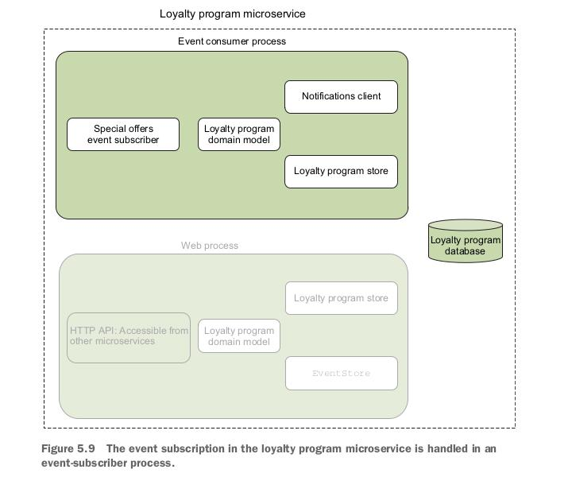

# 5. Microservice collaboration (взаимодействие)

- Understanding how microservices collaborate through commands, queries, and events.
(Понимание того, как микросервисы взаимодействуют с помощью команд, запросов и событий)

- Comparing event-based collaboration with collaboration based on commands and queries.
(Сравнение совместной работы на основе событий с совместной работой, основанной на командах и запросах)

- Implementing an event feed.
(Реализация потока событий)

- Implementing command-, query-, and event-based collaboration.
(Реализация совместной работы на основе команд, запросов и событий)

- Deploying collaborating microservices to Kubernetes.
(Развертывание взаимодействующих микросервисов в Kubernetes)

Микросервисы могут использовать три основных способа взаимодействия для совместной работы:
команды (commands), запросы (queries) и события (events). Каждый из этиъ способов имеет свои
сильные и слабые стороны, и понимание компромиссов между ними позволит выбрать подходящий.

## 5.1 Types of collaboration: Commands, queries, and events

(Типы взаимодействий: команды, запросы и события)

В качестве примера рассмотрим микросервис программы лояльности POS-системы из
главы 4. Микросервис программы лояльности прост: в ней регистрируются клиенты; после
регистрации они получают уведомления о новых специальных предложениях
и зарабатывают баллы лояльности, когда они что-то покупают.
На рис. 5.1 показано, что микросервис программы лояльности должен
сотрудничать с рядом других микросервисов:


Существует три способа взаимодействия между двумя микросервисами:

- *Commands* - команды используются, когда одному микросервису требуется другой микросервис
для выполнения действия. Например, микросервис программы лояльности отправляет команду
микросервису уведомлений, когда ему требуется отправить уведомление зарегистрированному
пользователю.

- *Queries* - запросы используются, когда одному микросервису требуется информация от
другого микросервиса. Например, клиенты с большим количеством баллов лояльности получают
скидку: микросервис выставления счетов запрашивает у микросервиса программы лояльности
количество баллов лояльности, имеющихся у пользователя.

- *Events* - события используются, когда микросервису необходимо отреагировать на что-то,
что произошло в другом микросервисе. Например, микросервис программы лояльности привязан
к событиям микросервиса специальных предложений: при появлении нового специального
предложения он может отправлять уведомления зарегистрированным пользователям.

Два микросервиса могут взаимодействовать между собой одним, двумя или всеми тремя
способами. На рис. 5.2 снова показаны варианты взаимодействия в рамках микросервиса
программы лояльности:


Взаимодействие, основанное на командах и запросах, должно использовать относительно
детализированные команды и запросы.
Вызовы между микросервисами являются удаленными вызовами, что означает, что они пересекают
границу процесса, часто используя сеть. Это означает, что вызовы между микросервисами
выполняются относительно медленно.

**Следует предпочесть способ взаимодействия, основанный на событиях**.
Взаимодействие на основе событий более слабо связано, чем два других способа, т.к. события
обрабатываются асинхронно. Это означает, что два микросервиса, взаимодействующих
посредством событий, не связаны во времени; обработка события не обязательно должна
происходить сразу после его появления. Скорее всего, обработка может произойти, когда
подписчик готов это сделать. Напротив, команды и запросы являются синхронными и поэтому
должны обрабатываться сразу после их отправки.

### 5.1.1 Commands and queries: Synchronous collaboration

(Команды и запросы: cинхронное взаимодействие)

Команды (commands) и запросы (queries) - это синхронные формы взаимодействий.
Оба реализуются как HTTP-запросы от одного микросервиса к другому. Запросы
реализуются с помощью HTTP `GET`-запросов, тогда как команды реализуются с помощью HTTP
запросов `POST`, `PUT` или `DELETE`.

>Команды и запросы через gRPC
>
>gRPC является сильным кандидатом в качестве альтернативы использованию HTTP.
>gRPC - это протокол для выполнения удаленных вызовов процедур (RPC).
>Команды - это вызовы методов, которые выполняют действие в вызываемом микросервисе,
>а запросы - это методы, которые возвращают некоторую информацию от вызываемого
>микросервиса.
>
>Работа с gRPC начинается с определения контракта в виде `proto` файла, в котором
>описаны процедурные вызовы. Файл `proto` используется для генерации кода как на стороне >клиента, так и на стороне сервера. Этот функционал в nuget пакете `Grpc.Tools`.
>
>Достоинства gRPC:
>
>- *Эффективность*. gRPC использует `HTTP/2` и `protobuf`. `Protobuf` - гораздо более
>компактный формат, чем JSON. `HTTP/2` обеспечивает бОльшую эффективность, чем `HTTP/1`.
>
>- *Явные контракты* (explicit contracts). Файлы `proto` определяют контракт между
>микросервисами. Библиотеки gRPC проверяют контракт во время выполнения.
>Это палка о двух концах: мы можем добиться некоторой безопасности, сделав контракты явными,
>но мы также теряем некоторую гибкость в развитии микросервисов.
>
>- *Хорошая поддержка .NET*. Nuget пакет `Grpc.Tools` используется для генерации кода
>из файлов `proto`. Nuget пакет `Grpc.AspNetCore` используется для hosting endpoints
>в ASP.NET.

Микросервис программы лояльности может отвечать на запросы о зарегистрированных
пользователях и может обрабатывать команды для создания или обновления зарегистрированных
пользователей. На рис. 5.3 показано взаимодействие на основе команд и запросов:


Рис. 5.3 включает два разных запроса (query):

- "Получить баллы лояльности для зарегистрированного пользователя"
- "Получить настройки для зарегистрированного пользователя".

Эти два запроса можно обработать при помощи одного endpoint, который возвращает
представление (representation) зарегистрированного пользователя. Представление включает в себя как
количество баллов лояльности, так и настройки.
Один endpoint делается по двум причинам:

- Проще сделать и обслуживать один endpoint, чем два.
- Понятнее, т.к. микросервис программы лояльности получает одно общее представление
зарегистрированного пользователя вместо того, чтобы придумывать специализированные форматы
для специализированных запросов.

На рисунке 5.3 в микросервис программы лояльности отправляются две команды (command):

- регистрация нового пользователя (HTTP `POST`)
- обновление существующего зарегистрированного пользователя (HTTP `PUT`)

`POST` часто используется для создания нового ресурса, а `PUT` для обновления ресурса.

В целом, микросервис программы лояльности должен предоставлять три конечных точки:

- Endpoint HTTP `GET` по URL `/users/{userId}`.
  - Возвращает представление пользователя.
  - Реализует оба запроса (query) - см. рис. 5.3.

- Endpoint HTTP `POST` по URL `/users/`.
  - Входной параметр - представление пользователя (в теле запроса).
  - Регистрирует этого пользователя в программе лояльности.

- Endpoint HTTP `PUT` по URL `/users/{userId}`
  - Входной параметр - представление пользователя (в теле запроса).
  - Обновляет уже зарегистрированного пользователя.

На рисунке 5.4 показан микросервис программы лояльности. Endpoints реализованы в компоненте
HTTP API.


Другие микросервисы, которые взаимодействуют с микросервисом программы лояльности
похожи по структуре и содержат компонент `LoyaltyProgramClient`.
Например, структура микросервиса выставления счетов может быть такой (рис. 5.5):


Представление зарегистрированного пользователя `LoyaltyProgramUser`,
которое программа лояльности ожидает получить в командах и с помощью которого она будет отвечать
на запросы:

```csharp
public record LoyaltyProgramUser(
    int Id, string Name, int LoyaltyPoints, LoyaltyProgramSettings Settings);

public record LoyaltyProgramSettings()
{
    public LoyaltyProgramSettings(string[] interests) : this()
    {
        this.Interests = interests;
    }

    public string[] Interests { get; init; } = Array.Empty<string>();
}
```

Определения endpoints и двух классов формируют контракт взаимодействия с микросервисом программы
лояльности. Данный контракт использует компонент `LoyaltyProgramClient`, см. рис. 5.6:


### 5.1.2 Events: Asynchronous collaboration. События: асинхронное взаимодействие

Взаимодействия, основанные на событиях, являются асинхронными. То есть микросервис, который
публикует события, не вызывает микросервисы, которые подписываются на события.
Подписчики обрабатывают новые события, когда они готовы их обработать. Когда мы используем
HTTP для реализации этого вида взаимодействия подписчики проводят опрос о новых событиях.
Этот опрос - это то, что автор называет подпиской на ленту событий. Хотя опросы это синхронные
запросы, взаимодействие является асинхронным, поскольку публикация событий не зависит от
опросов подписчиков на предмет новых событий.


На рис. 5.7 изображен микросервис программы лояльности, подписанный на события микросервиса
специальных предложений. Последний может публиковать события всякий раз, когда что-то
происходит в его домене. Например, когда новое специальное предложение становится активным.
Публикация события в данном контексте означает сохранение события в
хранилище данных специальных предложений. Программа лояльности не увидит событие до тех пор,
пока не обратится к ленте событий со специальными предложениями. Когда это произойдет, полностью
зависит от программы лояльности. Это может произойти сразу после публикации события или в любой
другой более поздний момент времени.

### Exposing an event feed. Отображение ленты событий

Микросервис может публиковать события для других микросервисов через канал событий, который
является просто HTTP endpoint. Например `/events`. На этот endpoint другой микросервис может
отправлять запросы, из которых он может получать данные о событиях.
На рис. 5.8 показаны компоненты микросервиса специальных предложений,
выделены компоненты, участвующие в реализации ленты событий:


События, опубликованные микросервисом специальных предложений, хранятся в его базе данных.Компонент `EventStore` содержит код, который считывает и записывает события в эту базу данных.
Код модели домена может использовать `EventStore` для хранения событий, которые ему необходимо
опубликовать. Компонент `Event Feed` - это реализация HTTP endpoint `/events`, которая
предоставляет события другим микросервисам.

Компонент `Event Feed` использует `EventStore` для чтения событий из базы данных, а
затем возвращает события в теле HTTP-ответа. Подписчики могут использовать
параметры запроса для управления: какие события и какое их количество будет передано.

### Subscribing to events. Подписка на события

Подписка на ленту событий по сути означает, что вы проводите опрос endpoint событий
микросервиса, на который вы подписаны. Периодически вы отправляете HTTP-запрос `GET` на
endpoint `/events`, чтобы проверить, есть ли какие-либо события, которые вы еще не обработали.

На рис. 5.9 представлен общий вид микросервиса программы лояльности, состоящий из двух процессов:



The event-subscriber process - это фоновый процесс, который периодически отправляет запросы
в ленту событий микросервиса специальных предложений для получения новых событий.
Когда он получает обратно пакет новых событий, он обрабатывает их, отправляя команды в
микросервис уведомлений для уведомления зарегистрированных пользователей о новых специальных
предложениях.

- `Special Offers Subscriber` - компонент, где реализован опрос ленты событий
- `Notifications-Client` - компонент, отвечает для отправки команды уведомлений.

Частота опросов на новые события может сильно отличаться в зависимости от конкретного варианта
использования. Часто события извлекаются каждые 30 секунд или каждые несколько минут.
Бывает опросы с частотой в 1 секунду или каждый час.

>### Events over queues
>
>Альтернативой публикации событий через ленту событий является использование технологии очередей,
>такой как `RabbitMQ`, `AWS SQS` или `Azure Queue Storage`. При таком подходе микросервисы,
>публикующие события, помещают их в очередь, а подписчики считывают их оттуда.
>События должны быть перенаправлены от издателя нескольким подписчикам.
>Микросервис, подписывшийся на события, сожержит процесс подписки на события, который считывает
>события из очереди и обрабатывает их. Повтор событий также может быть реализован с
>использованием очередей, но может потребовать небольших доработок - зависит от выбранной
>технологии.
>
>Это жизнеспособный способ взаимодействий между микросервисами. Но в книге используется
>взаимодействие на основе ленты/канала событий по HTTP, т.к.:
>
>- Это позволяет воспроизводить события в любое время
>- Это простое и надежное масштабируемое решение.
>
>### Event over gRPC
>
>gRPC имеет концепцию потоковой передачи, которая поддерживает открытое соединение HTTP/2 и
>отправляет данные через это соединение.
>Потоковая передача в gRPC работает в обоих направлениях - от клиента к серверу или от сервера
>к клиенту. Для моделирования событий с использованием потоковой передачи gRPC можно создать
>удаленную процедуру, которая работает примерно так же, как лента событий: она позволяет
>подписчикам событий вызывать процедуру и получать события в потоке ответов.

### 5.1.3 Data formats. (Форматы данных)

Обмен данными в формате JSON хорошо работает во многих ситуациях.
В зависимости от задач иногда лучше использовать что-то другое:

- Если требуется обмен большим объемами данных, может потребоваться более компактный формат.
Текстовые форматы, такие как JSON и XML, намного более многословны, чем двоичные
форматы, такие как protocol buffers.
- Если нужен более структурированный (structured) формат, чем JSON, который все еще удобочитаем
для человека, то можно использовать YAML.
- Если ваша компания использует проприетарный формат данных, то вам может потребоваться
поддержка этого формата.

Во всех этих случаях нужны endpoints, способные получать и посылать данные в отличном от JSON
формате. Например, запрос на регистрацию пользователя в микросервисе программы лояльности с
использованием YAML в теле запроса выглядит так:

```yaml
# (1) - Asks for the response in YAML format
# (2) - Specifies that the request body is in YAML format
# (3) - Provides a YAML-formatted request body

POST /users HTTP/1.1
Host: localhost:5000
Accept: application/yaml          # (1)
Content-Type: application/yaml    # (2)

Name: Christian     # (3)
Settings:
  Interests:
    - whisky
    - cycling
    - "software design"
```

В ответе на этот запрос также используется YAML:

```yaml
# (1) - Specifies that the response body is in YAML format
# (2) - Provides a YAML-formatted response body

HTTP/1.1 201 Created
Content-Type: application/yaml            # (1)
Location: http://localhost:5000/users/1

Id: 1               # (2)
Name: Christian
Settings:
  Interests:
    - whisky
    - cycling
    - "software design"
```

## 5.2 Implementing collaboration. (Реализация взаимодействия)

Реализация взаимодействия будет состоять из трех шагов:

1. Создание проекта для loyalty program (программы лояльности). Как раньше: создание
пустого приложения ASP.NET и добавление ASP.NET MVC.

2. Реализация взаимодействий на основе команд и запросов. Реализация всех команд и запросов,
в микросервисах которые их используют.

3. Реализация взаимодействий на основе событий. Сначала реализация event feed (ленты событий)
в разделе "Специальные предложения", а затем реализация подписки в программе лояльности.
Подписка будет включена в новый проект программы лояльности и будет управляться
Kubernetes CronJob.

Микросервис loyalty program состоит из веб-процесса (web process) и event consumer process, который
реализует взаимодействие на основе событий:


### 5.2.1 Setting up a project for the loyalty program

Создание проекта web process для loyalty program так же, как было описано во 2 главе:

```text
dotnet new web -n LoyaltyProgram
```

Реализация `Program.cs` похожа на реализацию в главе 2.
См. [LoyaltyProgram/Program.cs](chapter05/LoyaltyProgram/LoyaltyProgram/Program.cs)

### 5.2.2 Implementing commands and queries

Для web process в loyalty program надо реализовать следующие endpoints:

- `GET` по адресу `/users/{userId}`, который возвращает информацию о пользователе.
- `POST` по адресу `/users/`, который принимает информацию о пользователе и регистрирует его
в сервисе loyalty program.
- `PUT` по адресу `/users/{userId}`, который принимает информацию о пользователе и обновляет
информацию о зарегистрированном пользователе.

### 5.2.3 и 5.2.4 Implementing commands with HTTP `POST`, `PUT` and `GET`

Контроллер можно посмотреть тут:
[LoyaltyProgram/Users/UsersController.cs](chapter05/LoyaltyProgram/LoyaltyProgram/Users/UsersController.cs)

Информация о пользователе тут:
[LoyaltyProgram/Users/LoyaltyProgramUser.cs](chapter05/LoyaltyProgram/LoyaltyProgram/Users/LoyaltyProgramUser.cs). В книге этого кода нет.

```csharp
public record LoyaltyProgramUser(int Id, string Name, int LoyaltyPoints, LoyaltyProgramSettings Settings);

public record LoyaltyProgramSettings()
{
    public LoyaltyProgramSettings(string[] interests) : this()
    {
        Interests = interests;
    }

    public string[] Interests { get; init; } = Array.Empty<string>();
}
```

Это приемная сторона. Клиентская часть, API Gateway microservice:


это mock, консольное приложение. Его код в книге не показан. Находится тут:
[chapter05/ApiGatewayMock](chapter05/ApiGatewayMock/).

Интерес представляет класс [ApiGatewayMock/LoyaltyProgramClient.cs](chapter05/ApiGatewayMock/LoyaltyProgramClient.cs):

```csharp
public class LoyaltyProgramClient
{
    private readonly HttpClient _httpClient;

    public LoyaltyProgramClient(HttpClient httpClient)
    {
        _httpClient = httpClient;
    }

    // (1) Sends the command to loyalty program
    public Task<HttpResponseMessage> RegisterUser(string name)
    {
        var user = new { name, Settings = new { } };
        return _httpClient.PostAsync("/users/", CreateBody(user));      // (1)
    }

    // (1) Sends the UpdateUser command as a PUT request
    public Task<HttpResponseMessage> UpdateUser(LoyaltyProgramUser user) =>
        _httpClient.PutAsync($"/users/{user.Id}", CreateBody(user));    // (1)

    public Task<HttpResponseMessage> QueryUser(string arg) =>
        _httpClient.GetAsync($"/users/{int.Parse(arg)}");

    // (1) Serializes user as JSON
    // (2) Sets the Content-Type header
    private static StringContent CreateBody(object user) =>
        new StringContent(                      // (1)
            JsonSerializer.Serialize(user),
            Encoding.UTF8,
            "application/json");                // (2)
}
```

Он создает запросы к loyalty program microservice и получает ответы в виде `HttpResponseMessage`.

#### Special Offers endpoint

В книге не показан, но есть в исходных кодах. В микросервисе special offers реализуется CRUD
для endpoint `/offers`. Все действия со специальными предложениями сохраняются в event storage.
Все эти события затем появляются в event feed.

Это простой Web API. Реализуется при помощи контроллера
[SpecialOffers/SpecialOffers/SpecialOffersController.cs](chapter05/SpecialOffers/SpecialOffers/SpecialOffersController.cs):

```csharp
public record Offer(string Description, int Id);

[Route("/offers")]
public class SpecialOffersController : ControllerBase
{
    private static readonly IDictionary<int, Offer> Offers =
        new ConcurrentDictionary<int, Offer>();
    private readonly IEventStore _eventStore;

    public SpecialOffersController(IEventStore eventStore)
    {
        _eventStore = eventStore;
    }

    [HttpGet("{id:int}")]
    public ActionResult<Offer> GetOffer(int id) =>
        Offers.ContainsKey(id)
            ? Ok(Offers[id])
            : NotFound();

    [HttpPost("")]
    public ActionResult<Offer> CreateOffer([FromBody] Offer offer)
    {
        if (offer == null)
            return BadRequest();
        var newOffer = NewOffer(offer);
        return Created(new Uri($"/offers/{newOffer.Id}", UriKind.Relative), newOffer);
    }

    [HttpPut("{id:int}")]
    public Offer UpdateOffer(int id, [FromBody] Offer offer)
    {
        var offerWithId = offer with { Id = id };
        _eventStore.RaiseEvent("SpecialOfferUpdated", new { OldOffer = Offers[id], NewOffer = offerWithId });
        return Offers[id] = offerWithId;
    }

    [HttpDelete("{id:int}")]
    public ActionResult DeleteOffer(int id)
    {
        _eventStore.RaiseEvent("SpecialOfferRemoved", new { Offer = Offers[id] });
        Offers.Remove(id);
        return Ok();
    }

    private Offer NewOffer(Offer offer)
    {
        var offerId = Offers.Count;
        var newOffer = offer with { Id = offerId };
        _eventStore.RaiseEvent("SpecialOfferCreated", newOffer);
        return Offers[offerId] = newOffer;
    }
}
```

### 5.2.5 Implementing an event-based collaboration

Loyalty program подписывается на события из special offers (специальных предложений) и использует
события, чтобы решить, когда уведомлять зарегистрированных пользователей
о новых специальных предложениях:


#### Implementing an event feed

В главе 2 похожее уже было реализовано. Микросервис special offers содержит endpoint
`/events`, который возвращает список последовательно пронумерованных событий.
Он принимает два параметра: `start` и `end`, которые определяют диапазон событий.

- События необязательно могут возвращаться в одной форме - разные события могут иметь разные данные.
- В одном ответе может быть несколько типов событий.

Подробная реализация special offers в книге не показана. Реализация special offers в виде web API.

Здесь конфигурация web API [SpecialOffers/Program.cs](chapter05/SpecialOffers/Program.cs) как обычно.

Интересен контроллер, который реализует endpoint `/events` [](chapter05/SpecialOffers/Events/EventFeedController.cs):

```csharp
using Microsoft.AspNetCore.Mvc;

namespace SpecialOffers.Events;

[Route("/events")]
public class EventFeedController : ControllerBase
{
    private readonly IEventStore _eventStore;

    public EventFeedController(IEventStore eventStore)
    {
        _eventStore = eventStore;
    }

    [HttpGet("")]
    public ActionResult<EventFeedEvent[]> GetEvents(
        [FromQuery] int start, [FromQuery] int end)
    {
        if (start < 0 || end < start)
            return BadRequest();

        return _eventStore.GetEvents(start, end).ToArray();
    }
}
```

`IEventStore` - это хранилище событий сервиса. Его псевдо-реализация расположена тут:
[SpecialOffers/Events/EventStore.cs](chapter05/SpecialOffers/Events/EventStore.cs).

```csharp
public record EventFeedEvent(long SequenceNumber, DateTimeOffset OccuredAt, string Name, object Content);

public interface IEventStore
{
    void RaiseEvent(string name, object content);
    IEnumerable<EventFeedEvent> GetEvents(int start, int end);
}

public class EventStore : IEventStore
{
    private static long _currentSequenceNumber = 0;
    private static readonly IList<EventFeedEvent> Database = new List<EventFeedEvent>();

    public void RaiseEvent(string name, object content)
    {
        var seqNumber = Interlocked.Increment(ref _currentSequenceNumber);
        Database.Add(new EventFeedEvent(seqNumber, DateTimeOffset.UtcNow, name, content));
    }

    public IEnumerable<EventFeedEvent> GetEvents(int start, int end) =>
        Database
            .Where(e => start <= e.SequenceNumber && e.SequenceNumber < end)
            .OrderBy(e => e.SequenceNumber);
}
```

У `EventFeedEvent` свойство `Content` используется для данных события и может быть разным, в
зависимости от типа события.

#### Creating an event-subscriber process

Подписка на event feed (канал событий), по сути, означает, что вы будете опрашивать endpoint
микросервиса через определенные промежутки времени.

Отправляется HTTP-запрос `GET` на endpoint `/events`, чтобы проверить, есть ли какие-либо
необработанные события.

Реализация таких периодических опросов состоит из двух частей:

- Простое консольное приложение, которое считывает batch (пакет) событий.
- Kubernetes CronJob запускает консольное приложение через определенные интервалы времени.

Первым шагом в реализации процесса подписки на события является создание консольного
приложения:

```text
dotnet new console -n EventConsumer
```

Расположено оно будет тут [LoyaltyProgram/EventConsumer/](chapter05/LoyaltyProgram/EventConsumer/).

Запуск консольного приложения из CLI:

```text
dotnet run
```

#### Subscribing to an event feed

Реализация функционала для консольного приложения `EventConsumer`.
Состоит из одного файла [LoyaltyProgram/EventConsumer/Program.cs](chapter05/LoyaltyProgram/EventConsumer/Program.cs):

```csharp
// (1) Read the starting point of this batch (пакета) from a database.
// (2) Send GET request to the event feed.
// (3) Call the method to process the events in this batch.
//     ProcessEvents also updates the start variable.
// (4) Save the starting point of the next batch of events.

using System.Net.Http.Headers;
using System.Net.Mime;
using System.Text.Json;

var start = await GetStartIdFromDatastore();    // (1)
var end = 100;

var client = new HttpClient();
client.DefaultRequestHeaders
    .Accept
    .Add(new MediaTypeWithQualityHeaderValue(MediaTypeNames.Application.Json));

using var resp = await client.GetAsync(         // (2)
    new Uri($"http://special-offers:5002/events?start={start}&end={end}"));

await ProcessEvents(await resp.Content.ReadAsStreamAsync());    // (3)
await SaveStartIdToDataStore(start);                            // (4)

// Fake implementation. Should get from a real database
Task<long> GetStartIdFromDatastore() => Task.FromResult(0L);

// Fake implementation. Should save to a real database
Task SaveStartIdToDataStore(long startId) => Task.CompletedTask;

// Fake implementation. Should apply business rules to events
// (5) This is where the event would be processed.
// (6) Keeps track of the highest event number handled.
async Task ProcessEvents(Stream content)
{
    var options = new JsonSerializerOptions(JsonSerializerDefaults.Web);
    var events = await JsonSerializer.DeserializeAsync<SpecialOfferEvent[]>(content, options)
        ?? Array.Empty<SpecialOfferEvent>();

    foreach (var @event in events)
    {
        Console.WriteLine(@event);                              // (5)
        start = Math.Max(start, @event.SequenceNumber + 1);     // (6)
    }
}

public record SpecialOfferEvent(
    long SequenceNumber, DateTimeOffset OccuredAt, string Name, object Content);
```

Для метода `ProcessEvents` следует отметить несколько моментов:

- Метод `ProcessEvents` отслеживает, какие события были обработаны. Это гарантирует,
что вы не будете запрашивать события, которые вы уже обработали.

- События могут содержать разные данные в свойстве `Content`. В зависимости от свойства `Name`
можно выбирать обработку данных для определенных типов событий.
Можно игнорировать некоторые типы событий и их данные, если они не требуются для текущей
функциональности.

- События десериализуются в тип `SpecialOfferEvent`. Этот тип отличается от `EventFeedEvent`,
который используется в special offers.
Двум разным микросервисам не обязательно работать с одинаковым типом события.
Если микросервис LoyaltyProgram не зависит от данных, которых нет во входном событии, то
никаких ошибок в работе это не вызовет.

Тип `EventFeedEvent` структурно похож на `SpecialOfferEvent`. В `SpecialOfferEvent`
даже может отсутствовать часть полей, если это будет нужно:

```csharp
public record EventFeedEvent(
    long SequenceNumber, DateTimeOffset OccuredAt, string Name, object Content);
```

### 5.2.6 Deploying to Kubernetes

Для deploy в Kubernetes надо выполнить три шага:

- Создание контейнеров Docker для обоих микросервисов.

  - Контейнер для special offers (специальных предложений) похож на Docker из [главы 3](Chapter03.md).

  - Контейнер для loyalty program (программы лояльности) имеет особенность:
на основе переменной среды он может действовать либо как HTTP API, предоставляющий endpoints
`POST`, `PUT` и `GET`, либо как event consumer (обработчик событий).

- Deploy для special offers (специальных предложений) в Kubernetes похож на deploy в [главе 3](Chapter03.md).

- Deploy для loyalty program (программы лояльности) будет в виде двух экземпляров разных
конфигураций: один работает как API, а другой - как event consumer (обработчик событий).

Выполнив эти три шага, мы получим три модуля, работающие в Kubernetes:

- Модуль микросервиса special offers (специальных предложений).
- Модуль API-части микросервиса loyalty program (программы лояльности).
- CronJob для event consumer части микросервиса loyalty program.

Также будет два deployments в Kubernetes, одно для микросервиса special offers
и одно для микросервиса loyalty program.
API и event consumer микросервиса loyalty program рассматриваются как единое целое, поэтому
они развертываются вместе и описываются в одном Kubernetes manifest file (файле манифеста).
Во время выполнения они запускаются независимо, что позволяет, например, отдельно масштабировать
только часть с API, а обработчика событий оставить в единственном экземпляре.

### 5.2.7 Building a Docker container special offers microservice

[`Dockerfile`](chapter05/SpecialOffers/Dockerfile) для special offers microservice (как в [главе 3](Chapter03.md)):

```dockerfile
FROM mcr.microsoft.com/dotnet/sdk:6.0 AS build
WORKDIR "/src"
COPY . .
RUN dotnet restore "SpecialOffers.csproj"
RUN dotnet build "SpecialOffers.csproj" -c Release -o /api/build

FROM build AS publish
WORKDIR "/src"
RUN dotnet publish "SpecialOffers.csproj" -c Release -o /api/publish

FROM mcr.microsoft.com/dotnet/aspnet:6.0 AS final
WORKDIR "/app"
EXPOSE 80
COPY --from=publish /api/publish ./api
ENTRYPOINT dotnet api/SpecialOffers.dll
```

### 5.2.8 Building a Docker container for both parts of the loyalty program

The loyalty program состоит из двух частей: API и event consumer.
Мы создадим один контейнер, который способен работать либо как API, либо как event consumer
в зависимости от environment variable (переменной окружения). Создается `Dockerfile`, где `ENTRYPOINT`
управляется environment variable [`Dockerfile`](chapter05/LoyaltyProgram/Dockerfile):

```dockerfile
# (1) Builds the API
# (2) Builds the event consumer
# (3) Publishes the API
# (4) Publishes the event consumer
# (5) Uses the value of the STARTUPDLL environment variable as the entry point

FROM mcr.microsoft.com/dotnet/sdk:6.0 AS build
WORKDIR "/src"
COPY . .
RUN dotnet restore "LoyaltyProgram/LoyaltyProgram.csproj"
RUN dotnet restore "EventConsumer/EventConsumer.csproj"
WORKDIR "/src/LoyaltyProgram"
RUN dotnet build "LoyaltyProgram.csproj" -c Release -o /api/build       #(1)
WORKDIR "/src/EventConsumer"
RUN dotnet build "EventConsumer.csproj" -c Release -o /consumer/build   #(2)

FROM build AS publish
WORKDIR "/src/LoyaltyProgram"
RUN dotnet publish "LoyaltyProgram.csproj" -c Release -o /api/publish       #(3)
WORKDIR "/src/EventConsumer"
RUN dotnet publish "EventConsumer.csproj" -c Release -o /consumer/publish   #(4)

FROM mcr.microsoft.com/dotnet/aspnet:6.0 AS final
WORKDIR "/app"
EXPOSE 80
COPY --from=publish /api/publish ./api
COPY --from=publish /consumer/publish ./consumer
ENTRYPOINT dotnet $STARTUPDLL                     #(5)
```

Созданный image будет содержать `LoyaltyProgram.dll` и `EventConsumer.dll`

Build a loyalty program Docker image (запускать из директории где находится `Dockerfile`):

```txt
docker build . -t loyalty-program
```

- `-t` присваивает тег собранному image

Запуск loyalty program как API:

```txt
docker run --rm -p 5001:80 -e STARTUPDLL="api/LoyaltyProgram.dll" loyalty-program
```

- `-d` - запуск docker контейнера в фоновом режиме и возврат обратно в терминал.
- `--rm` - container is automatically removed when the container exits.
- `-p 5001:80` - container exposes port 5001 and listens to traffic on
that port. Any incoming traffic to port 5001 is forwarded to port 80 inside the
container.
- `-e STARTUPDLL="api/LoyaltyProgram.dll"` - переменная окружения (для запуска API)
- `loyalty-program` at the end of the command is the name of the container image to run.

Запуск loyalty program как Event Consumer:

```txt
docker run --rm -e STARTUPDLL="consumer/EventConsumer.dll" loyalty-program
```

Event Consumer будет запущен, но ему не удастся извлечь события из special offers
event feed, потому что микросервис special offers еще не запущен.
Надо запустить микросервис special offers в контейнере и поместить его в ту же Docker network,
что и event consumer. Для этого создается новая сеть Docker под названием "microservices":

```text
docker network create --driver=bridge microservices
```

Контейнеры, которые мы добавляем в network микросервисов, могут взаимодействовать,
используя контейнер и имена хостов.

Запуск микросервиса special offers с добавлением его в network микросервисов и присвоением ему
названия "special-offers":

```text
docker build . -t special-offers
docker run --rm -p 5002:80 --network=microservices --name=special-offers special-offers
```

Теперь можно повторно запустить loyalty program как Event Consumer:

```text
docker run --rm -e STARTUPDLL="consumer/EventConsumer.dll" --network=microservices loyalty-program
```

При этом event consumer запустится один раз и он обработает только один пакет событий.
Позже мы настроим расписание Cron в Kubernetes, которое периодически будет запускать event consumer.

- Если ошиблись, то можно удалить image

```text
docker stop special-offers
docker image list
docker image rm 7581fa3f72a3
```

### 5.2.9 Deploying the loyalty program API and the special offers

#### Создание Kubernetes manifest

Добавляем файлы Kubernetes manifest `loyalty-program.yaml` и `special-offers.yaml`.
Аналогичный файл был создан в [главе 3](Chapter03.md).

Файл [LoyaltyProgram/loyalty-program.yaml](chapter05/LoyaltyProgram/loyalty-program.yaml):

```yaml
# (1) Start of the section specifying the container deployment
# (2) The number of copies of the LoyaltyProgram API we want deployed.
# (3) The container image to deploy.
# (4) The port the container listens for requests on
# (5) Override the STARTUPDLL environment variable to control how the container starts up.
# (6) Point to the LoyaltyProgram.dll, which will run the LoyaltyProgram API.
kind: Deployment            # (1)
apiVersion: apps/v1
metadata:
  name: loyalty-program
spec:
  replicas: 1               # (2)
  selector:
    matchLabels:
      app: loyalty-program
  template:
    metadata:
      labels:
        app: loyalty-program
    spec:
      containers:
        - name: loyalty-program
          image: loyalty-program                  # (3)
          imagePullPolicy: IfNotPresent
          ports:
            - containerPort: 80                   # (4)
          env:
            - name: STARTUPDLL                    # (5)
              value: "api/LoyaltyProgram.dll"     # (6)
---
# Start of the section specifying a service
# (1) Specifies this is a load balancer service
# (2) Listens on port 5000 externally
# (3) Maps to port 80 on the container
# (4) Routes requests to the loyalty program
apiVersion: v1
kind: Service
metadata:
  name: loyalty-program
spec:
  type: LoadBalancer            # (1)
  ports:
    - name: loyalty-program
      port: 5001                # (2)
      targetPort: 80            # (3)
  selector:
    app: loyalty-program        # (4)
```

Файл [SpecialOffers/special-offers.yaml](chapter05/SpecialOffers/special-offers.yaml):

```yaml
kind: Deployment
apiVersion: apps/v1
metadata:
  name: special-offers
spec:
  replicas: 1
  selector:
    matchLabels:
      app: special-offers
  template:
    metadata:
      labels:
        app: special-offers
    spec:
      containers:
        - name: special-offers
          image: special-offers
          imagePullPolicy: IfNotPresent
          ports:
            - containerPort: 80
---
apiVersion: v1
kind: Service
metadata:
  name: special-offers
spec:
  type: LoadBalancer
  ports:
    - name: special-offers
      port: 5002
      targetPort: 80
  selector:
    app: special-offers
```

#### Deploy to Kubernetes

Deploy the loyalty program API to Kubernetes:

```text
kubectl apply -f loyalty-program.yaml
```

Deploy special offers:

```text
kubectl apply -f special-offers.yaml
```

- Посмотреть запущенные микросервисы в Kubernetes:

```text
kubectl get pods
```

Пример вывода:

```text
NAME                               READY   STATUS    RESTARTS   AGE
loyalty-program-58758df679-6tbbf   1/1     Running   0          37s
special-offers-7759869665-w24xn    1/1     Running   0          9s
```

- Посмотреть IP адреса и порты запущенных микросервисов в Kubernetes:

```text
kubectl get services
```

Пример вывода:

```text
NAME              TYPE           CLUSTER-IP      EXTERNAL-IP   PORT(S)          AGE
kubernetes        ClusterIP      10.96.0.1       <none>        443/TCP          38d
loyalty-program   LoadBalancer   10.98.171.182   localhost     5001:30351/TCP   3m
special-offers    LoadBalancer   10.98.154.204   localhost     5002:30162/TCP   2m32s
```

- List everything running in the Kubernetes cluster:

```text
kubectl get all
```

### 5.2.10 Deploy EventConsumer

В Kubernetes manifest для loyalty program (программы лояльности) надо сконфигурировать
event consumer как CronJob, который будет вызываться по расписанию.

Добавление следующей секции в файл [LoyaltyProgram/loyalty-program.yaml](chapter05/LoyaltyProgram/loyalty-program.yaml):

```yaml
# (1) The Kubernetes API version needed to specify a CronJob
# (2) Indicate that this is a CronJob.
# (3) Define the schedule for this job. (Run once every minute).
# (4) Point to the event consumer dll.
# (5) Make sure consumer runs only one copy at the time of the event.
apiVersion: batch/v1                # (1)
kind: CronJob                       # (2)
metadata:
  name: loyalty-program-consumer
spec:
  schedule: "*/1 * * * *"           # (3)
  startingDeadlineSeconds: 30
  jobTemplate:
    spec:
      template:
        spec:
          containers:
            - name: loyalty-program
              image: loyalty-program
              imagePullPolicy: IfNotPresent
              env:
                - name: STARTUPDLL
                  value: "consumer/EventConsumer.dll"   # (4)
          restartPolicy: Never
  concurrencyPolicy: Forbid                             # (5)
```

EventConsumer будет запускаться раз в минуту (`*/1 * * * *`).
Можно и так было задать (`* * * * *`).

- Снова deploy the loyalty program to Kubernetes:

```text
kubectl apply -f loyalty-program.yaml
```

Выполнение этой команды снова вполне нормально. Kubernetes определит, нужно ли вносить какие-либо
изменения, и применит только эти изменения.

- Посмотреть CronJob:

```text
kubectl get cronJob
```

Пример вывода:

```text
NAME                       SCHEDULE      SUSPEND   ACTIVE   LAST SCHEDULE   AGE
loyalty-program-consumer   */1 * * * *   False     0        41s             106s
```

- Посмотреть список заданий Kubernetes:

```text
kubectl get jobs
```

```text
NAME                                COMPLETIONS   DURATION   AGE
loyalty-program-consumer-27898274   1/1           5s         2m47s
loyalty-program-consumer-27898275   1/1           5s         107s
loyalty-program-consumer-27898276   1/1           5s         47s
```

- Посмотреть логи (журналы) одного из экземпляров CronJob:

```text
kubectl logs job.batch/loyalty-program-consumer-27898276
```

- Removing a service from Kubernetes

```text
kubectl delete -f loyalty-program.yaml
kubectl delete -f special-offers.yaml
```

#### Формат cron job

[Взято отсюда](https://cloud.google.com/scheduler/docs/configuring/cron-job-schedules)

A schedule is defined using the unix-cron string format `(* * * * *)` which is a set of five fields
in a line, indicating when the job should be executed.

| Field            | Format of valid values
|------------------|------------------------
| Minute           | 0-59
| Hour             | 0-23
| Day of the month | 1-31
| Month            | 1-12 (or JAN to DEC)
| Day of the week  | 0-6 (or SUN to SAT; or 7 for Sunday)

- A field can contain an asterisk (`*`), which always stands for "first-last".
- Ranges are two numbers separated with a hyphen (`-`) and the specified range is inclusive.
- Following a range with `/NUMBER` specifies skips of the number's value through the range. For
example, both `0-23/2` and `*/2` can be used in the Hour field to specify execution every two hours.
- A list is a set of numbers (or ranges) separated by commas (`,`). For example, `1,2,5,6` in the
Day of the month field specifies an execution on the first, second, fifth, and sixth days
of the month.

| Sample schedule                              | Cron job format
|----------------------------------------------|-----------------------
| Every minute                                 | `* * * * *`
| Every Saturday at 23:45 (11:45 PM)           | `45 23 * * 6`
| Every Monday at 09:00 (9:00 AM)              | `0 9 * * 1`
| Every Sunday at 04:05 (4:05 AM)              | `5 4 * * SUN`
| Every weekday (Mon-Fri) at 22:00 (10:00 PM)  | `0 22 * * 1-5`

## Запросы

Все запросы [тут](chapter05/requests.http)

## Summary

- Существует три типа взаимодействий между микросервисами:
  - Взаимодействия на основе команд (command-based). Когда один микросервис использует HTTP `POST`,
`PUT`, или `DELETE` чтобы заставить другой микросервис выполнить какое-либо действие.
  - Взаимодействия на основе запросов (query-based). Когда один микросервис использует HTTP `GET`
запроса состояния другого микросервиса.
  - Взаимодействия на основе событий (event-based). Когда один микросервис предоставляет
event feed (ленту событий), на которую другие микросервисы могут подписаться, опрашивая ленту на
предмет наличия новых событий.

- Взаимодействие на основе событий более слабо связано, чем взаимодействие на основе команд и
запросов.

- Можно использовать `HttpClient` для отправки команд и запросов другим микросервисам.

- Можно использовать MVC controllers для реализации endpoints для приема и обработки
команд и запросов.

- С помощью MVC controller можно реализовать простой event feed (ленту событий).

- Можно создать процесс, который подписывается на события при помощи:
  - Консольное приложение .NET.
  - Использование `HttpClient` чтения событий из event feed (ленты событий).
  - Запуск этого приложения как CronJob в Kubernetes.
