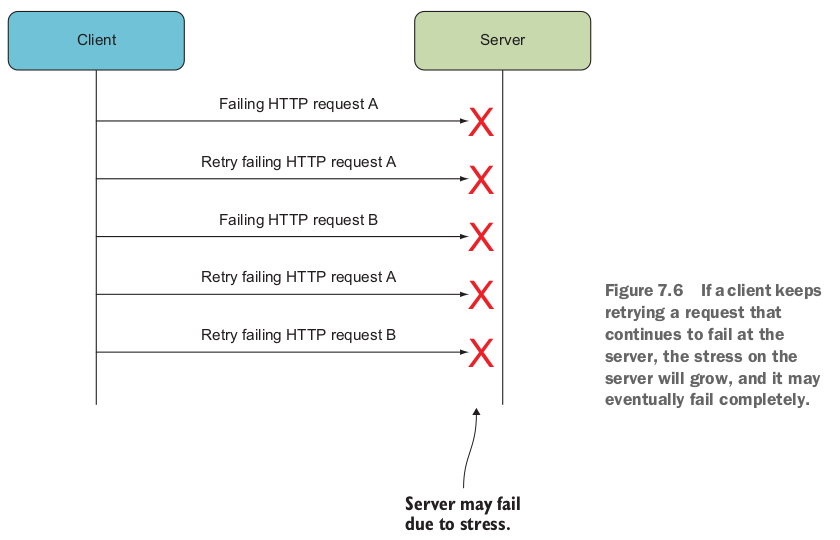

# 7. Designing for robustness. (Проектирование для обеспечения надежности)

- Communicating robustly between microservices.
(Надежная связь между микросервисами).

- Letting the calling side take responsibility for robustness in the face of failure.
(Вызывающая сторона берет на себя ответственность за надежность при failure (отказе)).

- Rolling back versus rolling forward.
(Откат назад против отката вперед).

- Implementing robust communication.
(Внедрение надежного взаимодействия).

## Failures (сбои/отказы) and errors (ошибки)

*Failures (сбой/отказ)* происходит, когда что-то идет не так в системе, и проблема
вызвана чем-то вне системы.
Примеры источников failures:

- Потерянные сетевые пакеты приводят к сбою связи.
- Потерянные соединения приводят к сбою связи.
- Аппаратные сбои - микросервисы выходят из строя.

*Errors (ошибки)* возникают, когда система не может должным образом обслуживать своих пользователей.
Примеры ошибок:

- Пользователь видит страницу с ошибкой.
- Система зависает и никак не реагирует на действия пользователя.
- Система возвращает wrong response на действие пользователя.

## 7.1 Expect failures. Ожидайте failures

Отличительной чертов микросервисной системы является большой объем взаимодействий между
микросервисами.
Следует ожидать, что связь время от времени будет прерываться. Связь между двумя
микросервисами может редко прерываться, но, во всей системе сбои связи будут
достаточно часто возникать из-за большого объема взаимодействий.

Поэтому следует делать сбоеустойчивые микросервисы. Из [главы 5](Chapter05.md)
взаимодействие между микросервисами делится на три категории:

- *Query-based collaboration* (на основе запросов). Когда query завершается неудачей,
вызывающий абонент не получает необходимую ему информацию. Если клиент хорошо
справляется с этим, то система продолжит работу, но с ухудшенной функциональностью.
Если клиент не справится, то в результате может быть ошибка в системе.

- *Command-based collaboration*  (на основе команд). Когда отправка команды завершается
неудачей, отправитель не может знать, получил ли получатель команду. В зависимости от
того, как справляется с этим отправитель, это может привести к ошибке или ухудшению
функциональности.

- *Event-based collaboration* (на основе событий). Когда абонент polls (опрашивает)
event feed и вызов завершается неудачей, то особо негативного влияния на работу
системы это не окажет. Подписчик позже может снова сделать запрос к event feed и
получить все события (пусть даже и некоторые будут получены с задержкой).

### 7.1.1 Keeping good logs

В системе из нескольких микросервисов нужно сделать good logs, которые позволят
отследить, что произошло в системе и что привело к ошибке. "Что произошло" часто
охватывает несколько микросервисов, поэтому следует использовать central log microservice
(микросервис централизованного ведения журнала), см. рис. 7.2:


Микросервис журнала - это центральный компонент, в который все другие микросервисы
отправляют свои логи.

Сбой в log microservice не должен приводить к сбою всей системы. Поэтому отправляющая
сторона не должна ждать ответа после отправки логов (fire and forget).
При использовании контейнеров другие микросервисы просто посылают логи в standard out,
а log shipping tool собирает эти логи и отправляет их в log microservice
(микросервис журналов).

>### Использование готового решения для log microservice
>
>Автор рекомендует использовать готовое решение для реализации log microservice.
>Примеры такиз решений: ELK, Datadog, Splunk, Honeycomb и т.д.
>В [главе 10](Chapter10.md) обещают показать пример использования подобного решения.

### 7.1.2 Using trace IDs (идентификаторы трассировки)

Чтобы найти все логи, относящиеся к определенному действию в системе, можно
использовать *trace IDs*. ID трассировки - это идентификатор, присвоенный, например,
к запросу от конечного пользователя, когда он поступает в систему.
Trace ID передается от микросервиса к микросервису во всех сообщениях, которые
появляются из этого запроса пользователя. Все микросервисы отправляют логи
в log microservice и каждое из этих сообщений должно содержать trace ID.
Log microservice должен позволять выполнять поиск логов по traceID.

На рисунке 7.2 API Gateway создаст и назначит trace ID каждому входящему запросу.
Этот trace ID затем будет передаваться с каждым взаимодействием микросервиса с
микросервисом, включая события и log messages.

Это хорошо зарекомендовавший себя шаблон, который может быть реализован на основе
открытого стандарта, такого как Open Telemetry
([https://opentelemetry.io/](https://opentelemetry.io/)). См. [главу 9](Chapter09.md).

### 7.1.3 Rolling forward vs. rolling backward. (Откат вперед против отката назад)

Во многих обычных системах, если начинают возникать ошибки после развертывания ее новой
версии, лучшим решением по исправлению этих ошибок обычно является откат к предыдущей
версии.
В микросервисных системах решение может быть другим. Микросервисы могут очень быстро и
просто развертываться и достаточно малы и просты для исправлений.
Поэтому для исправления ошибок в микросервисах рекомендуется делать откаты вперед,
а не назад.

Почему рекомендуется откат вперед? В некоторых ситуациях, откат назад - дело сложное,
особенно когда речь идет об изменениях в базе данных. Когда развертывается новая
версия, изменяющая базу данных, микросервис начинает создавать данные, которые
записываются в обновленную базу данных. Как только эти данные попадают в базу данных,
они должны там оставаться, что может быть несовместимо с возвратом к более ранней версии.
В таком случае откат вперед может быть проще.

### 7.1.4 Don't propagate failures. (Не передавайте сбои/отказы)

Вокруг микросервиса могут происходить события, которые могут нарушить его нормальную
работу. Т.е. микросервис *испытывает стресс*. Пример источников стресса:

- Одна из машин в кластере, на которой находится БД микросервиса, вышла из строя.

- Микросервис потерял сетевое подключение к одному из микросервисов, с которыми
он взаимодействует.

- Микросервис получает необычно большой трафик.

- Один из микросервисов, с которым происходит взаимодействие, вышел из строя.

Микросервис, находящийся в состоянии стресса, не может продолжать работать так,
как обычно это делает. Он не вышел из строя, но он должен справиться с этой ситуацией.


Как показано на рисунке 7.3, в случае сбоя одного микросервиса, риску сбоя подвергается
еще больше микросервисов, которые с ним взаимодействуют.
Вот несколько примеров того, как можно остановить распространение сбоев:

- Отправитель отправил команду другому микросервису, а тот ее не обработал.
Чтобы остановить распространение сбоя, отправитель может действовать так, как если
бы команда была выполнена успешно, но на самом деле сохранить ее
в списке неудачных команд. Микросервис-отправитель может периодически просматривать
список сбойных команд и пробовать отправлять их снова.
Такое поведение возможно не во всех ситуациях, например, если результат выполнения
команды требуется немедленно обработать. Этот подход можно комбинировать с
*circuit breaker* (см. далее в этой главе).

- Микросервис делает запрос на другой микросервис и он заканчивается ошибкой. В этом
случае клиент может использовать кэшированный ответ. В [главе 6](Chapter06.md)
было описание как кэшировать ответы на запросы. Если у вызывающей стороны
в кэше находится устаревший ответ и новый запрос завершается неудачей, то клиент
может решить использовать устаревший ответ. Опять же, это возможно не во всех ситуациях,
но когда это возможно, сбой не будет распространяться по системе.

- API Gateway испытывает стресс из-за больших объемов трафика от определенного
клиента. Gateway может игнорировать часть запросов от этого клиента.
Клиент может отправлять необычно большое количество запросов из-за внутреннего сбоя.
При ограничении запросов клиент станет работать медленнее, но все равно будет получать
некоторые ответы на свои запросы.
Без регулирования трафика API Gateway может стать медленным для всех клиентов
или полностью выйти из строя. Более того, так как API Gateway взаимодействует с
другими микросервисами, нерегулируемая обработка всех входящих запросов приведет к
увеличению нагрузки и на другие микросервисы тоже.

Внедрение мер защиты от распространения сбоев придает надежность всей системе в целом.

## 7.2 The client side's responsibility for robustness. (Ответственность клиентской стороны за надежность)

Запрос, показанный на рисунке 7.4, завершается неудачей; он может завершиться неудачей
из-за сбоя сервера, или он может завершиться неудачей из-за того, что он не достигает
сервера. Как только запрос завершается неудачей, сервер ничего не может с этим поделать
и не может отправить ответ на неудачный запрос. Таким образом, клиент должен нести
ответственность за обеспечение надежности совместной работы в условиях неудачных
запросов.

<table>
<tr>
<td>


</td>
<td>


</td>
</tr>
</table>

Взаимодействие, основанное на событиях, более надежно чем запрос или команда.
На рисунке 7.5 показан подписчик события в одном микросервисе и event feed в другом.
Как вы видели в [главе 4](Chapter04.md), подписчик на событие периодически просматривает
event feed на предмет новых событий.
Такой способ взаимодействия означает, что если запрос на получение новых событий
завершится неудачей, подписчик события запросит те же события при следующем запросе.

Повышение надежности для взаимодействий на основе команд и запросов будет рассмотрено
далее.

### 7.2.1 Robustness pattern: Retry

Клиент который делает команды или запросы, может делать повторные попытки при
сбое запросов. Если причина неудачного запроса временная, следующая попытка может
быть успешной. Временные сбои являются обычным явлением. Их причины:

- Перегрузка сети (network congestion).
- Развертываемый микросервис. При развертывании микросервиса, может возникнуть короткий
промежуток времени, когда микросервис недоступен или работает медленно - например,
балансировщик нагрузки переключается на новую версию. Даже если сервер работает медленно
только во время развертывания, запросы могут завершаться сбоем из-за тайм-аутов.

Повторная попытка - это палка о двух концах. Если причина сбоев не является временной,
повторные запросы не помогут. Напротив, повторные попытки создают нагрузку на
сервер, поскольку он получает не только обычное количество запросов, но и повторные
попытки (см. рис. 7.6).

Означает ли это, что retrying (повторная попытка) это плохой паттерн? Нет, это означает,
что повторы не следует продолжать или повторять их слишком часто.

- Первое, что следует учитывать, - это сколько раз имеет смысл повторить попытку.
Если запрос не выполняется три раза, есть ли какие-либо основания полагать, что он будет
выполнен успешно в четвертый раз?

- Во-вторых, можно использовать постепенно увеличиваемые временные паузы (по экспоненте)
между каждой повторной попыткой.

<table>
<tr>
<td>



</td>
<td>


</td>
</tr>
</table>

Эти два условия обеспечат более медленное возрастание нагрузки на сервер.
Желательно всегда использовать их при повторных попытках выполнения команд или запросов.
Библиотека Polly упрощает настройку таких стратегий повторных попыток.

Возможно даже реализация повторов через несколько минут или даже часов. На рис. 7.7 показана стратегия повторных попыток, в которой интервалы являются длинными и
становятся экспоненциально длиннее.

Такой подход будет работать не во всех ситуациях. Если пользователь ожидает ответа,
нет смысла повторять попытку через час, потому что пользователь сдастся задолго
до этого. С другой стороны, если система должна неспешно обработать какое-то событие,
то можно ждать долго.

### 7.2.2 Robustness pattern: Circuit breaker (автоматический выключатель)

Паттерн circuit breaker предполагает, что если несколько разных запросов подряд завершаются неудачей, то следующий запрос также, скорее всего, завершится неудачей.

Рис. 7.8 иллюстрирует эту ситуацию. Клиент уже отправил HTTP-запросы A, B, C и D.
Насколько вероятно, что запрос E добьется успеха? Во многих случаях - маловероятно.
То, что несколько запросов завершились неудачей, указывает на то, что проблема связана
не с отдельными запросами. Скорее, это связано со связью:

- клиент не может связаться с сервером
- сервер не работает или сбоит
- клиент отправляет неверные запросы
- временная проблема со связью

Паттерн circuit breaker устраняет эту ситуацию, вообще не делая запрос E, предполагая,
что он завершится неудачей. Отказ от выполнения запросов, которые могут завершиться
неудачей, снижает нагрузку как на клиента, так и на сервер:

- Сервер получает меньше запросов.
- Клиент не тратит ресурсы на ожидание и может быстрее выполнить свою работу.

Circuit breaker помещает HTTP-запросы в конечный автомат, подобный тому, который показан
на рис. 7.9.

<table>
<tr>
<td>


</td>
<td>


</td>
</tr>
</table>

Конечный автомат circuit breaker запускается в *closed state* (замкнутом состоянии) и
работает так:

- Если circuit breaker находится в closed state, он пропускает HTTP-запросы.
  - Если HTTP-запрос завершается неудачей, circuit breaker увеличивает счетчик.
  - Если запрос выполнен успешно, circuit breaker сбрасывает счетчик на ноль.
  - Когда счетчик превышает заданный предел (например пять неудачных запросов подряд) -
circuit breaker переходит в open state (разомкнутое состояние).

- Если circuit breaker находится в *open state* (разомкнутом состоянии), он не пропускает
никаких HTTP-запросов. Вместо этого он немедленно выдает ошибку. Circuit breaker
остается в разомкнутом состоянии в течение заданного периода (например, 30 секунд), а
затем переходит в half-open state (полуоткрытое состояние).

- Если circuit breaker находится в *half-open state* (полуоткрытом состоянии)
он пропускает первый HTTP-запрос. После этого HTTP-запроса он переходит:
  - в closed state (замкнутое состояние), если запрос выполнен успешно.
  - в open state (разомкнутое состояние), если он завершился неудачей.

>Совет. Circuit breaker полезны не только для HTTP-запросов. Они также могут быть
>использованы для повышения надежности при выполнении любой другой операции,
>которая может завершиться сбоем (can fail).

## 7.3 Implementing robustness patterns

Реализацию паттернов для повышения надежности при взаимодействиях предлагается
рассмотреть на примере loyalty program microservice (из глав [4](Chapter04.md) и
[5](Chapter05.md)). На рис. 7.10 показан этот и соседние микросервисы. Их
взаимодействие идет через описанные ранее стратегии повышения надежности:


Будет реализовано:

- *Fast-paced retry strategy* (стратегия быстрых повторений) в микросервисе API Gateway
для commands (команд), которые он отправляет к микросервису loyalty program. Реализация
основана на библиотеке Polly.

- *Circuit breaker* в микросервисе API Gateway для выполения queries (запросов),
которые он делает в микросервис loyalty program. Эта реализация также основана
на библиотеке Polly.

- *Slow-paced retry strategy* (стратегия медленных повторений) в микросервисе
loyalty program для commands (команд), которые он отправляет в микросервис
notifications на основе подписки на события.

- *General exception handlers* (общие обработчики исключений) в HTTP API в микросервисе
loyalty program с использованием возможностей MVC.

Микросервис API Gateway состоит из компонентов, показанных на рисунке 7.11:


### Polly

Polly is a convenient library for creating and using error-handling strategies. Creating
a strategy with Polly is done in a declarative way via a fluent API. Once created, a
strateegy can be applied to any Func or Action, which essentially means you can apply the
strategy to any code you want. Furthermore the HttpClient class integrates with Polly
to make applying error-handling strategies to HTTP requests even easier.

Polly - это удобная библиотека для создания и использования стратегий обработки ошибок.
Создание стратегии с помощью Polly выполняется декларативным способом с помощью
fluent API. Стратегия может быть применена к любому `Func` или `Action`, что, по сути,означает, что ее можно применить к любому коду.
Кроме того, класс `HttpClient` интегрируется с Polly - стратегии обработки ошибок
можно применять и к HTTP-запросам.

Три основных шага для использования Polly:

- Решите, какие исключения обрабатывать, например `HttpException`.
- Решите, какую policy (политику) использовать, например retry policy.
- Примените policy к функции.

Входной точкой для работы с Polly является класс `Policy`:

```csharp
// Step 1: Decide which exceptions to handle.
// Step 2: Decide which policy to use.
// Step 3: Use the strategy to wrap a function call.
var retryStrategy =
    Policy
        .Handle<HttpException>()                    // (1)
        .Retry();                                   // (2)

retryStrategy.Execute(() => DoHttpRequest());       // (3)
```

Polly поставляется с рядом встроенных policies, включая варианты стратегий retry
и различных стратегий circuit breaker. Все стратегии представлены как в асинхронном,
так и в синхронном вариантах.
