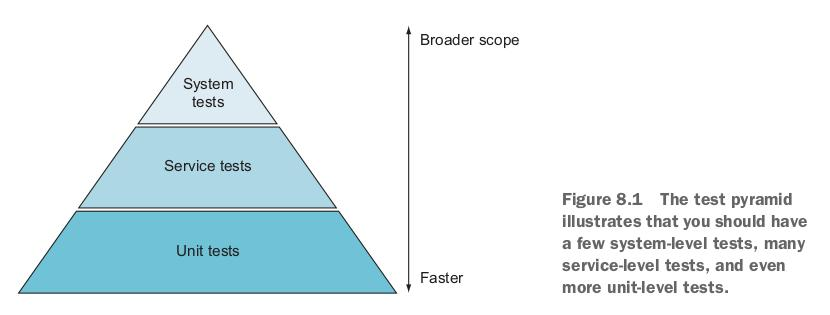
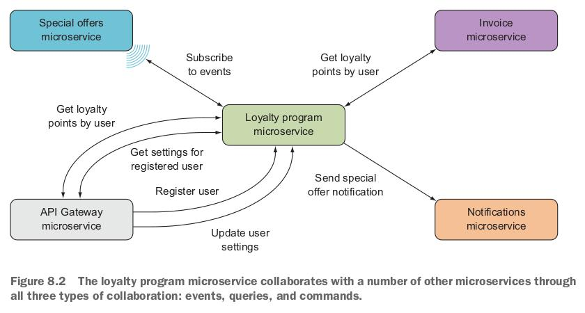
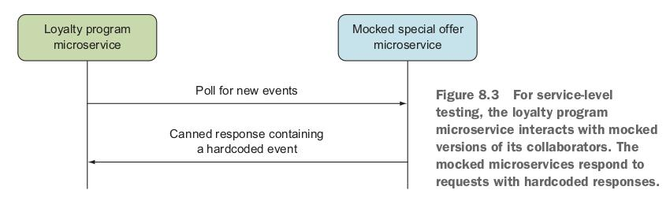
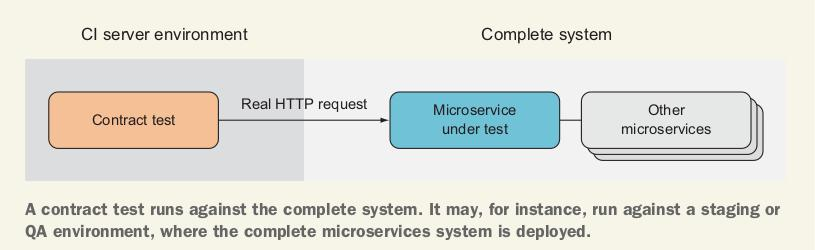
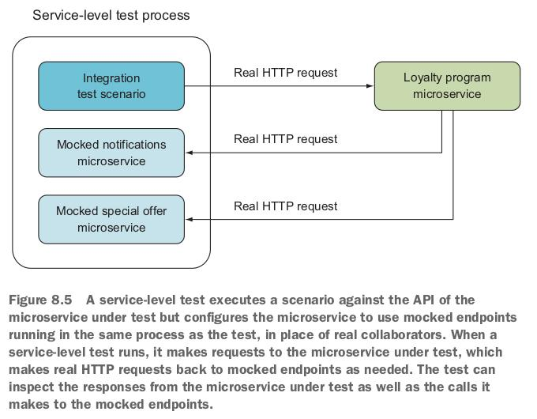

# 8. Writing tests for microservices

    - Writing good automated tests.
    (Написание хороших автоматизированных тестов).

    - Understanding the test pyramid and how it applies to microservices.
    (Понимание тестовой пирамиды и ее применимость к микросервисам).

    - Testing microservices from the outside.
    (Тестирование микросервисов извне).

    - Writing fast, in-process tests for endpoints
    (Написание быстрых in-process (внутрипроцесных) тестов для endpoints).

    - Using `Microsoft.AspNetCore.TestHost` for integration and unit tests
    (Использование `Microsoft.AspNetCore.TestHost` для интеграционых и юнит тестов).

## 8.1 What and how to test

### 8.1.1 The test pyramid: What to test in a microservices system



В этой книге показана test pyramid из трех уровней:

- System tests (верхний уровень). Тесты, которые охватывают всю систему микросервисов и
обычно реализуются через GUI.

- Service tests (средний уровень). Тесты, которые работают с одним микросервисом.
Тестируют его целиком.

- Unit tests (нижний уровень). Тесты, которые проверяют одну небольшую часть функциональности
в микросервисе - модульные (unit) тесты.

На тестовой пирамиде видно, что чем ближе к нижнему уровню, тем больше должно быть тестов.
На самом деле, количество тестов на каждом из уровней зависит от: размера системы, ее
сложности и стоимости отказов.

### 8.1.2 System-level tests: Testing a complete microservice system end to end

Характеристики system-level тестов:

- Широкий охват. Тестируют сразу наибольший объем кода.
- Если тест завершается ошибкой, не понятно где ее искать и в чем ее причина.
- Самые медленные.

Рекомендуется писать system-level тесты для тестирования success paths в наиболее важных
частях системы. Если необходимо, можно писать system-level тесты и для наиболее
важных failure сценариев.

### 8.1.3 Service-level tests: Testing a microservice from outside its process

Характеристики service-level тестов:

- Тесты взаимодействуйте с одним целым изолированным микросервисом
- Взаимодействующие микросервисы  заменяются mock'ами
- Service-level тестам взаимодействуют с тестируемым микросервисом извне.
- Данные тесты напрямую взаимодействуют с API микросервиса.
- Тесты service-level более точны, чем тесты system-level, т.к. они охватывают
только один микросервис.

Microservice mock'и:

- Содержат те же endpoints, что и реальный микросервис.
- Ответы (responses) hardcoded.

Тесты service-level тестируют сценарии, а не отдельные запросы.
То есть они делают последовательность запросов, которые вместе формируют сценарий.
Запросы, отправляемые тестируемым микросервисом в сервисы-mock'и, являются
реальными HTTP-запросами, а ответы - реальными HTTP-ответами.

Для теста loyalty program микросервиса:



можно создать mock версии микросервисов, с которыми он взаимодействует:



Тест service-level для микросервиса loyalty program может делать следующее:

1. Отправлять команду для создания пользователя.

2. Сделать запрос от loyalty program к mock версии микросервиса special offers. Затем
получить от последнего жестко запрограммированые события о новом специальном предложении.

3. Записывать любые команды, отправленные в микросервис notifications.
Проверять, что команда уведомления пользователя о новом специальном предложении была
отправлена.

Для тестовых вызовов endpoints, реализованных в при помощи MVC контроллеров,
используется библиотека `Microsoft.AspNetCore.TestHost`.
Эта библиотека позволяет вам писать тесты, которые вызывают
ASP.NET endpoints в памяти. Вызовы к тестируемому коду делаются через `TestServer` из
`Microsoft.AspNetCore.Mvc.Testing`.

Рекомендации:

- Писать service-level тесты для всех успешных сценариев (success paths) микросервиса.
Желательно покрыть все endpoint'ы микросервиса.

- По желанию и исходя из требований. Писать service-level тесты только для самых важных
failure сценариев.

#### Contract tests

Контрактный тест - это тест для определения, реализует ли
вызываемый микросервис контракт, ожидаемый вызывающей стороной (другим микросервисом).

Статья о contract tests: <https://martinfowler.com/bliki/ContractTest.html>

Контрактные тесты:

- написаны с точки зрения вызывающей стороны
- не должны знать о том, как реализованы тестируемые ими микросервисы
- не должны знать о других микросервисах, с которыми взаимодействут тестируемый микросервис

Неплохой идеей является автоматический запуск подобных тестов при каждом развертывании
тестируемого микросервиса.



### 8.1.4 Unit-level tests: Testing endpoints from within the process

Характеристики unit-level тестов:

- Тестируют только один микросервис
- Тестируют только часть микросервиса
- Самые быстрые среди всех тестов
- Идеальны для тестирования failure сценариев
- Легко обнаруживают ошибки из-за малого тестового покрытия

Два типа unit-level тестов:

- Используют реальную БД (*мое примечание: я бы не назвал это полноценными unit-тестами*)
- Используют in-memory БД

## 8.2 Testing libraries: `Microsoft.AspNetCore.TestHost` and `xUnit`

### 8.2.3 xUnit and Microsoft.AspNetCore.TestHost working together

Пример можно посмотреть тут: [chapter08/TestExample/](chapter08/TestExample/)

Тест вызывает endpoint GET в `TestController` и проверяет, что код возврата `200 OK`.

Тестируемый контроллер [TestController.cs](chapter08/TestExample/Sut/TestController.cs):

```csharp
public class TestController : ControllerBase
{
    // Endpoint used in the test
    [HttpGet("/")]
    public Task<OkResult> Get() => Task.FromResult(Ok());
}
```

Тесты [TestController_should.cs](chapter08/TestExample/SutTests/TestController_should.cs):

```csharp
public class TestController_should : IDisposable
{
    private readonly IHost _host;
    private readonly HttpClient _sut;

    // (1) - Create an ASP.NET host for the test endpoint.
    // (2) - Explicitly add the test controller to the service collection
    //       using a custom extension method.
    // (3) - Map all endpoints in the test controller.
    public TestController_should()
    {
        _host = new HostBuilder()           // (1)
            .ConfigureWebHost(host =>
                host.ConfigureServices(services =>
                    services.AddControllersByType(typeof(TestController)))  // (2)
            .Configure(appBuilder =>
                appBuilder
                    .UseRouting()
                    .UseEndpoints(opt => opt.MapControllers()))     // (3)
            .UseTestServer())
        .Start();

        _sut = _host.GetTestClient();
    }

    // (1) - Call the endpoint in the test controller.
    // (2) - Assert that the call succeeded.
    [Fact]
    public async Task respond_ok_to_request_to_root()
    {
        var actual = await _sut.GetAsync("/");                  // (1)
        Assert.Equal(HttpStatusCode.OK, actual.StatusCode);     // (2)
    }

    // (1) - Stop and dispose the ASP.NET host after the test is done.
    public void Dispose()
    {
        _host?.Dispose();       // (1)
        _sut?.Dispose();
    }
}
```

### Уточнения

1. Тестовый проект использует nuget `Microsoft.AspNetCore.TestHost`:

```text
dotnet add package Microsoft.AspNetCore.TestHost --version 6.0.4
```

2. `Dispose` в Xunit тестах вызывается после каждого теста. Если не сделать dispose для
`_host`, то тест может повиснуть.

3. Тест запускается из консоли при помощи `dotnet test`.

4. Вызов `_sut.GetAsync("/")` выполняет вызов endpoint контроллера `TestController`
через настоящий ASP.NET pipeline.

5. Строковый аргумент `"/"` - это относительный URL-адрес, на который делается fake
запрос.

6. В конфигурации теста используются самодельный метод расширения
`AddControllersByType` и класс `FixedControllerProvider`.

Метод `AddControllersByType` определяет, что является контроллером в MVC.
Создается `ControllerFeatureProvider`, который замещает дефолтную реализацию
`ControllerFeatureProvider` для MVC.

MVC использует `ControllerFeatureProvider` для распознавания контроллера.

[`MvcBuilderExtensions.cs`](chapter08/TestExample/SutTests/MvcBuilderExtensions.cs):

```csharp
public static class MvcBuilderExtensions
{
    // (1) - Make the service collection aware (знающие о) of controllers.
    // (2) - Get access to feature providers.
    // (3) - Remove the default controller provider feature.
    // (4) - Add a custom controller provider feature.
    public static IMvcBuilder AddControllersByType(
        this IServiceCollection services,
        params Type[] controllerTypes) =>
        services
            .AddControllers()                           // (1)
            .ConfigureApplicationPartManager(mgr =>     // (2)
            {
                mgr.FeatureProviders.Remove(            // (3)
                    mgr.FeatureProviders.First(f => f is ControllerFeatureProvider));
                mgr.FeatureProviders.Add(               // (4)
                    new FixedControllerProvider(controllerTypes));
            });
}
```

[`FixedControllerProvider.cs`](chapter08/TestExample/SutTests/FixedControllerProvider.cs):

```csharp
// Custom implementation of the controller provider.
public class FixedControllerProvider : ControllerFeatureProvider
{
    private readonly Type[] _controllerTypes;

    public FixedControllerProvider(params Type[] controllerTypes) =>
        _controllerTypes = controllerTypes;

    // Override the method used to identify controllers.
    protected override bool IsController(TypeInfo typeInfo) =>
        _controllerTypes.Contains(typeInfo);
}
```



## 8.3 Writing unit tests using Microsoft.AspNetCore.TestHost

Тестовый solution: [Ch08.sln](chapter08/main/Ch08.sln).

Здесь приведен пример написания unit тестов для [`LoyaltyProgram`](chapter08/main/LoyaltyProgram/).

Будут написаны тесты для 3-х endpoints:

- `GET /users/{userId}`. Получает представление `user`.
- `POST /users`. Ожидает представление `user` в body request'а и регистрирует его
в loyalty program.
- `PUT /users/{userId}`. Ожидает представление `user` в body request'а и обновляет уже
зарегистрированного пользователя в loyalty program.

Еще будут написаны тесты для event feed микросервиса loyalty program.

Что будет сделано:

- Создан тестовый проект для микросервиса loyalty program.
- Будут написаны тесты для endpoints с использованием `Microsoft.AspNetCore.TestHost`.

### 8.3.1 Setting up a unit-test project

1. Создание нового проекта
[`LoyaltyProgramUnitTests`](chapter08/main/LoyaltyProgramUnitTests/):

```text
dotnet new xunit -n LoyaltyProgramUnitTests
```

1. Структура всего [solution](chapter08/main/):

```text
Ch08.sln
Dockerfile
loyalty-program.yaml
|
|---EventConsumer
|       EventConsumer.csproj
|       Program.cs
|
|---LoyaltyProgram
|       appsettings.Development.json
|       appsettings.json
|       LoyaltyProgram.csproj
|       Program.cs
|       Startup.cs
|
|-------EventFeed
|           EventFeedController.cs
|           EventStore.cs
|-------Users
|           LoyaltyProgramSettings.cs
|           LoyaltyProgramUser.cs
|           UsersController.cs
|
|---LoyaltyProgramUnitTests
        LoyaltyProgramUnitTests.csproj
        UnitTest1.cs
```

3. Запуск тестов:

```text
dotnet test
```

4. В проект тестов добавить nuget пакеты:

- `Microsoft.AspNetCore.TestHost`
- `Microsoft.AspNetCore.Mvc.Testing` (для .NET 6, чтобы использовать `WebApplicationFactory`)

Reference на тестируемый проект:

```xml
<ItemGroup>
    <ProjectReference Include="..\LoyaltyProgram\LoyaltyProgram.csproj" />
</ItemGroup>
```

5. Дополнительно, для .NET 6. Добавить в [LoyaltyProgram.csproj](chapter08/main/LoyaltyProgram/LoyaltyProgram.csproj):

```xml
<ItemGroup>
    <InternalsVisibleTo Include="LoyaltyProgramUnitTests" />
</ItemGroup>
```

### 8.3.2 Using the TestServer and HttpClient to unit-test endpoints

Пример тестов endpoint. Здесь показана только инициализация тестового сервера и
тестового клиента. Полный код тестов см. в
['UserEndpoints_should.cs'](chapter08/main/LoyaltyProgramUnitTests/UserEndpoints_should.cs):

```csharp
// (1) - Real LoyaltyProgram startup.
// (2) - Use the test server so requests are in process.
// (3) - The host uses the test server to create a test HttpClient.
public class UserEndpoints_should : IDisposable
{
    // private readonly IHost _host;  // .NET 5.0
    private readonly WebApplicationFactory<Program> _app;
    private readonly HttpClient _sut;

    public UserEndpoints_should()
    {
        //// For NET 5.0
        // _host = new HostBuilder()
        //     .ConfigureWebHost(x => x
        //         .UseStartup<Program>()                   // (1)
        //         .UseTestServer())                        // (2)
        //     .Start();
        //
        // _sut = _host.GetTestClient();                    // (3)

        // For NET 6.0
        _app = new WebApplicationFactory<Program>()         // (1)
            .WithWebHostBuilder(x => x.UseTestServer());    // (2)

        _sut = _app.CreateClient();                         // (3)
    }

    // Тесты

    public void Dispose()
    {
        //// For NET 5.0
        // _host?.Dispose();
        // _sut?.Dispose();

        // For NET 6.0
        _app?.Dispose();
        _sut?.Dispose();
    }
}
```

### 8.3.3 Injecting mocks into endpoints

