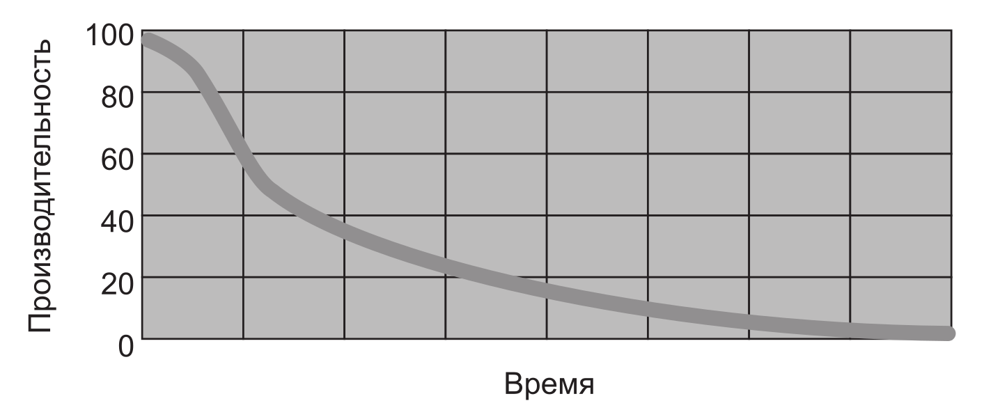
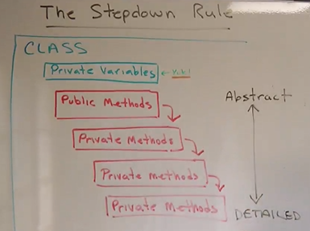
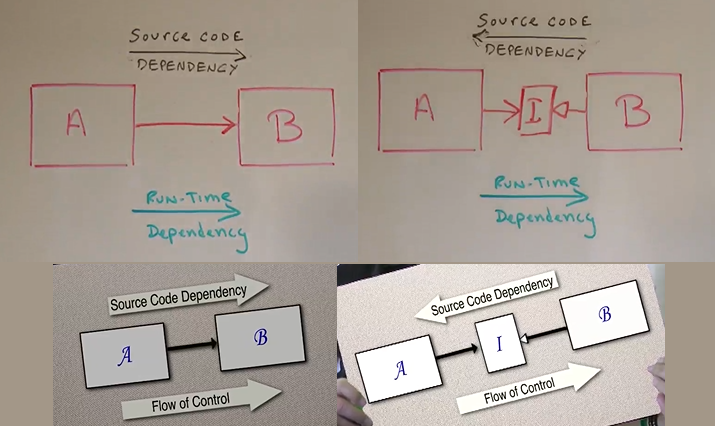
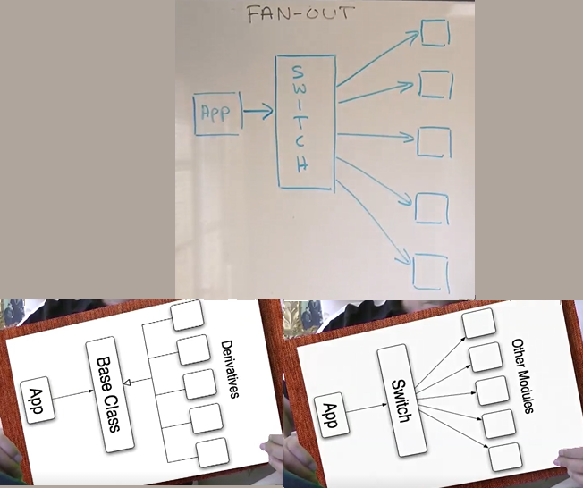
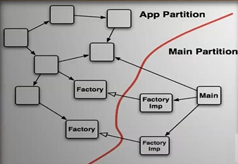

# Clean Code. Fundamentals

## Episode 1. Clean Code

### Does Clean Code Matter?

Чистый код имеет очень большое значение при долговременной разработке и поддержке больших
и сложных программных продуктов.

### The Productivity Trap (ловушка)

Productivity vs Time



Чем сложнее продукт, тем:

* Требуется все больше и больше времени на внедрение новых фич.
* Требуется все больше и больше времени на исправление багов.
* Затраты на разработку увеличиваются.
* Найм новых сотрудников не спасает (даже ухудшает) положение.

### The Big Redesign in the Sky

Переписывание продукта с нуля скорее всего не спасет положение:

* Старый продукт постоянно развивается - надо развивать также переписываемый продукт.
* Отсюда, новый продукт может не поддерживать какие-то фичи старого.

Переписывание программы может сработать для несложного и молодого продукта.

### Code Rot (протухание кода)

#### Rigidity (отсутствие гибкости)

Система сопротивляется изменениям.

Каждое изменение кода начинает приводить к новым багам в самых разных частях программного продукта.

Исправление бага вместо одного дня занимает несколько недель.

#### Fragility (хрупкость)

Поведение кода становится непредсказуемым после любого изменения.

Изменение в одном месте ПО, может изменить/сломать функционал в совершенно другом месте.

#### Inseparability (неделимость)

Невозможность переиспользования функционала в других частях, при разработке другого ПО.

#### Opacity (непрозрачность)

Сложночитаемый код ухудшает его поддержку.

#### Why does code Rot? (Почему код становится грязным?)

Дедлайны, откладывание "причесывания" кода на "когда-нибудь потом".
Естественно, что "когда-нибудь потом" никогда не наступает.

### The Boy Scout Rule

Оставляйте после себя место чище, чем оно было до вас.
После каждого изменения кода, старайтесь делать код вокруг чуть чище.

## Episode 2. Names

### Reveal Your Intent (Раскрывайте свои намерения)

* Если для имени требуется комментарий, то значит выбрано плохое имя.

*Плохо:*

```java
int d; // elapsed time in days;
```

*Хорошо:*

```java
int elapsedTimeInDays;
```

### Describe The Problem

* Если приходится лезть в код, где используется имя, чтобы узнать зачем оно нужно или о чем оно,
значит это плохое имя.

* Always choose names to communicate your intent. (Всегда выбирайте такие имена, чтобы сообщать о
своих намерениях.)

*Пример.* Непонятно, что это. И комментарий непонятен:

```java
/** Useful range constant. **/
public static final int INCLUDE_NONE = 0;

/** Useful range constant. **/
public static final int INCLUDE_FIRST = 1;

/** Useful range constant. **/
public static final int INCLUDE_SECOND = 2;

/** Useful range constant. **/
public static final int INCLUDE_BOTH = 3;
```

Лучше назвать эти константы (это интервалы) как-то так:

```text
Intervals!
(a, b) open
[a, b] closed
(a, b] open left
[a, b) open right
```

... и сделать такой enum:

```java
public enum DateInterval {
    OPEN,
    CLOSED,
    OPEN_LEFT,
    OPEN_RIGHT
}
```

### Avoid Disinformation

*Пример 1.* Неясное имя, которое ничего не разъясняет, а только путает.

```java
public abstract class SerialDate
```

Непонятно что такое "Serial", как оно применяется к "Date".

*Пример 2.* Неточное имя функции, параметра.

```java
public static String[] getMonths(final boolean shortened) {
    if (shortened) {
        return DATE_FORMAT_SYMBOLS.getShortMonths();
    }
    else {
        return DATE_FORMAT_SYMBOLS.getMonths();
    }
}
```

* Эта функция возвращает имена месяцев, но по ее имени это непонятно.
* Правильное ее название должно быть `getMonthNames`
* Параметр `shortened` также назван неправильно. Правильней было бы назвать `shortenedName`.
* Плюс, передача `bool` параметра это плохо (почему? - см. след. эпизоды).

*Пример 3.* Ошибка. Имя вообще означает не то, что описывает.

```java
public class Pair
{
    // ...
    public Pair(Object first, Object second, Object third)
    {
        // ...
    }
    // ...
}
```

### Pronounceable Names

* Имена должны быть произносимыми.
* Имена - инструменты для коммуникации, делайте их понятными для других.

*Примеры.* Как произнести это всё?

```text
PC-GWDA                     // Что это?
```

```java
public int getYYYY() {      // getYYYY?    Лучше назвать getYear.
    return this.year
}
```

```java
try {
    m_qdox.addSource(f);        // m_qdox - префиксы необязательны, имя невнятное
}
catch(ParseException e) {
    ppp("Cannot parse file "    // ppp?
}
```

Плохие имена для переменных:

```java
int qty_tests = 0;
int qty_pass_m = 0;
int qty_pass_s = 0;
int qty_skip = 0;
int qty_fail = 0;
```

### Avoid Encodings

* Избегайте зашифрованные имена.

* Избегайте префиксов, обозначающих тип данных. Сейчас IDE может показать тип данных для любой
переменной.

* Компилятор и Unit тесты позволяют избежать неправильного использования переменной, метода, класса.

* Просто используйте имена.

*Примеры* ненужных префиксов. (*Мое примечание: некоторые моменты здесь спорны*)

Prefix| Type                       | Example                        |
------|----------------------------|--------------------------------|
C     | Class                      | `CAccount`                     |
I     | Interface                  | `IAccount`                     |
p     | pointer                    | `pAccount`                     |
s     | string                     | `sName`                        |
sz    | null terminated            | `szName`                       |
psz   | pointer to null terminated | `pszName`                      |

### Parts of Speech

#### Именование классов и переменных

Классы и переменные - *существительные* (nouns)

*Примеры* имен классов/переменных: `Account`, `MessageParser`

* **Игнорируйте** слова, которые "создают шум": `Manager`, `Processor`, `Data`, `Info`.

#### Именование методов

Методы - *глаголы* (verbs)

*Примеры* имен методов:

```java
postPayment(payment);
Money price = getPrice();
```

#### Экземляры классов

Экземляры классов - *существительные* (nouns)

Экземляры классов часто повторяют имя класса, объектами которых они являются.

#### Bool переменные и методы, которые возвращают bool

`bool` переменная должна быть записана как *predicate*.

*Примеры*:

```java
boolean isEmpty;
boolean isTerminated;
```

Все это для того, чтобы `bool` переменная хорошо читалась с `if`:

```java
if (isEmpty) {
    if (Payment.isPostable())
        postPayment(payment);
}
```

Методы, которые возвращают `bool`, также должны быть названы как *predicate*.
Тоже для комфортного чтения с `if`:

```java
if (Payment.isPostable()) { 
    // ...
}
```

#### Свойства (из C#)

Свойства должны быть *существительные* (nouns).

Если свойство `bool`, то должно быть названо как *predicate*.

#### Enums

Перечисления должны быть названы как *прилагательные* (adjectives).

Пример:

```java
enum Color { RED, GREEN, BLUE };
enum Status { PENDING, CLOSED, CANCELLED };
enum Size { SMALL, MEDIUM, LARGE };
```

### The Scope Length Rule

* Переменные, которые имеют большой scope, должны иметь длинное имя.
* Переменные, которые имеют малый scope, могут иметь короткое имя. Даже аббревиатуру или вообще,
состоять из одного символа.
* Публичные методы/функции с большим scope, должны иметь короткие convenient (комфортные/удачные)
имена.
* Private методы/функции с малым scope, должны иметь длинные говорящие имена.
* Публичные классы с большим scope, должны иметь короткие convenient (комфортные/удачные) имена.
* Private nested классы с малым scope, должны иметь длинные говорящие имена.
* Будьте внимательны с унаследованными классами с большим scope: они добавляют прилагательное
к существительному и также не должны иметь слишком большую длину.

*Пример* унаследованного класса:

```java
// Базовый класс
Account

// Класс-наследник
SavingsAccount
```

### Recap & Conclusion

1. Choose your names thoughtfully (вдумчиво).
2. Communicate your intent. (Сообщайте о своем намерении.)
3. Avoid Disinformation
  * Не позволяйте именам быть "грязными".
  * Не позволяйте смыслу быть размытым.
  * Имя должно соответствовать своему назначению.
4. Pronounceable Names
  * Используйте произвносимые имена
5. Avoid encodings
  * Избегайте сокращений
  * Избегайте префиксов
6. Choose Parts of Speech Well.
  * Классы, переменные - существительные
  * Методы - глаголы
  * bool - предикаты
7. The Scope Rule
  * Переменные, которые имеют большой scope, должны иметь длинное имя.
  * Переменные, которые имеют малый scope, могут иметь короткое имя (даже 1 символ).
  * Публичные методы/функции/классы с большим scope, должны иметь короткие имена.
  * Private методы/функции/классы с малым scope, должны иметь длинные говорящие имена.

## Episode 3. Functions

### Overview

Функция должна делать только одну операцию (thing) и делать ее хорошо.

### The First Rule of Functions

* Они должны быть небольшими. Насколько? **Четыре** - **пять** **строчек**, может быть **шесть**
**строк**.

10 строк - уже большая функция.

* В четырех строках не так много возможностей организовать большие отступы.

* Из предыдущего эпизода: private функции внутри класса будут иметь длинные имена, т.к. scope у них
небольшой.

* Если в методе есть несколько блоков м каждый из них работает с общими параметрами/аргументами,
то скорее всего этот метод можно превратить в класс.

Класс по сути - набор методов, каждый из которых работает с общими полями класса.

#### Рефакторинг

*Примечание*: в соседнем примере упоминается [Characterization test](https://en.wikipedia.org/wiki/Characterization_test#:~:text=In%20computer%20programming%2C%20a%20characterization,unintended%20changes%20via%20automated%20testing.)

Эти тесты постоянно гоняются во время рефакторинга, чтобы показать что мы ничего не сломали.
Плюс могут постоянно гоняться unit-тесты, если такие возможно написать.

**Шаг 1**. Выделение класса из метода. (Рефакторинг в IDE Extract Method Object).
Как-нибудь назовем класс (потом дадим более осмысленное имя).

**Шаг 2**. Выделение параметров/аргументов в поля (fields) класса.

**Шаг 3**. Поиск похожих кусков кода, выделение из них отдельных методов (возможно
параметризируемых).

**Шаг 4**. Все `if` вызывают только 1 строку, в `if`'ах нет блоков кода.

**Шаг 5**. Переименование класса и главного public метода для более точного описания цели создания
данного класса.

Результат рефакторинга - класс, который содержит один public метод с коротоким именем и множеством
private методов с длинными именами. Все методы имеют малый размер (~4-6 строк).

### Are you out of your mind?

Но:

* Не усложняем ли мы таким образом наш первоначальный код?
* Не заблудимся ли мы среди "леса" маленьких функций?

#### The Geography Metaphor

Ориентироваться среди множества функций/методов помогает грамотное именование методов, классов и
namespace'ов.

#### The Bedroom Metaphor

Аналогия: в комнате у тебя может быть беспорядок, но ты в нем хорошо ориентируешься.
Тебе комфортно. Но если в твоей комнате будет еще один человек, то ему будет некомфортно -
такая ситация малопригодна для совместного существования.

Для порядка мы начинаем сортировать вещи, раскладывать их по шкафам, коробкам, делать поясняющие
надписи и т.п.

#### Efficiency

Раньше вызов метода и передача туда параметра было довольно дорогостоящей операцией. Сейчас
это копейки, поэтому количество вызовов методов стало не так важно.

Гораздо важнее - читаемость кода.

#### Coding Time

Рефакторинг занимает какое-то время. Но читаемость позволить существенно упростить понимание кода.
Упростить понимание кода для себя, когда ты влезешь в него после длительного перерыва.

На самом деле, рефакторинг занимает не так уж и много времени, но выгода колоссальная.

### Where do classes go to hide?

Классы скрываются в функциях большого размера.

Из больших функций всегда можно выделить один или несколько классов.

#### Рефакторинг

Видео пример. Используются шаги рефакторинга, описанные в одном из предыдущих разделов.
В результате из одного метода получается три небольших класса.

### One Thing!

Функция должна делать только одну операцию (thing) и делать ее хорошо. Но что такое это за одна
операция?

* Если функция состоит из нескольких секций, она определенно делает несколько операций (things).

* Если функция обращается к разным уровням абстракции, она определенно делает несколько операций
(things). Функция не должна пересекать разные уровни абстракции.

Но понятие абстракция может быть размытым. Нужно более четкое определение выполняет ли функция
только что-то одно или нет. Решение ниже.

### Extract Till You Drop! (Выделяй функции пока не сможешь выделить больше ни одной)

* Extract Till You Drop! Очевидный и очень действенный совет.

Результатом будет куча функций длиной в ~4 строки.

* В блоках `if`, `while` только одна строка. Если есть фигурные скобки `{` `}`, значит еще не все
функции выделены.

* Из конструкций `switch` можно выделить отдельные классы (полиморфизм).
(Рефакторинг в IDE "Push Members Down").

#### Рефакторинг

Видео пример. Используются шаги рефакторинга, описанные в одном из предыдущих разделов.

Упоминаются *Завистливые функции* ([Feature Envy](https://refactoring.guru/ru/smells/feature-envy))

### Conclusion

1. Функции должны быть небольшими (~4 строки).
2. Они экономят время читателю.
3. Функции должны делать только одну операцию (thing).
4. Чтобы гарантированно добиться пункта 3, надо делать **Extract Till You Drop!**.

## Episode 4. Function Structure

### Overview

Эпизод про вредные конструкции в функциях.

### Arguments

#### Three Arguments Max

Функции должны иметь как можно меньшее количество аргументов. 0 аргументов - the best,
1 - нормально, 2 - нуу... более-менее нормально, 3 - уже спорное количество.

*Проблема* с 3 и более аргументов:

* Сложно запоминать порядок аргументов.
* 3 аргумента? Почему эта функция не является классом?

Тоже самое касается и конструктора класса.

Проблему с бОльшим количеством полей, которые необходимо задать в классе, дядюшка Боб решает
при помощи setter functions. Говорит, что Unit тесты обезопасят его от ошибок.
*Мое примечание: Ну их, эти setter'ы. Это ненадежный подход.*

#### No Boolean Arguments Ever

* Передавая boolean параметр в функцию мы сразу говорим, что делаем функцию, которая делает две
операции.

Вместо этого надо написать две отдельные функции.

* Использование bool параметров является источником потенциальных ошибок.

* Функция, которая принимает 2 boolean параметра, делает 4 операции. Более того, в каком порядке
передавать эти параметры?

#### Innies not Outies

* No output arguments please.

Люди не ожидают выходные данные на месте аргумента. Надо возвращать данные только как return value.

#### The Null Defense

* Передавать `null` в функцию **плохо**.

* Ожидать передачи `null` в функии **плохо**.

* В случае передачи `null` ожидается двойное поведение функции (как в случае с `bool`).

Вместо этого надо написать две отдельные функции.

* Defensive programming is the smell. Для внутренней системы.

Это значит недостаточное покрытие кода unit тестами. Лучшая защита - это тесты.

* В public частях системы применяется Defensive programming.

Защита против неверных вызовов методов "снаружи".

### The Stepdown Rule

* Функции должны читаться сверху вниз.

Аналог - газетная/журнальная статья.

Основной public метод наверху, все остальные private методы, которые он вызывает находятся ниже.

Сверху более abstract методы, снизу более detailed.

* Каждая children функция находится ниже родительской в порядке очереди вызовов:

```text
f1() {
  f2_1()
  f3_1()
  f4_1()
}

    f2_1() {
      f2_2(),
      f2_3()
    }

        f2_2() {
          f2_4()
        }

            f2_4() { ... }

        f2_3() { ... }

    f3_1() { ... }

    f4_1() { ... }
```

Ну или так:




* *(Спорный пункт, даже Uncle Bob сомневается)* если несколько public методов в классе,
то иерархия такая:

```text
public1 -> private1 -> ... -> private1 -> public2 -> private2 -> ... -> private2 -> public3 -> ...
```

### Switches and Cases

Структура `switch` может нарушать направление зависимостей между модулями в приложении.
Большая `if-else` конструкция может всети себя также.

#### Немного про зависимости. Как ОО разруливает проблему

Модуль `A` зависит от модуля `B` (вызывает его метод). `B` plugin для `A`.

Если ввести интерфейс `I`, то происходит инверсия (source code dependency):



Этот прием позволяет отдельно собирать модули `A` и `B`.

#### Про switch. Fanout problem

`switch` ссылается на множество модулей, аналогично случаю, приведенному выше:

Два возможных решения:

* Из `switch` вызывать другие модули через интерфейс (инверсия зависимости).
* Перенести `switch` в модуль, у которого нет зависимостей.



#### Немного по архитектуре приложения. Dependency Injection

* **App partition** a bunch of different modules, this should not have dependencies from the Main
partition.

Основной код (ядро) приложения здесь.

* **Main partition** keep it small and with limited subdivision, this part depends on the
application. This section is a plugin to the application.

Меньшее количество кода. Тут находятся фабрики, данные конфигурации.



Направление зависимостей через границу между partitions должно быть только в одном направлении.

* Runtime and source code dependencies should point towards the direction of the application.

* There should be only a few entry points from main into the application, let main do rest
of the work with factories implementations and strategies patterns (abstract interfaces or
skeletons will be in the app side) and nothing that happens in the application should
affect the main partition.

* Инверсия зависимостей также позволяет независимо разрабатывать функционал ядра приложения и
его плагинов.

### Paradigms

На текущий момент активно используются следующие парадигмы:

* Functional Programming
* Structured Programming
* Object-Oriented Programming

### Functional Programming

* Нет операции присваивания.

Вместо присванивания значения переменной мы передаем ее в функцию вместо аргумента.
*(Мое примечание: не досказано до конца)*

Вместо циклов используется рекурсия. *(Мое примечание: не совсем так)*

* В функциональном программировании чистые функции.  *(Мое примечание: не все такие)*

#### Side Effect. Temporal Coupling (связь по времени)

* Функции обладают свойством Temporal Coupling - некоторые из них требуется вызывать в определенной
последовательности.

* Особенно часто temporal coupling можно наблюдать у парных функций: (`open`/`close`, `new`/`free`,
`lock`/`unlock`, `set`/`get`, etc.

* Contain side effect code so you don't forget to close, free, unlock, etc.

* Temporal Coupling (особенно неявные/скрытые) часто является причиной ошибок.

Пример. Работа с файлом:

```java
// Bad
open (myFile, new FileCommand()) {            // Файл не был закрыт
  public void process(File f) {
    // ... process file here
  }
}

// Good
public void open(File f, FileCommand c) {     // Файл открыт, работа с ним, файл закрыт.
  f.open();
  c.process(f);
  f.close();
}
```

#### Command Query Separation (CQS)

Задача не избегать side effect, а стараться сгруппировать их в определенном месте.

Одно из таких решений **CQS**:

* `Command` - меняет состояние системы и ничего не возвращает. В случае ошибки кидает исключение.

* `Query` - не меняет состояние системы. Возвращает результат вычисления или состояние системы.

Пример: Getter - это Query, Setter - это Command.

*Пример*:

```java
int f();    // Query      -- No side effects
void g();   // Command    -- Side effect
```

Плюс разделения: по сигнатуре метода/функции видно, есть ли у нее side effect.

*Пример* неопределнной функции с точки зрения CQS:

```java
User u = authorizer.login(username, password);
```

Почему `login` возвращает пользователя? Может переделать функционал `authorizer` и сделать
как-то так?:

```java
User u = authorizer.getUser(username);
```

Может быть `User` возвращается как признак удачного выполнения Command, а `null` если Command'а
не была выполнена. Но лучше вместо возврата ошибки кидать исключение (будет далее).

Команда должна возвращать `void`.

Этот же пример более наглядно:

```python
# Плохо
class Auth():
    def login(username, pass):
        # Call code that returns if login was possible here
        login_successful = True
        if login_successful:
            return User(username)
        else:
            return None

authorize = Auth()
user = authorize.login(username, password)

# Хорошо
class Auth():
    def login(username, pass):
        # Call code that returns if login was possible here
        login_successful = True
        if not login_successful:
            raise Exception

authorize = Auth()
authorize.login(username, password)
user = authorize.get_user(username)
```

*Пример* *(Мое примечание: не очень внятный)*. Иногда при multithreading требуется читать
предыдущее состояние вместе с установкой нового. И эту операцию невозможно разделить
на две отдельные:

```java
oldBlah = setBlah(newBlah);
...
setBlah(oldBlah);
```

Решение - passing a block:

```java
withBlah(newBlah, someBlahCommand)
```

#### Tell Don't Ask

* Экстремальный случай: avoid queries all together. Говорить объектам что делать, но не спрашивать
ничего об их состоянии.

```java
if (user.isLoggedIn())
  user.execute(command)
else
  annunciator.promtLogin();
```

Будет ли он лучше, если переписать его с исключениями?

```java
try
  user.execute(command);
catch (User.NotLoggedIn e)
  annunciator.promptLogin();
```

А еще лучше, пускай объект `user` целиком заботится о том, что вызывать:

```java
user.execute(command, annunciator);
```

* Множество Query функций могут выйти и под контроля.

*Пример*. Также известно как "Train wrecks" (крушение позездов):

```java
o.getX()
  .getY()
    .getZ()
      .doSomething();
```

Это прямое нарушение принципа "Tell Don't Ask".

Лучше:

```java
o.DoSomething();
```

Цепочки queries (Train wrecks) нарушают закон Деметры (The Law of Demeter).

#### The Law of Demeter (закон Деметры)

*The Law of Demeter* - плохо, когда функция знает о всей структуре системы. Функция должна
иметь ограниченную область видимости/"знания".

Правила.

* Вы *можете* вызывать методы объекта если:
  * Объект был переданы в метод как аргумент.
  * Был создан в методе локально.
  * Находится внутри того же самого объекта, что и метод.
  * Глобальный объект.

* Вы *не можете* вызывать методы объекта если:
  * Объект возвращаются из предыдущего вызова метода. (например как: `o.getx().gety().do()`).

### Structured Programming
