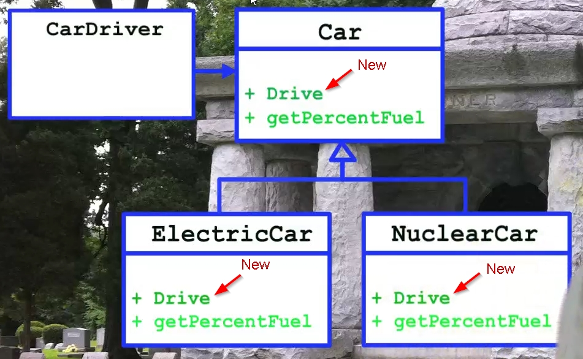

# Clean Code. Fundamentals

## Episode 1. Clean Code

### Does Clean Code Matter?

Чистый код имеет очень большое значение при долговременной разработке и поддержке больших
и сложных программных продуктов.

### The Productivity Trap (ловушка)

Productivity vs Time


Чем сложнее продукт, тем:

* Требуется все больше и больше времени на внедрение новых фич.
* Требуется все больше и больше времени на исправление багов.
* Затраты на разработку увеличиваются.
* Найм новых сотрудников не спасает (даже ухудшает) положение.

### The Big Redesign in the Sky

Переписывание продукта с нуля скорее всего не спасет положение:

* Старый продукт постоянно развивается - надо развивать также переписываемый продукт.
* Отсюда, новый продукт может не поддерживать какие-то фичи старого.

Переписывание программы может сработать для несложного и молодого продукта.

### Code Rot (протухание кода)

#### Rigidity (отсутствие гибкости)

Система сопротивляется изменениям.

Каждое изменение кода начинает приводить к новым багам в самых разных частях программного продукта.

Исправление бага вместо одного дня занимает несколько недель.

#### Fragility (хрупкость)

Поведение кода становится непредсказуемым после любого изменения.

Изменение в одном месте ПО, может изменить/сломать функционал в совершенно другом месте.

#### Inseparability (неделимость)

Невозможность переиспользования функционала в других частях, при разработке другого ПО.

#### Opacity (непрозрачность)

Сложночитаемый код ухудшает его поддержку.

#### Why does code Rot? (Почему код становится грязным?)

Дедлайны, откладывание "причесывания" кода на "когда-нибудь потом".
Естественно, что "когда-нибудь потом" никогда не наступает.

### The Boy Scout Rule

Оставляйте после себя место чище, чем оно было до вас.
После каждого изменения кода, старайтесь делать код вокруг чуть чище.

## Episode 2. Names

### Reveal Your Intent (Раскрывайте свои намерения)

* Если для имени требуется комментарий, то значит выбрано плохое имя.

*Плохо:*

```java
int d; // elapsed time in days;
```

*Хорошо:*

```java
int elapsedTimeInDays;
```

### Describe The Problem

* Если приходится лезть в код, где используется имя, чтобы узнать зачем оно нужно или о чем оно,
значит это плохое имя.

* Always choose names to communicate your intent. (Всегда выбирайте такие имена, чтобы сообщать о
своих намерениях.)

*Пример.* Непонятно, что это. И комментарий непонятен:

```java
/** Useful range constant. **/
public static final int INCLUDE_NONE = 0;

/** Useful range constant. **/
public static final int INCLUDE_FIRST = 1;

/** Useful range constant. **/
public static final int INCLUDE_SECOND = 2;

/** Useful range constant. **/
public static final int INCLUDE_BOTH = 3;
```

Лучше назвать эти константы (это интервалы) как-то так:

```text
Intervals!
(a, b) open
[a, b] closed
(a, b] open left
[a, b) open right
```

... и сделать такой enum:

```java
public enum DateInterval {
    OPEN,
    CLOSED,
    OPEN_LEFT,
    OPEN_RIGHT
}
```

### Avoid Disinformation

*Пример 1.* Неясное имя, которое ничего не разъясняет, а только путает.

```java
public abstract class SerialDate
```

Непонятно что такое "Serial", как оно применяется к "Date".

*Пример 2.* Неточное имя функции, параметра.

```java
public static String[] getMonths(final boolean shortened) {
    if (shortened) {
        return DATE_FORMAT_SYMBOLS.getShortMonths();
    }
    else {
        return DATE_FORMAT_SYMBOLS.getMonths();
    }
}
```

* Эта функция возвращает имена месяцев, но по ее имени это непонятно.
* Правильное ее название должно быть `getMonthNames`
* Параметр `shortened` также назван неправильно. Правильней было бы назвать `shortenedName`.
* Плюс, передача `bool` параметра это плохо (почему? - см. след. эпизоды).

*Пример 3.* Ошибка. Имя вообще означает не то, что описывает.

```java
public class Pair
{
    // ...
    public Pair(Object first, Object second, Object third)
    {
        // ...
    }
    // ...
}
```

### Pronounceable Names

* Имена должны быть произносимыми.
* Имена - инструменты для коммуникации, делайте их понятными для других.

*Примеры.* Как произнести это всё?

```text
PC-GWDA                     // Что это?
```

```java
public int getYYYY() {      // getYYYY?    Лучше назвать getYear.
    return this.year
}
```

```java
try {
    m_qdox.addSource(f);        // m_qdox - префиксы необязательны, имя невнятное
}
catch(ParseException e) {
    ppp("Cannot parse file "    // ppp?
}
```

Плохие имена для переменных:

```java
int qty_tests = 0;
int qty_pass_m = 0;
int qty_pass_s = 0;
int qty_skip = 0;
int qty_fail = 0;
```

### Avoid Encodings

* Избегайте зашифрованные имена.

* Избегайте префиксов, обозначающих тип данных. Сейчас IDE может показать тип данных для любой
переменной.

* Компилятор и Unit тесты позволяют избежать неправильного использования переменной, метода, класса.

* Просто используйте имена.

*Примеры* ненужных префиксов. (*Мое примечание: некоторые моменты здесь спорны*)

Prefix| Type                       | Example                        |
------|----------------------------|--------------------------------|
C     | Class                      | `CAccount`                     |
I     | Interface                  | `IAccount`                     |
p     | pointer                    | `pAccount`                     |
s     | string                     | `sName`                        |
sz    | null terminated            | `szName`                       |
psz   | pointer to null terminated | `pszName`                      |

### Parts of Speech

#### Именование классов и переменных

Классы и переменные - *существительные* (nouns)

*Примеры* имен классов/переменных: `Account`, `MessageParser`

* **Игнорируйте** слова, которые "создают шум": `Manager`, `Processor`, `Data`, `Info`.

#### Именование методов

Методы - *глаголы* (verbs)

*Примеры* имен методов:

```java
postPayment(payment);
Money price = getPrice();
```

#### Экземляры классов

Экземляры классов - *существительные* (nouns)

Экземляры классов часто повторяют имя класса, объектами которых они являются.

#### Bool переменные и методы, которые возвращают bool

`bool` переменная должна быть записана как *predicate*.

*Примеры*:

```java
boolean isEmpty;
boolean isTerminated;
```

Все это для того, чтобы `bool` переменная хорошо читалась с `if`:

```java
if (isEmpty) {
    if (Payment.isPostable())
        postPayment(payment);
}
```

Методы, которые возвращают `bool`, также должны быть названы как *predicate*.
Тоже для комфортного чтения с `if`:

```java
if (Payment.isPostable()) { 
    // ...
}
```

#### Свойства (из C#)

Свойства должны быть *существительные* (nouns).

Если свойство `bool`, то должно быть названо как *predicate*.

#### Enums

Перечисления должны быть названы как *прилагательные* (adjectives).

Пример:

```java
enum Color { RED, GREEN, BLUE };
enum Status { PENDING, CLOSED, CANCELLED };
enum Size { SMALL, MEDIUM, LARGE };
```

### The Scope Length Rule

* Переменные, которые имеют большой scope, должны иметь длинное имя.
* Переменные, которые имеют малый scope, могут иметь короткое имя. Даже аббревиатуру или вообще,
состоять из одного символа.
* Публичные методы/функции с большим scope, должны иметь короткие convenient (комфортные/удачные)
имена.
* Private методы/функции с малым scope, должны иметь длинные говорящие имена.
* Публичные классы с большим scope, должны иметь короткие convenient (комфортные/удачные) имена.
* Private nested классы с малым scope, должны иметь длинные говорящие имена.
* Будьте внимательны с унаследованными классами с большим scope: они добавляют прилагательное
к существительному и также не должны иметь слишком большую длину.

*Пример* унаследованного класса:

```java
// Базовый класс
Account

// Класс-наследник
SavingsAccount
```

### Recap & Conclusion

1. Choose your names thoughtfully (вдумчиво).
2. Communicate your intent. (Сообщайте о своем намерении.)
3. Avoid Disinformation
  * Не позволяйте именам быть "грязными".
  * Не позволяйте смыслу быть размытым.
  * Имя должно соответствовать своему назначению.
4. Pronounceable Names
  * Используйте произвносимые имена
5. Avoid encodings
  * Избегайте сокращений
  * Избегайте префиксов
6. Choose Parts of Speech Well.
  * Классы, переменные - существительные
  * Методы - глаголы
  * bool - предикаты
7. The Scope Rule
  * Переменные, которые имеют большой scope, должны иметь длинное имя.
  * Переменные, которые имеют малый scope, могут иметь короткое имя (даже 1 символ).
  * Публичные методы/функции/классы с большим scope, должны иметь короткие имена.
  * Private методы/функции/классы с малым scope, должны иметь длинные говорящие имена.

## Episode 3. Functions

### Overview

Функция должна делать только одну операцию (thing) и делать ее хорошо.

### The First Rule of Functions

* Они должны быть небольшими. Насколько? **Четыре** - **пять** **строчек**, может быть **шесть**
**строк**.

10 строк - уже большая функция.

* В четырех строках не так много возможностей организовать большие отступы.

* Из предыдущего эпизода: private функции внутри класса будут иметь длинные имена, т.к. scope у них
небольшой.

* Если в методе есть несколько блоков м каждый из них работает с общими параметрами/аргументами,
то скорее всего этот метод можно превратить в класс.

Класс по сути - набор методов, каждый из которых работает с общими полями класса.

#### Рефакторинг

*Примечание*: в соседнем примере упоминается [Characterization test](https://en.wikipedia.org/wiki/Characterization_test#:~:text=In%20computer%20programming%2C%20a%20characterization,unintended%20changes%20via%20automated%20testing.)

Эти тесты постоянно гоняются во время рефакторинга, чтобы показать что мы ничего не сломали.
Плюс могут постоянно гоняться unit-тесты, если такие возможно написать.

**Шаг 1**. Выделение класса из метода. (Рефакторинг в IDE Extract Method Object).
Как-нибудь назовем класс (потом дадим более осмысленное имя).

**Шаг 2**. Выделение параметров/аргументов в поля (fields) класса.

**Шаг 3**. Поиск похожих кусков кода, выделение из них отдельных методов (возможно
параметризируемых).

**Шаг 4**. Все `if` вызывают только 1 строку, в `if`'ах нет блоков кода.

**Шаг 5**. Переименование класса и главного public метода для более точного описания цели создания
данного класса.

Результат рефакторинга - класс, который содержит один public метод с коротоким именем и множеством
private методов с длинными именами. Все методы имеют малый размер (~4-6 строк).

### Are you out of your mind?

Но:

* Не усложняем ли мы таким образом наш первоначальный код?
* Не заблудимся ли мы среди "леса" маленьких функций?

#### The Geography Metaphor

Ориентироваться среди множества функций/методов помогает грамотное именование методов, классов и
namespace'ов.

#### The Bedroom Metaphor

Аналогия: в комнате у тебя может быть беспорядок, но ты в нем хорошо ориентируешься.
Тебе комфортно. Но если в твоей комнате будет еще один человек, то ему будет некомфортно -
такая ситация малопригодна для совместного существования.

Для порядка мы начинаем сортировать вещи, раскладывать их по шкафам, коробкам, делать поясняющие
надписи и т.п.

#### Efficiency

Раньше вызов метода и передача туда параметра было довольно дорогостоящей операцией. Сейчас
это копейки, поэтому количество вызовов методов стало не так важно.

Гораздо важнее - читаемость кода.

#### Coding Time

Рефакторинг занимает какое-то время. Но читаемость позволить существенно упростить понимание кода.
Упростить понимание кода для себя, когда ты влезешь в него после длительного перерыва.

На самом деле, рефакторинг занимает не так уж и много времени, но выгода колоссальная.

### Where do classes go to hide?

Классы скрываются в функциях большого размера.

Из больших функций всегда можно выделить один или несколько классов.

#### Рефакторинг

Видео пример. Используются шаги рефакторинга, описанные в одном из предыдущих разделов.
В результате из одного метода получается три небольших класса.

### One Thing!

Функция должна делать только одну операцию (thing) и делать ее хорошо. Но что такое это за одна
операция?

* Если функция состоит из нескольких секций, она определенно делает несколько операций (things).

* Если функция обращается к разным уровням абстракции, она определенно делает несколько операций
(things). Функция не должна пересекать разные уровни абстракции.

Но понятие абстракция может быть размытым. Нужно более четкое определение выполняет ли функция
только что-то одно или нет. Решение ниже.

### Extract Till You Drop! (Выделяй функции пока не сможешь выделить больше ни одной)

* Extract Till You Drop! Очевидный и очень действенный совет.

Результатом будет куча функций длиной в ~4 строки.

* В блоках `if`, `while` только одна строка. Если есть фигурные скобки `{` `}`, значит еще не все
функции выделены.

* Из конструкций `switch` можно выделить отдельные классы (полиморфизм).
(Рефакторинг в IDE "Push Members Down").

#### Рефакторинг

Видео пример. Используются шаги рефакторинга, описанные в одном из предыдущих разделов.

Упоминаются *Завистливые функции* ([Feature Envy](https://refactoring.guru/ru/smells/feature-envy))

### Conclusion

1. Функции должны быть небольшими (~4 строки).
2. Они экономят время читателю.
3. Функции должны делать только одну операцию (thing).
4. Чтобы гарантированно добиться пункта 3, надо делать **Extract Till You Drop!**.

## Episode 4. Function Structure

### Overview

Эпизод про вредные конструкции в функциях.

### Arguments

#### Three Arguments Max

Функции должны иметь как можно меньшее количество аргументов. 0 аргументов - the best,
1 - нормально, 2 - нуу... более-менее нормально, 3 - уже спорное количество.

*Проблема* с 3 и более аргументов:

* Сложно запоминать порядок аргументов.
* 3 аргумента? Почему эта функция не является классом?

Тоже самое касается и конструктора класса.

Проблему с бОльшим количеством полей, которые необходимо задать в классе, дядюшка Боб решает
при помощи setter functions. Говорит, что Unit тесты обезопасят его от ошибок.
*Мое примечание: Ну их, эти setter'ы. Это ненадежный подход.*

#### No Boolean Arguments Ever. Никаких `bool` аргументов

* Передавая boolean параметр в функцию мы сразу говорим, что делаем функцию, которая делает две
операции.

Вместо этого надо написать две отдельные функции.

* Использование bool параметров является источником потенциальных ошибок.

* Функция, которая принимает 2 boolean параметра, делает 4 операции. Более того, в каком порядке
передавать эти параметры?

#### Innies not Outies. Никаких `out` аргументов

* No output arguments please.

Люди не ожидают выходные данные на месте аргумента. Надо возвращать данные только как return value.

#### The Null Defense. Никаких `null` аргументов

* Передавать `null` в функцию **плохо**.

* Ожидать передачи `null` в функии **плохо**.

* В случае передачи `null` ожидается двойное поведение функции (как в случае с `bool`).

Вместо этого надо написать две отдельные функции.

* Defensive programming is the smell. Для внутренней системы.

Это значит недостаточное покрытие кода unit тестами. Лучшая защита - это тесты.

* В public частях системы применяется Defensive programming.

Защита против неверных вызовов методов "снаружи".

### The Stepdown Rule. Функции должны читаться сверху вниз

* Функции должны читаться сверху вниз.

Аналог - газетная/журнальная статья.

Основной public метод наверху, все остальные private методы, которые он вызывает находятся ниже.

Сверху более abstract методы, снизу более detailed.

* Каждая children функция находится ниже родительской в порядке очереди вызовов:

```text
f1() {
  f2_1()
  f3_1()
  f4_1()
}

    f2_1() {
      f2_2(),
      f2_3()
    }

        f2_2() {
          f2_4()
        }

            f2_4() { ... }

        f2_3() { ... }

    f3_1() { ... }

    f4_1() { ... }
```

Ну или так:


* *(Спорный пункт, даже Uncle Bob сомневается)* если несколько public методов в классе,
то иерархия такая:

```text
public1 -> private1 -> ... -> private1 -> public2 -> private2 -> ... -> private2 -> public3 -> ...
```

### Switches and Cases

Структура `switch` может нарушать направление зависимостей между модулями в приложении.
Большая `if-else` конструкция может всети себя также.

#### Немного про зависимости. Как ОО разруливает проблему

Модуль `A` зависит от модуля `B` (вызывает его метод). `B` plugin для `A`.

Если ввести интерфейс `I`, то происходит инверсия (source code dependency):


Этот прием позволяет отдельно собирать модули `A` и `B`.

#### Про switch. Fanout problem

`switch` ссылается на множество модулей, аналогично случаю, приведенному выше:

Два возможных решения:

* Из `switch` вызывать другие модули через интерфейс (инверсия зависимости).
* Перенести `switch` в модуль, у которого нет зависимостей.


#### Немного по архитектуре приложения. Dependency Injection

* **App partition** a bunch of different modules, this should not have dependencies from the Main
partition.

Основной код (ядро) приложения здесь.

* **Main partition** keep it small and with limited subdivision, this part depends on the
application. This section is a plugin to the application.

Меньшее количество кода. Тут находятся фабрики, данные конфигурации.


Направление зависимостей через границу между partitions должно быть только в одном направлении.

* Runtime and source code dependencies should point towards the direction of the application.

* There should be only a few entry points from main into the application, let main do rest
of the work with factories implementations and strategies patterns (abstract interfaces or
skeletons will be in the app side) and nothing that happens in the application should
affect the main partition.

* Инверсия зависимостей также позволяет независимо разрабатывать функционал ядра приложения и
его плагинов.

### Paradigms

На текущий момент активно используются следующие парадигмы:

* Functional Programming
* Structured Programming
* Object-Oriented Programming

### Functional Programming

* Нет операции присваивания.

Вместо присванивания значения переменной мы передаем ее в функцию вместо аргумента.
*(Мое примечание: не досказано до конца)*

Вместо циклов используется рекурсия. *(Мое примечание: не совсем так)*

* В функциональном программировании чистые функции.  *(Мое примечание: не все такие)*

#### Side Effect. Temporal Coupling (связь по времени)

* Функции обладают свойством Temporal Coupling - некоторые из них требуется вызывать в определенной
последовательности.

* Особенно часто temporal coupling можно наблюдать у парных функций: (`open`/`close`, `new`/`free`,
`lock`/`unlock`, `set`/`get`, etc.

* Contain side effect code so you don't forget to close, free, unlock, etc.

* Temporal Coupling (особенно неявные/скрытые) часто является причиной ошибок.

Пример. Работа с файлом:

```java
// Bad
open (myFile, new FileCommand()) {            // Файл не был закрыт
  public void process(File f) {
    // ... process file here
  }
}

// Good
public void open(File f, FileCommand c) {     // Файл открыт, работа с ним, файл закрыт.
  f.open();
  c.process(f);
  f.close();
}
```

#### Command Query Separation (CQS)

Задача не избегать side effect, а стараться сгруппировать их в определенном месте.

Одно из таких решений **CQS**. Разделение функций на две группы:

* `Command` - меняет состояние системы и ничего не возвращает. В случае ошибки кидает исключение.

* `Query` - не меняет состояние системы. Возвращает результат вычисления или состояние системы.

Пример: Getter - это Query, Setter - это Command.

*Пример*:

```java
int f();    // Query      -- No side effects
void g();   // Command    -- Side effect
```

Плюс разделения: по сигнатуре метода/функции видно, есть ли у нее side effect.

*Пример* неопределнной функции с точки зрения CQS:

```java
User u = authorizer.login(username, password);
```

Почему `login` возвращает пользователя? Может переделать функционал `authorizer` и сделать
как-то так?:

```java
User u = authorizer.getUser(username);
```

Может быть `User` возвращается как признак удачного выполнения Command, а `null` если Command'а
не была выполнена. Но лучше вместо возврата ошибки кидать исключение (будет далее).

Команда должна возвращать `void`.

Этот же пример более наглядно:

```python
# Плохо
class Auth():
    def login(username, pass):
        # Call code that returns if login was possible here
        login_successful = True
        if login_successful:
            return User(username)
        else:
            return None

authorize = Auth()
user = authorize.login(username, password)

# Хорошо
class Auth():
    def login(username, pass):
        # Call code that returns if login was possible here
        login_successful = True
        if not login_successful:
            raise Exception

authorize = Auth()
authorize.login(username, password)
user = authorize.get_user(username)
```

*Пример* *(Мое примечание: не очень внятный)*. Иногда при multithreading требуется читать
предыдущее состояние вместе с установкой нового. И эту операцию невозможно разделить
на две отдельные:

```java
oldBlah = setBlah(newBlah);
...
setBlah(oldBlah);
```

Решение - passing a block:

```java
withBlah(newBlah, someBlahCommand)
```

#### Tell Don't Ask

* Экстремальный случай: avoid queries all together. Говорить объектам что делать, но не спрашивать
ничего об их состоянии.

```java
if (user.isLoggedIn())
  user.execute(command)
else
  annunciator.promtLogin();
```

Будет ли он лучше, если переписать его с исключениями?

```java
try
  user.execute(command);
catch (User.NotLoggedIn e)
  annunciator.promptLogin();
```

А еще лучше, пускай объект `user` целиком заботится о том, что вызывать:

```java
user.execute(command, annunciator);
```

* Множество Query функций могут выйти и под контроля.

*Пример*. Также известно как "Train wrecks" (крушение позездов):

```java
o.getX()
  .getY()
    .getZ()
      .doSomething();
```

Это прямое нарушение принципа "Tell Don't Ask".

Лучше:

```java
o.DoSomething();
```

Цепочки queries (Train wrecks) нарушают закон Деметры (The Law of Demeter).

#### The Law of Demeter (закон Деметры)

*The Law of Demeter* - плохо, когда функция знает о всей структуре системы. Функция должна
иметь ограниченную область видимости/"знания".

Правила.

* Вы *можете* вызывать методы объекта если:
  * Объект был переданы в метод как аргумент.
  * Был создан в методе локально.
  * Находится внутри того же самого объекта, что и метод.
  * Глобальный объект.

* Вы *не можете* вызывать методы объекта если:
  * Объект возвращаются из предыдущего вызова метода. (например как: `o.getx().gety().do()`).

### Structured Programming

Самая молодая из трех рассматриваемых парадигм.

Структурное программирование состоит из следующих простых операций:

* *Sequence* - Простое следование выполнения одного блока кода после другого.

* *Selection* - Boolean выражение, которое выбирает направление выполнения кода.

* *Iteration* - Зацикленное выполнение блока кода, пока не будет выполнено условие.


#### Свойства этих структур

* Эти три структуры образуют proofable код.

* Все эти структуры похожи: они имеют 1 точку входа и 1 точку выхода.

* Эти структуры компонуемы друг с другом.

* Любой модуль, который содержит любое количество этих структур будет иметь 1 вход сверху и 1 выход снизу. Даже целая система.

#### Early Returns

* Правило "1 вход сверху и 1 выход" **не запрещает** досрочно выйти из фунции, т.к. это не нарушает
структуру кода.

```java
// Нормально
private boolean nameIsInvalid(String name) {
  if (name.equals(""))
    return true;
  if (//...)
    return true;
  return false;
}
```

* Правило "1 вход сверху и 1 выход" **запрещает** досрочный выход (`break`) из цикла.
**Разрешается** использование `continue` внутри цикла, т.к. это не нарушает структуру кода.

```java
while (enumeration.hasMoreElements() && (i < length>)) {
  //..
  if (!name.endsWith(".jar"))
    continue;   // Нормально
  if (!name.equals(jarNames[i])) {
    break;      // Плохо
  }
  i++;
}
```

### Error Handling

#### Prefer Exceptions

* Возвращаемые ошибки загрязняют код (его логику).
* Исключения же оставляют код чистым.

#### Exceptions are for Callers

* Исключение должно иметь scope к классу, откуда выбрасывается. Uncle Bob определяет исключение
внутри класса, которое будет его выбрасывать.
* Исключение должно иметь как можно более информативное имя.
* Не рекомендуется использовать исключения из стандартных библиотек языка.

#### Use Unchecked Exceptions. (Для Java: наследуйте исключения от `RuntimeException`)

Проблема c Сhecked Exceptions, что они создают reverse dependency: Если в наследуемом классе
метод будет выбрасывать Сhecked Exception, то этот же метод необходимо будет поправить и в
родительском классе.

#### Хорошо названное и scoped исключение не требует передачи дополнительной информации

В очень редких случаях требуется передавать исключение с дополнительной информацией.

Пример созданных исключений из видео. (Определены и используются внутри класса `Stack`):

```java
public class Overflow extends RuntimeException {
}
public class Underflow extends RuntimeException {
}
public class IllegalCapacity extends RuntimeException {
}
```

#### Special Cases

Если требуется особое поведение от объекта (например stack с нулевой длиной) - лучше использовать
*Null Object Pattern*.

В *примере*, из класса `Stack` выделяется один интерфейс `Stack` и два класса его реализующие:
`BoundedStack` и `ZeroCapacityStack`.

Исключения и `ZeroCapacityStack` (private class) определены рядом с public классом `BoundedStack`.

В `BoundedStack` также есть static fabric method (конструктор сделан как private):

```java
public static Stack Make(int capacity) {
  if (capacity < 0)
    throw new IllegalCapacity();
  if (capacity == 0)
    throw new ZeroCapacityStack();
  return new BoundedStack(capacity);
}
```

#### Null is not an Error. Лучше бросить исключение вместо возврата `null`

Ни в коем случае не возвращать null, лучше создать новое исключение, специально для этого случая
и бросить его.

В *примере*, когда стек пустой, при попытке получить верхний элемент стека (операция `top`/`peek`)
выбрасывает исключение `Empty`.

#### Null is a Value

*(Мое примечание: хммм... что-то дядюшка Боб здесь намудрил)*

Пример, если в стеке не найден индекс элемента во его значению, то по соглашению в Java можно
вернуть значение индекса равное `-1`. Но товарищ, говорит, что именно в этом случае лучше
возвращать значение `null`. *(???)*

#### Trying is One Thing

Обработка ошибки - это одна операция и поэтому:

* Блок `try` должен быть один в функции и идти первым, сразу после ее объявления.
* В блоке `try` должен быть вызов только одной функции.
* Блок `catch` или `finally` должен быть последним в функции.

### Conclusion

* Функции должны иметь максимум 3 аргумента.
* Не передавать в функцию `bool` и `null` аргументы.
* Никаких output аргументов.
* The Stepdown Rule. Функции читаются сверху вниз.
* Про switch. Fanout problem. switch может нарушать dependency inversion. Решение
  * Использование интерфейсов.
  * Или располагать switch в модулях без зависимостей.
* *The Law of Demeter* - плохо, когда функция знает о всей структуре системы. Функция должна
иметь ограниченную область видимости/"знания".
* Command Query Separation (CQS). Функции делятся на две группы:
  * `Command` - меняет состояние системы и ничего не возвращает. В случае ошибки кидает исключение.
  * `Query` - не меняет состояние системы. Возвращает результат вычисления или состояние системы.
* Лучше бросать исключения, чем возвращать коды ошибок из функций.
  * Исключение должно иметь scope к классу, откуда выбрасывается и иметь как можно более
  информативное имя.
  * Use Unchecked Exceptions.
  * Ни в коем случае не возвращать null, лучше создать новое исключение, специально для этого случая
  и бросить его.
* Trying is One Thing. Функция должна содержать только блок try-catch-finally и ничего более.

## Episode 5. Form

### Comments

Лучшая замена комментариям - это грамотные наименования переменных, методов (функций) и классов.

#### Coding Standards

Код сам по себе должен отображать coding standard.

#### Comments should be Rare. (Комментарии должны быть редкими)

* Когда комментариев слишком много, они начинают засорять код.
* Комментарии должны быть редкими.
* Код сам должен описывать себя. Его структура, наименования и т.д.

#### Comments are Failures

* В современных ЯП код приложения можно сделать очень выразительным.
* Выразительный код не требует дополнительного комментирования. Комментарии в таком случае являются
ошибкой.

#### Comments are Lies (ложь)

* Со временем комментарии "протухают". Они могут сообщать неверную информацию (код поменялся -
комментарии поменять забыли).

* Про обновление комментариев часто забывают, т.к. они могут быть расположены в разных местах,
относительно обновляемого кода.

#### Good Comments

Иногда комментарии все же нужны.

* **Legal Comments**. (Юридические/лицензионные комментарии). Обычно расположены в верхней части
файлов.

* **Informative Comments**. (Информативные комментарии). Пример - описание регулярного выражения:

```java
// format matched kk:mm:ss EEE, MM dd, yyyy
Pattern timePattern = Pattern.compile("\\d*:\\d*:\\d*: \\w*, \\w* \\d*, \\d*");
```

* **Clarifications and Explanations of Intent**. (Разъяснения и пояснения замысла).

* **Warning of Consequences**. (Предупреждение о последствиях).

Можно использовать, но функция с хорошим именем будет лучше.

* **TODO Comments**.

* **Public API Documentation**.

Хорошая документация в API это здорово, особенно если будут хорошие имена функций.

#### Bad Comments

* **Mumbling**. (Бормотанье).

Не говорите сами с собой в комментариях. Никакой лирики.

* **Redundant Explanations**. (Излишние объяснения).

Если добавляете комментарий, то добавляйте что-то новое, чего нет в коде. Здесь применим
принцип DRY.

* **Mandated Redundancy**. (Обязательное резервирование).

*(?) Обязательное комментирование параметров, которые не требуют комментариев (?)*

```java
/**
 * @param title The title of the CD
 * @param author The author of the CD
 * @param tracks The number of tracks on the CD
 * @param durationInMinutes The duration of the CD in minutes
 */
public void addCd(String title, String author, int tracks, int durationInMinutes) {
  //...
}
```

* **Плохие/неточные комментарии**.

Позаботьтесь об этих комментариях. Либо исправьте, либо удалите их.

* **Journal Comments**. (Изменения в документе).

Не нужны, т.к. есть система контроля версий. Удалять.

* **Noise Comments**.

Плохо. Удалять комментарии типа таких:

```java
/**
 * Default constructor
 */
protected SerialDate() {
}

/** The name. */
private String name;

/** The version. */
private String version;
```

* **Big Banner Comments**.

Маркеры позиций, большие комментарии в виде баннеров.

* **Closing Brace Comments**. (Комментирование закрывающих скобок).

Не нужно. IDE поможет со скобками.

* **Attribution Comments**. (Комментарии об авторстве).

Не нужно. Система контроля версий все помнит.

* **HTML in Comments**.

HTML плохо читаем как комментарии в коде.

* **Non-Local Information**.

Комментарии для кода, расположенного совершенно в другом месте чревато "протуханием" и ошибками
в будущем.

* **Закоментированный код**.

Сразу удалять закомментированный код. Не разбираться, что он делал и зачем он был нужен.
Система контроля версий при случае позволит его восстановить.

### Formatting

Форматирование кода очень важно.

#### File Size

* Smaller is better. Keep your files size small.
* Желательно делать файлы преимущественно длиной 50-100 строк. Максимум около 500 строк.
* Подход TDD способствует написанию небольших классов.

#### Vertical Formatting

**Общее правило**: близкие по использованию, принадлежности друг другу части кода
должны располагаться как можно ближе (вертикально) друг к другу.

* Всегда используйте одинаковое количество строк для отступа.
* Например, методы разделяются одной пустой строкой.
* Методы отделяются одной строкой от переменных класса.
* Группы `public` и `private` переменных класса также отделяются одной пустой строкой.

* Внутри метода:
  * Отделение переменных от остального кода пустой строкой.
  * Отделение разных topic'ов кода метода друг от друга пустой строкой.
    * Например: блок `if` отделяется от `while`-цикла пустой строкой.
  * Для небольших функций использование пустых строк не требуется.

#### Horizontal Formatting

**Основное правило**: длина строки по горизонтали должна быть такой, чтобы не приходилось
скроллить горизонтально, чтобы прочитать всю строку целиком.

На практике длина строки не должна превышать 100-120 символов по горизонтали.

#### Indentation (отступ)

**Основное правило**: используйте одинаковые отступы везде в проектах в соответствии с
принятыми правилами разработки в команде.

### Classes

**Классы**: есть скрытые (чаще всего) переменные класса и открытые методы класса, которые изменяют
эти внутренние переменные.

**Основное правило**: чем меньше открытых переменных класса (и getter'ов и setter'ов), тем
больше возможностей сделать класс полиморфным.

* Если надо как-то получить данные извне класса, то необходимо использовать как можно более
абстрактную форму для из получения (см. пример ниже).

* Если внутри класса есть `private` переменные и доступ к ним выполняется через getter'ы и
setter'ы (или свойства), то это *признак плохого дизайна*.
  * Зачем вообще тогда нужны `private` переменные?
  * Методы должны изменять переменные класса.
  * Getter'ы и setter'ы снижают cohesion (сцепление/единство) класса.
  * Согласно правилу "Tell Don't Ask" у класса должно быть минимальное число getter'ов
  (а значит и setter'ов).

* Иногда все же можно использовать getter'ы и setter'ы.

`Пример`. **Плохо**:

В базовом классе используется метод получения количества газа. Но в классах наследниках этот
метод становится неприменим (у электромобиля и дизеля нет газа).

```java
class Car {
  private int gallonsOfGas;
  public int getGallonsOfGas() { ... }
}

class DieselCar extends Car {
  // ...
  public int getGallonsOfGas() { ... }
}

class ElectricCar extends Car {
  // ...
  public int getGallonsOfGas() { ... }
}
```

**Лучше так**. Для класса `Car` теперь возможно реализовать полиморфные классы, а значит
сделать инверсию зависимостей.

```java
class Car {
  public double getPercentFuel() { ... }    // Универсальный метод, годный для
}
```

### Data Structures

**Структуры данных** (противоположно классам): есть публичные переменные, но нет методов.

* Структурам данных невозможно говорить, что делать.
* У структур данных можно только спрашивать.
* Скорее всего для обработки структур данных будет применяться функции с конструкциями `switch`.

Пример:

```java
public class Employee {
  public enum Type { HOURLY, SALARIED }

  public Type type;
  public String firstName;
  public String lastName;
  public Calendar dob;
  public String ssn;
}

class Utilities {
  void print(Employee e) {
    switch (e.type) {
      case HOURLY:
        printHourlyEmployee(e);
        break;
      case SALARIED:
        printSalariesEmployee(e);
        break;
    }
  }
}
```

#### The Expression Problem

**The Expression Problem** - возможна ли защита от добавления новых типов и от добавления
новых методов?

* Классы ориентированы на полиморфизм
* Структуры данных ориентированы на использование совместно с конструкциями `switch`.

* Классы
  * Защищают клиентский код от добавления новых типов.
  * "Сопротивляются" добавлению новых методов: если в базовый класс добавляется новый метод,
  то остальные классы-наследники также поменяются.
  * Добавление нового метода breaks independent deployability.



* Структуры данных
  * Не защищают клиентский код от добавления новых типов.
  * Структурам данных безразлично добавление новых методов: просто добавляется еще один
  `switch` statement.
  * Добавление нового метода not breaks independent deployability.


Возможна ли защита от добавления новых типов и от добавления новых методов (The Expression Problem)?

Да возможна - см. паттерны проектирования.

#### Рекомендации (на текущий момент)

*Классы* следует использовать при добавлении новых типов.

*Структуры данных* и switch statements следует использовать при добавлении новых методов.

### Boundaries (границы)

**Основное правило**: С одной стороны границы части "Concrete", с другой - "Abstract".

Это основное правило хорошего дизайна ПО.


Примеры:

* Boundaries разделяют часть *Main* (Concrete) от части *App* (Abstract) (см. предыдущий эпизод).

* Boundaries разделяют *Views* (Concrete) from *Models* (Abstract).

* Boundaries разделяют *Database* (Concrete) from *Domain Objects* (Abstract).

#### The Impedance Mismatch

Базы данных содержат только data structures. Это плохо вяжется с ООП. Мы не можем
заставить data structures быть объектом.

ORM по сути являются mapper'ами базы данных в data structures.

Со стороны *Domain Objects* видны интерфейсы, через которые идет обмен данными с БД.
По другую сторону границы видны классы, которые реализуют эти интерфейсы.
Эти классы - accessor'ы к БД.


### Conclusion

1. Каждый раз, когда вы пишете комментарий you failed.
2. Комментарии разрешено писать в особых случаях, когда без них никак нельзя.
3. Длина строки по горизонтали должна умещаться в экран редактора (никаких horizontal scrollbars не
должно быть).
4. Длина файлов должна быть ограниченной. (Порядка 100 строк и не должна превышать 500 строк).
5. Избегайте getter'ы и setter'ы.
6. Classes защищают от добавления новых типов.
7. Data structures защищают от добавления новых функций.
8. Не помещайте business rules в data structures.
9. Boundaries делят код приложения на две части: concrete и abstract.
Зависимости направлены от concrete к abstract.
10. Separate domain object from the database by putting the db interface layer in between them.
11. Application layer не должен знать об этой прослойке и базе данных.

## Episode 6. Test Driven Development. Part 1

### Fear and Code Rot. (Страх и гниение кода)

Когда код начинает портиться, он становится rigid (жесткий), fragile (хрупкий),
immobile (неподвижный).

* Изменения в коде начинают требовать изменения в нескольких местах сразу.
* Это увеличивает риск привнесения ошибки (даже нескольких) в разные части приложения.
* Debugging cтановится сложным.
* Затраты на поддержку и разработку кода растут.
* Появляется страх: если поправишь/почистишь код, то можешь его сломать.

#### The Big Cleanup

Периодическая большая чистка кода без большого покрытия тестами приводит к еще бОльшим проблемам
чем было до этой чистки. Иногда приходится откатывать все изменения назад, т.к. "очищенное"
приложение становится практически неработоспособным.

#### Eliminating Fear

Тесты позволяют безболезненно чистить код.

Большое покрытие кода (порядка 90-95%) избавляет от страха изменений кода и позволяет контролировать
степень распространения дефектов.

Важно, чтобы тесты быстро выполнялись и их легко можно было запустить.

#### The Real World

Может показаться, что написание рабочего кода вместе с тестами может замедлить разработку.
На самом деле все совершенно наоборот.

### The Three Laws of TDD

1. Write **no** production code except to pass a failing test.

2. Write only **enough** of a test to demonstrate a failure.

(Ошибка компиляции также является failure.)

3. Write only **enough** production code to pass the test.

#### Debugging Time

Затраты времени на отладку кода уменьшается в разы. Постоянные запуски тестов позволяют
сразу откатить ошибочные изменения назад.

#### Design Documents

Тесты - это низкоуровневая проектная документация.

#### Decoupling. (Отделение, разделение)

Writing tests first makes production code testable.

Другое слово для testable - decoupled.

Из-за этого дизайн приложения становится лучше. Тесты улучшают дизайн.

#### Courage to Change. (Смелость изменений)

Тесты защищают от возможности что-либо сломать во время изменений кода.

#### Trust. (Доверие)

Тестам, которые написаны до рабочего кода согласно трем правилам TDD, можно доверять.

Тесты, которые пишутся после написания рабочего кода могут содержать пробелы (неполное покрытие).

### Conclusion

Самая главная мысль этого эпизода "The Three Laws of TDD":

1. Write **no** production code except to pass a failing test.

2. Write only **enough** of a test to demonstrate a failure.

3. Write only **enough** production code to pass the test.

## Episode 6. Test Driven Development. Part 2

**Misplaced responsibility** - неправильное размещение ответственности. Один из признаков code smell.
Код в определенном месте делает не то, что от него ожидается.

Тесты в равной степени важны как и production code. Поэтому их тоже надо рефакторить.

### Red Green Refactor

Три этапа разработки согласно TDD (цикл):

1. Пишем тест, который не проходит.
2. Пишет код, который заставляет проходить тест.
3. Рефакторинг кода и тестов.

### Answering the Objections. (Ответы на возражения)

* TDD замедляет разработку, ведь это же тоже код и его надо писать и поддерживать.
**Ответ**: (На самом деле нет, не замедляет, а ускоряет).

* Не проще сразу писать код как надо, а не постоянно рефакторить его? **Ответ**: (Нет, разработка это
итеративный процесс. Сразу красиво и безошибочно код написать приактически невозможно).

* Кто тестирует тесты? **Ответ**: (Тесты тестируют рабочий код, рабочий код тестирует тесты).

* Поддержка тестов в рабочем состоянии затратна. **Ответ**: (Поддерживайте тесты чистыми,
периодически проводите их рефакторинг. Относитесь к тестам как к рабочему коду.
Если при одном изменении в рабочем коде множество тестов перестает работать, значит что-то
не так с тестами - их надо пересмотреть).

* Наличие тестов не гарантирует полное отстутствие багов в приложении. **Ответ**: (Да, это так.
Тесты нужны для безопасного внесения изменений и рефакторинга существующего кода. И все-таки,
защита от багов имеется).

* Неважно когда писать тесты, до кода или после. **Ответ**: (Нет. Тесты написанные после кода,
могут не покрывать весь его функционал или вообще могут быть никогда не написаны).

#### Legacy code

*Совет: книга "Working effectively with legacy code" by Michael C. Feather.*

Как насчет Legacy code, у которого нет тестов? Его нельзя рефакторить, т.к. есть риск
что-либо сломать, и тесты писать тяжело, т.к. этот код не был спроектирован как тестируемый.

Один из советов: найти маленький кусок legacy code, который можно протестировать, не внося больших
изменений. Используйте эти тесты для более безопасного "расширения" своих изменений.

Еще совет: весь новый фукционал разрабатывайте по TDD и добавляйте его к legacy code. Со временем
это сделает весь продукт более тестируемым и надежным.

#### Как тестировать GUI

Ответ: Никак. Надо делать слой GUI как можно тоньше и вынести из него всю логику, не отвечающую
за отрисовку интерфейса. На всю вынесенную логику, можно написать тесты.

GUI делится на *View* и *Presenter*. Presenter содержит всю логику для отображения и управления
View и может быть протестирован.

#### Как тестировать БД

Ответ: Никак. Надо отделить БД от приложения через дополнительный слой (см. ранее).

### Discipline and Professionalism

* Double Entry Bookkeeping. (Двойная Бухгалтерия). Тесты + рабочий код, похоже на ведение
двойной бухгалтерии - сведение баланса между debit и credit для убежденности верности расчетов.

* QA should find NOTHING. Цель профессионального разработчика, чтобы тестировщик не нашел ни одного
бага.

* 100% code coverage. 100% очень сложно достичь, но к этому числу нужно стремиться.

## Episode 7. Architecture, Use Cases, and High Level Design

### What is Architecture

#### Architecture Exposes Usage (Архитектура выявляет/показывает сценарии использования)

Архитектура это то, как система/приложение будет использоваться. Хорошая архитектура "screams use cases".

Use cases - сценарии использования.

Внутри приложении мы хотим видеть use cases, а не названия "delivery mechanism" (log, mvc, controllers).

Use cases не должны зависеть от delivery mechanism. Use cases должны располагаться отдельно
ото всех.

#### Deferring Decisions (Откладывание решений)

Хорошая архитектура не состоит из определенных tools и frameworks (software environment).
Хорошая архитектура позволяет отложить принятие решения об использовании определенного типа БД,
framework'а, библиотеки, UI, ...

Пример - проект [FitNesse](http://www.fitnesse.org/). Данные можно хранить в памяти, в файлах,
в БД. Все модули хранения реализованы как подключаемые плагины.

#### Separation of Value (Разделение ценности)

Разделение системы на компоненты/модули/плагины позволяет оценить параметр **cost vs value**.
Этот параметр помогает выбрать конкретную технологию для использования в составе разрабатываемого
ПО.

### Use Cases (Сценарии использования)

Web Delivery (Console Delivery) - это деталь. Главная часть - это бизнес правила.
Как правило в `MVC`, model не является частью business rules.

Необходимо строить архитектуру приложения так, чтобы delivery были взаимозаменяемы для одной
основной системной архитектуры:


*Совет: книга "Object-Oriented Software Engineering. A Use Case Driven Approach" by Ivar Jacobson.*

Решение в книге простое: определить взаимодействия пользователя с системой **без**
использования/рассматривания механизмов delivery. Для взаимодействия рассматриваются т.н.
*use cases*. (Т.е. при взаимодействии пользователя не рассматриваются такие слова как:
button, click, page, link, ...).

**Use cases** form the central organizing principles and the abstractions around which is system
is built (формируют центральные организующие принципы и абстракции, вокруг которых строится
система).

**Use case** - formal description how user interacts with a system in order to achieve specific
goal (формальное описание того, как пользователь взаимодействует с системой для достижения
конкретной цели).

Пример use case:


Use cases говорят о:

* *командах и данных*, которые получает система.
* *действиях и данных*, которые она производит в качестве ответа.

Приведенный пример показывает только положительный сценарий развития событий. В реальности подобные
сценарии также содержат **Exception course**:


*Совет: книга "Writing Effective Use Cases" by Alistair Cockburn.*

*Совет: книга "User Stories Applied. For Agile Software Development" by Mike Cohn.*

### Parititioning (Разделение)

В книге "Object-Oriented Software Engineering" архитектура имеет 3 типа объектов:

1. **Entities** - бизнес-объекты.
2. **Boundaries** - пользовательские интерфейсы.
3. **Interactors** (controls) - use-case объекты.

*Entities* have: application independent business rules. Методы этих объектов могут применяться
во всех типах приложений.

*Interactors* have: application specific business rules. Обычно interactors вызывают entities.

```text
Create        -- 1. Create -->    Order
Order       ------------------->  Entity
Interactor    -- 2. GetID  -->
              <-- ID --
```

Interactor знает как создать entity и как вызвать у него метод, чтобы достичь требуемого use case.

Задача use case - получить данные от пользователя и возвратить ему определенные данные.

*Boundary* объекты изолируют use cases от delivery mechanisms и обеспечивают взаимодействие между
ними. Use cases ничего не знают о delivery mechanisms.


Цепочка взаимодействий выглядит так:

```text
Пользователь -> Delivery mech. -> Boundary -> Interactor -> Entity
Entity -> Interactor -> Boundary -> Delivery mech. -> Пользователь
```

Entities и Interactors являются тестируемыми объектами. Можно долгое время разрабатывать приложение
без использования delivery mechanism.

### Isolation

Для Web приложения на стороне delivery mechanisms находятся: html, css, JS, MVC, и т.д.

На текущий момент в сложных приложениях View получает данные для отображения из entities через
цепочку interactors-entities:


Model в MVC не является бизнес объектом.

Как выглядит взаимодействие:

1. HttpRequest попадает на Web Server
2. Router переводит обработку на определенный Controller/
3. Controller создает Request Model - простую структуру данных для передачи через Boundary.
4. Request Model через Boundary передается в Iteractor.
5. Interactor конвертирует Request Model в Result Model.

Он реализует use case, управляет взаимодействием между entities, собирает данные их работы и создает Response Model.


6. Interactor посылает Response Model через Boundary назад в Presenter объект, расположенный
на стороне delivery.

7. Presenter конвертирует Response Model в формат, пригодный для отображения на Web.

---

Boundaries состоят из **двух наборов** интерфейсов:

1. Первый набор Boundary интерфейсов используется Controller'ом, но реализуется Interactor'ом.
Здесь используется Request Model (data structure).

2. Второй набор Boundary интерфейсов используется Interactor'ом, но реализуется Presenter'ом.
Здесь используется Response Model (data structure).


#### Database
