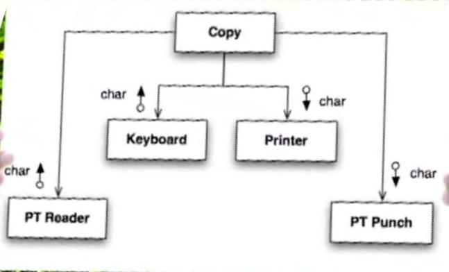

# Clean Code. SOLID Principles

## Episode 8. Foundations of the SOLID principles

### The Source Code is the Design

Предварительные документы (UML диаграммы и т.п.), которые создаются до написания исходного кода
не являются дизайном. Исходный код - это дизайн, компилятор - это фабрика, скомпилированный код -
это программа.

Затраты на дизайн (написание кода) гораздо более существенны, чем для его "постройки" (этапы
компиляции и тестирования).

Быстрая компиляция программ способствует их частому изменению. Но чем чаще изменения, тем
вероятней становится появление ошибок, тем сложнее поддерживать в рабочем состоянии уже написанный
фукнционал и тем сложнее добавлять новый.

Таким образом дизайн становится похожим на "Big ball of mud". В эпизоде 6 приводилось решение,
для уменьшения этого явления - написание тестов и рефакторинг кода.

В этом и последующих эпизодах будут приведены признаки плохого кода.

### Design Smells

В одном из предыдущих эпизодов говорилось о следующих "design smells":

* Rigidity (негибкость)
* Fragility (хрупкость)
* Immobility (статичность/неподвижность)

#### Rigidity. (Негибкость)

Rigidity - это признак, когда систему становится сложно изменять.

Что делает систему негибкой:

1. Много времени занимает test и build.
2. Небольшое изменение требует полного rebuild.

Если мы сможем уменьшить время на test и build, то мы увеличим гибкость системы. Это позволит
более легко вносить изменения.

Если мы сможем создать структуру программы так, чтобы небольшое изменение в ней не требовало
пересборки всего приложения, то это также увеличит гибкость системы.
Поэтому нам необходимо следить и управлять зависимостями модулей программы друг от друга.

#### Fragility. (Хрупкость)

Fragility - изменение в одном модуле приводит к поломке в другом модуле.

Решение - управление зависимостями между модулями и изоляция модулей друг от друга.

#### Immobility. (Статичность)

Система является статичной - если ее внутренние компоненты сложно повторно использовать в других
компонентах.

Решение - использование разделения приложения на части - абстракцию и реализацию (см. более ранние
эпизоды).

#### Viscosity. (Вязкость, тягучесть, клейкость)

Система является viscosity если такие процессы как: building, testing, check-ins, check-outs,
merges сложны и/или требуют много времени для выполнения.

Причина viscosity системы - это высокая связность (coupling) между компонентами.

#### Needless Complexity. (Ненужная сложность)

Должны мы проектировать систему только с учетом текущих требований или закладывать возможность
модификации системы в будущем?

Закладывая возможность изменения системы в будущем мы усложняем себе работу в настоящем.
Сложный дизайн не способствует изменениям.

Тесты позволяют поддерживать дизайн в простом состоянии и не бояться в дальнейшем вносить в него
изменения.

Поэтому: надо делать систему только под текущие требования и вместе с кодом писать тесты.

#### Почему код становится грязным

Череда неверных шагов, недостаток опыта, страх изменений и небрежность со временем увеличивают
степень загрязнения кода.

### What is OO?

#### Dependency Inversion

Пример: верхний уровень зависит от нижних. Когда мы добавляем новые элементы, верхний уровень
начинает зависеть от большего числа компонентов.

<table>
<tr>
<td>


</td>
<td>



</td>
</tr>
</table>

В новой версии реализации зависимостей верхний модуль зависит только от двух компонентов
`getchar` и `putchar`.

В *nix системах система ввода/вывода зависит от 5 абстракций: `open`, `close`, `read`, `write`,
`seek`. Если мы хотим работать, например, с файлом, то нам требуется реализовать эти 5 абстракций
в модуле для работы с файлом.

Полиморфизм можно использовать не только в ООП. Например можно развернуть зависимость даже
в чистом Си. Для нашего случая можно реализовать работу с нижележащими модулями подобным образом,
через функции абстракции `File`:

<table>
<tr>
<td>


</td>
<td>


</td>
<td>


</td>
</tr>
</table>

В новой версии зависимость кода инвертируется: модуль `Copy` ничего не знает про нижележащие
уровни. Мы можем добавлять новые модули без его изменения и усложнения ("загрязнения").

Аналогично, можно сделать в ООП:

<table>
<tr>
<td>

```java
public interface Reader { char getchar(); }
public interface Writer { void putchar(int c); }

void copy(Reader reader, Writer writer) {
    int c;
    while ((c = reader.getchar()) ! = EOF) {
        writer.putchar(c);
    }
}

public Keyboard implements Reader { ... }
public Printer implements Writer { ... }
```

</td>
<td>


</td>
</tr>
</table>

#### What is OO?

В ООП вызовы подобного типа:

```java
o.f(x);
```

"развязывают" вызываемый код от кода вызывающего. Вызывающий код посылает сообщение с требованием
выполнить какую-либо операцию. Вызывающий код не знает как именно будет обработан его запрос.

```text
Flow of control
-------------------------------->

Sender ---> message <--- Recipient

Opposed dependency
<--------------------------------
```

Именно в этом и состоит суть ООП. Говорят, что суть ООП это наследование, инкапсуляция и
полимофизм. На самом деле, это лишь механизмы. Самое главное свойство ООП, которое отличает его
от других парадигм - это способность инверсии зависимостей кода - это предотвращение зависимости
верхних слоев кода от нижних слоев реализации.

#### Dependency Management

Боб мартин создал 5 принципов, согласно которым классы в ООП зависят друг от друга - **SOLID**:

1. The **S**ingle Responsibility Principle
2. The **O**pen Closed Principle
3. The **L**iskov Substitution Principle
4. The **I**nterface Segregation Principle
5. The **D**ependency Inversion Principle

Три приниципа, согласно которым классы группируются в связанные модули -
**Component Cohesion Principles** (Принципы Согласованности Компонентов):

1. The Release-Reuse Equivalency Principle
2. The Common Closure Principle
3. The Common Reuse Principle

Три принципа, которые описывают зависимости между компонентами -
**Component Coupling Principles** (Принципы Соединения/Связанности Компонентов):

1. The Acyclic (ациклические/непереодические) Dependencies Principle
2. The Stable Dependencies Principle
3. The Stable Abstractions Principle

Все эти принципы образуют **Dependency Management**, позволяя организовывать компоненты системы с
high cohesion and low coupling (высокая связность и низкое сцепление).

### Conclusion

1. Software expensive to design but cheap to build.
2. Проблемы дизайна: Rigidity (негибкость), fragility (хрупкость), immobility (статичность),
viscosity (вязкость, тягучесть, клейкость), needless complexity (ненужная сложность).
3. Инверсия зависимости позволяет избежать "загрязнения" кода.
4. Основная суть ООП: оно позволяет изолировать high-level policy от low-level detail.
5. Dependency Management - список рекомендаций, которые позволит организовывать компоненты системы
с high cohesion and low coupling (в частности, сюда включены принципы SOLID).

## Episode 9. SRP (The Single Responsibility Principle)

**SRP принцип** - модуль должен иметь одну и только одну причину для изменения (одну и только одну
ответственность).

### Responsibility

Самые лучшие модули (классы) имеют только одну ответственность. Но что такое ответственность
класса?

#### It's About Users

Пользователи класса, у которых есть определенные ожидания от этого класса, определяют его
ответственность.

Пример. Класс `Employee` с тремя методами, каждый из методов выполняет ожидания пользователей из
трех различных групп:

```text
Employee:
---
+ CalculatePay          <--- Policy
+ Save                  <--- Architecture
+ DescribeEmployee      <--- Operations
```

У класса `Employee` есть *три ответственности*, т.к. он обслуживает три группы людей.

#### It's About Roles

*Responsibility* - is a family of functions that serves one particular actor
(actor - пользовательская роль).

Когда меняется actor, то он является причиной изменения всего семейства функций.
Actor для responsibility является единственной причиной его изменения.

### The Two Values of Software

ПО для пользователя решает две задачи:

* помогает сохранять деньги
* помогает делать деньги

У программного обеспечения есть два values *primary* and *secondary*.

В начале жизненного цикла ПО доминирует **secondary value** - **behaviour** (поведение). Оно
определяется стабильностью работы и степенью удовлетворения потребностей пользователя.
Со временем потребности пользователя меняются и величина behaviour уменьшается.

Чтобы поддерживать behaviour в прежнем, высоком состоянии, ПО необходимо постоянно модернизировать.

Далее для ПО становится более важным **primary value** - **способность к изменениям**.

В системах с изначально высоким secondary value и низким primary value (сложно менять)
рентабельность уменьшается.

И наоборот, в системах с изначально низким значением secondary value и высоким primary value
(легко менять) рентабельность со временем увеличивается.

**Вывод**: *первоочередная задача разработчика - разрабатывать ПО с высоким primary value (высокая способность к изменениям).*

#### Friction (сцепление)

Responsibility определяется набором функций внутри модуля. Такие модули определяют величину
Primary value.

#### CM Collision

Рассмотрим предыдущий пример `Employee`. Если два разработчика из разных групп
(например Policy и Architecture) начнут вносить изменения в класс Employee, то они
будут мешать друг другу.

Эти конфликты одновременных изменений в одном и том же месте уменьшают primary value
разрабатываемого ПО.

#### Fan Out

Класс `Employee` имеет несколько ответственностей и зависит от нескольких классов. Изменение
какого-либо класса (на рис. какой-либо `API`) является причиной изменения `Employee`.

Изменения `Employee` также заставляют изменяться и более верхние классы (на рис. `Employee User`).

Задача разработчика - минимизировать число Fan Out класса, т.е. минимизировать число его
ответственностей.


#### Colocation is Coupling (Колокация - это связанность)

Из предыдущего пункта: изменения в одном нижележащем модуле заставляет пересобирать более верхние
модули, даже если они не используют функционал измененного нижнего модуля.

Т.о. модуль `Employee` косвенно связывает между собой различные actors.

#### Encroaching Fragility (Вторгающаяся хрупкость)

Из-за таких косвенных связей увеличивается хрупкость системы: изменение в одном модуле может
сломать работу другого модуля.

### SRP

**SRP принцип** - модуль должен иметь одну и только одну причину для изменения (одну и только одну
ответственность).

Мы объединяем сущности, которые имеют одну причину для изменений в одном месте и разделяем их
в противном случае.

При проектировании системы мы:

1. Четко определяем роли пользователей системы (who the actors are).
2. Определяем ответственности, которые обслуживают каждого из actor'ов.
3. Ответственности объединяются в отдельные модули. Каждый из модулей имеет одну и только одну
ответственность.
4. Отдельные модули помещаются в отдельные функции, отдельные классы, отдельные файлы, отдельные
проекты.


Степень разделения можно варьировать. Например, какой-нибудь класс, выполняющий полезную
работу, также записывает в логи полезную информацию. Надо ли разносить логику по выполнению
полезной работы и логику логирования по разным классам или файлам? Ответ - "зависит", но скорее
всего нет: достаточно разнести логику по разным методам в одном классе (по мнению дядюшки Боба).

#### Conclusion

Физическое разделение ответственностей позволяет делать модули с малым их количеством. Далее,
эти модули можно легко объединять в модули большего размера: функции объединяются в классы,
классы объединяются в модули и т.д.:


### Solutions
