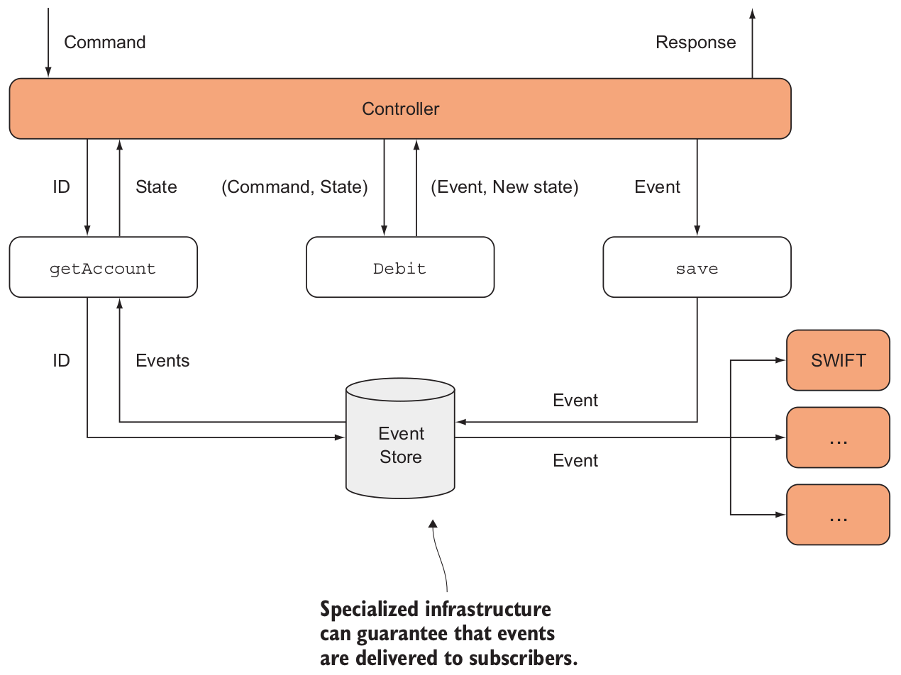

# Chapter 10

## Event sourcing: a functional approach to persistence (постоянству)

Two approaches of append-only data storage:
* *Assertion-based* - Treats the DB as an ever-growing (постоянно-растущая) collection of facts
that are true at a given point in time.
* *Event-based* - Treats the DB as an ever-growing collection of events that occur at
given points in time.

In both cases, data is never updated or deleted, only appended.

The traditional functions of a relational DB are the *CRUD* operations:
create, read, update, and delete.

The functional approach to data storage is *CRA*: create, read, append.

## 10.1 Thinking functionally about data storage

Many server applications today are inherently (по существу) *stateless*: when they receive a
request, they retrieve the required data from the database, do some processing, and persist the
relevant changes.

This also means that it’s relatively easy to avoid state mutation in a stateless server:
just create new, updated versions of the data, and persist those to the database.

### 10.1.1 Why data storage should be append-only

Причины:

1. Storage is cheap, and data is valuable.
  * Анализ данных (Big data, маркетинговые исследования и т.д.)
  * История действий (Системы контроля кода, банковские счета)
2. Append-only storage имеет еще одно преимущество: устраняет проблему конфликтов при
одновременном доступе.

### 10.1.2 Relax, and forget about storing state

*States* are snapshots (моментальные снимки) of an entity at a given time.

*Entity* is a sequence of logically related states.

*State transitions* cause (порождает) a new state to be associated with the entity.
Иначе: cause the entity to go from one state to the next.

Пример: банковский счет находится в определенном state, а завтра он будет в другом state
из-за произошедших events: таких как deposits, withdrawals, or interest charges (процентные
платежи). Events приводят к transition (переходу) счета из одного состояния в другое.

Обычный подход к хранению данных в БД:

In relational databases, we tend to only store the latest state of an entity, overwriting
previous states. When we really need to know about the past, we often use history
tables, in which we store *all* snapshots.

Event sourcing (ES):

Stores data about the events. It's always possible to reconstruct the current state of an
entity by "replaying" all the events that affected the entity. *State is secondary*.

## 10.2 Event sourcing basics

* *Events* can be represented as simple, immutable data objects capturing details of
what happened.
* *States* can also be represented as immutable data objects, although they may
have a more complex structure than events.
* *State transitions* can be represented as functions that take a state and an event,
and produce a new state.

### 10.2.1 Representing events

Events *should* (должны) be really simple. They're just plain data objects that capture the
*minimum* amount of information required to faithfully (точно) represent what happened.

Пример. Some events affecting a bank account:

```csharp
public abstract class Event
{
    // Identifies the affected entity (in this case, an account)
    public Guid EntityId { get; }
    public DateTime Timestamp { get; }
}

public sealed class CreatedAccount : Event
{
    public CurrencyCode Currency { get; }
}

public sealed class DepositedCash : Event
{
    public decimal Amount { get; }
    public Guid BranchId { get; }
}

public sealed class DebitedTransfer : Event
{
    public string Beneficiary { get; }
    public string Iban { get; }
    public string Bic { get; }
    public decimal DebitedAmount { get; }
    public string Reference { get; }
}
```

Events should be treated as being immutable: they represent things that happened in the past,
and there's no changing the past. They are persisted to storage, so they must also be
serializable.

### 10.2.2 Persisting events

Events have a different structure - different fields. You can't store them in a fixed-format
structure like a relational table.

Various options for storing events (in order of preference):

* A specialized event DB such as Event Store (https://geteventstore.com).
* A document database such as Redis, Mongo DB , and others. These storage systems make no
assumptions about the structure of the data they store.
* A traditional relational DB such as SQL Server.

Если требуется хранить events в relational DB, что для этого требуется:

* Header columns such as `EntityId` and `Timestamp`.
* Данные event'а  is serialized into a `JSON` string and stored into a wide column.

Пример:

| EntityId | Timestamp        | EventType        | Data                                           |
|----------|------------------|------------------|------------------------------------------------|
| abcd     | 2016-07-22 12:40 | CreatedAccount   | `{ “Currency”: “EUR” }`                        |
| abcd     | 2016-07-30 13:25 | DepositedCash    | `{ “Amount”: 500, “BranchId”: “BOCLHAYMCKT” }` |
| abcd     | 2016-08-03 10:33  | DebitedTransfer | `{ “DebitedAmount”: 300, “Beneficiary”: “Rose Stephens”, ...}` |

### 10.2.3 Representing state

Какое назначение для states, если у нас есть events:

* (Основная причина). We need snapshots to make decisions on how to process commands. For example,
if we receive a command that we should make a transfer, and the account is frozen or has an
insufficient balance, then we must reject the command.
* We also need snapshots to display to users. I'll refer to these as *view models*.

A simplified model of the entity state:

```csharp
public sealed class AccountState
{
    public AccountStatus Status { get; }
    public CurrencyCode Currency { get; }
    public decimal Balance { get; }
    public decimal AllowedOverdraft { get; }

    public AccountState WithStatus(AccountStatus newStatus)    // ...

    public AccountState Debit(decimal amount) =>
        Credit(-amount);

    public AccountState Credit(decimal amount) =>
        new AccountState(
            Balance: this.Balance + amount,
            Currency: this.Currency,
            Status: this.Status,
            AllowedOverdraft: this.AllowedOverdraft
        );
}
```

This is dumb, immutable data object with read-only properties, some copy methods such as
`WithStatus` , and with methods named `Debit` and `Credit`, which are also just copy methods
and contain no business logic.

### 10.2.4 An interlude on pattern matching

*Pattern matching* is a language feature that allows you to execute different code
depending on the "shape" of some data - most importantly, its type.
It’s a staple (основа) of functional languages.

You can think of the classic `switch` statement as a very limited form of pattern matching,
because you can only match on the exact *value* of an expression.

How to matching on the type?

#### C#'s incipient (начальная/неполная) support for pattern matching

Примеры разных способов применения соответствия по типу.

Simple domain:

```csharp
enum Ripeness { Green, Yellow, Brown }

abstract class Reward { }
class Peanut : Reward { }
class Banana : Reward { public Ripeness Ripeness; }
```

1. Matching on the type of an expression in C# 6:

```csharp
string Describe(Reward reward)
{
    Peanut peanut = reward as Peanut;
    if (peanut != null)
        return "It's a peanut";

    Banana banana = reward as Banana;
    if (banana != null)
        return $"It's a {banana.Ripeness} banana";

    return "It's a reward I don't know or care about";
}
```

2. Matching on type in C# 7 with `is`:

```csharp
string Describe(Reward reward)
{
    if (reward is Peanut _)
        return "It's a peanut";

    else if (reward is Banana banana)
        return $"It's a {banana.Ripeness} banana";

    return "It's a reward I don't know or care about";
}
```

3. Matching on type in C# 7 with `switch`:

*Кажется, что сопоставление в этом виде наиболее оптимально в использовании*

```csharp
string Describe(Reward reward)
{
    switch (reward)
    {
        case Peanut _:
            return "It's a peanut";
        case Banana banana:
            return $"It's a {banana.Ripeness} banana";
        default:
            return "It's a reward I don't know or care about";
    }
}
```

#### A custom solution for expression-based pattern matching

```csharp
// (1) - The generic parameter specifies the type that will be returned when calling Match.
// (2) - A list of functions; the first one with a matching type will be evaluated.
// (3) - Optionally add a default value or handler.
// (4) - Supplies the value on which to match
string Describe(Reward reward) =>
    new Pattern<string>                                     // (1)
    {
        (Peanut _) => "It's a peanut",                      // (2)
        (Banana b) => $"It's a {b.Ripeness} banana"         // (2)
    }
    .Default("It's a reward I don't know or care about")    // (3)
    .Match(reward);                                         // (4)
```

1. Set up the functions that handle each case.
2. You can optionally call `Default` to provide a default value, or handler, to use if no
matching function is found.
3. Use `Match` to supply the value to match on; this will evaluate the first function whose
input type matches the type of the given value.

`Pattern` class is useful for types that are open for inheritance, like `Event` or `Reward`,
where you can envisage (предусмотреть) adding new subclasses as the system evolves
(по мере развития системы).

#### Matching on the structure of a list

*Используется для восстановления/(вычисления) состояний по событиям*

You may want to execute different code depending on whether a list is empty or not.

As a reminder, here's an example of using `Match` to compute the length of a list:

```csharp
public static int Length<T>(this List<T> list) =>
    list.Match(
        () => 0,
        (_, tail) => 1 + tail.Length());
```

A `Match` can be defined to work for any `IEnumerable`:

```csharp
// (1) - Calls the Empty handler if the list is empty.
// (2) - Calls the Otherwise handler with the list's head and tail if it’s not empty.
R Match<T, R>(
    this IEnumerable<T> list, Func<R> empty, Func<T, IEnumerable<T>, R> otherwise) =>
        list.Head()
            .Match(
                None: () => empty(),                            // (1)
                Some: (head) => otherwise(head, list.Skip(1))   // (2)
            );

// Head returns None if the list is empty;
// otherwise the head of the list wrapped in a Some.
Option<T> Head<T>(this IEnumerable<T> list)
{
    var enumerator = list.GetEnumerator();
    return enumerator.MoveNext()
        ? Some(enumerator.Current)
        : None;
}
```

### 10.2.5 Representing state transitions

1. We have a *state* and an *event*.
2. We can compute the next state by *applying* the event to the state.

This computation is called a *state transition*. Signature in general form:

```text
state -> event -> state
```

В нашем примере со счетом в банке эта сигнатура в таком виде:

```text
AccountState -> Event -> AccountState
```

При создании счета в банке, сигнатура имеет такой вид:

```text
event -> state
```

Modeling state transitions:

```csharp

public static class Account
{
    // CreatedAccount is a special case, because there is no prior state.
    public static AccountState Create(CreatedAccount evt) =>
        new AccountState
        (
            Currency: evt.Currency,
            Status: AccountStatus.Active
        );

    // (2) - Calls the relevant transition depending on the type of the event
    public static AccountState Apply(this AccountState account, Event evt) =>
        new Pattern
        {
            (DepositedCash e) => account.Credit(e.Amount),
            (DebitedTransfer e) => account.Debit(e.DebitedAmount),
            (FrozeAccount _) => account.WithStatus(AccountStatus.Frozen),
        }
        .Match(evt);
}
```

The first method is the special case of creation: it takes a `CreatedAccount` event and
creates a new `AccountState`.

The `Apply` method is the more general formulation of a state transition, and it will
process all other types of events.

### 10.2.6 Reconstructing the current state from past events

Recovering the present state of an entity from its event history:

```csharp
// (1) - "history" - Given the history of events.
// (2) - Creates a new account from the first event, and uses it as an accumulator.
// (3) - Applies each subsequent event
public static Option<AccountState> From(IEnumerable<Event> history) =>      // (1)
    history.Match(
        Empty: () => None,
        Otherwise: (created, otherEvents) => Some(
            otherEvents.Aggregate(
                seed: Account.Create((CreatedAccount)created),              // (2)
                func: (state, evt) => state.Apply(evt))));                  // (3)
```

1. We're taking a sequence of events: the entity's history (`IEnumerable<Event> history`).
2. List of events you get from the DB when you query all events for a given `EntityID`.
3. Assuming that the sequence is *sorted*: first event should be at the top of the list.
4. If the history is empty, the code returns `None`.
5. Otherwise the sequence must contain a `CreatedAccount` at the head of the list,
with the tail containing all following events.
    * The code creates the initial state from the `CreatedAccount` event.
    * Initial state uses that as an accumulator to `Aggregate`.
    * `Aggregate` applies all subsequent events to the state, finally obtaining the current state.
6. Можно получить любой промежуточный статус счета, просто ограничив применение событий
требуемой датой.

## 10.3 Architecture of an event-sourced system

Event-sourced system can be split into two separate parts:

* *The command side*. This side has the job of writing data, which consists mainly of
validating commands received from users. Valid commands will result in events
being persisted and propagated.

* *The query side* - This side has the job of reading data. View models are dictated by
what you want to show on the client, and the query side must populate those
view models from the stored events. Optionally, the query side can also publish
notifications to the client when new events cause the views to change.


Достоинства такого разделения:

* Smaller, more focused components.
* Command and query sides can be completely separate applications.
* Can be scaled and deployed independently. Если много чтения, то можно увеличить
только query side, оставив a single instance of the command side (чтобы prevent concurrent
changes).

The command and query side необязательно разделять на два отдельных приложения - они
успшено могут работать внутри одного приложения (просто разделить по классам/интрефейсам
и т.п.).

### 10.3.1 Handling commands

Commands are:

1. The earliest source of data.
2. Sent to your application by users (or by other systems).
3. Handled by the command side:
    * Validate the command
    * Turn the command into an event
    * Persist the event and publish it to interested parties (стороны).

Comparing commands and events:

* *Commands* are requests from a user or other application. It's possible for a command
to be disregarded (игнорирование) for some reason. Maybe the command
fails validation, or maybe the system crashes while handling it. Commands are
named in the imperative form, such as `MakeTransfer` or `FreezeAccount`.

* *Events* can't fail because they’'e already happened. They're named
in the past tense (прошедшее время), such as `DebitedTransfer` or `FrozeAccount`.

* Commands and events *generally* (в большинстве случаев) capture the same information.
And creating an event from a command is just a matter of copying field by field (sometimes
with some variations).

* An event directly affects a single entity, but events are broadcast within your system,
so they may trigger the creation of other events that affect other entities.

The command side of an event-sourced system:


Top-level command-handling workflow:

```csharp
public class MakeTransferController : Controller
{
    Func<Guid, AccountState> getAccount;
    Action<Event> saveAndPublish;

    // Handles receiving a command
    public IActionResult MakeTransfer([FromBody] MakeTransfer cmd)
    {
        // Retrieves the account
        var account = getAccount(cmd.DebitedAccountId);

        // Performs the state transition; returns a tuple with the event and the new state.
        var (evt, newState) = account.Debit(cmd);

        // Persists the event and publishes to interested parties (стороны).
        saveAndPublish(evt);

        // Returns information to the user about the new state.
        return Ok(new { Balance = newState.Balance });
    }
}

public static class Account
{
    // Converts the command into an event and obtain the account's new state.
    public static (Event Event, AccountState NewState) Debit(
        this AccountState state, MakeTransfer transfer)
    {
        // Translates the command into an event.
        Event evt = transfer.ToEvent();
        // Computes the new state
        AccountState newState = state.Apply(evt);
        return (evt, newState);
    }
}
```

> ### Tuples in C# 7
> ```csharp
> (string, string, int) GetAuthorInfo() =>    // Declares tuple as the method's return type
>     ("Enrico", "Buonanno", 40);             // Creates a tuple literal
>
> // Tuples can be deconstructed.
> var (first, last, age) = GetAuthorInfo();
> first     // => "Enrico"
> age       // => 40
> ```
> You can assign meaningful names to the elements of a tuple:
> ```csharp
> (string First, string Last, int Age) GetAuthorInfo() =>
>     ("Enrico", "Buonanno", 40);
>
> var info = GetAuthorInfo();
> info.First    // => "Enrico"
> info.Age      // => 40
> ```
> The old tuples (since C# 4) are backed by the `System.Tuple` classes, which are *immutable*
> reference types.
>
> The new tuples are backed by the `System.ValueTuple` structs. They're copied when passed
> between functions, yet they're *mutable*, so you can update their members within methods.

### 10.3.2 Handling events

`saveAndPublish` - the newly created event should be propagated to interested parties.
A dedicated service should subscribe to these events and may consume this event.
For example:

* Send the money to the receiving bank (SWIFT, ...).
* Recomputing the ban'’s cash reserve.
* Sending a toast notification to the client's phone.

#### Why function is called `saveAndPublish`. Using Event Store

Both things should happen atomically. If the process saves the event and then crashes before all subscribers were able to handle the event, the system may be left in an inconsistent state.

For example, the account may be debited but the money not sent to SWIFT.

How this atomicity is achieved is somewhat intricate (насколько сложно) and strictly depends
on the infrastructure you're targeting.

For instance, if you use *Event Store*, you can take advantage of *durable* subscriptions to
event streams, which guarantee that the event is delivered at *least once* to the subscriber:



By using Event Store, you could simplify the logic in `saveAndPublish` to only
`save` the event.

