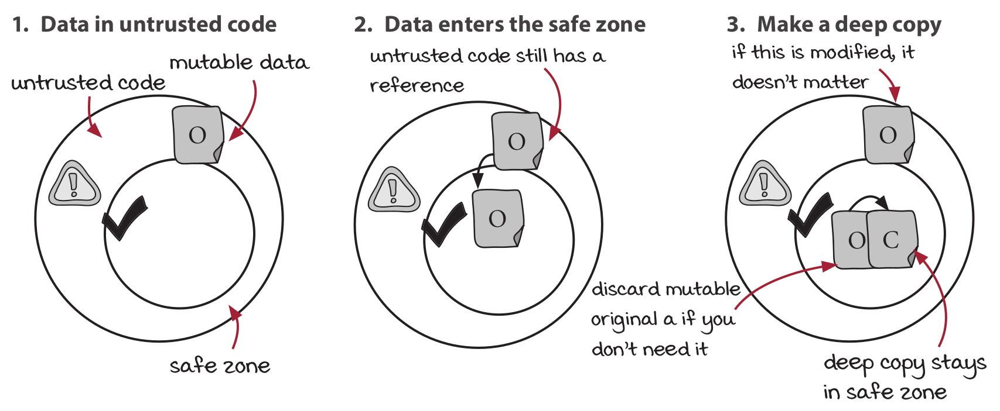

# Grokking Simplicity

## Part 1: Actions, calculations, and data

## Chapter 6. Staying immutable in a mutable language

### Vocab

*Nested data*: Data structures inside data structures; we can talk about the inner data
structure and the top-level data structure.

*Shallow copy*: Copying only the top-level data structure in nested data.

*Structural sharing*: Two nested data structures referencing the same inner data structure

We say data is *deeply nested* when the nesting goes on for a while (продолжается некоторое время).
It's a relative term, but an example might be objects within objects within arrays within objects
within objects... The nesting can go on a long time.

### Categorizing operations into reads, writes, or both

* **Reads**
  * Get information out of data
  * Do not modify the data
* **Writes**
  * Modify the data

### The three steps of the copy-on-write discipline

1. Make a copy.
2. Modify the copy (as much as you want!).
3. Return the copy.

```js
function add_element_last(array, elem) {    // we want to modify array
    var new_array = array.slice();          // 1. make a copy
    new_array.push(elem);                   // 2. modify the copy
    return new_array;                       // 3. return the copy
}

function remove_item_by_name(cart, name) {
    var new_cart = cart.slice();    // 1. make a copy
    var idx = null;
    for(var i = 0; i < new_cart.length; i++) {
        if(cart[i].name === name)
            idx = i;
    }
    if(idx !== null)
        new_cart.splice(idx, 1);    // 2. modify the copy
    return new_cart;                // 3. return the copy
}
```

* Copy-on-write converts writes into reads.

* These copy-on-write operations are generalizable

### JavaScript arrays at a glance

Особенности:

* Can have values of different types.
* Can access elements by index.
* Can extend and shrink.

Операции:

**Lookup by index** `[idx]`

This gets the element at `idx`. Indexes start at 0.

```js
> var array = [1, 2, 3, 4];
> array[2]
3
```

**Set an element** `[] =`

The assignment operator will mutate an array.

```js
> var array = [1, 2, 3, 4];
> array[2] = "abc"
"abc"
> array
[1, 2, "abc", 4]
```

**Length** `.length`

This contains the number of elements in the array. It's not a method, so don't use
parentheses.

```js
> var array = [1, 2, 3, 4];
> array.length
4
```

**Add to the end** `.push(el)`

This mutates the array by adding el to the end and returns the new length of the array.

```js
> var array = [1, 2, 3, 4];
> array.push(10);
5
> array
[1, 2, 3, 4, 10]
```

**Remove from the end** `.pop()`

This mutates the array by dropping the last element and returns the value that was dropped.

```js
> var array = [1, 2, 3, 4];
> array.pop();
4
> array
[1, 2, 3]
```

**Add to the front** `.unshift(el)`

This mutates the array by adding el to the array at the beginning and returns the new length.

```js
> var array = [1, 2, 3, 4];
> array.unshift(10);
5
> array
[10, 1, 2, 3, 4]
```

**Remove from the front** `.shift()`

This mutates the array by dropping the first element (index 0) and returns the value that
was dropped.

```js
> var array = [1, 2, 3, 4];
> array.shift()
1
> array
[2, 3, 4]
```

**Copy an array** `.slice()`

This creates and returns a shallow copy of the array.

```js
> var array = [1, 2, 3, 4];
> array.slice()
[1, 2, 3, 4]
```

**Remove items** `.splice(idx, num)`

This mutates the array by removing num items starting at idx and returns the removed items.

```js
> var array = [1, 2, 3, 4, 5, 6];
> array.splice(2, 3); // remove 3 elements
[3, 4, 5]
> array
[1, 2, 6]
```

### JavaScript objects at a glance

Особенности:

* Objects in JavaScript are collections of key/value pairs, where the keys are unique.
* The keys are always strings.
* The values can be any type.

Операции:

**Look up by key** `[key]`

This looks up the value corresponding to `key`. If the key doesn't exist, you'll get `undefined`.

```js
> var object = {a: 1, b: 2};
> object["a"]
1
```

**Look up by key** `.key`

You can also use a dot notation to access the values. This is convenient if `key` fits into
JavaScript's tokenization syntax rules.

```js
> var object = {a: 1, b: 2};
> object.a
1
```

**Set value for key** `.key` or `[key] =`

You can assign a value to a key using either syntax, which mutates the object. It sets
the value for `key`. If `key` exists, it replaces the value. If the `key` doesn't exist, it
adds to it.

```js
> var object = {a: 1, b: 2};
> object["a"] = 7;
7
> object
{a: 7, b: 2}
> object.c = 10;
10
> object
{a: 7, b: 2, c: 10}
```

**Remove a key/value pair** `delete`

This method mutates the object by removing a key/value pair given the key. You can use
either look-up syntax.

```js
> var object = {a: 1, b: 2};
> delete object["a"];
true
> object
{b: 2}
```

**Copy an object** `Object.assign(a, b)`

`Object.assign()` copies all key/values pairs from object `b` to object `a` (mutating it).
We can use it to make a copy of `b` by copying all key/value pairs to an empty object.

```js
> var object = {x: 1, y: 2};
> Object.assign({}, object);
{x: 1, y: 2}
```

**List the keys** `Object.keys()`

If we want to iterate through the key/value pairs in an object, we can do it indirectly
by asking the object for all of its keys using the function `Object.keys()`.
That returns an array of the keys in an object, which we can then loop through.

```js
> var object = {a: 1, b: 2};
> Object.keys(object)
["a", "b"]
```

### What to do if an operation is a read and a write

Two approaches:

1. Split function (Splitting the operation into read and write).
2. Return two values.

Example. Remove from the front `.shift` This mutates the array by dropping the first element
(index 0) and returns the value that was dropped.

```js
> var array = [1, 2, 3, 4];
> array.shift()
1
> array
[2, 3, 4]
```

#### Splitting the operation into read and write

```js
// just a function that returns the first element (or undefined if the list is empty).
// it's a calculation
function first_element(array) {
    return array[0];
}

// perform the shift but drop the return value
// Copy-on-write
function drop_first(array) {
    var array_copy = array.slice();
    array_copy.shift();
    return array_copy;
}
```

We can use them separately or together.

#### Returning two values from one function

```js
function shift(array) {
    var array_copy = array.slice();
    var first = array_copy.shift();
    return {    // we use an object to return two separate values
        first : first,
        array : array_copy
    };
}
```

или так (реализация с помощью функций из предыдущего раздела)

```js
function shift(array) {
    return {
        first : first_element(array),
        array : drop_first(array)
    };
}
```

### Reads to immutable data structures are calculations

* **Reads to mutable data are actions**

  If we read from a mutable value, we could get a different answer each time we read it,
  so reading mutable data is an action.

* **Writes make a given piece of data mutable**

  Writes modify data, so they are what make the data mutable.

* **If there are no writes to a piece of data, it is immutable**

  If we get rid of all of the writes by converting them to reads, the data won't ever change after
  it is created. That means it's immutable.

* **Reads to immutable data structures are calculations**

  Once we do make the data immutable, all of those reads become calculations.

* **Converting writes to reads makes more code calculations**

  The more data structures we treat as immutable, the more code we have in calculations and
  the less we have in actions.

### Immutable data structures are fast enough

* We can always optimize later
* Garbage collectors are really fast
* We're not copying as much as you might think at first
  * shallow copy (just copy the top level of a data structure)
  * structural sharing (copies share a lot of references to the same objects in memory)
* Functional programming languages have fast implementations

### Copy-on-write operations on objects

1. Make a copy.
2. Modify the copy.
3. Return the copy.

```js
// Original
function setPrice(item, new_price) {
    item.price = new_price;
}

// Copy-on-write
function setPrice(item, new_price) {
    var item_copy = Object.assign({}, item);
    item_copy.price = new_price;
    return item_copy;
}
```

Еще:

```js
o["price"] = 37;    // objectSet - copy-on-write version of this

function objectSet(object, key, value) {
    var copy = Object.assign({}, object);
    copy[key] = value;
    return copy;
}

var a = {x : 1};
delete a["x"];    // objectDelete - copy-on-write version of this

function objectDelete(object, key) {
    var copy = Object.assign({}, object);
    delete copy[key];
    return copy;
}
```

### Summary

* In functional programming, we want to use immutable data. It is impossible to write
calculations on mutable data.

* Copy-on-write is a discipline for ensuring our data is immutable. It means we make a
copy and modify it instead of modifying the original.

* Copy-on-write requires making a shallow copy before modifying the copy, then
returning it. It is useful for implementing immutability within code that you control.

* We can implement copy-on-write versions of the basic array and object operations to
reduce the amount of boilerplate we have to write.

## Chapter 7. Staying immutable with untrusted code

Any data that leaves the safe zone is potentially mutable. It could be modified by the
untrusted code. Likewise, any data that enters the safe zone from untrusted code
is potentially mutable.

The copy-on-write pattern won't quite help us here.
We can use *defensive copies* to protect data and maintain immutability.

### Vocab

*Deep copies* duplicate all levels of nested data structures, from the top all the way
to the bottom.

### The rules of defensive copying

Note that these rules could be applied in any order.

#### Rule 1: Copy as data leaves your code

1. Make a deep copy of the immutable data.
2. Pass the copy to the untrusted code.


#### Rule 2: Copy as data enters your code

1. Immediately make a deep copy of the mutable data passed to your code.
2. Use the copy in your code.



### Example

```js
// Original
function add_item_to_cart(name, price) {
    var item = make_cart_item(name, price);
    shopping_cart = add_item(shopping_cart, item);
    var total = calc_total(shopping_cart);
    set_cart_total_dom(total);
    update_shipping_icons(shopping_cart);
    update_tax_dom(total);
    black_friday_promotion(cart_copy);          // untrusted code
}
```

```js
// With defensive copying
function add_item_to_cart(name, price) {
    var item = make_cart_item(name, price);
    shopping_cart = add_item(shopping_cart, item);
    var total = calc_total(shopping_cart);
    set_cart_total_dom(total);
    update_shipping_icons(shopping_cart);
    update_tax_dom(total);
    var cart_copy = deepCopy(shopping_cart);    // Copy before sharing data
    black_friday_promotion(cart_copy);          // untrusted code
    shopping_cart = deepCopy(cart_copy);        // Copy after sharing data
}
```

```js
// Extracted safe version
function add_item_to_cart(name, price) {
    var item = make_cart_item(name, price);
    shopping_cart = add_item(shopping_cart, item);
    var total = calc_total(shopping_cart);
    set_cart_total_dom(total);
    update_shipping_icons(shopping_cart);
    update_tax_dom(total);
    shopping_cart = black_friday_promotion_safe(shopping_cart);     // call extracted code
}

function black_friday_promotion_safe(cart) {     // extracted code
    var cart_copy = deepCopy(cart);
    black_friday_promotion(cart_copy);
    return deepCopy(cart_copy);
}
```

### Copy-on-write and defensive copying compared

#### Copy-on-write

**When to use it**

Use copy-on-write when you need to modify data you control.

**Where to use it**

You should use copy-on-write everywhere inside the safe zone. In fact, the
copy-on-write defines your immutability safe zone.

**Type of copy**

Shallow copy - relatively cheap

**The rules**

1. Make a shallow copy of the thing to modify.
2. Modify the copy.
3. Return the copy.

#### Defensive copying

**When to use it**

Use defensive copying when exchanging data with untrusted code.

**Where to use it**

Use copy-on-write at the borders of your safe zone for data that has to cross in or out.

**Type of copy**

Deep copy - relatively expensive

**The rules**

1. Make a deep copy of data as it enters the safe zone.
2. Make a deep copy of data as it leaves the safe zone.

### Implementing deep copy in JavaScript is difficult

Recommended to using the implementation from the Lodash library (lodash.com).

Пример реализации глубокого копирования.

```js
// (1) - recursively make copies of all of the elements
// (2) - strings, numbers, booleans, and functions are immutable so they don't need to be copied
function deepCopy(thing) {
    if(Array.isArray(thing)) {
        var copy = [];
        for(var i = 0; i < thing.length; i++)
            copy.push(deepCopy(thing[i]));          // (1)
        return copy;
    } else if (thing === null) {
        return null;
    } else if (typeof thing === "object") {
        var copy = {};
        var keys = Object.keys(thing);
        for(var i = 0; i < keys.length; i++) {
            var key = keys[i];
            copy[key] = deepCopy(thing[key]);       // (1)
        }
        return copy;
    } else {
        return thing;       // (2)
    }
}
```

### Summary

*Defensive copying is a discipline for implementing immutability. It makes copies as
data leaves or enters your code.

* Defensive copying makes deep copies, so it is more expensive than copy-on-write.

* Unlike copy-on-write, defensive copying can protect your data from code that does not
implement an immutability discipline.

* We often prefer copy-on-write because it does not require as many copies and we use
defensive copying only when we need to interact with untrusted code.

* Deep copies copy an entire nested structure from top to bottom. Shallow copies only
copy the bare minimum.

## Chapter 8. Stratified design: Part 1

### Vocab

*Stratified design* is a design technique that builds software in layers.
Each layer defines new functions in terms of the functions in the layers below it.

### Пример уровней

1. (Верхний) business rules

  * `gets_free_shipping()`
  * `cartTax()`

2. cart operations

  * `remove_item_by_name()`
  * `calc_total()`
  * `add_item()`
  * `setPriceByName()`

3. copy-on-write

  * `removeItems()`
  * `add_element_last()`

4. (Нижний) array built-ins

  * `.slice()`


### Developing our design sense

#### Характеристики, которые могут использоваться в качестве критериев для дизайна

**Function bodies**

* Length
* Complexity
* Levels of detail
* Functions called
* Language features used

**Layer structure**

* Arrow length
* Cohesion
* Level of detail

**Function signatures**

* Function name
* Argument names
* Argument values
* Return value

#### Решения, принимаемые при проектировании дизайна

**Organization**

* Decide where a new function goes.
* Move functions around.

**Implementation**

* Change an implementation.
* Extract a function.
* Change a data structure.

**Changes**

* Choose where new code is written.
* Decide what level of detail is appropriate.

### Patterns of stratified design

* Pattern 1: Straightforward (простая/несложная) implementation

  The layer structure of stratified design should help us build straightforward implementations.
  When we read a function with a straightforward implementation, the problem the function
  signature presents should be solved at the right level of detail in the body. Too much detail
  is a code smell.

* Pattern 2: Abstraction barrier

  Some layers in the graph provide an interface that lets us hide an important implementation
  detail. These layers help us write code at a higher level and free our limited mental capacity
  to think at a higher level.

* Pattern 3: Minimal interface

  As our system evolves, we want the interfaces to important business concepts to converge to
  a small, powerful set of operations. Every other operation should be defined in terms of those,
  either directly or indirectly.

* Pattern 4: Comfortable layers

  The patterns and practices of stratified design should serve our needs as programmers, who are
  in turn serving the business. We should invest time in the layers that will help us deliver
  software faster and with higher quality. We don't want to add layers for sport. The code and
  its layers of abstraction should feel comfortable to work in.

### Pattern 1: Straightforward implementations

1. Выделить desired (нужные) shopping cart operations

* Add an item.
* Remove an item.
* Check if an item is in the cart.
* Sum the total.
* Clear the cart.
* Set the price of an item by name.
* Calculate the tax.
* Check if it gets free shipping.

2. Visualizing our function calls with a call graph

Пример диаграммы:

```text
    ------------- freeTieClip() --------------
    |             |           |              |
    |             |           v              v
    |             |      make_item()    add_item()
    v             v
array_index    for loop
```

* Arrows represent function calls.
* `array index`, `for loop` - language features.
* `make_item()`, `add_item()` - function calls.
* Functions and built-in language features могут быть расположены на разных уровнях

Замечания по приведенной диаграмме:

* `freeTieClip()` обращается к разным уровням (стрелки указывают на разные уровни)
* The difference in layers makes the implementation less obvious and hard to read.

3.Straightforward (простые/несложные) implementations call functions from similar layers of
abstraction.

In a straightforward implementation, all arrows would be about the same length.

Если из одного слоя идет обращение к разным слоям, то можно ввести промежуточные функции
для "выравнивания" (чтобы обращения были только к функциям одного нижележащего слоя).


4. Стрелки между функциями из разных слоев должны быть как можно короче.

5. All functions in a layer should serve (выполнять) the same pupose (функцию/работу).

Пример таких слоев:

* business rules about carts (самый верхний)
  * `freeTieClip()`, `gets_free_shipping()`, `cartTax()`
* business rules (general)
  * `calc_tax()`
* basic cart operations
  * `add_item()`, `setPriceByName()`, `isInCart()`, `calc_total()`, `remove_item_by_name()`
* basic item operations
  * `make_item()`, `setPrice()`
* copy-on-write operations
  * `add_element_last()`, `removeItems()`
* JavaScript language features (самый нижний)
  * `object literal`, `.slice()`, `for loop`, `array index`

### Three different zoom levels

1. Global zoom level

  At the global zoom level, we see the entire call graph.


2. Layer zoom level

  At the layer zoom level, we start with the level of interest and draw everything it
  points to below it.


3. Function zoom level

  At the function zoom level, we start with one function of interest and draw everything it
  points to below it.

### Summary

* Stratified design organizes code into layers of abstraction. Each layer helps us ignore
different details.

* When implementing a new function, we need to identify what details are important to solving
the problem. This will tell you what layer the function should be in.

* There are many clues (подсказок) that can help us locate functions in layers. We can look at
the name, the body, and the call graph.

* The name tells us the intent (смысл/цель) of the function. We can group it with other functions
with related (похожими) intents.

* The body can tell us the details that are important to a function. These are clues as to
where in the layer structure it goes.

* The call graph can show us that an implementation is not straightforward. If the arrows
coming from it are of varying lengths, it's a good sign the implementation is not
straightforward.

* We can improve the layer structure by extracting out more general functions. More
general functions are on lower layers and are more reusable.

* The pattern of straightforward implementation guides us to build layers such that our
functions are implemented in a clear and elegant way.

## Chapter 9. Stratified design: Part 2

An *abstraction barrier* is a layer of functions that hide the implementation.

**Важно**: на диаграмме нет стрелок, которые пересекают abstraction barrier.

### Abstraction barrier. Abstraction barriers hide implementations

Functional programmers strategically employ (используют) abstraction barriers because they
let them think about a problem at a higher level.

The abstraction barrier in this case means the functions above that layer don't need to
know what the data structure is.

Также правильный выбор abstraction barrier позволяет нижним слоям успешно игнорировать
функции из более верхних слоев.


#### When to use (and when *not* to use!) abstraction barriers

1. To facilitate (для облегчения) changes of implementation.

  * Abstraction barrier позволяет потом изменять нижележащие слои.

  * This property might be useful if you are prototyping something and you still don't
  know how best to implement it.

  * You know something will change; you're just not ready to do it yet.

2. To make code easier to write and read.

  * An abstraction barrier that lets you ignore lower code details will make your code
  easier to write.

3. To reduce coordination between teams.

  * The abstraction barrier allows teams on either (обеих) side to ignore the details the
  other team handles.

4. To mentally focus on the problem at hand.

#### Не следует делать абстрактный барьер на слишком низком слое иерархии

1. Code in the barrier is lower level, so it's more likely to contain bugs.

2. Low-level code is harder to understand.

### Pattern 3: Minimal interface

By keeping our interfaces minimal, we avoid bloating our lower layers with unnecessary
features.

In stratified design, we find a dynamic tension between the completeness of the abstraction
barrier and the pattern to keep it minimal.

There are many reasons to keep the abstraction barrier minimal:

1. If we add more code to the barrier, we have more to change when we change the
implementation.

2. More functions in an abstraction barrier mean more coordination between teams.

3. A larger interface to our abstraction barrier is harder to keep in your head.

The minimal interface pattern guides us to solve problems at higher levels and avoid
modifying lower levels.

The pattern can be applied to all layers, not just abstraction barriers.

#### Идеальный layer, к которому следует стремиться

1. Layer should have as many functions as necessary, but no more.

2. The functions should not have to change, nor should you need to add functions later.

3. The set should be complete, minimal, and timeless.

### Pattern 4: Comfortable layers

Не надо делать слишком "высокие" башни абстракций. Не надо добавлять слои только ради
спорта. We should invest time in the layers that will help us deliver software
faster and with higher quality. Если нам комфортно работать с текущими уровнями, значит,
скорее всего, они не нуждаются в дополнительных улучшениях.

### Spreading rule (правило распространения)

Любая функция, которая вызывает action, сама становится action.


### What does the graph show us about our code?

*Nonfunctional requirements* (**NFR**s) are things like how testable, maintainable, or
reusable the code is.

Рассматриваются три NFRs:

1. *Maintainability* - What code is easiest to change when requirements change?
2. *Testability* - What is most important to test?
3. *Reusability* - What functions are easier to reuse?

### Code at the top of the graph is easier to change

```text
    A
   / \
  v   v
  B   C
```

`A` - легче изменить, чем `B` или `C`.

The longer the path from the top to a function, the more expensive that function will be to
change.

If we put code that changes frequently near or at the top, our jobs will be easier. Build
less on top of things that change.


### Testing code at the bottom is more important

If we're doing it right, code at the top changes more frequently than code at the bottom.

Тесты функций на верхних слоях иерархии имеют меньший вес/значение, т.к. данный функционал
может меняться очень часто.

Наоборот, тесты функций на нижних слоях иерархии имеют больший вес, т.к. здесь изменения
происходят гораздо реже.


### Code at the bottom is more reusable (более многократно используется)

Чем выше функция в иерархии, тем меньше она пригодна для повторного использования.


### Summary: What the graph shows us about our code. Итоговая картинка

```text
--- A ---       Легче менять. Тесты менее ценны. Меньшая переиспользуемость.
|       |
v       v
B       C       Сложнее менять. Тесты более ценны. Большая переиспользуемость.
```


### Summary

* The pattern of abstraction barrier lets us think at a higher level. Abstraction barriers
let us completely hide details.

* The pattern of minimal interface has us build layers that will converge (стремиться) on
a final form. The interfaces for important business concepts should not grow or change
once they have matured. (Интерфейсы для устоявшегося "взрослого" функционала не должны меняться).

* The pattern of comfort helps us apply the other patterns to serve our needs. It is easy to
over-abstract when applying these patterns. We should apply them with purpose.
(Короче, не следует бесцельно создавать слишком много слоев абстракций).

* Properties emerge (являются следствием) from the structure of the call graph. Those properties
tell us where to put code to maximize our testability, maintainability, and reusability.
