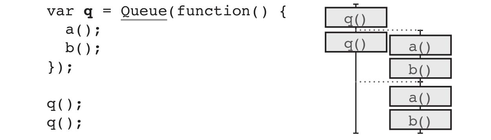
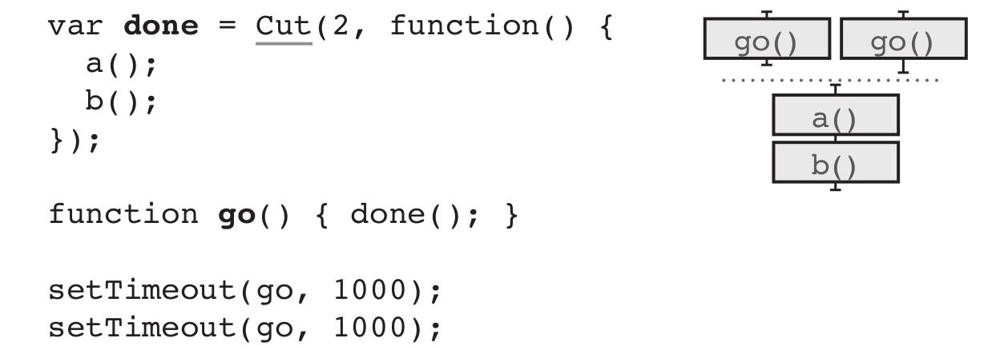
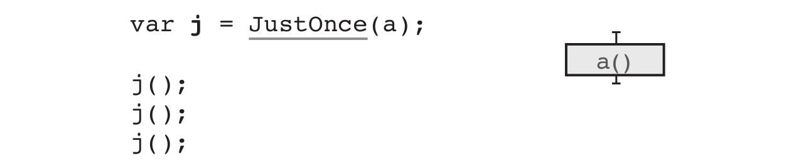
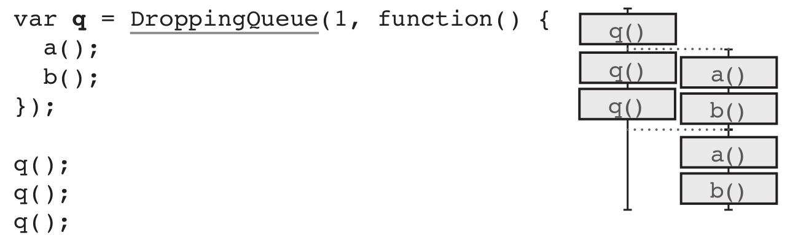
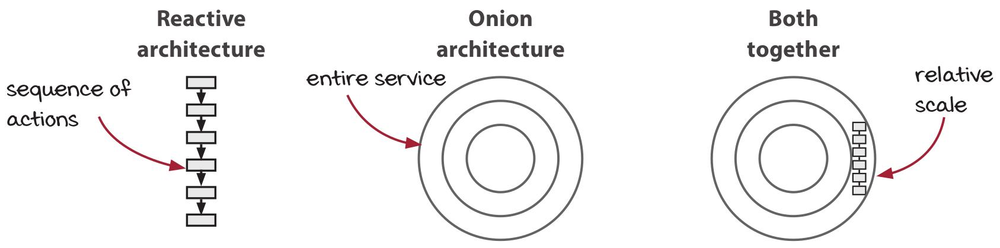
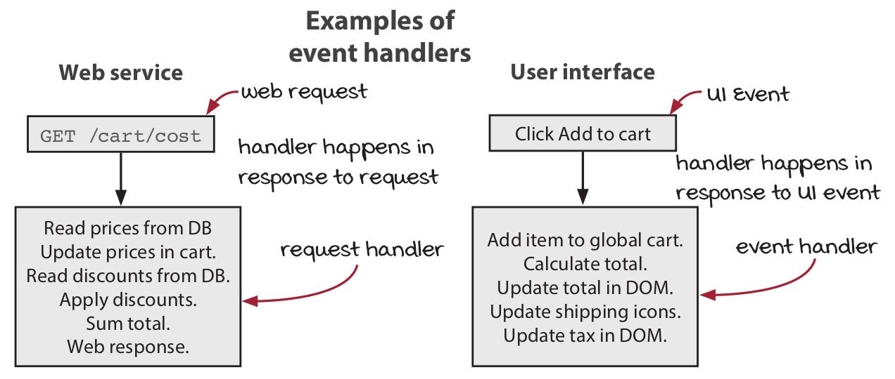
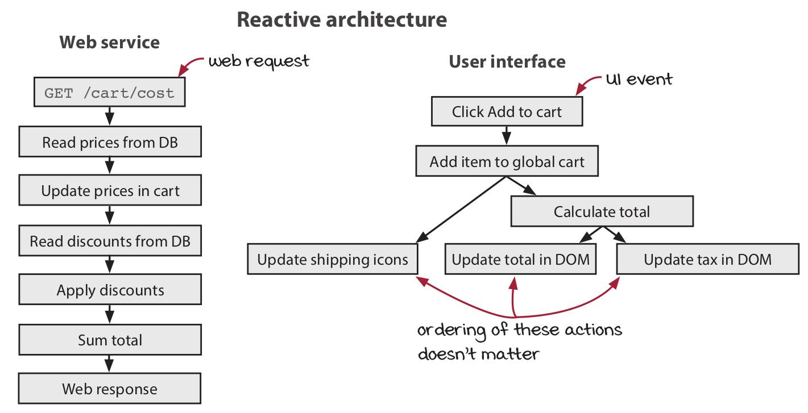
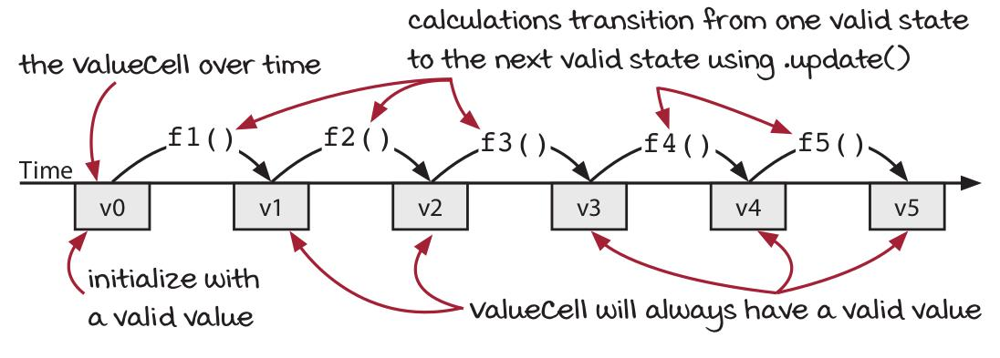

# Grokking Simplicity

## Part 2: First-class abstractions

## Chapter 17. Coordinating timelines

Sometimes, multiple timelines need to work together when there's no explicit resource they
are sharing. In this chapter, we will build a concurrency primitive that will help
timelines coordinate and eliminate incorrect possible orderings.

### Vocab

A *race condition* occurs when the behavior depends on which timeline finishes first.

An action that only has an effect the first time you call it is called idempotent.
`JustOnce()` makes any action idempotent.

`Идемпотентность` - свойство объекта или операции при повторном применении операции к
объекту давать тот же результат, что и при первом.

Примеры идемпотентных операций:

* сложение с нулем `a = a + 0`
* умножение на единицу `x = x * 1`
* модуль числа: `x = |x|`

### Waiting for both parallel callbacks

Our goal: We want the ajax responses to come back in parallel, but we want to wait for
both of them before writing to the DOM.

```text
Read total          Read total
Write total         Write total
    |                    |
           Read total
        update_total_dom()
```

### A concurrency primitive for cutting timelines. `Cut()`

In JavaScript (as single thread): Every timeline will call that function when it's done.
Every time the function is called, we increment the number of times it has been called.
Then, when the last function calls it, it will call a callback:

```js
// num - number of timelines to wait for
// callback - the callback to execute when they are all done
function Cut(num, callback) {
    var num_finished = 0;            // initialize the count to zero
    return function() {          // the returned function is called at the end of each timeline
        num_finished += 1;       // each time function is called, we increment the count
        if(num_finished === num)
            callback();          // when the last timeline finishes, we call the callback
    };
}
```

Using:

Before:

```js
function calc_cart_total(cart, callback) {
    var total = 0;

    // timeline 1
    cost_ajax(cart, function(cost) {
        total += cost;
    });

    // timeline 2
    shipping_ajax(cart, function(shipping) {
        total += shipping;
        callback(total);
    });
}
```

With `Cut()`:

```js
function calc_cart_total(cart, callback) {
    var total = 0;
    var done = Cut(2, function() {
        callback(total);
    });

    // timeline 1
    cost_ajax(cart, function(cost) {
        total += cost;
        done();
    });

    // timeline 2
    shipping_ajax(cart, function(shipping) {
        total += shipping;
        done();
    });
}
```

#### 1. What scope (область) to store `Cut()`

We need to call `done()` at the end of each callback. That suggests we create the
`Cut()` in the scope of `calc_cart_total()`, where both callbacks are created.

#### 2. What the callback for `Cut()` is

Inside of `calc_cart_total()`, we have already separated the callback that should happen
after the total is calculated. We'll just pass that callback through to `Cut()`.

### A primitive to call something just once. `JustOnce()`

Functionality thats perform an action just once, no matter how many times the code may call
that action.

```js
function JustOnce(action) {         // pass in an action
    var alreadyCalled = false;      // remember if we've called it already
    return function(a, b, c) {
        if(alreadyCalled) return;   // exit early if we've called it before
        alreadyCalled = true;       // we're about to call it, so remember
        return action(a, b, c);     // call the action, passing through the arguments
    };
}
```

Usage:

```js
var sendAddToCartTextOnce = JustOnce(sendAddToCartText);

sendAddToCartTextOnce("555-555-5555-55");       // only the first one sends a text
sendAddToCartTextOnce("555-555-5555-55");
```

JavaScript has one thread. Other languages would need to use locks to share a mutable
variable.

### Recap. Concurrency primitives

#### `Queue()`

Items added to the queue are processed in a separate, single timeline. Each item is
handled in order to completion before the next is started:



#### `Cut()`

Call a callback in a new timeline only after all timelines have completed:



#### `JustOnce()`

An action wrapped in `JustOnce()` will only be executed once, even if the wrapped
function is called multiple times:



#### `DroppingQueue()`

This is like a Queue(), but will skip tasks if they build up quickly:



### Summary

* Functional programmers build a new model of time on top of the implicit model
provided by the language. The new model has properties that help them solve the
problem they are working on.

* The explicit model of time is often built with first-class values. Being first-class means
you have the whole language available to manipulate time.

* We can build concurrency primitives that coordinate two timelines. Those primitives
constrain the possible orderings, helping us ensure the correct result is achieved every
time.

* Cutting timelines is one way to coordinate between timelines. Cutting allows multiple
timelines to wait for all timelines to finish before one continues.

## Chapter 18. Reactive and onion architectures

* *Reactive architecture* is used at the level of individual sequences of actions.

It helps decouple cause from effect, which can untangle (распутать) some confusing
parts of our code.

* *Onion architecture* operates at the level of an entire service.

Gives a structure to services that must interact with the outside world.



### Vocab

The name `ValueCell` is inspired by spreadsheets, which also implement a reactive
architecture. When you update one spreadsheet cell, formulas are recalculated in
response.

There's more than one name for the *watcher* concept:

* Watchers
* Listeners
* Callbacks
* Observers
* Event handlers

The equivalent to `ValueCells` in other functional languages and frameworks:

* In Clojure: *Atoms*
* In React: *Redux store* and *Recoil atoms*
* In Elixir: *Agents*
* In Haskell: *TVars*

### What is reactive architecture?

Reactive architecture specify what happens in response to events. It is very useful
in web services and UIs.



Event handlers let you say, "When X happens, do Y, Z, A, B, and C." In the reactive
architecture, we break up the typical step-by-step handler function into a series of
handlers that respond (откликаются/срабатывают) to the previous one.



### Tradeoffs of the reactive architecture

1. Decouples effects from their causes

Separating the causes from their effects can sometimes make code less readable.
However, it can also be very freeing and let you express things much more
precisely.

2. Treats a series of steps as pipelines

Composing pipelines of data transformation steps (using chaining functional tools
together) - a great way to compose calculations into more sophisticated operations.
Reactive architecture lets you do a similar composition with actions and calculations
together.

3. Creates flexibility in your timeline

When you reverse the expression of ordering, you gain flexibility in your timeline.

### Cells are first-class state. `ValueCell`

`ValueCell` simply wrap a variable with two simple operations.
One reads the current value `(val())`. The other updates the current value `(update())`.

```js
// (1) - hold one immutable value (can be a collection)
// (2) - get current value
// (3) - modify value by applying a function to current value (swapping pattern)
function ValueCell(initialValue) {
    var currentValue = initialValue;        // (1)
    return {
        val: function() {                   // (2)
            return currentValue;
        },
        update: function(f) {               // (3)
            var oldValue = currentValue;
            var newValue = f(oldValue);
            currentValue = newValue;
        }
    };
}
```

Usage:

```js
// Before
var shopping_cart = {};
function add_item_to_cart(name, price) {
    var item = make_cart_item(name, price);
    shopping_cart = add_item(shopping_cart, item);      // update
    var total = calc_total(shopping_cart);              // read
    set_cart_total_dom(total);
    update_shipping_icons(shopping_cart);               // read
    update_tax_dom(total);
}

// After
var shopping_cart = ValueCell({});
function add_item_to_cart(name, price) {
    var item = make_cart_item(name, price);
    shopping_cart.update(function(cart) {               // update
        return add_item(cart, item);
    });
    var total = calc_total(shopping_cart.val());        // read
    set_cart_total_dom(total);
    update_shipping_icons(shopping_cart.val());         // read
    update_tax_dom(total)
}
```

### Reactive version of `ValueCell`

*Watchers* are handler functions that get called every time the state changes.

```js
// (1) - hold one immutable value (can be a collection)
// (2) - keep a list of watchers
// (3) - get current value
// (4) - modify value by applying a function to current value (swapping pattern)
// (5) - call watchers when value changes
// (6) - add a new watcher
function ValueCell(initialValue) {
    var currentValue = initialValue;                    // (1)
    var watchers = [];                                  // (2)
    return {
        val: function() {                               // (3)
            return currentValue;
        },
        update: function(f) {                           // (4)
            var oldValue = currentValue;
            var newValue = f(oldValue);
            if(oldValue !== newValue) {
                currentValue = newValue;
                forEach(watchers, function(watcher) {   // (5)
                    watcher(newValue);
                });
            }
        },
        addWatcher: function(f) {                       // (6)
            watchers.push(f);
        }
    };
}
```

Usage:

```js
// Before
// (1) - make the event handler simpler by removing downstream actions
var shopping_cart = ValueCell({});
function add_item_to_cart(name, price) {
    var item = make_cart_item(name, price);
    shopping_cart.update(function(cart) {
        return add_item(cart, item);
    });
    var total = calc_total(shopping_cart.val());
    set_cart_total_dom(total);
    update_shipping_icons(shopping_cart.val());         // (1)
    update_tax_dom(total);
}

// After
// (1) - we only have to write this code once and it runs after all cart updates
var shopping_cart = ValueCell({});
function add_item_to_cart(name, price) {
    var item = make_cart_item(name, price);
    shopping_cart.update(function(cart) {
        return add_item(cart, item);
    });
    var total = calc_total(shopping_cart.val());
    set_cart_total_dom(total);
    update_tax_dom(total);
}

shopping_cart.addWatcher(update_shipping_icons);        // (1)
```

### `FormulaCell` calculate derived values

`FormulaCell` watch another cell and recalculate it's value when the upstream cell changes.

```js
// (1) - reuse the machinery of ValueCell
// (2) - add a watcher to recompute the current value of this cell
// (3) - val() and addWatcher() delegate to myCell
// (4) - FormulaCell has no way to change value directly
function FormulaCell(upstreamCell, f) {
    var myCell = ValueCell(f(upstreamCell.val()));          // (1)
    upstreamCell.addWatcher(function(newUpstreamValue) {    // (2)
        myCell.update(function(currentValue) {
            return f(newUpstreamValue);
        });
    });
    return {
        val: myCell.val,                    // (3)
        addWatcher: myCell.addWatcher       // (3), (4)
    };
}
```

Usage:

```js
// Before
var shopping_cart = ValueCell({});

function add_item_to_cart(name, price) {
    var item = make_cart_item(name, price);
    shopping_cart.update(function(cart) {
        return add_item(cart, item);
    });
    var total = calc_total(shopping_cart.val());
    set_cart_total_dom(total);
    update_tax_dom(total);
}

shopping_cart.addWatcher(update_shipping_icons);

// After
// (1) - cart_total will change whenever shopping_cart changes
// (2) - click handler is now very simple
// (3) - DOM will update in response to cart_total changing
var shopping_cart = ValueCell({});
var cart_total = FormulaCell(shopping_cart, calc_total);    // (1)

function add_item_to_cart(name, price) {
    var item = make_cart_item(name, price);
    shopping_cart.update(function(cart) {
        return add_item(cart, item);                        // (2)
    });
}

shopping_cart.addWatcher(update_shipping_icons);
cart_total.addWatcher(set_cart_total_dom);                  // (3)
cart_total.addWatcher(update_tax_dom);                      // (3)
```

### `ValueCell` consistency guidelines (рекомендации для согласованности)

* Initialize with a valid value.
* Pass a calculation to `update()` (never an action (никогда не использовать action)).
* That calculation should return a valid value if passed a valid value.

### Mutable state in functional programming



### How reactive architecture reconfigures systems

### Summary

* Reactive architecture flips the way we sequence actions. It goes from "Do X, do Y"
to "When X, then do Y."

* Reactive architecture, taken to its extreme, organizes actions and calculations into
pipelines. The pipelines are compositions of simple actions that happen in sequence.

* We can create first-class mutable state that lets us control the read and write
operations. One example is the `ValueCell`, which takes inspiration from spreadsheets
and lets us implement a reactive pipeline.

* The onion architecture, in broad strokes, divides software into three layers:
interaction, domain, and language.

* The outer interaction layer holds the actions of the software. It orchestrates the
actions with calls to the domain layer.

* The domain layer contains the domain logic and operations of your software,
including business rules. This layer is exclusively comprised of calculations.

* The language layer is the language plus utility libraries that your software is
built with.

* The onion architecture is fractal. It can be found at every level of abstraction in
your actions.
