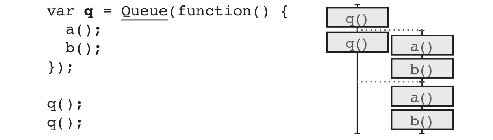

# Grokking Simplicity

* Part 1: Actions, calculations, and data
  * [Chapters 01 - 05](Part1_1.md)
  * [Chapters 06 - 09](Part1_2.md)

* Part 2: First-class abstractions

  * [Chapters: 10-13](Part2.md)

## Chapter 10. First-class functions: Part 1

Code smell: Implicit argument in function name.

There are two characteristics to the implicit argument in function name smell:

1. Very similar function implementations
2. Name of function indicates the difference in implementation

### Refactoring #1: Express implicit argument

Steps:

1. Identify the implicit argument in the name of the function.
2. Add explicit argument.
3. Use new argument in body in place of hard-coded value.
4. Update the calling code.

#### Example

Before:

```js
// Пример одной из функций, к которой применяется рефакторинг.
function setPriceByName(cart, name, price) {
    var item = cart[name];
    var newItem = objectSet(item, 'price', price);
    var newCart = objectSet(cart, name, newItem);
    return newCart;
}

// Использование
cart = setPriceByName(cart, "shoe", 13);
cart = setQuantityByName(cart, "shoe", 3);
cart = setShippingByName(cart, "shoe", 0);
cart = setTaxByName(cart, "shoe", 2.34);
```

```js
// Функция из главы 6.
function objectSet(object, key, value) {
    var copy = Object.assign({}, object);
    copy[key] = value;
    return copy;
}
```

After:

```js
function setFieldByName(cart, name, field, value) {
    var item = cart[name];
    var newItem = objectSet(item, field, value);
    var newCart = objectSet(cart, name, newItem);
    return newCart;
}

// Использование
cart = setFieldByName(cart, "shoe", 'price', 13);
cart = setFieldByName(cart, "shoe", 'quantity', 3);
cart = setFieldByName(cart, "shoe", 'shipping', 0);
cart = setFieldByName(cart, "shoe", 'tax', 2.34);
```

### Refactoring #2: Replace body with callback

Steps:

1. Identify the before, body, and after sections.
2. Extract the whole thing into a function.
3. Extract the body section into a function passed as an argument to that function.

#### Example

Примеры обобщенных функций, в которые передается функция (callback) в виде параметра.

```js
function forEach(array, f) {
    for(var i = 0; i < array.length; i++) {
        var item = array[i];
        f(item);
    }
}
```

```js
function withLogging(f) {
    try {
        f();
    } catch (error) {
        logToSnapErrors(error);
    }
}
```

Использование:

```js
function cookAndEat(food) {
    cook(food);
    eat(food);
}

forEach(foods, cookAndEat);

withLogging(function() { saveUserData(user); });
```

## Chapter 11. First-class functions: Part 2

Продолжение предыдущей главы. Применение refactoring: Replace body with callback.

Примеры функций, которые на вход принимают другие функции.

### Copy-on-write for arrays

```js
function withArrayCopy(array, modify) {
    var copy = array.slice();
    modify(copy);
    return copy;
}
```

Использование. (Данные функции являются pure):

```js
// Usage 1. Устанавливает значение в массиве по определенному индексу.
function arraySet(array, idx, value) {
    return withArrayCopy(array, function(copy) {
        copy[idx] = value;
    });
}

// Usage 2. Добавляет элемент в конец массива.
function push(array, elem) {
    return withArrayCopy(array, function(copy) {
        copy.push(elem);
    });
}

// Usage 3. Получает элемент из конца массива вместе с его удалением.
function drop_last(array) {
    return withArrayCopy(array, function(copy) {
        copy.pop();
    });
}

// Usage 4. Удаляет элемент из начала массива (без его получения).
function drop_first(array) {
    return withArrayCopy(array, function(copy) {
        copy.shift();
    });
}
```

### Copy-on-write for objects

```js
function withObjectCopy(object, modify) {
    var copy = Object.assign({}, object);
    modify(copy);
    return copy;
}
```

Использование. (Данные функции являются pure):

```js
// Usage 1.
function objectSet(object, key, value) {
    return withObjectCopy(object, function(copy) {
        copy[key] = value;
    });
}

// Usage 2.
function objectDelete(object, key) {
    return withObjectCopy(object, function(copy) {
        delete copy[key];
    });
}
```

### Try/catch

```js
function tryCatch(f, errorHandler) {
    try {
        return f();
    } catch(error) {
        return errorHandler(error);
    }
}
```

Использование:

```js
tryCatch(sendEmail, logToSnapErrors)

// Вместо
try {
    sendEmail();
} catch(error) {
    logToSnapErrors(error);
}
```

### When

*Мое примечание: применение сомнительно, только как демонстрация.*

```js
function when(test, then) {
    if(test)
        return then();
}
```

Использование:

```js
when(array.length === 0, function() {
    console.log("Array is empty");
});

// Вместо
if(array.length === 0) {
    console.log("Array is empty");
}
```

### If

*Мое примечание: применение сомнительно, только как демонстрация.*

```js
function IF(test, then, ELSE) {
    if(test)
        return then();
    else
        return ELSE();
}
```

Использование:

```js
IF(array.length === 0, function() {
    console.log("Array is empty");
}, function() {
    console.log("Array has something in it.");
});

// Вместо
if (array.length === 0)
    console.log("Array is empty");
else
    console.log("Array has something in it.");
```

### Returning functions from functions

Для создания подобных функций опять применяется refactoring:
Replace body with callback.

Примеры:

```js
// Обобощенная функция. Возвращает функцию, которая вызывает переданную
// функцию и логирует ее ошибки.
function wrapLogging(f) {
    return function(arg) {
        try {
            f(arg);
        } catch (error) {
            logToSnapErrors(error);
        }
    }
}

// Создание функции, которая наделяет переданную функцию новым поведением.
var saveUserDataWithLogging = wrapLogging(saveUserData);
```

Использование:

```js
// "Обычный" режим вызова функции.
try {
    saveUserData(user);
} catch (error) {
    logToSnapErrors(error);
}

// Использование созданной функции.
saveUserDataWithLogging(user);
```

#### Еще примеры функций, которые возвращают функции

1. Функция, которая создает функцию с игнорированием ошибок:

```js
function wrapIgnoreErrors(f) {
    return function(a1, a2, a3) {
        try {
            return f(a1, a2, a3);
        } catch(error) { // error is ignored
            return null;
        }
    };
}
```

2. Функция, которая создает функцию, которая прибавляет число к другому числу:

```js
function makeAdder(n) {
    return function(x) {
        return n + x;
    };
}
```

Использование:

```js
var increment = makeAdder(1);
var plus10 = makeAdder(10);

increment(10)       // 11
plus10(12)          // 22
```

## Chapter 12. Functional iteration

Три главных функциональных инструмента.

### `map()`

```js
// (1) - takes array and function
// (2) - creates a new empty array
// (3) - calls f() to create a new element based on the element from original array
// (4) - push. Adds the new element for each element in the original array
// (5)
function map(array, f) {                    // (1)
    var newArray = [];                      // (2)
    forEach(array, function(element) {
        newArray.push(f(element));          // (3) and (4)
    });
    return newArray;                        // (5)
}
```

### `filter()`

```js
// (1) - takes array and function
// (2) - creates a new empty array
// (3) - calls f() to check if the element should go in the new array
// (4) - push. Adds the original element if it passes the check
// (5) - returns the new array
function filter(array, f) {                 // (1)
    var newArray = [];                      // (2)
    forEach(array, function(element) {
        if(f(element))                      // (3) and (4)
            newArray.push(element);
    });
    return newArray;                        // (5)
}
```

### `reduce()`

```js
// (1) - takes array, an initial accumulator value, and function
// (2) - initializes the accumulator
// (3) - calls f( ) to calculate the next value of the accumulator,
//       based on current value and current element
// (4) - returns the accumulated value
function reduce(array, init, f) {           // (1)
    var accum = init;                       // (2)
    forEach(array, function(element) {
        accum = f(accum, element);          // (3)
    });
    return accum;                           // (4)
}
```

### Реализация `map()` и `filter()` через `reduce()`

Реализации `map()`:

```js
// using only non-mutating operations (inefficient)
function map(array, f) {
    return reduce(array, [], function(ret, item) {
        return ret.concat(f([item]));
    });
}

// using mutating operations (more efficient)
function map(array, f) {
    return reduce(array, [], function(ret, item) {
        ret.push(f(item));
        return ret;
    });
}
```

Реализации `filter()`:

```js
// using only non-mutating operations (inefficient)
function filter(array, f) {
    return reduce(array, [], function(ret, item) {
        if (f(item)) return ret.concat([item]);
        else return ret;
    });
}

// using mutating operations (more efficient)
function filter(array, f) {
    return reduce(array, [], function(ret, item) {
        if(f(item))
            ret.push(item);
        return ret;
    });
}
```

## Chapter 13. Chaining functional tools

### Функция `maxKey()`

Finds the largest value from an array. It uses a function to determine what part of the
value you should compare.

```js
// (1) - function. Pass in callback sayng how to compare values.
function maxKey(array, init, f) {
    return reduce(array, init, function(biggestSoFar, element) {    // (1)
        if(f(biggestSoFar) > f(element)) {
            return biggestSoFar;
        else
            return element;
    });
}
```

Использование:

```js
maxKey(customer.purchases, {total: 0},
    function(purchase) { return purchase.total; }
);
```

Можно выразить `max()` через `maxKey()`:

```js
// (1) - function. Tell maxKey() to compare the whole value unchanged
// (2) - a function that returns uts argument unchanged is called "identity"
function max(array, init) {
    return maxKey(array, init, function(x) {    // (1)
        return x;                               // (2)
    });
}
```

### Clarifying chains, method 1: Name the steps

Пример функции, которая сложна для понимания. Original:

```js
function biggestPurchasesBestCustomers(customers) {
    var bestCustomers = filter(customers, function(customer) {          // step 1
        return customer.purchases.length >= 3;
    });

    var biggestPurchases = map(bestCustomers, function(customer) {      // step 2
        return maxKey(customer.purchases, {total: 0}, function(purchase) {
            return purchase.total;
        });
    });

    return biggestPurchases;
}
```

Refactoring. Extracted a function for each higher-order function and named it:

```js
// steps are shorter and dense with meaning (короткие и ясночитаемые).
function biggestPurchasesBestCustomers(customers) {
    var bestCustomers = selectBestCustomers(customers);         // step 1
    var biggestPurchases = getBiggestPurchases(bestCustomers);  // step 2
    return biggestPurchases;
}

function selectBestCustomers(customers) {
    return filter(...);
}

function getBiggestPurchases(customers) {
    return map(...);
}
```

### Clarifying chains, method 2: Naming the callbacks

Пример функции, которая сложна для понимания. Original:

```js
function biggestPurchasesBestCustomers(customers) {
    var bestCustomers = filter(customers, function(customer) {                  // step 1
        return customer.purchases.length >= 3;
    });

    var biggestPurchases = map(bestCustomers, function(customer) {              // step 2
        return maxKey(customer.purchases, {total: 0}, function(purchase) {
            return purchase.total;
        });
    });

    return biggestPurchases;
}
```

Refactoring. Extract and name the callbacks:

```js
// steps are still short and meaningful
// (1) - callbacks are named
function biggestPurchasesBestCustomers(customers) {
    var bestCustomers = filter(customers, isGoodCustomer);              // step 1, (1)
    var biggestPurchases = map(bestCustomers, getBiggestPurchase);      // step 2, (1)
    return biggestPurchases;
}

function isGoodCustomer(customer) {             // (1)
    return customer.purchases.length >= 3;
}

function getBiggestPurchase(customer) {         // (1)
    return maxKey(customer.purchases, {total: 0}, getPurchaseTotal);
}

function getPurchaseTotal(purchase) {
    return purchase.total;
}
```

### Оптимизация вызовов chains (stream fusion)

#### Two `map()` steps in a row

Original:

```js
var names = map(customers, getFullName);
var nameLengths = map(names, stringLength);
```

Optimized:

```js
var nameLengths = map(customers, function(customer) {
    return stringLength(getFullName(customer));
});
```

#### Two `filter()` steps in a row

Original:

```js
var goodCustomers = filter(customers, isGoodCustomer);
var withAddresses = filter(goodCustomers, hasAddress);
```

Optimized:

```js
var withAddresses = filter(customers, function(customer) {
    return isGoodCustomer(customer) && hasAddress(customer);
});
```

#### `map()` step followed by `reduce()` step

Original:

```js
var purchaseTotals = map(purchases, getPurchaseTotal);
var purchaseSum = reduce(purchaseTotals, 0, plus);
```

Optimized:

```js
var purchaseSum = reduce(purchases, 0, function(total, purchase) {
    return total + getPurchaseTotal(purchase);
});
```

### Chaining tips

#### Make data

The functional tools work best when they work over an entire array of data.
If you find the for loop is working over a subset of the data, try to break that data out
into its own array. Then `map()`, `filter()`, and `reduce()` can make short work of it
(помогут быстро обработать эти отдельные массивы).

#### Operate on the whole array

Стараться обрабатывать массивы в одно действие.
`map()` transforms every element.
`filter()` keeps or removes every element.
`reduce()` combines every element. Make a bold move and process the whole thing.

#### Many small steps

Для сложных алгоритмов их разбиение на более мелькие шаги часто помогает облегчить
понимание их работы и читаемость.

#### Ещё tips

* Replace conditionals with `filter()`

* Извлекайте множество вспомогательных функций таких как `map()`, `filter()` и `reduce()`.

* Experiment to improve

### Debugging tips for chaining

* Стараться использовать понятные имена в функциях, параметрах, переменных.
* Выводить (на экран, консоль, логи, ...) промежуточные результаты.
* Отслеживать используемые типы данных
  * `map()` возвращает массив с элементами того же (редко) или нового типов.
  * `filter()` возвращает массив с элементами того же типа.
  * `reduce()` возвращает значение того же типа, что и initial.

### Some other functional tools

#### `pluck()`

Удобная функция-замена `map()` для более удобного получения поля объекта.

```js
function pluck(array, field) {
    return map(array, function(object) {
        return object[field];
    });
}
```

Usage and variation:

```js
// Usage
var prices = pluck(products, ‘price’);

// Variation
function invokeMap(array, method) {
    return map(array, function(object) {
        return object[method]();
    });
}
```

#### `concat()`

Удаляет один уровень вложенности у массива:

```js
function concat(arrays) {
    var ret = [];
    forEach(arrays, function(array) {
        forEach(array, function(element) {
            ret.push(element);
        });
    });
    return ret;
}
```

Usage and variation:

```js
// Usage
var purchaseArrays = pluck(customers, "purchases");
var allPurchases = concat(purchaseArrays);

// Variation. Also called mapcat() or flatMap() in some languages
function concatMap(array, f) {
    return concat(map(array, f));
}
```

#### `frequenciesBy()` and `groupBy()`

Подсчет количества и группировка. Данные функции возвращают объекты (хэш-карты):

```js
function frequenciesBy(array, f) {
    var ret = {};
    forEach(array, function(element) {
        var key = f(element);
        if(ret[key]) ret[key] += 1;
        else ret[key] = 1;
    });
    return ret;
}

function groupBy(array, f) {
    var ret = {};
    forEach(array, function(element) {
        var key = f(element);
        if(ret[key]) ret[key].push(element);
        else ret[key] = [element];
    });
    return ret;
}
```

Usage:

```js
var howMany = frequenciesBy(products, function(p) {
    return p.type;
});
```

```text
> console.log(howMany[‘ties’])      // 4
```

```js
var groups = groupBy(range(0, 10), isEven);
```

```text
> console.log(groups)
{
    true: [0, 2, 4, 6, 8],
    false: [1, 3, 5, 7, 9]
}
```

## Chapter 14. Functional tools for nested data

### Functional tool: `update()`

`update()` let's us take a function that operates on a single value
and apply it in place inside of an object (treated as hash maps):

```js
// (1) - takes the object to modify
//       the location of the value (key)
//       the modify operation - function to call
// (2) - returns the modified object (copy-on-write)
function update(item, field, modify) {                  // (1)
    var value = item[field];                            // get
    var newValue = modify(value);                       // modify
    var newItem = objectSet(item, field, newValue);     // set
    return newItem;                                     // (2)
}
```

### Steps for replace get, modify, set with `update()`

1. Identify get, modify, and set.

2. Replace with `update()`, passing modify as callback.

### Functional tool: `update2()`, `update3()`, etc

`update2` - the 2 means nested twice. Modify a value nested twice within objects.

```js
function update2(object, key1, key2, modify) {
    return update(object, key1, function(value1) {
        return update(value1, key2, modify);
    });
}
```

Похожим образом получаются остальные функции `update3()`, `update4()`, ...
`update3()`:

```js
function update3(object, key1, key2, key3, modify) {
    return update(object, key1, function(object2) {
        return update2(object2, key2, key3, modify);
    });
}
```

### Functional tool: `nestedUpdate()`

It takes an object, a path of keys to follow into the nesting of the objects, and a
function to call on the value once it is found.
`nestedUpdate()` works on paths of any length, including zero. It is *recursive*.

```js
// (1) - base case (path of zero length)
// (2) - make progress toward (по направлению к) base case (by dropping one path element)
// (3) - recursive case
function nestedUpdate(object, keys, modify) {
    if(keys.length === 0)
        return modify(object);                              // (2)
    var key1 = keys[0];
    var restOfKeys = drop_first(keys);                      // (2)
    return update(object, key1, function(value1) {
        return nestedUpdate(value1, restOfKeys, modify);    // (3)
    });
}
```

### The anatomy of safe recursion

1. Base case
2. Recursive case
3. Progress toward (по направлению к) the base case

## Chapter 15. Isolating timelines

### The two fundamentals of timeline diagrams

0. **Only actions** need to be in timelines. **Calculations can be left out**
because they don't depend on when they are run.

1. If two actions occur in order, put them in the same timeline.

2. If two actions can happen at the same time or out of order (не по порядку),
they belong (находятся) in separate timelines.

### Two tricky details about the order of actions

1. `++` and `+=` are really three steps

```js
total++;
```

This single operator does three steps:

```js
var temp = total;       // read (action)
temp = temp + 1;        // addition (calculation)
total = temp;           // write (action)
```

Timeline:

```text
Read total
    |
Write total
```

2. Arguments are executed before the function is called

```js
console.log(total);
```

Equivalent code:

```js
var temp = total;
console.log(temp);
```

Timeline:

```text
Read total
    |
console.log()
```

### Step 1. Drawing timeline

1. Identify the actions. Ignore calculations.
2. Draw each action, whether sequential or parallel.
3. Simplify using platform-specific knowledge.

### Asynchronous calls require new timelines

### Different languages, different threading models

* Single-threaded, synchronous. (example: PHP)

* Single-threaded, asynchronous. (example: JavaScript)

* Multi-threaded. (example: Java, Python, Ruby, C, C#)

* Message-passing processes. (example: Erlang, Elixir)

### Timeline diagrams capture the two kinds of sequential code

1. Code that can be interleaved (чередоваться/меняться местами).

Any amount of time can pass between two actions.

```text
action 1
   |
action 2
```

2. Code that cannot be interleaved

Two actions run one after the other. Порядок их выполнения не может быть изменен.

```text
action 1
action 2
```

### Principles of working with timelines

1. Fewer (меньшее количество) timelines are easier.

2. Shorter timelines are easier.

3. Sharing fewer (меньшее число) resources is easier.

4. Coordinate when resources are shared. (Необходима координация использования общих
ресурсов между различными timeline'ами.)

5. Manipulate time as a first-class concept. (создание повторно используемых объектов
для манипуляций с timeline).

### Simplifying the timeline

1. Consolidate all actions on a single timeline.

2. Consolidate timelines that end by creating one new timeline.

### Timelines that share resources can cause problems

We can remove problems by not sharing resources

#### Converting a global variable to a local one

1. Identify the global variable we would like to make local.

2. Replace the global variable with a local variable.

#### Converting a global variable to an argument

1. Identify the implicit (неявный) input.

2. Replace the implicit (неявный) input with an argument.

## Chapter 16. Sharing resources between timelines

*Мое примечание: аццкий ад с этими callback.*

A *concurrency primitive* is a piece of reusable functionality that helps share
resources across timelines.

### Using `Queue` as concurrency primitive

```js
// (1) - Queue() is very generic, so the variable names are generic as well
// (2) - we allow done() to accept an argument.
// (3) - set up asynchronous call to item.callback.
function Queue(worker) {                // (1)
    var queue_items = [];               // (1)
    var working = false;

    function runNext() {
        if(working)
            return;
        if(queue_items.length === 0)
            return;
        working = true;
        var item = queue_items.shift();
        worker(item.data, function(val) {       // (2)
            working = false;
            setTimeout(item.callback, 0, val);  // (3)
            runNext();
        });
    }

    return function(data, callback) {
        queue_items.push({
            data: data,
            callback: callback || function(){}
        });
        setTimeout(runNext, 0);
    };
}
```

Usage:

```js
// (1) - cart will get the item data; we call done() when we're done.
// (2) - here we know the specifics of what we're doing, so we use specific variable names.
function calc_cart_worker(cart, done) {         // (1)
    calc_cart_total(cart, function(total) {     // (2)
        update_total_dom(total);
        done(total);
    });
}

var update_total_queue = Queue(calc_cart_worker);
```

### Using `DroppingQueue` as concurrency primitive

Выполняет только ограниченное число/(последний) action из всех action в очереди.

По сути, в `DroppingQueue` небольшое улучшение по сравнению с предыдущим `Queue`.

*Мое примечание: DroppingQueue - программный аналог бездребезговой кнопки.*

```js
// max - pass the max of tasks to keep. 1 - будет выполнен только 1 task.
// (1) - keep dropping items from the front until we are under or at max.
function DroppingQueue(max, worker) {
    var queue_items = [];
    var working = false;

    function runNext() {
        if(working)
            return;
        if(queue_items.length === 0)
            return;
        working = true;
        var item = queue_items.shift();
        worker(item.data, function(val) {
            working = false;
            setTimeout(item.callback, 0, val);
            runNext();
        });
    }

    return function(data, callback) {
        queue_items.push({
            data: data,
            callback: callback || function(){}
        });
        while(queue_items.length > max)      // (1)
            queue_items.shift();             // (1)
        setTimeout(runNext, 0);
    };
}
```

Usage:

```js
function calc_cart_worker(cart, done) {
    calc_cart_total(cart, function(total) {
        update_total_dom(total);
        done(total);
    });
}

// 1 - drop all but one (будет вызван только послений worker)
var update_total_queue = DroppingQueue(1, calc_cart_worker);
```

### Principle: Use real-world sharing as inspiration (источники для вдохновения)

Examples:

* *Locks on bathroom* doors enable a one-person-at-a-time discipline.
* *Public libraries* (book pools) allow a community to share many books.
* *Blackboards* allow one teacher (one writer) to share information with an entire class
(many readers).

## Chapter 17. Coordinating timelines

### A concurrency primitive for cutting timelines. `Cut()`

In JavaScript (as single thread): Every timeline will call that function when it's done.
Every time the function is called, we increment the number of times it has been called.
Then, when the last function calls it, it will call a callback:

```js
// num - number of timelines to wait for
// callback - the callback to execute when they are all done
function Cut(num, callback) {
    var num_finished = 0;            // initialize the count to zero
    return function() {          // the returned function is called at the end of each timeline
        num_finished += 1;       // each time function is called, we increment the count
        if(num_finished === num)
            callback();          // when the last timeline finishes, we call the callback
    };
}
```

### A primitive to call something just once. `JustOnce()`

Functionality thats perform an action just once, no matter how many times the code may call
that action.

```js
function JustOnce(action) {         // pass in an action
    var alreadyCalled = false;      // remember if we've called it already
    return function(a, b, c) {
        if(alreadyCalled) return;   // exit early if we've called it before
        alreadyCalled = true;       // we're about to call it, so remember
        return action(a, b, c);     // call the action, passing through the arguments
    };
}
```

### Recap. Concurrency primitives

#### `Queue()`

Items added to the queue are processed in a separate, single timeline. Each item is
handled in order to completion before the next is started:



#### `Cut()`

Call a callback in a new timeline only after all timelines have completed:


#### `JustOnce()`

An action wrapped in `JustOnce()` will only be executed once, even if the wrapped
function is called multiple times:


#### `DroppingQueue()`

This is like a Queue(), but will skip tasks if they build up quickly:


