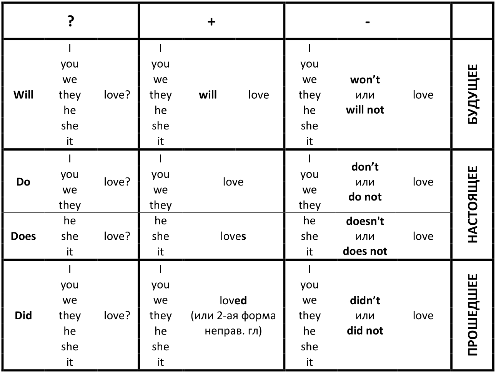

# Урок 1. Алгоритм глагола. Правильные и неправильные глаголы

Любое действие в английском языке может происходить в **настоящем**, **прошедшем** и
**будущем** времени. При этом мы можем что-то **утверждать**, **отрицать** или **задавать вопрос**.

Так образуются 9 возможных вариантов предложений - 9 ячеек таблицы. При этом необходимо
знать особенности английского глагола:

* **строгий порядок слов** в предложении, а именно сначала подлежащее, а потом сказуемое
(в утвердительных и отрицательных конструкицях)

* деление глаголов на **правильные** и **неправильные**

Перед тем как изучить деление глаголов на правильные и неправильные, рассмотрим
**личные местоимения**, к которым будет прикрепляться наш глагол:

* **I** - я (всегда пишется с заглавной буквы)
* **you** - ты/вы
* **we** - мы
* **they** - они
* **he** - он
* **she** - она
* **it** - это

**Например**:

* I help - я помогаю.

* It doesn't work - это не работает.

## Правильные и неправильные глаголы

Глаголы в английском делятся на 2 группы: **правильные** и **неправильные**. Мы используем
формы правильных и неправильных глаголов в простом прошедшем времени. Основная разница
между ними заключается в окончаниях:

* **Правильные глаголы** - в прошедшем времени добавляется окончание **-ed** к основе:
  * like -> lik**ed**
  * work -> work**ed**
  * ask -> ask**ed**

* **Неправильные глаголы** - в прошедшем времени образуются не путем добавления окончания **-ed**,
а путем изменения своей первоначальной формы:
  * go - **went**
  * fly - **flew**
  * leave - **left**

Обе формы (окончание -ed и 2-я форма неправильного глагола) ставятся в таблице только в
**прошедшем времени в утверждении**. Конечно, большая часть глаголов относится к правильным,
но избежать использования неправильных глаголов невозможно, поэтому такие глаголы нужно только
учить.

