# Git. Большой практический выпуск

*Создан:*  03.10.2022, 10:02
*Источник:* [Git. Большой практический выпуск](https://www.youtube.com/watch?v=SEvR78OhGtw)

## Тезисы

- Git - распределенная система версионирования файлов.

- Файлы могут быть:

- `tracked` - под версионным контролем.
  - `modidied` - файл изменен.
  - `commited` - файл сохранен (зафиксирован).
  - `staged` - подготовленные к commit.
- `untracked` - не под версионным контролем.

`index` (staging area) - область файлов подготовленных к commit.

- `HEAD` - метка, которая указывает на какой-либо commit. Текущее состояние рабочего каталога.

- Как правило, в ветке `master` находится стабильный код.

- Два вида тегов:
  - *Аннотированные*. Полноценный объект.
  - *Легковесные*. Просто указатель.

## Первоначальная настройка Git

Надо указать:

- Имя пользователя (отображается в commit)
- e-mail пользователя (отображается в commit)
- Текстовый редактор по умолчанию

Команда Для работы с конфигурацией:

```text
git config
```

### Три уровня конфигурации git

1. Конфигурация для всех пользователей системы

```text
git config --system
```

2. Конфигурация для текущего пользователя системы

```text
git config --global
```

3. Конфигурация для текущего репозитория, с которым сейчас работаем

```text
git config
```

или

```text
git config --local
```

### Конфигурация для текущего пользователя системы

*(Делается только раз, после установки git на машину).*

- Задание имени пользователя:

```text
git config -- global user.name "Artem Agafonov"
```

- Задание e-mail пользователя:

```text
git config -- global user.email aeagafonov@lanit.ru
```

Текстовый редактор можно выбрать при первом commit.

## Команды в консоли не относящиеся к git

- Создание директории

```text
mkdir git
```

- Переход в директорию

```text
cd git
```

- Перейти в родительскую директорию:

```text
cd ..
```

- Вывод содержимого текущей директории. В Linux:

```text
ls -la
```

- `-l` - вывод файлов и директорий в виде списка
- `-a` - отобразить все срытые файлы и каталоги

- Создание пустого файла. В Linux:

```text
touch app.py
```

## Игнорирование файлов в git (файл `.gitignore`)

1. Необходимо создать файл `.gitignore` в директории с `.git` (корень репозитория).

2. В `.gitignore` можно добавить:

```text
### Комментарий
# Еще один комментарий

__pycache__/         # Игнорирование директории
log/                 # Игнорирование директории

*.py[cod]            # Игнорирование файлов *.pyc *.pyo *.pyd
docker-compose.yaml  # Игнорирование определенного файла

resources/products.json  # Игнорирование файла в поддиректории
```

## Команды git. Работа в одной ветке

### Создание репозитория

```text
git init
```

Создается директория `.git` - здесь хранится история репозитория.

### Просмотр истории commit'ов

#### Команда `git log`

*Плюс, можно посмотреть метку `HEAD`.*

```text
git log
```

Более подробный вывод commit'ов:

```text
git log -p
```

#### Команда `git show`

Отобразить детальную информацию по commit'у:

```text
git show хэш_коммита
```

### Просмотр статуса репозитория и файлов

Просмотр статуса репозитория, в каком состоянии находятся файлы:

```text
git status
```

### Добавление файлов/директорий в commit (`git add`)

Добавление одного файла:

```text
git add File1
```

Добавление нескольких файлов:

```text
git add File1 File2
```

### Фиксация commit (`git commit`)

- Есть `commited` файлы:

```text
git commit -m "Some changes"
```

- `-m` - небольшое сообщение-описание commit.

Если флаг не указывать, то откроется текстовый редактор для ввода commit message.

- Есть какие-то `modified` файлы, которые находятся под версионным контролем:

```text
git commit -am "Message. Some changes"
```

Берутся все измененные файлы под контролем, переносятся в commit (аналог команд `git add`), создается commit.

### Откат изменений в файле до последнего commit (`git restore`)

`File1` находится в состоянии `modified`:

```text
git restore File1
```

### Откат изменений в файле до `indexed` состояния

```text
git restore --staged File1
```

### Показ изменений в файле (`git diff`)

 Cо времени последнего commit:

```text
git diff
```

В commited файле (показать изменения с момента последнего состояния файла `indexed`):

```text
git diff --staged
```

### Переименование или перемещение файлов (`git mv`)

- Переименование (из `app.py` в `application.py`):

```text
git mv app.py application.py
```

- Переименование и перемещение файла:

```text
git mv app.py /resources/application.py
```

### Удаление файла из git и из файловой системы (`git rm`)

```text
git rm File1
```

### Удаление файла только из git

(В файловой системе файл останется).

```text
git rm --cached File1
```

### Работа с тегами (`git tag`)

#### Добавление легковесного тега (`git tag`)

При нахождении на определенном commit создать метку `v1`:

```text
git tag v1
```

#### Добавление аннотированного тега

```text
git tag -a R2020.4 -m "Release 2020.4"
```

`-m` добавить сообщение к тегу

#### Показ всех тегов

```text
git tag
```

#### Push тега на сервер

По умолчанию команда `push` не отправляет теги на удаленный сервер.
Чтобы отправить тег `v1` надо:

```text
git push origin v1
```

#### Push всех тегов на сервер

```text
git push --tags
```

## Команды git. Работа с несколькими ветками

### Посмотреть метку `HEAD` (где она)

```text
git log
```

### Посмотреть все ветки

```text
git branch -a
```

### Создание новой ветки (`git branch`)

*Примечание: `new-api`, `bugfix` - название веток.*

```text
git branch new-api
```

### Создание новой ветки и переместиться на нее

`dev` - новая ветка.

```text
git checkout -b dev
```

- Создать новую ветку от определенного commit и переместиться на нее:

```text
git checkout -b new-branch 9f5a1...
```

### Удаление ветки

- Если удаляемая ветка была куда-либо смержена:

```text
git branch -d bugfix
```

- Если удаляемая ветка не была смержена:

```text
git branch -D bugfix
```

### Перемещение указателя `HEAD` вместе с веткой

Это самый прямой, ОПАСНЫЙ и часто используемый вариант. Например, было так:

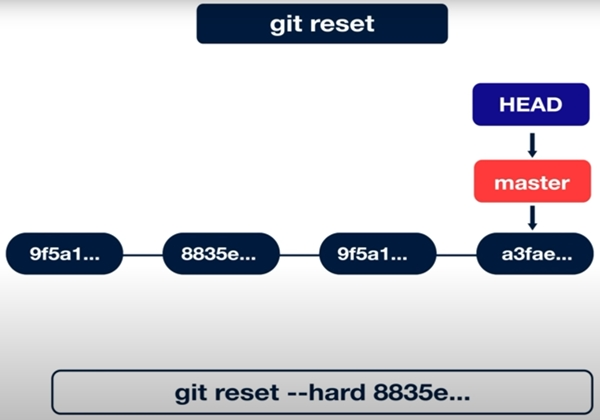

Выполнили:

```text
git reset --hard 8835e...
```

HEAD вместе с веткой `master` переместился на commit `8835e`, commit'ы `9f5a1...` и `a3fae` исчезли из истории ветки (но не удалились).

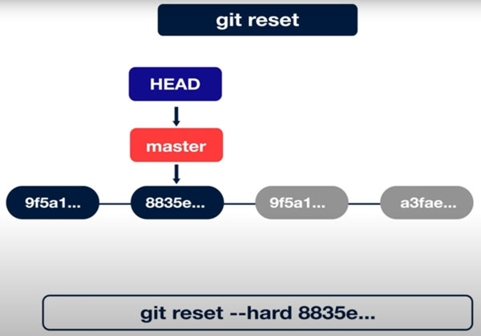

Зная hash commit'а `9f5a1...` или `a3fae` можно переместиться на них обратно.

### Переключение на другую ветку (`git checkout`)

```text
git checkout new-api
```

HEAD перейдет с `master` на `new-api`.

- Еще можно передать hash-сумму commit, тогда HEAD перейдет на этот commit:

```text
git checkout 8835e...
```

Скорее всего редко где используется. Указатель HEAD может перейти в статус `detached`, когда он не указывает ни на одну из веток.

### Слияние веток (`git merge`)

Пример как слить изменения из ветки `bugfix` и `new-api` в `master`:

Шаг 1. Переход на ветку `master`:

```text
git checkout master
```

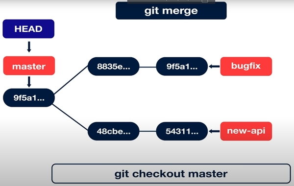

Шаг 2. Fast-forward merge (слияние):

```text
git merge bugfix
```

Fast-forward слияние: просто перенос метки `master` на последнюю метку ветки `bugfix`.

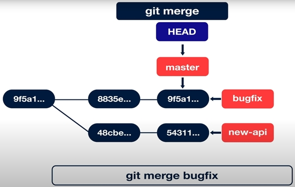

Шаг 3. Необязателен. Удаление ветки `bugfix`:

```text
git branch -d bugfix
```

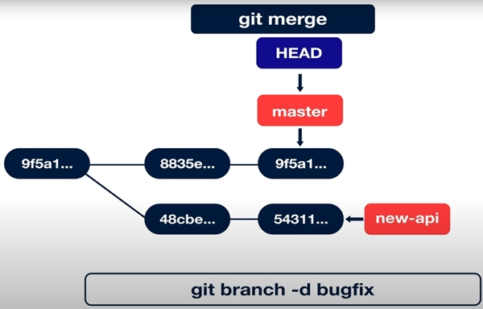

Шаг 4. Слияние `new-api` с `master`

```text
git merge new-api
```

Это `merge` слияние - создание дополнительного merge commit, который ссылается на два сливаемых commit'а.

На рисунке merge-commit это `a3fae...`

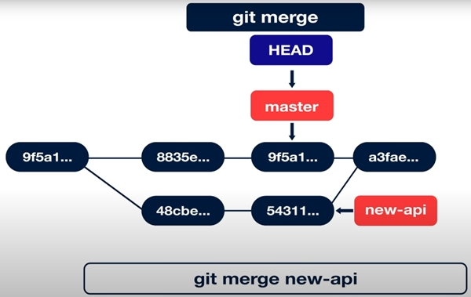

И... перенос  метки `master` на этот merge commit:

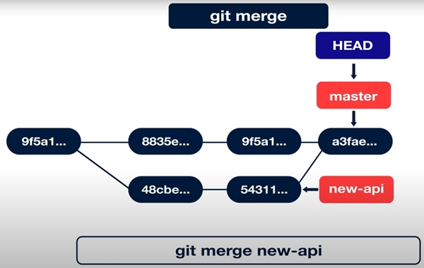

Шаг 5. Необязателен. Удаление ветки `new-api`:

```text
git branch -d new-api
```

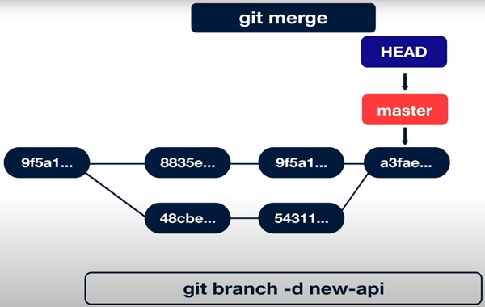

## Команды git. Работа с удаленными репозиториями

### Посмотреть какие удаленные репозитории доступны (`git remote`)

```text
git remote -v
```

`-v` - более подробная информация

Репозитории: `fetch` - для чтения, `push` - для записи.

### Добавить на удаленный сервер локальный git репозиторий (`git remote add`)

```text
git remote add origin адрес-git-репозитория.git
```

- `remote add` - добавить на удаленный сервер
- `origin` - имя репозитория по умолчанию

#### Отправить изменения на сервер (`git push`)

Отправить изменения на сервер `origin` в ветку `master` с ветки, на которой сейчас нахожусь:

```text
git push origin master
```

#### Чтобы не писать `git push origin master`

Можно выполнить **один раз** команду:

```text
git push --set-upstream origin master
```

git свяжет локальную ветку `master` с удаленной веткой `origin`.

В дальнейшем можно будет просто выполнять `git push`, находясь на ветке `master`.

### Клонировать репозиторий (`git clone`)

```text
git clone адрес-git-репозитория.git
```

### Забрать изменения с удаленного сервера (`git pull`)

```text
git pull origin master
```

Команда `git pull` по сути выполняет две команды:

```text
git fetch origin
git merge origin/master
```

### Получить актуальную информацию о репозитории с удаленного сервера

Обновляет ветки слежения

```text
git fetch origin
```

Пример. Есть локальный репозиторий. После команды `git push origin master` появляется локальный указатель ветки `remotes/origin/master`:

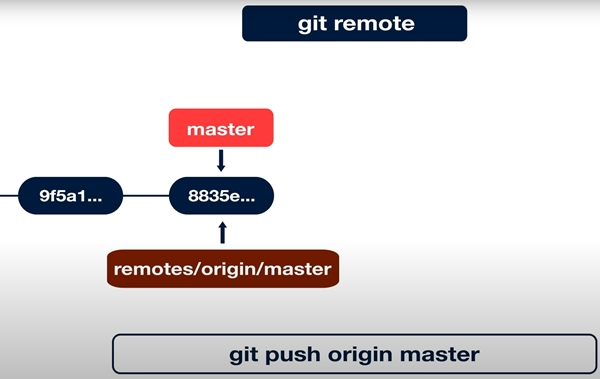

`remotes/origin/master` называют "веткой слежения" (remote reference). Этот указатель мы не можем никак перемещать.

Получаем актуальную информацию о состоянии удаленных веток `git fetch origin`:

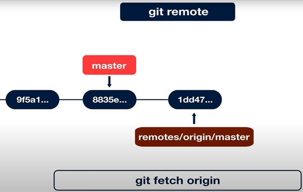

Здесь обновлены ветки слежения.

Как увидеть у себя локально изменения - сделать merge:

```text
git merge origin/master
```

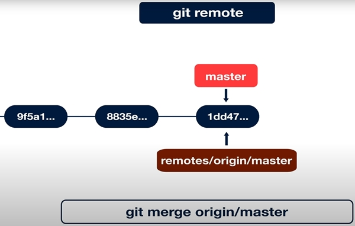

По сути, `git fetch` и `git merge` можно заменить одной командой:

```text
git pull origin master
```

### Перебазирование (`git rebase`)

Пример.

Есть ветки `master` и `new-api`. Надо влить изменения в `new-api` из `master`:

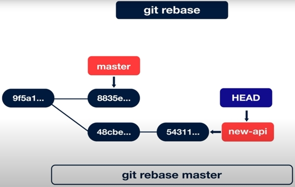

Находясь в ветке `new-api` выполним:

```text
git rebase master
```

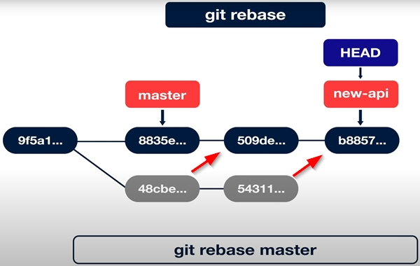

1. Вначале будет взят общий для двух веток commit (`9f5a1...`)

2. Потом остальные commit'ы в ветке `new-api` - это `48cbe...` и `54311..` будут перебазированы в `509de...` и `b8857...`.

Commit'ы `48cbe...` и `54311...` не удаляются, перейти на них можно только зная их hash значение.

#### Недостаток перебазирования

Допустим, сделали `push` для ветки `new-api` на сервер (`origin/new-api`)


А локально сделали такой rebase:

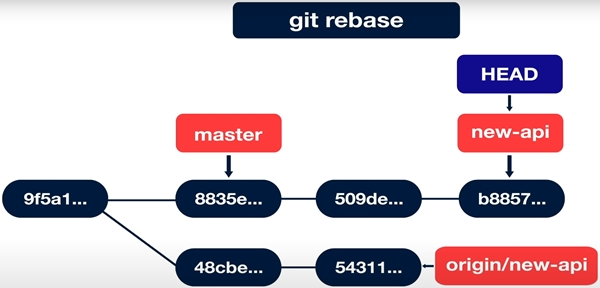

Простой `git push` в такой ситуации будет отклонен сервером.

#### Принудительный `push` (**ОПАСНО**)

Можно сделать принудительный `push` такого rebase и тогда сервер перепишет у себя историю изменений:

```text
git push origin master -f
```

Но при наличии копии репозитория сервера у других пользователей этот прием сломает историю изменений на их машинах.

#### Отключение принудительного `push`

На github:

- Branches > Branch protection rules > Add rule
- Ввести branch name pattern (например `master`) и нажать `Create`.
