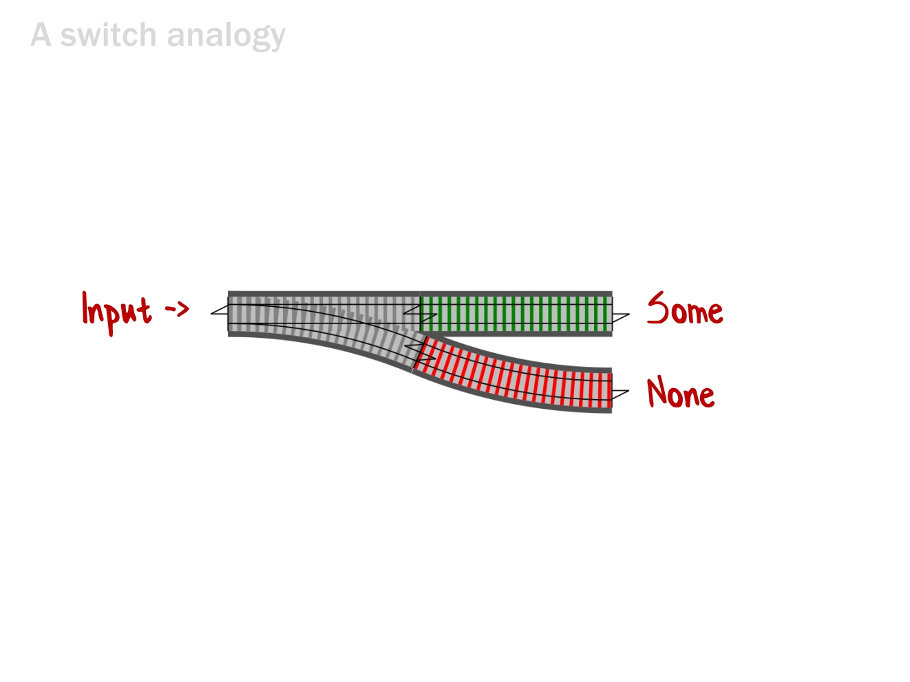

# Functional Programming Design Patterns

*Источник:* https://fsharpforfunandprofit.com/fppatterns/

*Перевод:* https://habr.com/ru/post/337880/

## Краткое содержание

* Core Principles of FP design
  * Functions, types, composition

* Functions as parameters
  * Functions as interfaces (функции в качестве интерфейсов)
  * Partial application & dependency injection

* Monads
  * Error handling, Async

* Maps
  * Dealing with wrapped data
  * Functors

* Monoids
  * Aggregating data and operations

## 1. Основные принципы функционального проектирования (дизайна)

* Functions are things (Функции как объекты первого класса)

* Composition everywhere (Композиция как основной "строительный материал")

* Types are not classes

### 1.1. Функции как объекты первого класса (Functions are things)

Функции и значения равны в правах:

```fsharp
let z = 1
let add x y = x + y     // int -> int ->int
```

#### Функции как входы и выходы

Function as output:

```fsharp
let add x = (fun y -> x + y)
```

Function as input:

```fsharp
let useFn f = (f 1) + 2
```

Function as parameter:

```fsharp
let transformInt f x = (f x) + 1
```


### 1.2. Композиция как основной "строительный материал"

```fsharp
apple -> banana     // 1)
banana -> cherry    // 2)

// Composition
apple -> banana >> banana -> cherry
apple -> cherry                         // result
```

#### Design paradigm: Functions all the way down

Композиция применима как на уровне совсем небольших функций,
так и на уровне целого приложения.

Уровни дизайна (от нижнего к верхнему)

1) *Low-level operation*


Composition:


2) *Service*


3) *Use-case* (цепочка вариантов)


4) *Web application*


### 1.3. Types are not classes

**Тип** - это допустимое множество входных и выходных значений.

Примеры:

```text
Int, Customer, int -> int
```

* Данные отделены от поведения

* Types can be composed too (like functions - "algebgraic types")

#### Product type

**Логическое "И"**

Если взять множество людей и множество дат, "перемножив" их
мы получим множество дней рождений.

```text
Set of people * Set of dates
```

```fsharp
type Birthday = Person * Date
```

#### Sum type

**Логическое "ИЛИ"**

Discriminated union - сложное название.
Проще представлять себе этот тип как выбор.

Можно на выбор оплатить товар наличными, банковским переводом или с помощью
кредитной карты.
Между этими вариантами нет ничего общего, кроме того,
все они являются способом оплаты.

```text
Set of Cash values + Set of Cheque values + Set of CreditCard values
```

```fsharp
type PaymentMethod =  
| Cash
| Cheque of ChequeNumber
| Card of CardType * CardNumber
```

#### Design principle: Strive for totality (Стремление к "полноте")

"Полнота" означает, что для каждого input у функции есть valid output.

Пример: есть функция деления на 0:

```csharp
int TwelveDividedBy(int input)
{
    switch (input)
    {
        case 3: return 4;
        case 2: return 6;
        case 1: return 12;
        case 0: return ??;    // What happens here?
    }
} 
```

Как обрабатывать деление на 0?

**Как делать не надо**: выброс исключения:

```csharp
int TwelveDividedBy(int input)    // int -> int
{
    switch (input)
    {
        case 3: return 4;
        case 2: return 6;
        case 1: return 12;
        case 0:
            throw InvalidArgException;
    }
}
```

`int -> int` ложная сигнатура

**Решение 1**: Constrain the input

```csharp
int TwelveDividedBy(NonZeroInteger input)   // NonZeroInteger -> int
{
    switch (input)
    {
        case 3: return 4;
        case 2: return 6;
        case 1: return 12;
        case -1: return -12;
    }
}
```

**Решение 2**: Extend the output

```csharp
int TwelveDividedBy(int input)    // int -> int option
{
    switch (input)
    {
        case 3: return Some 4;
        case 2: return Some 6;
        case 1: return Some 12;
        case 0: return None;      // 0 is valid input
    }
}
```

Если использовать решения 1 и 2:

* Можно использовать сигнатуру и систему типов в качестве документации.

* Операции не допустимые в реальном мире не будут компилироваться в приложении,
что дает более надежную защиту, чем модульные тесты.

Более подробно смотреть тут:
[fsharpforfunandprofit.com/ddd](https://fsharpforfunandprofit.com/ddd/)

## 2. Functions as parameters

### Guideline: Parameterize all the things

*Пример 1*:

```fsharp
let printList() =
    for i in [1..10] do             // Hard-coded data
        printfn "the number is %i" i
```

Параметризация:

```fsharp
let printList aList =
    for i in aList do
        printfn "the number is %i" i
```

И еще дальше:

```fsharp
let printList anAction aList =
    for i in aList do
        anAction i
```

*Пример 2*:

```fsharp
public static int Product(int n)
{
    int product = 1;                // Initial Value
    for (int i = 1; i <= n; i++)
    {
        product *= i;               // Action
    }
    return product;
}
public static int Sum(int n)
{
    int sum = 0;                    // Initial Value
    for (int i = 1; i <= n; i++)
    {
        sum += i;                   // Action
    }
    return sum;
}
```

```fsharp
let product n =
    let initialValue = 1
    let action productSoFar x = productSoFar * x
    [1..n] |> List.fold action initialValue

let sum n =
    let initialValue = 0
    let action sumSoFar x = sumSoFar + x
    [1..n] |> List.fold action initialValue
```

Есть множество вспомогательных функций: `fold`, `map`, `reduce`, `collect` и т.д.

### 2.1. Functions as interfaces (функции в качестве интерфейсов)

Example on C#:

```csharp
interface IBunchOfStuff
{
    int DoSomething(int x);
}
```

An interface with one method is a just a function type:

```fsharp
type IBunchOfStuff: int -> int
```

Any function with that type is compatible with it:

```fsharp
let add2 x = x + 2 // int -> int
let times3 x = x * 3 // int -> int
```

Object-oriented strategy pattern (C#):

```csharp
class MyClass
{
    public MyClass(IBunchOfStuff strategy) {..}

    int DoSomethingWithStuff(int x)
    {
        return _strategy.DoSomething(x)
    }
}
```

#### Functional strategy pattern

```fsharp
let DoSomethingWithStuff strategy x =     // int -> int
    strategy x
```


#### Decorator pattern

```fsharp
let isEven x = (x % 2 = 0)                        // int -> bool
```


Using function parameter:

```fsharp
let isEvenWithLogging = logger isEven             // int -> bool
```


Using function composition:

```fsharp
let isEvenWithLogging = log >> isEven >> log      // int -> bool
```


### Every function is a one parameter function

Writing functions in different ways:

1) Normal (Two parameters):

```fsharp
let add x y = x + y             // int -> int -> int
```

2) As a thing (no parameters):

```fsharp
let add = (fun x y -> x + y)    // int -> int -> int
```

3) One parameter:

```fsharp
let add x = (fun y -> x + y)    // int -> (int -> int)
```

Пример:

```fsharp
let three = 1 + 2
let three = (+) 1 2       // "+" is a two parameter function
let three = ((+) 1) 2
```

```fsharp
let add1 = (+) 1          // "+" is a one param function
let three = add1 2
```

### 2.2. Pattern: Partial application (частичное применение)

Пример:

*Two parameters*:

```fsharp
let name = "Scott"
printfn "Hello, my name is %s" name             // Two parameters
```

```fsharp
let name = "Scott"
(printfn "Hello, my name is %s") name
```

*One parameter*:

```fsharp
let name = "Scott"
let hello = (printfn "Hello, my name is %s")    // One parameter
hello name
```

#### Pattern: Use partial application when working with lists

Пример 1:

```fsharp
let hello = printfn "Hello, my name is %s"      // Partial application

let names = ["Alice"; "Bob"; "Scott"]
names |> List.iter hello
```

Пример 2:

```fsharp
let add1 = (+) 1                                // Partial application
let equals2 = (=) 2                             // Partial application

[1..100]
|> List.map add1
|> List.filter equals2
```

#### Pattern: Use partial application to do dependency injection

Пример 1:

```fsharp
type GetCustomer = CustomerId -> Customer

// This function requires a connection.
// DbConnection -> CustomerId -> Customer
let getCustomerFromDatabase connection (customerId : CustomerId) =
    // from connection
    // select customer
    // where customerId = customerId
```

The partially applied function does NOT require a connection:

```fsharp
// CustomerId -> Customer
let getCustomer1 = getCustomerFromDatabase myConnection
```

Пример 2:

```fsharp
// This function requires a dictionary.
// Dictionary<Id, Customer> -> CustomerId -> Customer
let getCustomerFromMemory dict (customerId : CustomerId) =
    dict.Get(customerId)
```

The partially applied function does NOT require a dictionary:

```fsharp
// CustomerId -> Customer
let getCustomer2 = getCustomerFromMemory dict
```

## 3. Continuations (продолжения)

Пример с делением:

```csharp
int Divide(int top, int bottom) 
{
    if (bottom == 0)
    {
        // кто решил, что нужно выбросить исключение?
        throw new InvalidOperationException("div by 0");
    }
    else 
    {
        return top/bottom;
    }
}
```

Вместо того, чтобы решать за пользователя, мы можем предоставить решение
пользователю:

```csharp
void Divide(int top, int bottom, Action ifZero, Action<int> ifSuccess)
{
    if (bottom == 0)
    {
        ifZero();
    }
    else
    {
        ifSuccess( top/bottom );
    }
}
```

Версия на F#:

```fsharp
let divide ifZero ifSuccess top bottom =   // Four parameters is a lot though!
    if (bottom=0)
    then ifZero()
    else ifSuccess (top/bottom)
```

*Улучшения. Вариант 1.* Вывод сообщений:

```fsharp
// Setup the functions to: print a message
let ifZero1 () = printfn "bad"
let ifSuccess1 x = printfn "good %i" x

// Partially apply the continuations
let divide1 = divide ifZero1 ifSuccess1

// Test. Use it like a normal function - only two parameters
let good1 = divide1 6 3
let bad1 = divide1 6 0
```

*Улучшения. Вариант 2.* Return `Option`:

```fsharp
// Setup the functions to: return an Option
let ifZero2() = None
let ifSuccess2 x = Some x

// Partially apply the continuations
let divide2 = divide ifZero2 ifSuccess2

// Test. Use it like a normal function - only two parameters
let good2 = divide2 6 3
let bad2 = divide2 6 0
```

*Улучшения. Вариант 3.* Throw an exception:

```fsharp
// Setup the functions to: throw an exception
let ifZero3() = failwith "div by 0"
let ifSuccess3 x = x

// Partially apply the continuations
let divide3 = divide ifZero3 ifSuccess3

// Test. Use it like a normal function - only two parameters
let good3 = divide3 6 3
let bad3 = divide3 6 0
```

### Pattern: Chaining callbacks with continuations

Pyramid of doom ("пирамида погибели"): null testing example

```fsharp
Let example input =
    let x = doSomething input
    if x <> null then
        let y = doSomethingElse x
        if y <> null then
            let z = doAThirdThing y
            if z <> null then
                let result = z
                result
            else
                null
        else
            null
    else
        null
```

Pyramid of doom: async example

```fsharp
let taskExample input =
    let taskX = startTask input
    taskX.WhenFinished (fun x ->
        let taskY = startAnotherTask x
        taskY.WhenFinished (fun y ->
            let taskZ = startThirdTask y
            taskZ.WhenFinished (fun z ->
                z                           // final result
```

Решение - replace with `Option`

**Шаг 1**

Замена:

```text
x <> null на x.IsSome
y <> null на x.IsSome
z <> null на x.IsSome
null      на None
```

```fsharp
let example input =
    let x = doSomething input
    if x.IsSome then
        let y = doSomethingElse (x.Value)
        if y.IsSome then
            let z = doAThirdThing (y.Value)
            if z.IsSome then
                let result = z.Value
                Some result
            else
                None
        else
            None
    else
        None
```

**Шаг 2**

Выделение общего паттерна:

```fsharp
if opt.IsSome then
    //do something with opt.Value
else
    None
```

**Шаг 3**

Выделение функции:

```fsharp
let ifSomeDo f opt =
    if opt.IsSome then
        f opt.Value
    else
        None
```

**Шаг 4**

Заключительный:

```fsharp
let example input =
    doSomething input
    |> ifSomeDo doSomethingElse
    |> ifSomeDo doAThirdThing
    |> ifSomeDo (fun z -> Some z) 
```

## 3. Monads (a.k.a. chaining continuations)

Функцию, в которую передаются аргумент и два «продолжения» можно представить как
развилку (переключатель, стрелка на рельсах):



Как скомпоновать множество таких функций? Решение - использовать `Bind`.

Composing_switches.jpg


```fsharp
let bind nextFunction optionInput =
    match optionInput with
    // передаем результат выполнения предыдущей функции в случае успеха
    | Some s -> nextFunction s
    // или просто пробрасываем значение None дальше
    | None -> None
```

(`Some s -> nextFunction s` - This is a continuation)

### 3.1. Pattern: Use bind to chain options ("monadic bind")

Из предыдущего примера ("Pyramid of Doom"). Было:

```fsharp
let example input =
    let x = doSomething input
    if x.IsSome then
        let y = doSomethingElse (x.Value)
        if y.IsSome then
            let z = doAThirdThing (y.Value)
            if z.IsSome then
                let result = z.Value
                Some result
            else
                None
        else
            None
    else
        None
```

Использование `Bind`. Стало:

```fsharp
let bind f opt =
    match opt with
    | Some v -> f v
    | None -> None

let example input =
    doSomething input
    |> bind doSomethingElse
    |> bind doAThirdThing
    |> bind (fun z -> Some z)
```

This pattern is called **"monadic bind"**

### 3.2. Pattern: Use bind to chain tasks ("monadic bind")

Также из предыдущего примера ("Pyramid of Doom"). Было:

```fsharp
let taskExample input =
    let taskX = startTask input
    taskX.WhenFinished (fun x ->
        let taskY = startAnotherTask x
        taskY.WhenFinished (fun y ->
            let taskZ = startThirdTask y
            taskZ.WhenFinished (fun z ->
                z                           // final result
```

```fsharp
let taskBind f task =
    task.WhenFinished (fun taskResult -> f taskResult)

let taskExample input =
    startTask input
    |> taskBind startAnotherTask
    |> taskBind startThirdTask
    |> taskBind (fun z -> z)
```

This pattern is also a **"monadic bind"**

### 3.3. Pattern: Use bind to chain error handlers

Пример на C#. Последовательный вызов методов без обработок ошибок:

```csharp
string UpdateCustomerWithErrorHandling()
{
    var request = receiveRequest();
    validateRequest(request);
    canonicalizeEmail(request);
    db.updateDbFromRequest(request);
    smtpServer.sendEmail(request.Email);

    return "OK";
}
```

А теперь те же методы, но с обработкой ошибок.
С обработкой ошибок этот метод очень сильно разрастается:

```csharp
string UpdateCustomerWithErrorHandling()
{
    var request = receiveRequest();

    var isValidated = validateRequest(request);
    if (!isValidated)
        return "Request is not valid";

    canonicalizeEmail(request);

    try
    {
        var result = db.updateDbFromRequest(request);
        if (!result)
            return "Customer record not found";
    }
    catch
    {
        return "DB error: Customer record not updated";
    }

    if (!smtpServer.sendEmail(request.Email))
        log.Error "Customer email not sent"

    return "OK";
}
```

A structure for managing errors:

```fsharp
let validateInput input =
    if input.name = "" then
        Failure "Name must not be blank"
    else if input.email = "" then
        Failure "Email must not be blank"
    else
        Success input               // Happy path
```


Тот же пример, но на F#. Последовательный вызов методов без обработок ошибок:

```fsharp
let updateCustomer =
    receiveRequest
    |> validateRequest
    |> canonicalizeEmail
    |> updateDbFromRequest
    |> sendEmail
    |> returnMessage
```


А теперь те же методы, но с обработкой ошибок. На F#:

```fsharp
let updateCustomerWithErrorHandling =
    receiveRequest
    |> validateRequest
    |> canonicalizeEmail
    |> updateDbFromRequest
    |> sendEmail
    |> returnMessage
```


Более подробно здесь: https://fsharpforfunandprofit.com/rop/

### 4. Maps (или по другому - functors)

Есть World of normal values: `int`, `string`, `bool`

И есть World of options: `int option`, `string option`, `bool option`

Надо как можно дольше работать в одной области, без перехода в другую:


Пример. How **not** to code with options:

```fsharp
let add42 x = x + 42        // Works on normal values

// Плохо так делать
let add42ToOption opt =
    if opt.IsSome then                  // Unwrap
        let newVal = add42 opt.Value    // Apply
        Some newVal                     // Wrap again
    else
        None
```

Решение - "Lifting".

### 4.1. Lifting

Использование `Option.map` (`option<T> -> option<U>`):

```fsharp
let add42 x = x + 42                    // Works on normal values
1 |> add42                              // 43

// OK
let add42ToOption = Option.map add42
Some 1 |> add42ToOption                 // Some 43

// Или так
Some 1 |> Option.map add42              // Some 43
```

### 4.2. Lifting to lists

Использование `List.map` (`List<T> -> List<U>`)

```fsharp
[1; 2; 3] |> List.map add42               // [43; 44; 45]
```

### 4.3. Lifting to async

Использование `Async.map` (`async<T> -> async<U>`)

### 4.4. Выводы

* Guideline: Most wrapped generic types have a `map`. Use it!

* If you create your own generic type, create a `map` for it.

## 5. Monoids

Если некоторые сущности удовлетворяют следующим условиям, то они моноиды:

* Есть несколько сущностей и их можно комбинировать попарно

* **Rule 1 (Closure)** (Замкнутость).
Результат комбинации двух сущностей есть другая сущность (того же типа).

```text
1 + 2 = 3
```

* **Rule 2 (Associativity)** (Ассоциативность).
При комбинировании нескольких сущностей неважно в какой последовательности
они будут скомбинированы попарно.

```text
(1 + 2) + 3 = 1 + (2 + 3)
```

* **Rule 3 (Identity Element)** (Нейтральный элемент).
Есть некоторый специальный элемент ("zero"), для которого
комбинирование с ним другой сущности не меняет ее.

```text
1 + 0 = 1
42 * 1 = 42
```

### 5.1. Rule 1 (Closure)

The result of combining two things is always another one of the things.

**Benefit**: converts pairwise operations into operations that work on lists.

```fsharp
[ 1; 2; 3; 4 ] |> List.reduce (+)           // 1 + 2 + 3 + 4
[ 1; 2; 3; 4 ] |> List.reduce (*)           // 1 * 2 * 3 * 4
[ "a"; "b"; "c"; "d" ] |> List.reduce (+)   // "a" + "b" + "c" + "d"
```

### 5.2. Rule 2 (Associativity)

When combining more than two things, which pairwise combination you do first
doesn't matter.

**Benefit**: Divide and conquer, parallelization, and incremental accumulation.

Пример parallelization:

```text
1 + 2 + 3 + 4

(1 + 2)   // Вычисляется на Core 1    | -> 3 + 7
(3 + 4)   // Вычисляется на Core 2    |
```

Пример incremental accumulation:

```text
(1 + 2 + 3) + 4

// Можно так:
(6) + 4
```

### 5.3. Rule 3 (Identity element)

There is a special thing called "zero" such that when you combine any thing
with "zero" you get the original thing back.

(If zero is missing, it is called a **semigroup**)

**Benefit**: Initial value for empty or missing data.

### 5.4. Pattern: Simplifying aggregation code with monoids

Any combination of monoids is also a monoid:

```fsharp
type OrderLine = {Qty:int; Total:float}

let orderLines = [
    { Qty = 2; Total = 19.98 }
    { Qty = 1; Total =  1.99 }
    { Qty = 3; Total =  3.99 } ]
```

Write a pairwise combiner:

```fsharp
let addPair line1 line2 =
    let newQty = line1.Qty + line2.Qty
    let newTotal = line1.Total + line2.Total
    { Qty = newQty; Total = newTotal }
```

Profit!:

```fsharp
orderLines |> List.reduce addPair       // { Qty=6; Total= 25.96 }
```

### 5.5. Pattern: Convert non-monoids to monoids

Если ваши объекты - не моноиды, попробуйте преобразовать их:


### 5.6. Guideline: Convert expensive monoids to cheap monoids


### 5.7. Pattern: Seeing monoids everywhere

Metrics guideline: Use counters rather than rates

Alternative metrics guideline:
Make sure your metrics are monoids
* incremental updates
* can handle missing data


Функции с одинаковым типом входного и выходного значения являются моноидами и имеют специальное название - **"эндоморфизмы"**.

Пример. Endomorphisms:

```fsharp
let plus1 x = x + 1                 // int -> int
let times2 x = x * 2                // int -> int
let subtract42 x = x – 42           // int->int

// Reduce. Another endomorphism!
plus1ThenTimes2ThenSubtract42       // int->int
```

Функции, содержащие эндоморфизмы могут быть преобразованы к эндоморфизмам с
помощью частичного применения.

Пример:


## Monads vs. Monoids

Monads являются Monoids

У Monads соблюдаются правила: Closure, Associativity, Identity
