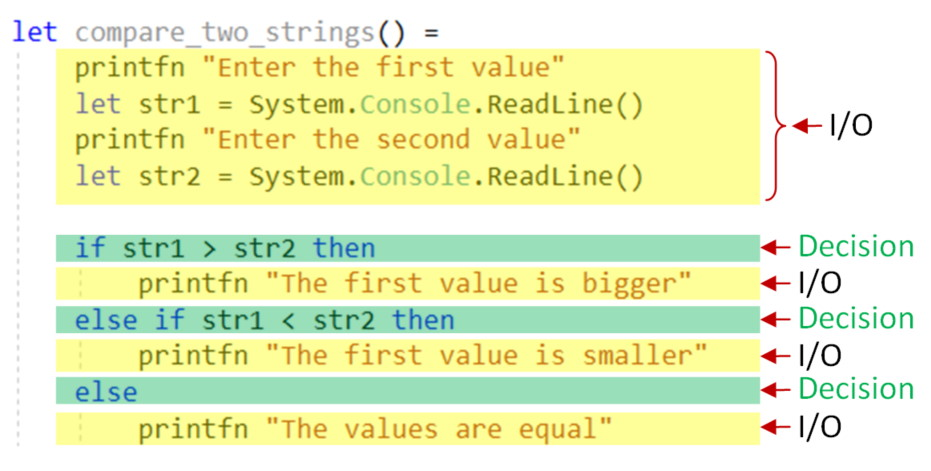
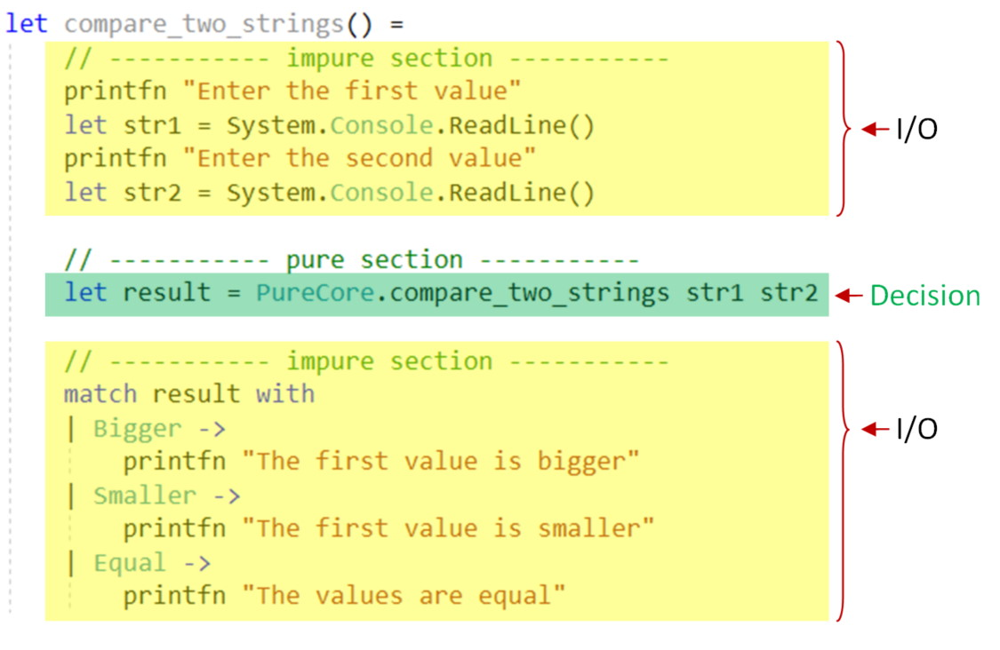

# Six approaches to dependency injection

*Six approaches to dependency injection, Part 1*

*[Source](https://fsharpforfunandprofit.com/posts/dependencies/)*

>This post is part of the
>[2020 F# Advent Calendar](https://sergeytihon.com/2020/10/22/f-advent-calendar-in-english-2020/).
>Check out all the other great posts there! And special thanks to Sergey Tihon for organizing this.

In this series of posts, we'll look at six different approaches to doing "dependency injection".

This post was inspired by
[Mark Seemann's similar series of posts](https://blog.ploeh.dk/2017/01/27/from-dependency-injection-to-dependency-rejection/),
and covers the same ideas in a slightly different way. There are other good posts on this topic by
[Bartosz Sypytkowski](https://bartoszsypytkowski.com/dealing-with-complex-dependency-injection-in-f/)
and [Carsten König](http://gettingsharper.de/2015/03/10/dependency-injection-a-functional-way/).
They are all worth reading!

The six approaches we will look at are:

* **Dependency retention**, in which we don't worry about managing dependencies; we just inline and
hard-code everything!
* **Dependency rejection**, a great term (coined by Mark Seemann, above), in which we avoid having
*any* dependencies in our core business logic code. We do this by keeping all I/O and other
impure code at the "edges" of our domain.
* **[Dependency parameterization](Six_approaches_to_DI_Part_2.md)**,
in which we pass in all dependencies as parameters.
This is commonly used in conjunction with partial application.
* **[Dependency injection and the Reader monad](Six_approaches_to_DI_Part_3.md)**,
in which we pass in dependencies after the rest of the code has already been constructed.
In OO-style code this is typically done via constructor injection and in FP-style code this
corresponds to the Reader monad.
* **[Dependency interpretation](Six_approaches_to_DI_Part_4.md)**,
in which we replace calls to dependencies with a data structure that is interpreted later.
This approach is used in both OO
([Interpreter Pattern](https://en.wikipedia.org/wiki/Interpreter_pattern)) and in FP (e.g.
[free monads](https://softwaremill.com/free-monads/)).

For each approach, we will look at a sample implementation, and then discuss the pros and cons
of each approach. And as a bonus, in the [final post in the series](Six_approaches_to_DI_Part_5.md),
we'll take a different example and again implement it in the six different ways.

*NOTE: I did a [similar post](https://fsharpforfunandprofit.com/posts/dependency-injection-1/)*
*a long time ago. That post is now superseded by these ones.*

## What is a "dependency"?

Before we get started, let's define what we mean by a "dependency" for this post. I will say that,
when function A calls function B, then function A has a *dependency* on function B. So this is
a caller/callee dependency, not a data dependency, or library dependency, or any of the other
kinds of dependencies that we deal with in software development.

But this happens all the time, so what kinds of dependencies are problematic?

First, we want generally want to create code that is predictable and deterministic (pure).
Any calls that are non-deterministic will mess this up. These non-deterministic calls include all
kinds of I/O, random number generators, getting the current date & time, etc.
So we will want to manage and control impure dependencies.

Second, even for pure code, we may often want to change behavior at runtime by passing in different
implementations, rather than hard-coding one. In OO design, we would probably use the Strategy
Pattern, and in FP design, we would probably pass in a "strategy" function as a parameter.

All other dependencies do *not* need special management. If there is only one implementation of
a class/module/function, and it is pure, then just call it directly in your code.
No need to mock or add extra abstraction if it is not needed!

To summarize then, we have two kinds of dependencies:

* Impure dependencies, which introduce non-determinism and make testing harder.
* "Strategy" dependencies, which support the use of multiple implementations.

## Workflow-oriented design

In all the code that follows, I'll be using a "workflow-oriented" design, where a "workflow"
represents a business transaction, a story, a use-case, etc. For more details on this approach,
see my
[Reinventing The Transaction Script talk](https://www.youtube.com/watch?v=USSkidmaS6w&feature=youtu.be)
(or for a more OO approach, the
[Vertical Slice Architecture](https://www.youtube.com/watch?v=5kOzZz2vj2o) talk by Jimmy Bogard).

## The requirements

Let's take some very simple requirements and implement them using these six different approaches.

The requirements are:

* Read two strings from input
* Compare them
* Print whether the first string is bigger, smaller, or equal to the second

That's it. Pretty straightforward, but let's see how complicated we can make it!

## Approach #1: Dependency retention

Let's start with the simplest implementation of the requirements:

```fsharp
let compareTwoStrings() =
  printfn "Enter the first value"
  let str1 = Console.ReadLine()
  printfn "Enter the second value"
  let str2 = Console.ReadLine()

  if str1 > str2 then
    printfn "The first value is bigger"
  else if str1 < str2 then
    printfn "The first value is smaller"
  else
    printfn "The values are equal"
```

As you can see, this implements the requirements directly, with no extra abstraction or
complication.

The advantage of this approach is exactly that: the implementation is obvious and easy
to understand. Indeed, for very small projects, adding abstractions may make the code less
maintainable, not more.

The downside is that this function is impossible to test. If you look at the function signature,
it is `unit -> unit`. In other words, it accepts no useful input and emits no useful output.
It can only be tested using human interaction, running it over and over and playing with the inputs.

So, I would recommend this approach for:

* Simple scripts that are not worth testing or creating abstractions for.
* Disposable sketches or prototypes where the focus is on making something quickly so that you can
learn more about the requirements.
* Programs where the "business logic" is minimal, where you're basically gluing together lots of
inputs and outputs. ETL pipelines are one example of this. And a lot of data science involves
hacking scripts together and checking the results manually. In these situations, the focus is
on the data and the data transformations, and it may not make sense to write tests or add extra
abstractions.

## Approach #2: Dependency rejection

One of the easiest ways to make code predictable and testable is eliminate any impure dependencies
from code, leaving just pure code. We'll call this "dependency rejection".

For example, in our first implementation above, the impure I/O calls (`printfn` and `ReadLine`) were
intermingled with the pure decisions (`if str1 > str2`).



If we want to have *only* pure decisions in our code, then what do we have to change?

* First, everything that is read from the console must be passed in as parameters
* Second, the decision must be returned as a pure data structure rather than doing any I/O

With these changes the code now looks like this:

```fsharp
module PureCore =

  type ComparisonResult =
    | Bigger
    | Smaller
    | Equal

  let compareTwoStrings str1 str2 =
    if str1 > str2 then
      Bigger
    else if str1 < str2 then
      Smaller
    else
      Equal
```

In this new implementation, everything to do with I/O is now eliminated.

This code is completely deterministic and therefore easy to test, like the little test suite below
(which uses the [Expecto testing library](https://github.com/haf/expecto)).

```fsharp
testCase "smaller" <| fun () ->
  let expected = PureCore.Smaller
  let actual = PureCore.compareTwoStrings "a" "b"
  Expect.equal actual expected "a < b"

testCase "equal" <| fun () ->
  let expected = PureCore.Equal
  let actual = PureCore.compareTwoStrings "a" "a"
  Expect.equal actual expected "a = a"

testCase "bigger" <| fun () ->
  let expected = PureCore.Bigger
  let actual = PureCore.compareTwoStrings "b" "a"
  Expect.equal actual expected "b > a"
```

But how do we actually *use* this pure code? Well, we need the caller to provide the inputs and
to act on the output. Generally the I/O should be done as high in the call stack as possible.
The "top layer" can be known by many different names, such as the "api layer", the "shell layer",
the "composition root", or simply "the program".

Here's what the caller code looks like:

```fsharp
module Program =
  open PureCore

  let program() =
    // ----------- impure section -----------
    printfn "Enter the first value"
    let str1 = Console.ReadLine()
    printfn "Enter the second value"
    let str2 = Console.ReadLine()

    // ----------- pure section -----------
    let result = PureCore.compareTwoStrings str1 str2

    // ----------- impure section -----------
    match result with
    | Bigger ->
      printfn "The first value is bigger"
    | Smaller ->
      printfn "The first value is smaller"
    | Equal ->
      printfn "The values are equal"
```

By using the "dependency rejection" approach, we can see that we now have a impure/pure/impure sandwich:



In general, we want our functional pipeline to look just like this:

* Some I/O or other non-deterministic code, such as reading from a console/file/database/etc
* The pure business logic which makes decisions
* Some more I/O, such as saving the result to a file/database/etc


What's nice about this is that the I/O segments can be specific to this particular workflow.
For example, rather than having an `IRepository` with hundreds of methods for each possible
use-case, we only need to implement the requirements for this one workflow, which in turn
keeps the overall code base cleaner.

### Multi-layer sandwiches

What if you need some extra I/O in the middle of your decision-making process?
In that case, you can create a multi-layer sandwich, like this:


The important thing is to keep the I/O segments separate from the decision segments,
for all the reasons discussed above.

### Testing

What's also nice about this approach is that the test boundaries become very clear.
You unit test the pure code in the center, and you do integration tests across the whole pipeline.


## Summary

In this post, we looked at the two of the six approaches: "dependency retention",
where dependencies are inlined, and "dependency rejection", where all I/O is eliminated,
leaving only pure code in the core domain.

Given the clear benefits, the "dependency rejection" approach should be used wherever possible.
The only downside is the extra indirection needed:

* You will probably need to define a special data structure to represent the decision returned
by the pure code.
* You will need a higher-level layer to run the impure code and pass the results to the pure code,
and then interpret the result and convert it back into I/O operations.

The source code for this post is available at these gists:

* [DependencyRejection.fsx](https://gist.github.com/swlaschin/cbc9a5992695a88e32e3f39fbf1ecf79)
* [DependencyRetention.fsx](https://gist.github.com/swlaschin/d35b59795a85a62723124df1a79d2388)

In the [next post](Six_approaches_to_DI_Part_2.md), we'll look at "dependency parameterization".
That is, passing in dependencies as standard function parameters.
