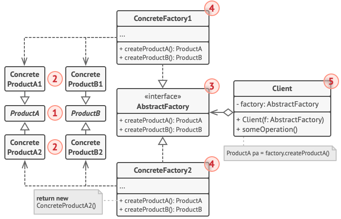

# Абстрактная фабрика

*Также известен как*: Abstract Factory

*Сложность*: 2/3

*Популярность*: 3/3

**Абстрактная фабрика** - это порождающий паттерн проектирования, который
решает проблему создания целых семейств связанных продуктов, без указания
конкретных классов продуктов.

Абстрактная фабрика задаёт интерфейс создания всех доступных типов
продуктов, а каждая конкретная реализация фабрики порождает продукты одной
из вариаций. Клиентский код вызывает методы фабрики для получения
продуктов, вместо самостоятельного создания с помощью оператора `new`.
При этом фабрика сама следит за тем, чтобы создать продукт нужной
вариации.

## Структура

1. **Абстрактные продукты** объявляют интерфейсы продуктов, которые
связаны друг с другом по смыслу, но выполняют разные функции.

2. **Конкретные продукты** - большой набор классов, которые относятся к
различным абстрактным продуктам (кресло/столик), но имеют одни и те же
вариации (Викторианский/Модерн).

3. **Абстрактная фабрика** объявляет методы создания различных
абстрактных продуктов (кресло/столик).

4. **Конкретные фабрики** относятся каждая к своей вариации продуктов и
реализуют методы абстрактной фабрики, позволяя создавать все продукты
определённой вариации.

5. Несмотря на то, что конкретные фабрики порождают конкретные продукты,
сигнатуры их методов должны возвращать соответствующие абстрактные
продукты. Это позволит клиентскому коду, использующему фабрику, не
привязываться к конкретным классам продуктов. Клиент сможет работать с
любыми вариациями продуктов через абстрактные интерфейсы.

## Применимость

Паттерн можно часто встретить в коде, особенно там, где требуется
создание семейств продуктов (например, внутри фреймворков).

## Признаки применения паттерна

Паттерн можно определить по методам, возвращающим фабрику, которая, в свою
очередь, используется для создания конкретных продуктов, возвращая их
через абстрактные типы или интерфейсы.
