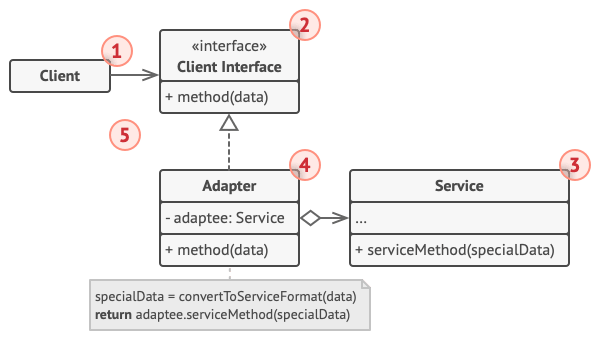

# Адаптер

*Также известен как*: Wrapper,  Обёртка,  Adapter

*Сложность*: 1/3

*Популярность*: 3/3

**Адаптер** - это структурный паттерн, который позволяет подружить
несовместимые объекты.

Адаптер выступает прослойкой между двумя объектами, превращая вызовы
одного в вызовы, понятные другому.

## Структура

1. **Клиент** - это класс, который содержит существующую бизнес-логику программы.

2. **Клиентский интерфейс** описывает протокол, через который клиент
может работать с другими классами.

3. **Сервис** - это какой-то полезный класс, обычно сторонний. Клиент не
может использовать этот класс напрямую, так как сервис имеет непонятный
ему интерфейс.

4. **Адаптер** - это класс, который может одновременно работать и с
клиентом, и с сервисом. Он реализует клиентский интерфейс и содержит
ссылку на объект сервиса. Адаптер получает вызовы от клиента через методы
клиентского интерфейса, а затем переводит их в вызовы методов обёрнутого
объекта в правильном формате.

5. Работая с адаптером через интерфейс, клиент не привязывается к конкретному классу адаптера. Благодаря этому, вы можете добавлять в программу новые виды адаптеров, независимо от клиентского кода. Это может пригодиться, если интерфейс сервиса вдруг изменится, например, после выхода новой версии сторонней библиотеки.

## Применимость

Паттерн можно часто встретить в коде, особенно там, где требуется
конвертация разных типов данных или совместная работа классов с
разными интерфейсами.

## Признаки применения паттерна

Адаптер получает конвертируемый объект в конструкторе или через параметры
своих методов. Методы Адаптера обычно совместимы с интерфейсом одного
объекта. Они делегируют вызовы вложенному объекту, превратив перед этим
параметры вызова в формат, поддерживаемый вложенным объектом.
