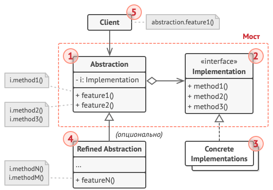

# Мост

*Также известен как*: Bridge

*Сложность*: 3/3

*Популярность*: 1/3

**Мост** - это структурный паттерн, который разделяет бизнес-логику или
большой класс на несколько отдельных иерархий, которые потом можно
развивать отдельно друг от друга.

Одна из этих иерархий (абстракция) получит ссылку на объекты другой
иерархии (реализация) и будет делегировать им основную работу. Благодаря
тому, что все реализации будут следовать общему интерфейсу, их можно
будет взаимозаменять внутри абстракции.

## Структура

1. **Абстракция** содержит управляющую логику. Код абстракции делегирует
реальную работу связанному объекту реализации.

2. **Реализация** задаёт общий интерфейс для всех реализаций. Все методы,
которые здесь описаны, будут доступны из класса абстракции и его
подклассов.

Интерфейсы абстракции и реализации могут как совпадать, так и быть
совершенно разными. Но обычно в реализации живут базовые операции, на
которых строятся сложные операции абстракции.

3. **Конкретные реализации** содержат платформо-зависимый код.

4. **Расширенные абстракции** содержат различные вариации управляющей
логики. Как и родитель, работает с реализациями только через общий
интерфейс реализации.

5. **Клиент** работает только с объектами абстракции. Не считая
начального связывания абстракции с одной из реализаций, клиентский код не
имеет прямого доступа к объектам реализации.

## Применимость

Паттерн Мост особенно полезен когда вам приходится делать
кросс-платформенные приложения, поддерживать несколько типов баз данных или
работать с разными поставщиками похожего API (например, cloud-сервисы,
социальные сети и т. д.)

## Признаки применения паттерна

Если в программе чётко выделены классы «управления» и несколько видов
классов «платформ», причём управляющие объекты делегируют выполнение
платформам, то можно сказать, что у вас используется Мост.
