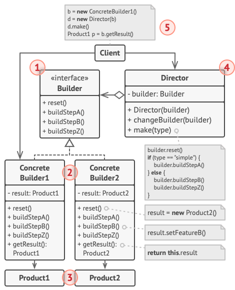

# Строитель

*Также известен как*: Builder

*Сложность*: 2/3

*Популярность*: 3/3

**Строитель** - это порождающий паттерн проектирования, который позволяет
создавать объекты пошагово.

В отличие от других порождающих паттернов, Строитель позволяет производить
различные продукты, используя один и тот же процесс строительства.

## Структура

1. **Интерфейс строителя** объявляет шаги конструирования продуктов, общие для
всех видов строителей.

2. **Конкретные строители** реализуют строительные шаги, каждый по-своему.
Конкретные строители могут производить разнородные объекты, не имеющие общего
интерфейса.

3. **Продукт** - создаваемый объект. Продукты, сделанные разными строителями,
не обязаны иметь общий интерфейс.

4. **Директор** определяет порядок вызова строительных шагов для производства
той или иной конфигурации продуктов.

5. Обычно **Клиент** подаёт в конструктор директора уже готовый
объект-строитель, и в дальнейшем данный директор использует только его. Но
возможен и другой вариант, когда клиент передаёт строителя через параметр
строительного метода директора. В этом случае можно каждый раз применять разных
строителей для производства различных представлений объектов.

## Применимость

Паттерн можно часто встретить в коде, особенно там, где требуется пошаговое
создание продуктов или конфигурация сложных объектов.

## Признаки применения паттерна

Строителя можно узнать в классе, который имеет один создающий метод и несколько
методов настройки создаваемого продукта. Обычно, методы настройки вызывают для
удобства цепочкой.

Например: `someBuilder`->`setValueA(1)`->`setValueB(2)`->`create()`).
