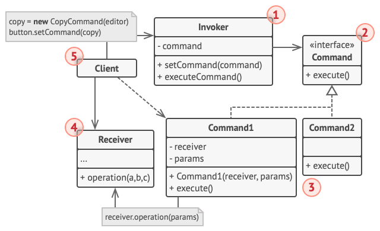

# Команда

*Также известен как*: Действие, Транзакция, Action, Command

*Сложность*: 2/3

*Популярность*: 2/3

**Команда** - это поведенческий паттерн, позволяющий заворачивать запросы
или простые операции в отдельные объекты.

Это позволяет откладывать выполнение команд, выстраивать их в очереди, а
также хранить историю и делать отмену.

## Структура

1. **Вызывающий объект** хранит ссылку на объект команды и обращается к нему,
когда нужно выполнить какое-то действие. Вызывающий объект работает с
командами только через их общий интерфейс. Он не знает, какую конкретно
команду использует, так как получает готовый объект команды от клиента.

2. **Команда** описывает общий для всех конкретных команд интерфейс. Обычно
здесь описан всего один метод для запуска команды.

3. **Конкретные команды** реализуют различные запросы, следуя общему
интерфейсу команд. Обычно команда не делает всю работу самостоятельно, а
лишь передаёт вызов получателю, которым является один из объектов
бизнес-логики.

  Параметры, с которыми команда обращается к получателю, следует хранить в
  виде полей. В большинстве случаев объекты команд можно сделать
  неизменяемыми, передавая в них все необходимые параметры только через
  конструктор.

4. **Получатель** содержит бизнес-логику программы. В этой роли может
выступать практически любой объект. Обычно команды перенаправляют вызовы
получателям. Но иногда, чтобы упростить программу, вы можете избавиться
от получателей, "слив" их код в классы команд.

5. **Клиент** создаёт объекты конкретных команд, передавая в них все
необходимые параметры, среди которых могут быть и ссылки на объекты
получателей. После этого клиент связывает объекты вызывающих классов с
созданными командами.

## Применимость

Паттерн можно часто встретить в коде, особенно когда нужно откладывать
выполнение команд, выстраивать их в очереди, а также хранить историю и
делать отмену.

## Признаки применения паттерна

Классы команд построены вокруг одного действия и имеют очень узкий
контекст. Объекты команд часто подаются в обработчики событий элементов
GUI. Практически любая реализация отмены использует принципа команд.
