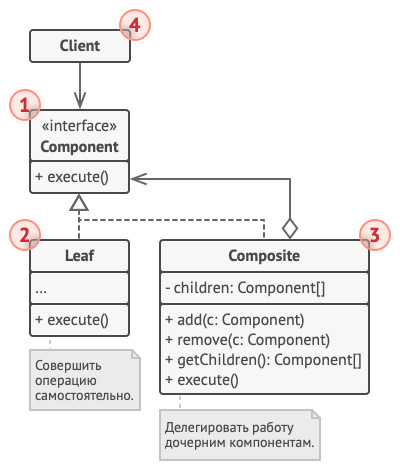

# Компоновщик

*Также известен как*: Дерево, Composite

*Сложность*: 2/3

*Популярность*: 2/3

**Компоновщик** - это структурный паттерн, который позволяет создавать
дерево объектов и работать с ним так же, как и с единичным объектом.

Компоновщик давно стал синонимом всех задач, связанных с построением
дерева объектов. Все операции компоновщика основаны на рекурсии и
"суммировании" результатов на ветвях дерева.

## Структура

1. **Компонент** определяет общий интерфейс для простых и составных
компонентов дерева.

2. **Лист** - это простой компонент дерева, не имеющий ответвлений.

  Из-за того, что им некому больше передавать выполнение, классы листьев
  будут содержать большую часть полезного кода.

3. **Контейнер** (или *композит*) - это составной компонент дерева. Он
содержит набор дочерних компонентов, но ничего не знает об их типах. Это
могут быть как простые компоненты-листья, так и другие
компоненты-контейнеры. Но это не является проблемой, если все дочерние
компоненты следуют единому интерфейсу.

  Методы контейнера переадресуют основную работу своим дочерним
  компонентам, хотя и могут добавлять что-то своё к результату.

4. **Клиент** работает с деревом через общий интерфейс компонентов.

  Благодаря этому, клиенту не важно, что перед ним находится - простой
  или составной компонент дерева.

## Применимость

Паттерн Компоновщик встречается в любых задачах, которые связаны с
построением дерева. Самый простой пример - составные элементы GUI,
которые тоже можно рассматривать как дерево.

## Признаки применения паттерна

Если из объектов строится древовидная структура, и со всеми объектами
дерева, как и с самим деревом работают через общий интерфейс.
